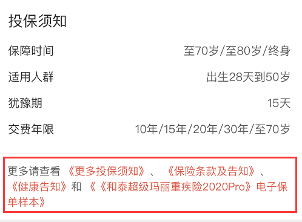
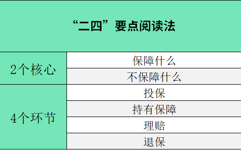

## 1、如何找到保险合同?

水星保日，要想看懂一款合同，第一步我们要找到它。

怎么去找到保险合同呢?

如果你买的是线下保险，一般保险公司会发给你一本板砖一样厚的保险合同。也就不用找啦。

如果你买的是互联网保险，一般在保险公司官网或者经纪公司产品宣传页面上，可以找到关于保险条款的链接，点击进去就可以看到详细的合同内容了。

## 2、怎么看一款合同

下面，我们就开始学习如何阅读一份保险合同吧。

为了更好的学习效果，大家不妨参考下面的方法，找一份保险合同，边听边对照着看。

通常来说，合同都会写明两点:

一是写清楚产品到底保什么，也就是保障责任;

二是明确规定好我们与保险公司分别有哪些权利和义务、有哪些行为守则。

在阅读条款的时候，其实重点也是抓住这两点。我们可以用“二四”法则，有针对地看保险合同。

其中“二四”法则中的“二”，代表2个保障核心:保障什么，不保障什么。想要挑对产品，这2个核心不能忽略。

而法则中的“四”，代表4个重要环节， 分别涵盖了购买、持有、申请理赔和退保中的注意事项及行为准则。

掌握了这些基本要点，我们可以更高效地读懂产品条款。

## 两个核心

先来看看两个核心:保障什么，不保障什么。

### 1、保障什么

建议重点关注两个部分: 1是:保障责任的具体内容; 2是:等待期的长短。

首先，保障责任是比较产品重要的依据之一，它明确列明了产品的赔付责任和注意事项。

大家要格外仔细，不放过任何一个重要的字眼，尤其是保险责任相关细节定义。

很多人买保险时，因为没有仔细阅读保险责任相关细节定义，从而对保障范围有误解。这样的”你以为”，会为后续理赔埋下隐患。

其次要关注等待期的规定。

等待期，就是保险合同成立后，还有一段等待时间。同等条件下，等待期短的产品更有吸引力。

### 2、不保障什么

不保障什么，就是保险合同中的“除外责任”，通常有2类:

一类是不可保责任，比如违反《保险法》或者其它法律规定，或者属于不可抗力因素等;

另一类是特别约定的除外责任，原则上可以保障，但被保险公司除外的。比如:意外险，通常会把滑雪、潜水这些相对有风险的活动导致的事故除外。

对我们而言，除外责任的条数肯定是越少越好。我在讲义区放了一个免责条款的样本，你可以对照看看:

其中第1-5条除外责任，都属于因为违反了法律责任，而被除外的责任。

剩下的几条免责，也属于健康类保险较为常见的除外条款，你可能会在不同产品的条款中反复看到。

## 四个环节

接下来再来看，从投保到理赔这4个关键环节中，有哪些要特别了解的事项。

这四个流程大多都是根据《保险法》的规定来制定的，你可以直接在合同里搜索对应关键词，直接找到相关的内容阅读。

### 环节一:投保

投保时，千万要注意以下三点:

1、年龄性别，千万别填错

年龄、性别直接影响保费，严重的话保险公司有权解除合同。大家严格按照身份证件上的信息去填写。

2、如实健康告知

投保时，通常保险公司会要求我们回答一份健康调查问卷，这个过程叫做“健康告知”。

问到的问题要如实回答，没问到的情况，不需要主动告知。你的身体情况，以投保时已经存在的医院或体检记录为准。

3、缴保费的问题

长期保障的产品，建议大家选择“按年交”。

投保后，忘记缴保费了。通常有一个缴费宽限期，宽限期间保障仍然有效。大多数合同宽限期为60天，手头紧的话，大家可以利用好宽限期。

不过，宽限期后，合同就会暂时中止，中止后保障就没了。

### 环节二:持有保险

持有环节，注意是否有信息变更的情况。比如，更改受益人，或者更改电话或地址。无论哪种情况，都要记得及时通知保险公司。

### 环节三:理赔

理赔重点要关注四点:

1 )理赔认定要求;

2 )理赔报案的时限;

3 )需要的申请材料和流程;

4 )保险金给付时效

看看保险公司针对理赔申请，是否有特别的要求和规定。事先了解这些合同内容，可以帮助我们规避一些在申请理赔时，不必要的麻烦。

### 环节四:退保

退保相关的条款内容，建议重点关注犹豫期的时长，以及犹豫期后的退保规定。

犹豫期有点像是淘宝的“7天无理由退货”，买的产品不满意，犹豫期内退保可以全额退款，或者扣除少量的手续费。

犹豫期后退保损失比较大，一般仅仅退回现金价值。买之前要慎重，用好“犹豫期”这项特权。

保险产品的合同条款，对我们至关重要。大家可以通过“二四”法则，快速了解一份保险合同的关键条款信息。

为了方便你学习，我把“二四”阅读法中的相关要点整理成了一张表格，带上这张图去阅读合同，相信你更能事半功倍。

学完本课不妨去找一份保险合同， 对照“二四”阅读法去看看它的核心保障内容和投保注意事项吧~

