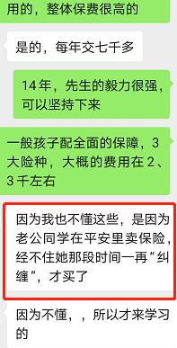

小伙伴们大家好, 今天的午间课堂我们轻松一点, 分享一位来自保险从业人员的亲身经历. 为保护隐私, 我们采取化名【花姐】.

花姐是一名保险代理员.

作为传统线下保险销售, 只要你人不错, 有朋友信任你, 他们如果再有需求, 一套流程下来, 基本上三个月内的新人, 很容易当上新人王, 上榜保险公司的荣誉体系, 接受鲜花和掌声.

花姐也是如此, 第一个月, 花姐在答谢会和亲子课堂上, 就签约了 3 个家庭的教育金保单, 四个成人重疾保险. 单月收入就有 3 万多, 靠着这些亲戚朋友顺利转正.

没错这些保费的来源, 都是"人情保单". 简单来说就是, 当熟人向我们推销保险时, 因为拉不下面子而购买的保单, 称之为"人情保单".

此时, 花姐也明白了做保险的基本流程了, 她发现, 作为保险代理人通常得做到以下几点:

第一: 每个月必须有单, 没有任何工作经验和保险知识下, 很难签到保单, 所以通常第一单就是自己给自己买, 也就是通常所说的"自保件".

第二: 想转正, 必须要有单, 自己专业, 保单哪里来? 凭借亲朋好友的信任, 邀约到公司的活动中, 很容易顺利签单.

第三: 在保险公司真的挺开心的, 正能量, 鸡血, 还没听就备受鼓励, 有了一点进步时, 就会获得很多掌声与鲜花.

花姐本以为可以在保险公司长期做下去, 觉得这就是她想要的事业, 升职加薪, 走上人生巅峰. 所以她一直想不通, 为什么很多人做不了多久就不做保险了呢?

可事实上, 到了第四个月, 也是在花姐转正的第二个月, 花姐就辞职不干了.

这是为什么? 钱赚够了?

其实, 花姐连续三个月业务都比较顺利, 可是后来花姐渐渐发现, 身边的朋友亲人, 信任自己的人, 或多或少都在自己这里买过保险了.

实在没有人可约了, 但是每个月的考核近在咫尺, 不出单的话, 可能不出 2 个月, 就要卷铺盖走人了.

那种精神压力让花姐觉得好累, 就在这时, 经理让花姐走组织发展路线:

"花姐, 你知道为什么我能在保险行业走这么久吗? 因为我两条腿走路, 一手抓业务, 一手抓增员. 一个人单打独干就是个零售商, 招募志同道合的伙伴, 你就是批发商. 这个季度, 努力晋升主管吧!"

不知为何, 熟悉了保险业务套路后的花姐, 没有了最开始的热血激情. 反而心里有个声音: 我 TM 自己都不想做了, 还找别人来做?

明明被公司追业务追的都累死了, 还要和身边的亲朋装作自己做的很好的样子.

时间久了, 很多亲戚朋友也不愿意参加公司活动, 展业难度就更大了, 还有很多客户拿着方案到处比较. 花姐不喜欢强行说自己的好, 那种自卖自夸的感觉, 让花姐觉得特别讨厌.

是的, 她变成了自己讨厌的那种人.

而且花姐发现, 好多公司的产品, 比自己公司产品好很多, 价格便宜 20%-50%, 花姐问经理, 为什么会这样? 经理告诉花姐:"小公司产品白给你, 你敢买吗?"

花姐:"好像有点道理, 但是你不是说保险公司不会倒闭吗? 小公司也不会倒闭, 应该也不会有问题吧?

经理:"不会倒闭, 但是理赔难啊, 买保险不就是为了以后有事好赔吗?"

最开始, 花姐很相信经理的那些话, 也很相信公司让自己背的那些"话术".

可是有一天, 花姐最好的朋友, 发了一篇文章给她.《\*\*福到底怎么样?》文章中, 对自己公司产品的解析, 措辞犀利, 有依有据, 条款扒的清清楚楚. 花姐才发觉自己从未认真看过条款.

于是花姐上网查询了很多关于理赔的资料, 也发现了很多知乎, 公众号, 关于产品精算原理, 保险公司监管理赔机制, 产品测评, 关于大小公司, 关于揭露营销套路等的文章比比皆是.

原来除了所在的公司, 有那么广阔的世界, 以前, 她信任公司, 她感恩亲朋的信任. 可是如今冷静想想, 这些信任她的人, 包括她自己, 这些保险真的买对了吗?

后来花姐自己说到:

我不是有意欺骗客户买了我的产品, 直到现在我才知道, 原来那些产品那么贵, 我更不知道买保险还要做需求分析, 谢谢你给我做的分析和方案, 我决定按照你说的重新规划. 如果按照现在的保险交下去······

第一, 保额太低, 出险后也解决不了太大问题.

第二, 之前买保险的费用已经占据了家庭全部保险规划的预算, 加保已经没有交费能力. 只是, 我的那些客户怎么办? 我现在告诉他们, 那个不好, 让他们退保, 他们一定气死了!

讲到这里, 大家一定明白了为什么班班不建议你买人情保单了吧.

从品性来说, 花姐她真的是个性情纯良, 心地善良的人. 我相信许许多多的保险从业人员和她一样.

可身在局中, 绝大多数都是看不清真相的人, 让亲戚朋友跳坑, 并不是她们的本意, 这就大概就叫好心办坏事了吧.

所以班班在这里要友情提醒一句: 勇敢地对人情保单说"不"!

尤其是在老同学、老朋友、亲戚们聚会, 酒足饭饱, 微醺之际免不了神志不是特别清楚, 一口允下各位亲戚朋友推销的保险. 正因为碍于人情, 这类保单大部分时候并不符合自己的实际需要, 以至于最后这份保单成了鸡肋.

买不靠谱的人情保单, 可能会有 2 大遭遇:

① 不适合自己和家庭成员

购买的时候代理人对你及家庭的情况了解, 你真可能买了并不适合你的保险, 往往是花了钱买别人的面子, 可能最后丢了里子.

比如业务员向你强烈推荐给未成年的子女买一份生死两全的保险, 这样的保险对于子女来说没有用处, 还特别贵!

② 理赔纠纷的风险大增

更惨的是, 碍于情面, 很多人在买的时候连健康告知都没做, 合同条款也不清楚, 需要理赔的时候, 才发现自己买的保险这不保, 那也不保, 可以说不合格的人情保单害惨了保险行业.

相信花姐内心真实的心声, 大家也都听到了吧.

那如何应对人情保单的推销呢? 班班给大家几个方法, 核心是: 慎重对待, 用点技巧, 尽力保护自己利益, 又不伤情面.

1、以"缓兵之计"测试对方

业务员通常会说:"就差你一张, 我这个月业绩就达成了, 支持我一下吧!"

比如下面这张图反应的就是类似这种情况:

作为消费者, 如果并不愿意买这帮忙的最后一张保单, 可以这么说: 我们是这么好的朋友了, 相信我们的关系不会因为一张保单受到任何影响的, 对吧, 所以我不愿意的事情你肯定不会难为我的.

出于对自身权益的维护, 我们婉言拒绝, 或者用其他方式缓和氛围, 这样既维护自身利益, 也不至于让朋友尴尬. 你, 学会了吗?

2、和业务员说:"给我做个详细的家庭保障方案呗!"

保险产品有很多种, 一个保险产品, 只能管很小的一个范围, 如果需要全面保障, 则需要多个产品组合, 根据家庭结构、缴费能力、财务状况, 身体状况, 需要有不同的产品组合才能达到家庭保障的目的, 而一个科学的保险组合方案, 需要真正专业的人才能做到.

做家庭保障方案过程还能避免你一时冲动去购买保险产品, 通过比较产品的优劣, 挑选比较出最合适的保障.

一份家庭保障方案, 可以很大程度上体现出来一个保险从业者的专业程度, 什么方案更适合你.

如果一个保险代理人连别人的家庭保障方案都看不明白, 只能说明 TA 不专业. 连专业都不足, 人情自然无话可说.

3、实在逃不过, 买"简单便宜"的产品

如果业务员借亲友施压:"我平常在生意上帮你这么多, 你就支持一下我的小孩吧! 自己家人做保险, 家人如果都不跟他买, 他出去怎么谈保单?"

面对这类推不掉的人情压力, 怎么办?

如果非得捧场, 真的推不掉, 可以买一份简单、便宜的保险. 比如买份意外险的保单, 保障额度高, 保费低, 一两百块钱, 也不会给自己带来太大压力.

当然, 班班还是不提倡这种行为的, 因为班班还是希望大家对自己、对家人负责, 不到万不得已, 不要用这招.

遇到人情保单, 在我们的现实生活, 其实平常是蛮普遍的, 班班带班这几年, 也遇到很多同学都是这样

甚至可以说, 大部分学员都是如此, 稀里糊涂的买了, 然后放到了抽屉里吃灰, 到底有哪些保障都不清楚

现在我们学习了基础的保险知识, 知道首先要了解自己的需求, 再根据当前的情况再来量身打造个性化方案, 而且我们有专业的规划师来帮助, 可以避免踩坑啦

亲戚朋友做保险代理人, 确实有职业素养高、能够帮到身边的人的, 但更多的是为了出业绩, 向身边的人推销产品的, 甚至一味以人情施压.

面对亲戚朋友推荐的保险, 我们不应该绝对的信任或拒绝, 应该学习一些保险知识, 判断一下他推荐的产品是否合理

现在我们都学习了基本知识, 又有专业的规划师的帮助, 相信不会再受这个困扰了

好了, 今天中午的分享就到这里, 感谢大家的聆听.
