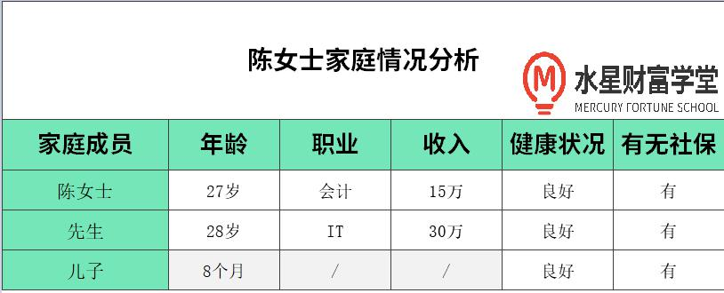
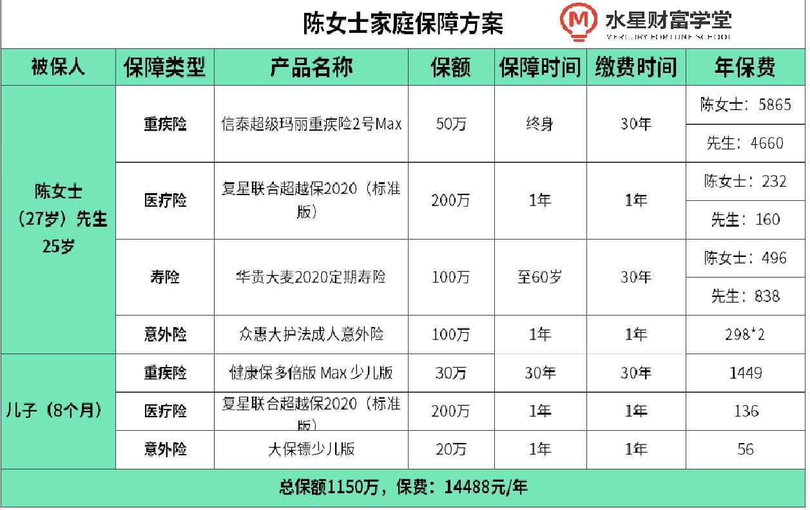
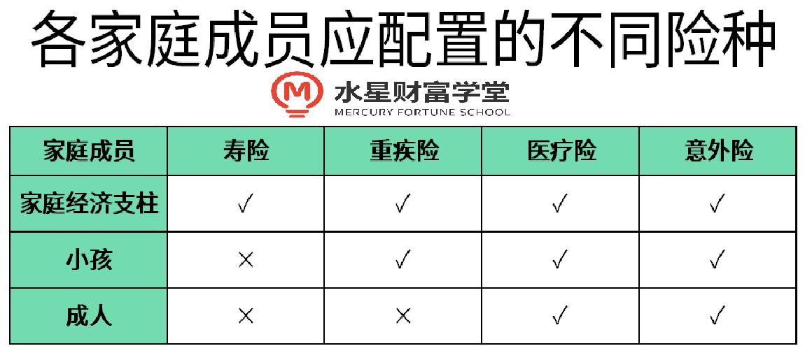

不少小伙伴很好奇, 规划师他怎么帮我设计适合我的规划方案呢? 今天就和大家分享一例规划师的真实方案规划. 温馨提醒: 每个人的家庭情况都不同, 以下案例中涉及的产品不作为任何推荐配置的建议.

不少朋友买保险, 既希望保障好, 又想保费便宜. 陈女士一家也一样. 她和先生都是打工人, 两人也收入还不错. 不过, 家庭责任重担也挺大的, 养孩子、还房贷压力不小. 她想给一家三口买些保险, 买到性价比高的保障.

通过, 咱们 1 对 1 的家庭保障规划服务. 规划师帮陈女士一家, 量身定制了全家保障.

## 一、家庭情况

保险配置是一件很私人化的事情, 在做方案前, 老师先了解了陈女士一家的基本情况.

陈女士夫妻俩健康状况很好, 平时开车通勤上下班. 有个 8 个月大的儿子, 宝宝身体也比较健康.

总的来说, 陈女士一家健康状况不错, 可供选择的产品也很多. 陈女士比较关注家庭医疗风险, 想买高保额的健康险. 希望花一万多, 尽量给全家买到高保额的保障.

## 二、方案设计

首先, 成人需要四大险种的保障, 因为孩子不承担家庭责任, 不需要买寿险.

下面一起来看下投保思路.

### 1、成人投保思路

陈女士夫妻俩, 重疾险保额 50 万, 保终身, 选了信泰超级玛丽重疾险 2 号 Max.

只有重疾险保障还不够, 老师还给夫妻俩选择了复星联合超越保, 可以报销高额的医疗费, 和重疾险互补.

夫妻俩要养孩子, 还有一百多万的房贷, 家庭责任重, 因此意外险和寿险必不可少.

定寿选了 100 万保额的华贵大麦 2020 定期寿险.

意外险给夫妻俩选了 100 万的众惠大护法成人意外险, 如果不幸意外去世, 能留下一笔钱给家人, 让他们继续正常生活.

### 2、儿子投保思路

老师给儿子选了 30 万的健康保多倍版 Max 少儿版保障一辈子, 重疾能赔 2 次.

同样, 老师也给孩子配置了复星联合超越保. 不仅能报销住院的医疗花费, 理赔后也不影响续保.

此外, 还给孩子配了一份大保镖少儿版, 可以解决意外导致的门诊、住院等花费.

整套方案总共花费 14488 元, 全家人都有了比较全面的保障, 陈女士对方案还是非常满意的.

哈哈哈, 陈女士是不是说出了大家的心声呢. 独乐乐不如众乐乐, 昨天有小伙伴来私聊班班, 家庭年收入 20 万左右, 上有老下有小, 应该如何配置保险. 这可能是咱们班大部分学员的情况, 所以我们今天带大家一起来梳理下整体配置思路. 把这几天的课程一起串起来.

## 三、结合真实设计方案案例梳理整体配置思路

一般来说, 在成长型家庭里, 夫妻双方都还年轻, 孩子还小, 而且有老人需要照顾.

买保险之前, 先抛出 4 个"灵魂拷问", 想清楚再投保, 避免踩坑.

### 1、保费预算多少才算合理?

保费预算过低, 不足以完全抵御风险. 保费过高, 会对家庭的现金流造成太大的压力.

因此, 设置合理的保费支出, 对于一个家庭的幸福感至关重要, 一般应控制在 8%-10%左右.

### 2、保额买多少比较合适?

寿险保额一般要覆盖一家人所有负债, 以及未来 10 年以上的支出, 才能保证即使失去了一部分收入来源, 也能维持正常生活.

重疾险保额应该要达到家庭年收入的 3-5 倍, 或能覆盖未来 5 年内的支出, 建议 50 万起步.

对于医疗险和意外险, 则不需要太过关注保额, 因为市面上的产品保额基本上都足够, 只需关注产品保障是否充足就可以.

### 3、一家人应该买哪些保险?

不同的家庭成员所扮演的角色不一样, 应配置的险种也有所不用, 一般分为这 3 种:

我们音频课也说过逻辑啦, 这里再复习一下:

(1)寿险

家庭经济支柱是支撑整个家庭正常运转的核心, 身上有许多财务责任, 如贷款、养育孩子、赡养父母等, 因此需要配置寿险. 确保家庭即使没有经济收入, 也能正常运转.

而小孩和老人没有经济收入, 所以不需要购买.

(2)重疾险

重疾险可以防范得大病的风险, 只要达到理赔标准就会打款赔付, 而且金额比较大, 可以在前期治疗时充分缓解资金压力, 按理说应该人手一份.

但老年人买重疾险, 保费太高, 而且能买到的保额很低, 所以不建议购买.

(3)医疗险

保费不高, 但保额通常上百万, 而且能够覆盖大部分住院支出, 因此每个家庭成员都要买.

但医疗险属于事后报销性质, 不能像重疾险一样立刻打款, 不能解决"没有现钱治病"的问题, 不能代替重疾险.

(4)意外险

意外的发生概率比重疾、身故要高得多, 特别对于经常出差、开车或四处走动的人来说, 意外险是必需品.

小孩喜欢蹦蹦跳跳, 老人容易摔倒跌伤, 也需要配置意外险.

### 4、买保险, 需要注意什么问题?

我们这里也来复习一下;

1)先买大人的, 再买小孩的

万一小孩发生了意外, 大人还有能力去陪伴照顾小孩.

但大人发生了意外, 小孩无法承担沉重的家庭经济责任和支付高昂的医药费.

因此, 在配置保险时, 应该先配置好大人的保险, 再考虑小孩的, 千万不要本末倒置.

(2)先做好健康保障, 再考虑理财

有的父母给孩子买保险, 很容易"想得太远", 直接考虑到以后的教育、婚嫁、养老……

合理的顺序应该先考虑孩子的重疾险、医疗险、意外险, 再考虑如何孩子未来的教育金、养老金等.

(3)保障充足且性价比高

保额足够大、期限足够长、赔付次数足够多, 而且价格合理, 是挑选产品最重要的原则.

梳理到这里, 肯定有小伙伴说, 好了, 我都知道了, 那你直接给出个方案不就好了吗, 我直接照搬. 但是买保险复杂就复杂在这了, 班班就算找理财师直接设计一个方案发到群里, 小伙伴们也无法直接照搬, 为什么呢?

## 四、为什么大多数小伙伴需要 1 对 1 定制方案

### 1、为什么方案不宜全盘照搬?

不同家庭的家庭负债、重疾需求不一样, 所需要的保额也会不一样.

有的家庭如果已经配置了一部分保险, 还涉及加保、置换、退保等问题, 更加复杂, 建议咨询理财师后再处理.

身体有问题的家庭成员, 不一定能买到方案中的保险, 需要联系理财师筛选合适的产品.

### 2、重疾险、寿险的保额如何确定?

寿险、重疾险的保额需要根据家庭年收入、总负债和对孩子未来的教育期望以及对父母的赡养责任确定.

每个家庭都不一样, 需要根据自己的情况确定.

### 3、知道了性价比最高的保险可以直接买吗?

投保前应根据家庭情况进行个性化调整, 而且需要仔细阅读《保险条款》、《投保须知》等重要文件. 保险不是我们想买, 想买就能买. 如果健康告知有异常, 比如体检有些小毛病, 甲状腺结节, 乳腺结节等等, 很多保险产品咱们就无法购买了. 为了避免后续理赔纠纷, 建议和理财师充分沟通后再进行投保.

买保险就像量体裁衣, 只有适合自己的才是最好的. 在买保险的过程中, 如果遇到任何问题, 都可以预约一下我们专业的规划师, 进行一对一针对的协助.
