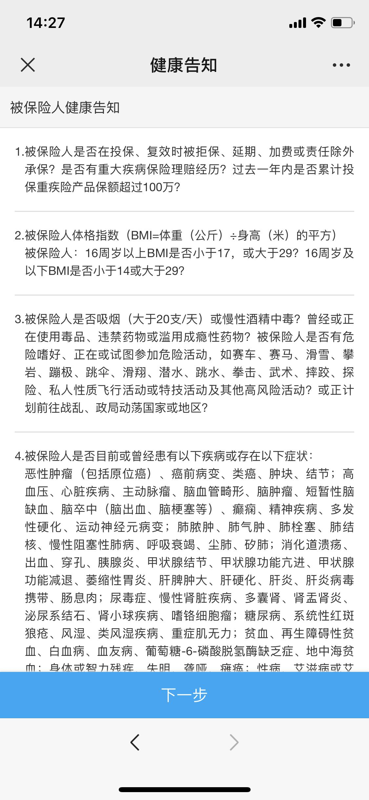
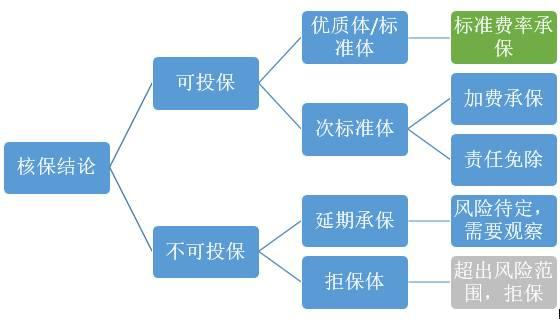
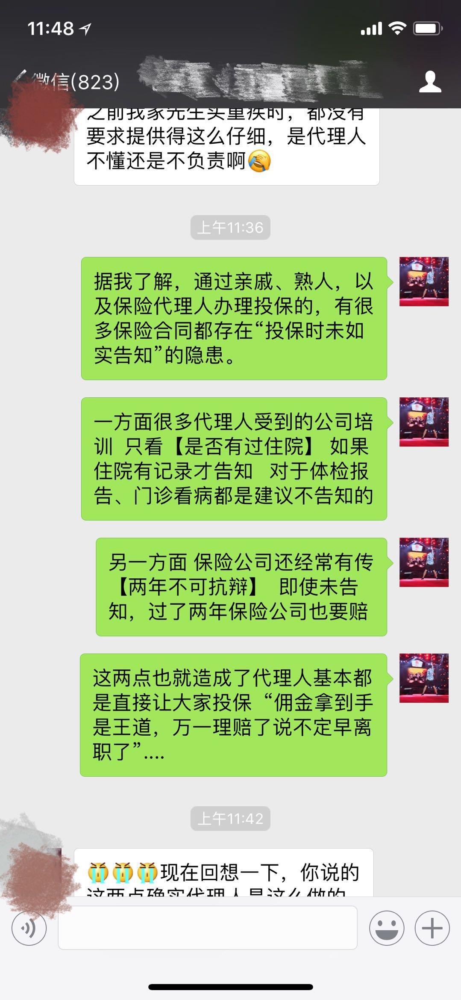

小伙伴们大家中午好呀!

这几天, 好多小伙伴都来问班班这些问题:

班班, 投保前, 我要去体检吗?

班班, 买哪些产品要体检, 哪些产品不用?

班班, 体检的某些指标异常, 会影响买保险吗?

班班……

呃……也先让班班消化一下.

班班发现, 这已经不是个例问题, 而是普遍性问题.

所以呀, 我们今天就拿这个主题, 和大家一起讨论一下, 我们投保前, 到底要不要去体检?

## 一、买保险前到底要不要去体检?

很多人对于买保险之前要不要去体检这个事情比较纠结, 担心自己在投保的时候不能完全说清楚自己的身体是什么状况, 有一些小的毛病没有去医院就诊过, 应不应该告知保险公司

或者之前有过一些既往的病史, 现在已经恢复正常了, 投保的时候要不要告知, 需不需要重新做个体检一起交给保险公司来以示清白.

其实, 这些问题本质上还是担心自己发生风险后, 保险公司以自己未如实告知为理由而拒赔.

所以, 就想着不如先去做个全面的体检, 在投保的时候还有体检单作为证据, 证明自己的身体棒棒哒.

但其实, 投保之前去体检, 我们真的有必要这么做吗?

答案是, 不! 需! 要!

班班你不要唬我哦, 我可是幼儿园四大智慧少年的后备人选.

班班还真不是忽悠你, 要想知道为什么不需要, 我们还得从核保和健康告知说起.

## 二、什么是核保、什么是健康告知?

我们购买健康险都是需要保险公司审核的, 审核的过程就叫做【核保】.

保险是一种非常独特的产品, 它卖的是"未来", 不同的人群出险概率是不同的, 所以需要对被保人进行分类区别对待.

因为不排除有些人会有这些想法:

第一, 已经生病了, 甚至病入膏肓, 这时候买保险, 很快就能获得理赔.

第二, 知道身体不适, 快要得病了, 吭哧吭哧去买保险, 这样也有很大的概率获得理赔.

第三, 经常从事危险工作, 发生意外的概率很高, 买份保险获得理赔的概率也很大.

如果真的可以这样, 那对我们身体健康投保的人岂不是很不公平?

所以, 核保是必须的.

通过什么进行核保呢? 那就是健康告知啦.

【健康告知】就是我们在投保之前, 保险公司让填写的健康问卷说明, 问清楚用户的身体健康状况、职业环境等, 确定一些用户未来发生风险的概率大不大.

这个问卷调查呢, 用专业的词讲就是叫【健康告知】, 符合要求的就可以投保. 不符合的, 要加费承保或者除外承保, 也可能直接拒保买不了.

健康告知长的就是这个样子:

核保通常会有以下几种结果:

通常来说, 经过健康告知确认后, 我们会是以下这四种情况中的一种, 我们以王小虎做完健康告知为例, 他得出的结果可能是:

一: 标准体. 恭喜王小虎, 他完美地符合健康告知中的所有要求, 可以直接投保

二: 次标准体. 王小虎可能有少数几条不符合健康告知, 但考虑到基本在可接受范围内, 保险公司也是允许他投保了. 当然, 有个前提条件: 要么增加保费, 要么接受除外责任.

增加保费很好理解, 别人花 1000 元能买到的保障, 那王小虎可能要再额外支付 200 元.

除外责任就是指的是保险公司考虑到客户当前的健康状况, 将一些特定疾病排除在责任范围之外, 其他责任保持不变.

比如, 王小虎有甲状腺结节三级, 即便结节是良性的, 保险公司也可能会把甲状腺癌及转移癌排除在责任范围之外.

三: 延期. 保险公司考虑到的某个健康问题, 暂不接受王小虎的本次投保申请, 建议过一段时间再来试试. 至于要等多久, 不同公司、不同产品、不同疾病的情况皆不一样. 说白了就是, 王小虎当下的风险过高, 等等再说吧.

四: 拒保. 对不起, 保险不卖给王小虎了. 王小虎的身体健康状况已经不符合健康告知的要求, 相当于被保险公司判了"死刑"咯.

所以啊, 班班说了这么多, 就是希望我们的小伙伴, 在配置保险的时候, 自己仍然是抬头挺胸, 倍儿自信的, 是掌握主动权的, 而不是一副耷拉着脑袋等待保险公司审判的样子.

很多时候, 当我们看到身边的惨痛教训后, 才想起要配置保险, 事实上这个时候我们可能已经处于一个需要向保险公司"申请"的状态了, 这个时候可能已经晚了, 可能会惨遭拒绝

因为绝大部分的健康问题是不可逆的, 承保总比被拒保好, 早买总比晚买好, 加费总比买不到好. 虽然比别人贵了, 但是也要恭喜你, 因为再过几年, 或者下一刻你就不能买了

## 三、关于健康告知需要注意哪些?

如实告知&有限告知原则

在购买保险时, 如果不想给未来的理赔埋下隐患, 对过往的病史一定要做到【如实告知】, 就是实话实说, 有一说一.

保险公司发现你投保前未如实告知, 且影响核保决定的, 可以直接拒赔. 所以说, 与其天天担惊受怕被拒赔, 不如跟保险公司"坦诚相见", 避免纠纷.

怎么样才算如实告知呢? 哪些需要告知? 哪些不需要告知? 告知到什么程度呢?

一般情况下, 健康告知的范围有两种形式: 无限告知和询问告知.

根据我国《保险法》第十六条的规定: 订立保险合同, 保险人就保险标的或者被保险人的有关情况提出询问告知的, 投保人应当如实告知.

可以看出来, 国内的健康告知实行的是【询问告知】, 即: 投保人对被保险人询问到的问题予以如实告知, 而对被保险人没有询问的问题, 投保人没有告知的义务.

翻译成大白话就是:

并不是所有的异常都需告知, 问了的才告知, 保险公司没有询问, 就算我们知道某个指标存在异常, 也无需告知. 这就是有限告知原则.

例: 健康告知问及被保险人是否患有肝炎, 如果被保险人确诊肝炎, 那么要填"是", 如果有后续提问, 我们就要做相应的补充说明.

告知的程度, 以自身知晓, 并获得医学诊断证实为准.

如果

自己根本不知道自己患病

没有去医院检查过

没有相关的检查诊断结果可以证明自己知道

没有被医院确诊为"XX 疾病"

可以直接回答"否", 即使没有告知, 也不能算不如实告知(班班也顺便提一嘴, 如果到时候真的发生理赔, 在和保险公司对话的过程中还是需要注意措辞哦).

所以说, 在我国投保时, 健康告知实行"你问我就说, 不问我就不说"的规定.

因此大家尽量【不要】在投保前去体检, 本来不知道的毛病, 万一在投保前查出来了, 那很有可能增大了不能投保的概率哦.

因为这时候你本来不知道的异常被知道了, 不得不说, 不然也容易影响今后的保险赔付.

## 四、保险公司要我去体检怎么办?

有的小伙伴可能也会问, 班班, 我都遵循【如实告知】和【有限告知】原则了, 如果保险公司还让我去体检怎么办?

一般情况下, 保险公司是不会提出这种要求的, 除非一些特殊情况.

比如下面两种情况保险公司可能会要求我们体检:

1、超限额: 保险公司对不同年龄都有一个免体检的限额, 如果超出了这个限额, 保险公司就会让大家去体检.

比如, 58 岁的王老虎, 在一家保险公司购买 100 万保额的重疾险, 这种情况下, 就大概率是要体检的, 因为保险公司要排除骗保嫌疑. 所以这也说明了, 保险要越年轻买越好! 因为年龄越大, 可买的保额其实会受到限制, 购买门槛也会比较高.

2、有病史: 这个也挺正常, 如果不符合健康告知的要求, 保险公司也是有权调取病历或者通过体检来核查你的健康状况的.

## 五、万一体检查出异常了, 咋办?

如果万不得已, 真的要去体检, 怎么办? 我还能买保险吗?

一般情况下, 提交体检报告后, 会存在下面 4 种结果:

【正常承保】: 完美, 终于通过核保, 可以安心了.

如果体检结果不尽如意, 保险公司主要会采取 1)加费承保, 2)除外承保的方式进行承保; 更严重的甚至会直接拒保:

【加费承保】: 指的是你要付出比其他人更多的保费, 保险公司才予以承保, 因为保险公司认为你的风险比普通健康人群高.

【除外承保】: 指的是保险公司对被保险人身体某个特定部位或特定器官的疾病不承担保障责任. 除此之外, 其余的器官发生疾病都正常承保.

【拒保】: 直接被保险公司拒绝, 无法购买这份保险.

所以, 投保前真的不建议去体检, 想体检的小伙伴们, 最好等保单生效后再去哦.

## 总结

最后, 因为今天的干货比较多, 也比较重要, 所以班班给大家总结一下: 怎么如实告知才对自己更有利呢?

这里有 4 个小窍门:

### 1、记住: 问到什么, 就答什么.

比如, 询问最近一年是否有体检, 体检结果是否出现异常? 如果好去年体检报告甘油三酯高了一点, 那么就直接告知好了.

再比如, 问询告知中说是否有"乙肝大三阳, 转氨酶高于正常值 2 倍以上", 并不再有其他肝病的问询, 而被保险人只是乙肝携带者, 那么就不需要告知, 可以正常购买.

### 2、不确定的问题, 不要主观臆断

在填写健康告知过程中, 如果遇到这样一种情况: 健康告知里问到的疾病, 也不知道自己有没有, 然后就不知道该如何填写了!

给大家一个建议: 如果我们在填写信息的时候确实不知道, 而且没有去医院检查过, 也就是说, 只要没有被医院"确诊"的病症, 没在医院留下过住院记录, 则都可以回答"否".

### 3、仔细填写, 看清定语

常见的健康告知, 基本覆盖了所有特殊情形, 这些列举条文的定义是非常精确的. 比如关于疾病种类的描述, "乙肝患者"和"乙肝携带者", 就是两个概念, 不可混为一谈.

如果拿不准, 尽量找我们专业的规划师求助, 不要给自己挖坑.

还有, 健康告知里的情况, 需要和时间一起判定, 所以期限也是需要注意的.

### 4、投保前, 不要体检!

投保前, 不要体检!

投保前, 不要体检!

最最后, 班班还要再啰嗦一下, 健康的身体可选择性才会更高, 趁健康早些投保才是最重要的!

如果有些小的健康问题, 班班背后的【规划师】可以帮忙根据个人情况来推荐产品.(每个产品的健康要求, 有些宽松, 有些严格, 都要结合个人情况来看哒)

如果明显不符合健康告知, 一些保险代理人还在劝说你买的话, 要谨慎一点, 毕竟理赔的时候, 可不是找他理赔.

当下社会一个挺尴尬的事实是: 当我们花费大量时间和精力在挑选产品, 比来比去的时候, 很可能本身就过不了健康告知而无法购买.

所以呢, 在比对产品之前, 了解一下健康告知是很有必要的事, 对于我们能否顺利投保起着至关重要的作用.

健康告知也比较专业, 术业有专攻, 专业的事就找专业的人, 毕竟我们有宝贵的规划师资源.

希望大家珍惜本次实战营的福利, 在规划师的帮助下找到真正适合自己的产品, 在不花冤枉钱的前提下, 也做好健康告知, 避免出险后产生理赔纠纷.

今天的分享到这里就结束啦

【提问】这类保险是否合理? 有朋友买了个保险, 保终生的, 每年保费六千多, 重疾, 中度, 轻度, 都可以报销, 最高保额 50 万, 每种疾病赔付一次. 不生病, 需要缴费 30 年. 如果生病了, 不需要再交保费.

【回答】目测是个终身单次重疾险, 有重疾, 轻症和中症的保障, 有轻症豁免

看一款重疾险是否适合当下的自己, 性价比是不是高, 根据你这几个要素是判断不出来的, 那我就先聊聊怎么初步判断是否适合自己

首先是要看这款产品的健康告知, 当下身体状况是否适合? 因为产品不同对于健康告知的侧重点也不同, 有的较为宽松, 有的较为严苛

其次是看这个重症轻症和中症的保障是否是那些高发的疾病, 这个就不光是要看疾病的种类了, 还需要有一定的医学常识

最后我们看保费, 这个是跟年龄有密切关系的, 越年轻保费越低

明天我们还会对重疾险有一个详细的分享, 可以再关注一下.

衡量一款重疾险是否足够高性价比, 建议大家就可以从这几个纬度去考虑:

疾病赔付, 健康告知, 等待期, 费率, 责任免除等方面来考虑
