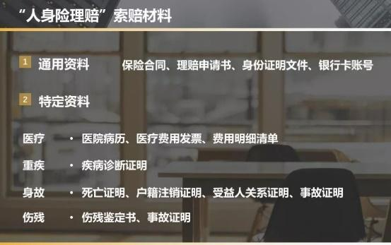
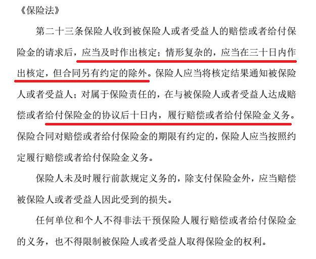

小伙伴们, 晚上好呀~你们的班班又出现了, 一眨眼今天就是咱们晚分享的最后一天了

今天我们要讲的内容是《理赔小常识及后续服务》.

先说说上完今晚这节课, 我们能get 到什么?

1、保险公司是不是靠拒赔赚钱的?

2、怎样才能顺利获得理赔

3、实战营投保的后续服务

## 1、保险公司是不是靠拒赔赚钱的?

在买保险前呢, 大家有个普遍关心的点, 就是我们出险之后, 该怎样向保险公司申请理赔? 或者担心理赔会不会很难?

OK~ 班班这就来教大家正确的理赔方式.

在说如何理赔之前, 先问问有没有人觉得保险公司是靠拒赔赚钱的?

如果你是这样想的话, 那就大错特错了.(相信大家心底也明白, 肯定不是)

在普通人眼里, 似乎保险公司拒赔50 万, 就能增加50 万利润.

其实不然, 在计算保费时, 保险公司早已考虑了各种赔付成本.

对于保险公司而言, 理赔就是流水线式的作业, 有人买保险就会有人出险, 就会有理赔, 都是很自然的过程.

无论保险公司大还是小, 每年理赔金额数以亿计, 并不会为了区区几十万赔款而刁难客户.

只要符合保险责任, 资料齐全, 保险公司就会按合同支付保额.

所以大家在购买保险时一定要做到如实告知, 了解保障范围和免责条款, 这样才能有效避免不必要的理赔纠纷.

那又有人问了, 万一真的出险了, 我们该怎么做才能顺利的获得理赔呢?

班班这就先上答案:

第一步: 及时给保险公司打电话报案, 申请理赔

在实战营期间投保的学员可以找规划师进行协助理赔, 简述出险情况及保险产品名称, 这里也要注意理赔的时效性哦, 班班建议大家第一时间报案申请理赔.

第二步: 按照保险公司的要求提供理赔资料

我们需要提供证明保险事故原因、性质和损失程度的资料, 无关资料可以Say No.

班班特意整理了一份"人身险理赔"索赔材料图, 供大家参考.

第三步: 等待保险公司联系我们

理赔人员在审阅理赔资料时, 可能会提出相关问题, 大部分问题只是为了核实情况, 并不是怀疑任何事情.

有时理赔人员会提出一些问题, 包括投保前的健康情况、就医记录等. 遇上此类问题, 千万不要乱答一气哦.

另外, 根据《保险法》第二十三条规定: 保险公司在收到理赔请求后, 要及时作出核定, 情形复杂的也不能超过30 天; 达成赔偿或给付保险金的协议后, 履行这个义务的时间不超过10 天.

下面我们来看一个真实的理赔案例:

去年4 月, 王老虎(化名)买了一份50 万保额的重疾险, 和一份百万医疗险.

今年体检查出甲状腺结节, 王老虎做了切除手术, 一共花了3.6万, 医保报销1.8 万.

出院后, 他就着手医疗险理赔的事情, 大概的经过是这样的:

● 根据协赔人员的指引准备好资料(资料包括: 身份证复印件、银行卡复印件、申请表、发票、费用清单、大病历原件等).

● 协赔人员在预审资料的时候, 发现王老虎病理报告提示"甲状腺乳头状癌", 但这个结果王老虎家人没有及时告诉他, 怕他多想.

● 所以当协赔人员告知王老虎可以同时申请重疾险50 万的赔偿时, 他很诧异, 做个小手术怎么可能赔50 万? 后来协赔人员耐心解释, 对着条款给王老虎捋清楚, 他已经达到重疾险的理赔标准.

● 6 月27 日王老虎根据指引提交了对应的资料给到两个保险公司, 7 月13 日医疗险报销了1.8 万; 8 月5 日, 重疾险赔了50 万.

王老虎事后回忆说, "理赔主要是在资料的收集上比较费劲, 按照他们说的去准备清晰多了, 不用来回瞎跑, 很快搞定. 更要感谢他们负责任地告知我还有50 万可以赔, 不然过了索赔期限就麻烦了."

王老虎的理赔还算比较顺利, 确诊"甲状腺乳头状癌"即赔. 其他疾病也是一样的道理, 符合合同约定的赔付条件就会赔付.

好啦, 理赔就讲到这里, 不知道大家现在心里是不是对于理赔更有底了呢~~

划重点啦:

如果你在实战营落实了保障, 配置好了保险, 保单生效后出了险, 请记得报案前联系规划师或在【水星保】微信公众号咨询, 随即拨打保险公司报案电话. 规划师会协助大家进行理赔服务的.

当然, 规划师除了会协助大家理赔以外, 还有很多服务给到大家的, 要知道咱们公司的规划师可都都是能量满满的小太阳呢.

所以, 班班也要在此强调下, 在实战营服务期间内配置保险的小伙伴, 你们都将获得后续的专属服务~

## 2、专属服务又有哪些呢?

### 专属服务1: 协助理赔服务

如果在投保后出险, 立即联系专属规划师, 专属规划师会协助进行理赔服务~

### 专属服务2: 后续的相关咨询服务

对于保险有不理解的地方, 小伙伴们可以来咨询专属规划师, 专属规划师会针对小伙伴提出的问题给出自己的专业建议.

### 专属服务3: 协助保单变更

我们配置好保险后, 尤其是长期险(寿险和重疾险), 可能会涉及我们保单的某些资料信息的更改, 比如联系方式、地址变更、付款信息变更(续期账户变更)、受益人变更、职业的变更等.

当小伙伴的这些信息发生改变之后, 可以联系专属规划师指导或联系保险公司进行变更.

### 专属服务4: 续保服务

续保分为2 种情况, 一种是像寿险以及重疾险这种长险的续保, 另外一种就是像医疗险和意外险的续保.

对于长险的续保, 在保险期间, 我们只需要保证我们在投保时绑定的银行卡有足够的钱支付保费即可. 因为在缴费之前, 保险公司会给我们发短信进行提醒.

对于意外险, 明年继续买就可以了. 医疗险则需要在上一保险期间届满后60 日内向保险公司申请重新投保.

那产品要是停售了, 届时也可以咨询专属规划师, 让专属规划师推荐当前市场性价比高的意外险或者医疗险哦~

### 专属服务5: 保险方案的动态调整

保险是一个长期配置的过程, 我们每个人在不同的人生阶段对保障的需求都是不一样的. 随着家庭收入、支出、负债的情况变化, 保额需求也会发生改变.

正常情况下, 我们需要每年进行一次保单检视, 每5 年到10 年就需要补充或者调整保单, 以符合当下的实际需求.

但是, 保险市场好产品不断推出, 我们在调整的时候难免"左右为难", 到了最后补充具体产品的时候, 还不知道哪款产品比较好, 比较适合我们.

这个时候, 可以大胆地把你的需求告知班班帮你预约专属规划师, 专属规划师会根据你的实际情况推荐适合的产品.

## 3、原有保单检视方法?

这里, 班班把原有保单检视的方法也给大家, 大家可以自己做做【保单检视】.

### 第一步: 确定理想保额

确定自己/家庭的理想保额, 如果不太清楚可以找班班申请规划师帮忙

### 第二步: 分析保单

这时, 对比一下【理想保额】和原有保单的【现有保额】, 再对比一下【预算保费】和【现有保费】, 你就会发现, 以下三种情况, 你必中一个:

情况1: 保额充足, 保费在预算内.

这说明我们暂时不需要补充新的保险了, 恭喜你, 这是最完美的情况哦~

情况2: 保额不充足, 保费还没有超过预算.

这说明原先配的保险保额比较低, 不过好在还有预算. 这时候, 我们根据课程里教的步骤, 挑选新的保险产品进行保额的补充就好啦~

情况3: 预算已经用完了, 但是保额还是不足.

这也是班班带班这么久最常见的情况! 不得不说, 有的保险销售真的是不专业啊...

这个时候, 我们要做的就是保单调整!

### 第三步: 保单调整

遇到第3 种情况, 我们一定要记住【保额优先】这个大原则. 买保险就是买保额. 保额是我们考虑保险的主要因素, 也是一份保险是否合适的主要因素.

所以, 为了补充到合适的保额, 这边班班教给你两个实用又好用的小招:

方法1: 增加保额

在咱们原有保单保额不足的情况下, 可以选择额外配置新的保险, 对保障进行补充.

对原有保单没有覆盖到的风险, 也可以补充相应的险种.

方法2: 替换保单(退保必有损失哦)

我们需要先检查自己原有保单的类型, 分清楚现有保单是理财型还是消费型保险.

如果我们现在持有的是消费型保险, 是不建议草率退保的, 需要仔细衡量衡量.

如果我们持有的是理财型的保险, 那我们就要明确配置这份保险的目的是什么——是当作一份强制性储蓄呢? 还是想要基础保障但造成了需求错配呢?

如果确实没有需要用保单理财的需求, 且这些产品的保费又太多, 以至于影响到了咱们的日常生活, 那就可以考虑更换保单了. 用保费更低、保额更高的产品对原有保单进行替换

道理都是懂的, 但有些小伙伴也还是很纠结. 退? 还是不退? 毕竟损失的都是自己交的钱呐! 心痛呀~

这是个好问题, 这份保单要不要退, 其实我们是可以通过量化思维来做决定的:

现有保单未交总保费-新保单总保费> 0

如果以上等式成立, 则说明换新保险会比较划算.

我们来看一个例子, 帮助理解:

这里, 班班要提醒大家, 在退保前有2 个要点是需要我们注意的:

1、了解自己当前的身体状况

重疾、寿险、医疗险的投保, 对身体健康状况都有一定的要求.

保险公司也会担心接收太多不健康的客户导致理赔压力太大, 所以, 保险并不是任何人想买、想在什么时间点买就都能买的.

这里就要求我们首先要了解自己的身体健康状况是否适合买新的保险. 如果不适合了, 那我们还是拿着原有保单比较稳妥, 好歹有个保障.

2、注意日期, 避免空窗期

保险公司为了防止逆向选择, 在保险产品上尤其是健康类的保险, 会设立一个等待期.

等待期, 用直白的话来解释, 就是保险公司承保之后, 保障的内容并不会马上起效, 要等待期结束才生效, 等待期内出险, 保险公司是不会赔付保额的.

所以, 我们在换新产品的时候, 需要注意新产品的等待期

如果等待期是90-180 天, 那我们最好在原有保单到期前的90 天或180 天之前进行投保.

(产品不同, 等待期不同, 大家需要根据自己看中的产品具体信息来~)

这样, 当原有保单到期失效的时候, 新的保单也开始发挥作用, 中间就不会没有保障.

好啦, 原有保单现在都检视好了, 新的产品也确定了.

现在, 大家对自己的保险方案应该很了解了! 最后一步, 就是大家去找班班申请规划师帮忙落实自己的保险方案喽~

好啦, 很高兴大家坚持到现在~

有保单的小伙伴可以好好检查一下自己的保单情况, 没有保单的小伙伴, 可以抓紧时间来找班班帮忙申请规划师.
