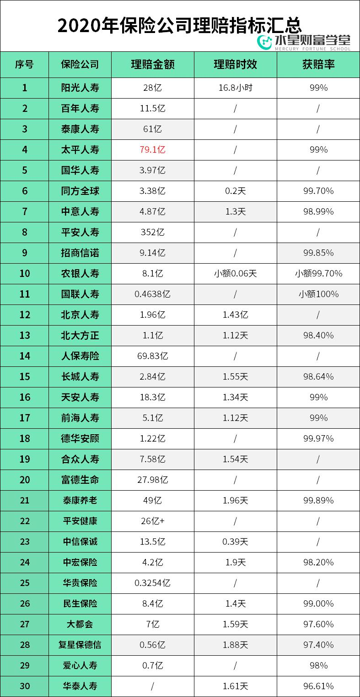
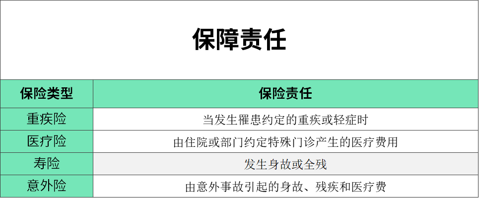
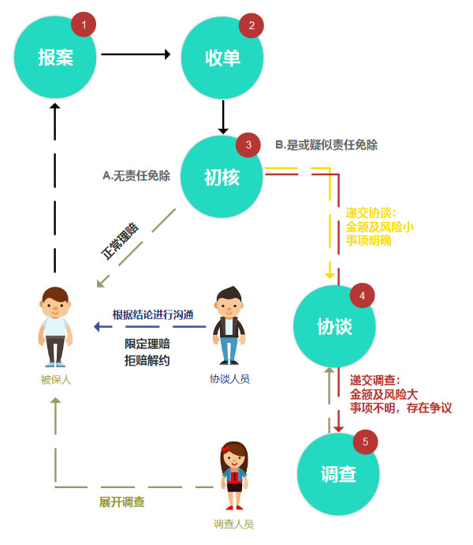
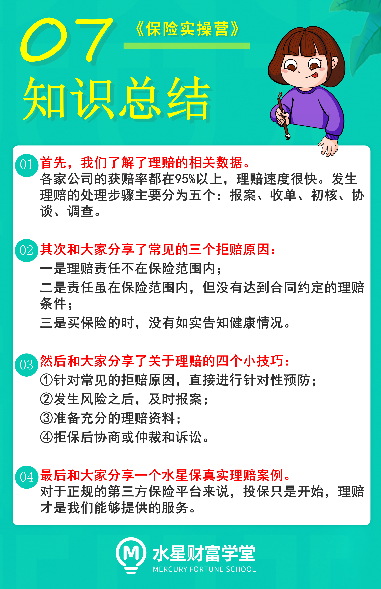

各位同学们, 小伙伴们大家好.

欢迎来到《保险实操营》. 懂原理, 不踩坑; 少花钱, 买对险.

上节课我们解决了买保险的两大困惑, 这节课我们继续来学习买保险之后大家最关心的后续注意事项以及理赔相关问题.

我们为什么要买保险呢? 无非就是发生风险的时候, 能顺利拿到理赔金, 以解燃眉之急. 所以理赔这件事就显得非常重要, 也是大家最为关心的一个话题.

很多人担心投保容易、理赔难, 出险以后保险公司会不会随便拒赔? 又或者长时间拖着不赔.

毕竟真的出险的时候, 那可是救命钱. 早给钱, 早治疗, 顺利出院; 晚给钱, 耽误治疗, 一命呜呼.

这个问题不光大家担心, 监管大大操的心更大, 毕竟搞不好, 可能毁的是整个行业的名声.

保险的重点就在于信任, 毕竟客户花那么多钱, 就买保险公司一个承诺.

## 一、理赔公开数据

怎么能获得大家的信任呢? 一个很重要的办法就是公开理赔数据. 根据 2020 年各家保险公司公布的理赔数据, 老师做了个表, 发给大家瞅瞅:

### 1、理赔率高达 95%

结合各家公司的理赔数据看, 各家公司的获赔率都在 95%以上. 保险并不存在理赔难的问题, 绝大部分人都能拿到理赔款.

### 2、理赔速度很快

有人担心, 保险公司理赔速度会不会很慢? 会不会故意耗着不给客户赔?

实际情况是不存在, 尤其是不存在能赔而故意不赔的情况. 从公布的理赔时效能看出来, 无论公司大小, 理赔时效都在 2 天内. 服务和速度都很到位, 完全可以放心.

那为什么我们总会看到一些, 关于保险理赔难的报道呢? 要回答这个问题, 不妨先一起了解一下到底什么是理赔.

## 二、发生理赔怎么处理?

理赔是什么呢? 简单来说, 如果被保险人发生了保险责任中约定的事故就能获得理赔.

前面我们了解了四大险种的保障责任, 我为你总结了一张保障责任表.

那么如果我们发生了理赔要怎么处理呢? 为了方便大家, 我整理了一张理赔处理流程图.

理赔流程大体分成五个环节:

### 1. 报案

主要是拨打保险公司客服电话, 告知被保人身份证号即可, 客服人员会引导进入后续环节. 要注意报案时间的要求, 寿险索赔时效一般 5 年, 寿险外的人身险一般是 2 年.

### 2. 收单

这里复杂一些, 除理赔申请书外, 不同险种有不同的材料要求, 理赔人员会详细说明, 分成这么两大块:

申请人证明资料: 涉及到被保人、受益人的身份和关系证明文件.

理赔证明资料: 寿险、意外险牵扯到的死亡证明(死亡/销户/火化)、残疾程度医学鉴定; 重疾险的病理报告、医学报告; 医疗险的费用清单、发票、手术记录等.

### 3. 初核

收单人员将申请资料转至审核, 审核人员初步核实, 有两种可能:

A. 材料齐全, 无责任免除, 事实清楚符合理赔要求的, 2-3 个工作日内通知付款, 超过这个时间的, 说明初核没有通过.

B. 有明显的责任免除或疑似责任免除事项的, 进入协谈或调查(金额或后续风险较小、责任免除事项明确的转给协谈; 反之, 转给调查).

### 4. 协谈

协谈人员会与被保人(申请人)进行沟通, 核实情况后, 被保人没有异议会转给审核, 通知赔不赔, 赔多少. 被保人若有异议, 协谈人员会转给调查, 进一步了解情况.

### 5. 调查

调查: 保险公司委托第三方机构进行调查, 并且根据调查的结果, 再次和被保人进行沟通. 如果仍无法达成一致, 那么后续可以通过法律诉讼的方式来解决.

只要你的要求符合保险公司的理赔标准, 保险公司是没有任何理由拒绝理赔的. 除非你的资料不符合保险合同, 例如你买的意外险, 偏偏报销医疗费用, 不在保障范围, 保险公司没有义务理赔.

毕竟, 理赔率关系到保险公司的品牌和口碑呢, 而且有保监会监管, 不可能无缘无故不给理赔.

## 三、常见三大拒赔理由

根据行业数据, 我们发现排名前三的拒赔理由是这些:

-是理赔责任不在保险范围内;

二是责任虽在保险范围内, 但没有达到合同约定的理赔条件;

三是买保险的时候, 没有如实告知健康情况.

前两条, 都和保险合同的详细条款有关.

能不能顺利理赔, 和合同中关于保障范围除外责任以及理赔认定的标准, 以及投保时是否进行了如实告知等密切相关.

讲完这些数据和案例后, 相信大家对理赔到底难不难, 这件事儿已经有了更多的理解.

接下来我再教你四招, 如果未来遇到风险需要理赔, 能够让你少走弯路.

## 四、理赔的四个小技巧

### 第一招: 事前预防, 不要埋下理赔的隐患

如何预防呢? 给大家两个方面的建议.

第一方面: 针对常见的拒赔原因, 直接进行针对性预防

投保前, 应该关注产品本身的保障内容和条款, 选择更符合自己保障需求的产品, 以及针对健康状况如实告知, 可以提前避免一些理赔的隐患.

第二个方面, 平时看病买药避免四点

理赔时我们的就诊记录, 甚至过往就诊买药记录都可能作为被调查的内容.

所以, 平时看病买药要注意四点. 免得给自己以后投保或者理赔挖坑.

第一, 由意外造成的事故, 一定要让医生将意外事由写进病历本.

第二, 在填写病例的时候, 请医生注意措辞. 不必要情况下, 不要随意在病历本上写下先天的、原生的、多少年前的、旧病复发等词语.

第三, 看病去符合产品要求的医院

大多数的重疾和医疗险, 都要求公立医院是二级以上. 民营或私人诊所的收据凭证, 大多时候不符合保险公司报销要求.

第四, 注意不要随便外借自己的医保卡给别人买药

很多保险公司会把这些记录, 当做你个人的记录处理, 很可能会影响投保或者理赔.

### 第二招: 发生风险之后, 及时报案

当出险的时候, 尽量在第一时间向保险公司报案, 进行备案和责任认定. 时间越早, 理赔也越快.

我翻看了许多份保险条款, 里面对于保险事故通知的约定都差不多, 要求相关人员在知道保险事故发生之日起的 X 日内通知保险公司, 这个时间期限大多为 10 天, 具体参照保险条款.

时间拖得越久, 事故鉴定越麻烦, 如果因为时间过长导致责任认定不清, 就容易引起理赔纠纷事件.

再有, 如果由于延迟通知致使保险公司增加的勘查、检验等费用, 均要由自己承担了.

所以咱们一方面尽早了解清楚理赔资料和流程. 另一方面, 避免因为没有及时报案, 影响调查带来不必要的纠纷.

### 第三招: 准备充分的理赔资料

关于理赔所需资料, 保险合同一般都会写明, 你可以打开一份保险合同, 看一下约定内容.

理赔资料的主要目的, 是为了证明申请的合理性和理赔事项的真实性.

理赔资料通常分为三类:

第一类, 基础材料

包括理赔申请书、申请人的身份证、银行账户、保险合同等等.

第二类, 关系证明

非本人申请的理赔, 需要出具一份关系证明.

第三类, 第三方出具的证明和报告

这是理赔材料中非常关键的部分, 直接关系到能否证明保险事故满足理赔条件, 也是保险公司核算保险金的依据.

到这里, 相信大家对理赔流程也有了个大致的概念.

报案以后, 通常就会有人员为我们提供指引和服务了. 我们可以根据指引, 来准备相关的理赔申请材料和证明文件.

保险公司收到申请资料和证明, 经过审核之后, 对于确属保险责任范围内的事故, 就会下发理赔通知书, 完成理赔金的给付并结案.

### 第四招: 拒赔后, 怎么办?

如果你按照保险公司的要求准备好了充足的资料, 并且出险事故也在保障范围内, 但保险公司还是拒绝理赔的话, 应该怎么处理呢?

一是协商, 了解保险公司拒赔的原因, 分清双方的责任.

如果保险公司和代理人的责任或双方都有责任, 那么可以向保险公司进行投诉.

常见的比如误导销售行为, 或者由于信息不对称, 投保人产生理解上的偏差.

在购买保险的过程中, 大家可以有意识的把聊天、通话等沟通记录做一个留存, 作为未来取证使用.

二是仲裁和诉讼

协商不成, 只能通过仲裁机构仲裁或者向法院提起诉讼.

与保险公司起争议, 普通人是否有胜算呢? 在理赔纠纷中, 保险公司并不如你想的那么强势.

法院在可赔可不赔的案件上, 往往倾向相对弱势群体.

所以遇到拒赔的情况, 我们仍然有争取的空间.

当然在咱们水星保平台配置的保险, 出险的时候一定要记得联系咱们的理财师, 帮咱们对接理赔相关事宜.

之前我们学员中就有发生意外就近就诊, 结果就诊医院不符合理赔范围的经历, 但是在我们理赔团队的据理力争下, 最终顺利拿到理赔款.

[理赔实例 | 意外骨折, 理赔团队争取赔款 4249 元](https://mp.weixin.qq.com/s/D78pETOOeCkyMhgcVUicKg)

这些天的陪伴就到这里啦, 大家如果今后在投保的过程中有什么问题, 可以扫码关注我们的水星保公众号, 留言咨询. 最后, 祝大家都好好的, 好好赚钱, 好好生活~
