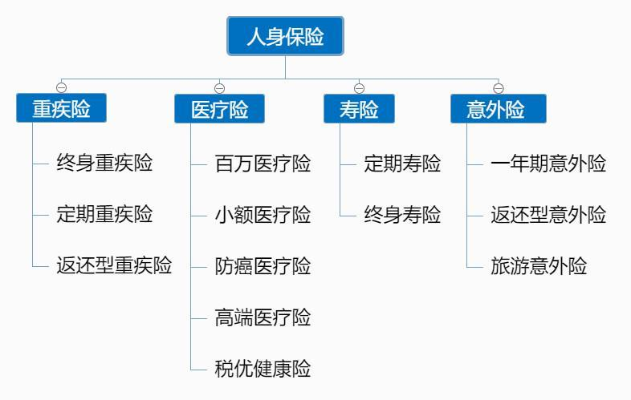
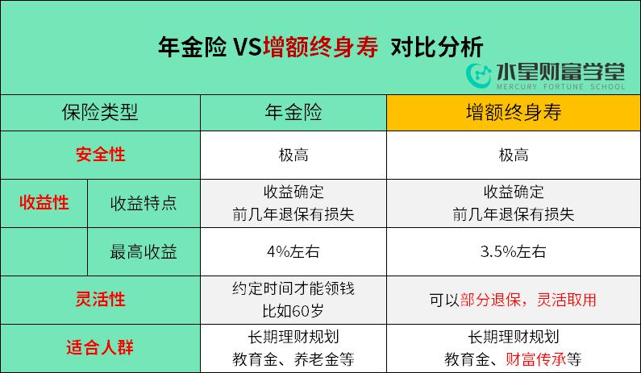
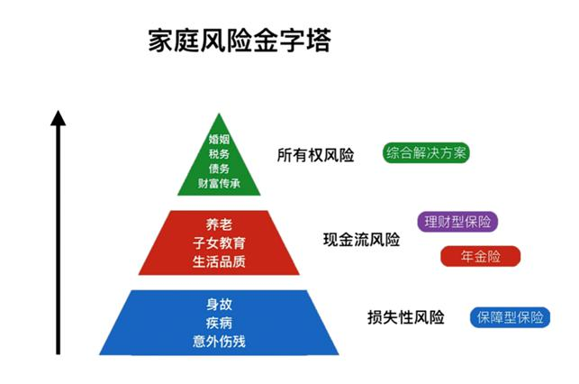
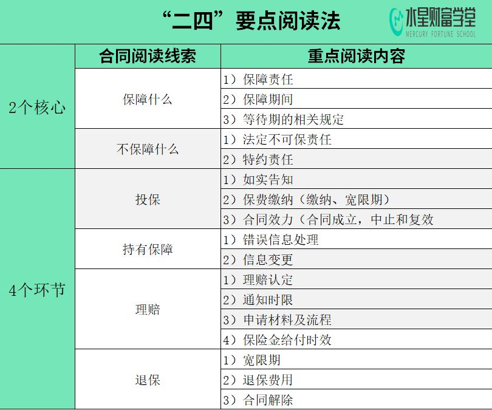

晚上好, 小伙伴们, 我们的毕业典礼现在正式开始啦

首先恭喜同学们完成水星财富学堂保险实战营课程的学习, 恭喜大家毕业啦!

那么现在我们来回顾一下 7 天的课程内容: 班班带着大家一起总结一下

## 第一天, 买保险不可不知的 3 大套路

### 一、3 大保险销售套路, 都有哪些?

误导 1: 无中生有, 消费别人的哀伤

误导 2: 存款变保单

误导 3: 高演示收益

### 二、避坑指南, 如何预防误导?

1)了解保险知识

2)选择靠谱的销售人员

3)重视回访和犹豫期

## 第二天, 内行人才懂的保险配置秘诀

### 一、买保险的第一步, 了解保险种类

平时咱们接触的保险可以分为两大类: 一类是: 保财产, 比如车险之类的, 也称财产险.

还有一类, 是专门保人的, 生老病死都可以赔的保险, 也称人身险.

### 二、普通人一般需要配置四大险种:

(1)重疾险: 定额给付, 缓解家庭经济压力; 重疾险可以用来补偿养病期间的收入损失

(2)医疗险: 就是报销医疗费用的. 像平时生病看医生, 如果有医疗险, 就能报销大部分医疗费.

(3)寿险: 身故就赔的保险, 万一经济支柱不幸离世, 保险公司赔的钱就可以用来照顾一家老小.

(4)意外: 只买短期, 无条件续保;

需要注意的是, 意外险本来是不赔猝死的: 因为猝死在医学上认为属于自身日积月累导致的疾病.

而意外险的判定原则是: 外来的、突发的、非本意的和非疾病的.

现在部分意外险, 也会额外保障猝死责任.

## 第三天, 学习了增额终身寿和年金险

随着利率不断下降, 普通人想资产稳定增值, 同时收益比较适中, 年金和增额终身寿或许是不错的选择.

年金险、增额终身寿, 虽然都有资金增值的作用, 但还是有区别的. 从安全性、灵活性、收益性, 这 3 个方面来看它俩的区别主要有以下两点:

## 第四天, 学习五大投保原则, 科学配置保险

1、先大人, 后小孩

2、先规划, 后产品

3、先保额, 后保费

4、先保障, 后理财

5、先人身, 后财产

保险是家庭财务规划的基石, 是一种转移我们财务风险的工具.

买之前, 只要你了解了这五大原则, 那么大的方向就不会错, 更不会发生花了钱, 却没有达到自己期望的情况.

## 第五天, 一张保险清单, 搞定全家保障

### 第一步, 明确需求

### 第二步、明确保额

1)重疾险

内行人通常建议, 重疾险保额应为: 重疾保额=治疗费用-社保报销+3 年收入损失

2)医疗险

医疗险解决的是看不起大病的问题, 市面上最火的百万医疗险, 每年只要几百块钱, 就能买到上百万的保障. 这个保额, 基本足够了.

3)寿险

测算寿险保额的方法其实很简单, 寿险保额=未还完的房贷等其他大额负债+必要的生活经费

4)意外险

成人意外险建议 50 万保额打底, 理想保额在 100 万以上. 这里提醒一下:0-9 岁的孩子即便意外身故也只赔 20 万, 所以孩子意外保额不建议配置太高.

### 第三步, 我们要确定一下预算

一般建议是, 家庭年收入的 8.50%! 注意, 这里的预算是不包括养老金、投资类的理财性保险的.

### 第四步: 了解自身的特殊情况

这个特殊情况, 包括年龄和健康状况. 如果你是非标体, 身体有一些小问题, 投保的时候, 有很多非常专业的地方需要去考虑.

这个时候, 你需要有专业的老师来帮你去做一下参考.

### 第五步, 就是挑选产品了

具体产品如何挑选, 可以预约我们的班级独家福利——规划师免费 1 对 1 咨询服务, 帮你根据你的实际情况, 针对需求挑选产品

## 第六天, 看懂保险合同, 明明白白买保障

如何找到保险合同?

第一步: 检视合同目录, 找到重点内容

第二步: 精读保险条款, 抓住 2 个核心+4 个重要环节

"二四"法则中的"二" , 代表 2 个保障核心: 保障什么, 不保障什么. 想要挑对产品, 这 2 个核心不能忽略.

法则中的"四", 代表 4 个重要环节, 分别涵盖了购买、持有、申请理赔和退保中的注意事项及行为准则.

## 第七天, 理赔无忧｜买了保险怎么赔?4 招让你少走弯路

### 一、什么是理赔?

简单来说, 如果被保险人发生了保险责任中约定的事故就能获得理赔.

### 二、常见 3 大拒赔理由:

一是理赔责任不在保险范围内; 二是责任虽在保险范围内, 但没有达到合同约定的理赔条件; 三是买保险的时候, 没有如实告知健康情况;

### 三、理赔的四个小技巧:

第一招: 事前预防, 不要埋下理赔的隐患

第一方面: 针对常见的拒赔原因, 直接进行针对性预防.

第二个方面, 平时看病买药避免四点:

1)由意外造成的事故, 一定要让医生将意外事由写进病历本.

2)在填写病例的时候, 请医生注意措辞.

3)看病去符合产品要求的医院

4)注意不要随便外借自己的医保卡给别人买药

第二招: 发生风险之后, 及时报案

第三招, 准备充分的理赔资料, 通常分为三类:

1)基础材料

2)关系证明

3)第三方出具的证明和报告

第四招: 拒赔后, 怎么办?

一是协商, 了解保险公司拒赔的原因, 分清双方的责任.

二是仲裁和诉讼, 协商不成, 只能通过仲裁机构仲裁或者向法院提起诉讼.

好啦, 跟着班班又回顾了一下 7 天的课程内容, 是不是又加深了一遍印象啊

毕业了也要记得复习哈

希望大家可以运用课程里学到的知识为自己的家庭妥妥的配置好保险!

这也是我们训练营的初衷, 希望大家掌握必备的保险知识, 躲开保险的坑, 帮家庭做好规划~

好啦, 亲爱的同学们, 结业愉快

群里面解决的是共性保险问题, 就好像大家去问诊, 班班是指导大家挂哪个号, 规划师是对症治疗的人. 个性化的保险问题, 包括保单咨询, 和保险如何配置, 都可以问哈.

我们的毕业典礼就到这里啦, 祝小伙伴们在接下来的日子里一切顺利, 越来越好

感谢大家的聆听
