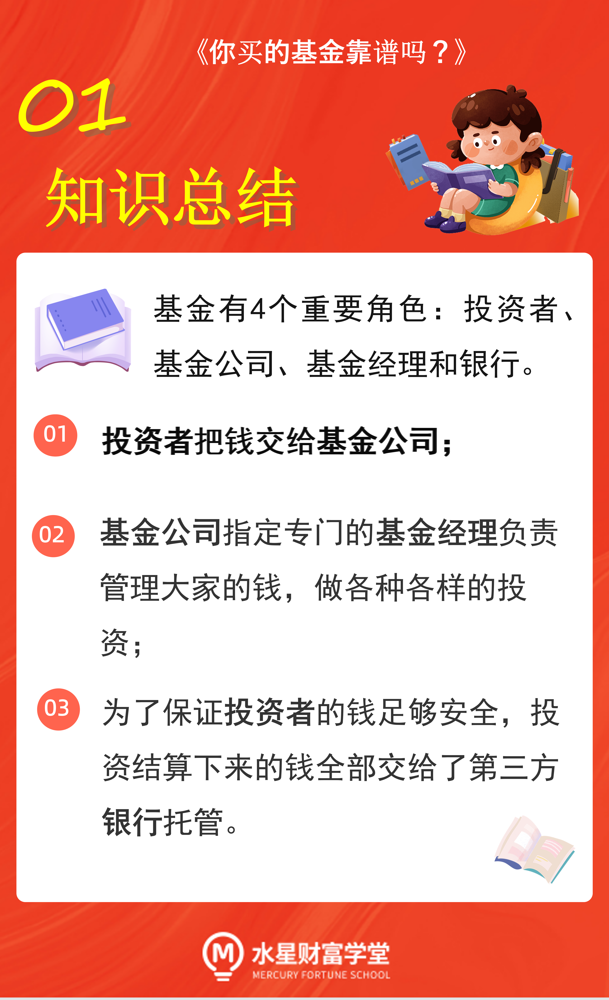

## 基金

投资中的基金是指, 由一家基金公司收集很多投资者的钱, 汇集在一起, 由基金经理按照规则进行投资, 从而获取收益的投资工具.

在中国, 基金公司的成立要经过证监会的严格审批, 截止到 2021 年 4 月, 国内的基金公司只有 140 多家. 基金经理则需要拿到从业资格证才能上岗.

万一基金公司卷款跑路了怎么办?

中国证监会规定, 我国的基金运作采用"第三方存管制度".

第三方存管机构, 目前是指具备第三方存管资格的商业银行. 如中国银行、工商银行、农业银行、交通银行等等, 都具备第三方存管资格.

我们的钱在这些大银行里托管着, 比直接放在基金公司更让人放心.

## 总结

