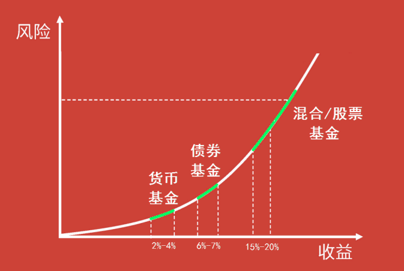
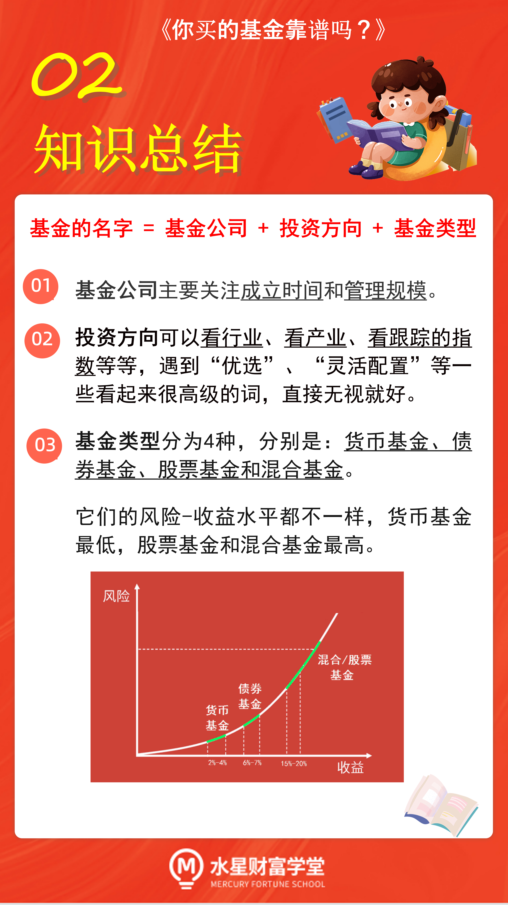

## 基金名字

基金的名字=基金公司+投资方向+基金类型.

如: 博时医疗保健行业混合(代码:050026).

这只基金的名字可以拆成三个部分来看: 博时+医疗保健行业+混合.

"博时"是基金公司的名字, 它的全名叫博时基金管理有限公司. 告诉我们, 基金是哪家公司出品的.

"医疗保健行业". 它告诉了我们该基金的投资方向. 我们如果选择投资这只基金, 相当于选择了医疗保健这一条赛道. 其他的像消费啊, 科技啊, 就和这只基金无关了.

最后是"混合": 它告诉了我们, 这只基金的分类属于混合型基金.

### 基金公司

选择基金公司主要看两个方面:

一是成立时间. 成立时间足够早, 说明公司已经通过了市场的长期检验, 相对更靠谱.

二是管理规模. 公司管理的钱都是投资者一笔一笔投进来的, 管理规模大的公司, 相当于取得了投资者更大的信任, 我们选择这样的公司也相对更放心.

学长根据成立时间和管理规模, 为大家筛选出了 48 家公司, 它们的成立时间都在 5 年以上, 管理规模都在千亿元以上.

> 基金管理公司名单(管理规模 TOP1~25)

> 数据来源: 天天基金网 数据收集日期:2021 年 04 月 14 日

| 基金公司         | 成立时间 | (年) 管理规模(亿元) |
| ---------------- | -------- | ------------------- |
| 天弘             | 2004     | 14, 182.42          |
| 易方达           | 2001     | 12, 867.24          |
| 汇添富           | 2005     | 8, 814.70           |
| 广发             | 2003     | 8, 524.04           |
| 南方             | 1998     | 8, 513.55           |
| 华夏             | 1998     | 8, 260.65           |
| 嘉实             | 1999     | 7, 649.46           |
| 博时             | 1998     | 7, 609.26           |
| 富国             | 1999     | 6, 343.93           |
| 工银瑞信         | 2005     | 6, 101.98           |
| 银华             | 2001     | 6, 003.62           |
| 鹏华             | 1998     | 5, 955.81           |
| 招商             | 2002     | 5, 318.87           |
| 华安             | 1998     | 4, 936.58           |
| 建信             | 2005     | 4, 774.06           |
| 兴证全球         | 2003     | 4, 734.65           |
| 中欧             | 2006     | 4, 357.98           |
| 景顺长城         | 2003     | 4, 175.50           |
| 国泰             | 1998     | 4, 141.67           |
| 平安             | 2011     | 3, 819.59           |
| 中银             | 2004     | 3, 695.68           |
| 交银施罗德       | 2005     | 3, 574.05           |
| 华宝             | 2003     | 3, 009.15           |
| 农银汇理         | 2008     | 2, 573.61           |
| 浦银安盛         | 2007     | 2, 440.97           |
| 兴业             | 2013     | 2, 400.07           |
| 国寿安保         | 2013     | 2, 296.05           |
| 大成             | 1999     | 2, 156.78           |
| 东方证券(东方红) | 2010     | 2, 135.86           |
| 万家             | 2002     | 2, 008.61           |
| 永赢             | 2013     | 1, 944.25           |
| 上投摩根         | 2004     | 1, 808.11           |
| 长城             | 2001     | 1, 778.43           |
| 民生加银         | 2008     | 1, 768.08           |
| 华泰柏瑞         | 2004     | 1, 692.06           |
| 融通             | 2001     | 1, 436.08           |
| 诺安             | 2003     | 1, 311.72           |
| 海富通           | 2003     | 1, 295.81           |
| 中信保诚(信诚)   | 2005     | 1, 289.20           |
| 银河             | 2002     | 1, 231.97           |
| 中融             | 2013     | 1, 210.85           |
| 中银证券         | 2002     | 1, 193.69           |
| 鸿德             | 2015     | 1, 177.57           |
| 光大保德信       | 2004     | 1, 121.60           |
| 国投瑞银         | 2002     | 1, 111.03           |
| 长信             | 2003     | 1, 065.21           |
| 中加             | 2013     | 1, 057.01           |
| 前海开源         | 2013     | 1, 011.09           |

### 投资方向

如像前面提到的"医疗保健行业", 投资方向一目了然.

再如: 民生加银养老服务混合(代码:002547). 其中"养老服务"就是基金的投资方向.

再如: 华夏沪深 300(代码:000051). 表示基金的投资方向是追踪沪深 300 指数, 复制指数表现.

Ps: 在基金名字中容易出现一些很高级的词, 比如"优选""灵活配置""价值"、"量化"等等, 这些花哨的修饰词对咱们来说参考价值不大, 大家直接忽略就好.

### 基金类型

按照投资品种来分类, 共分为 4 类, 分别是: 货币基金、债券基金、股票基金和混合基金.

货币基金的成分里主要包含了银行存款和债券, 不可以投资股票. 所以它的风险是比较低的, 几乎不会出现亏损. 大家熟悉的余额宝、零钱通其实就属于货币基金.

债券基金主要投资于债券, 此外还会投资一部分股票. 但是股票的占比不超过 20%. 所以, 债券基金的风险总体来说比较低, 但是比货币基金的风险要高一些.

而且, 虽然货币基金和债券基金都投资于债券, 但是它们挑选的债券不太一样. 货币基金主要投资于一年以内到期的债券, 利息相对较低; 债券基金主要投资于期限在一年以上的债券, 利息相对更高一些.

股票基金: 股票基金主要投资于股票, 此外还会投资一部分债券, 但是债券的占比不超过 20%. 所以, 股票基金的风险普遍较高.

最后是混合基金. 混合基金同时投资于股票和债券, 而且占比没有定死. 基金经理可以根据对市场形势的分析, 灵活调整股票和债券的比例.

对于国内的基金而言, 混合基金的成分大多以股票为主, 它的风险也是相对较高的.

大家只需要看基金的名字里写的是货币、债券、股票还是混合, 就可以知道基金类型, 进而判断基金的风险-收益水平啦.

## 总结

