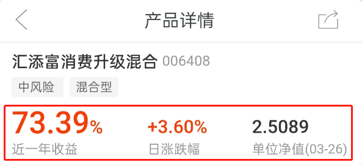
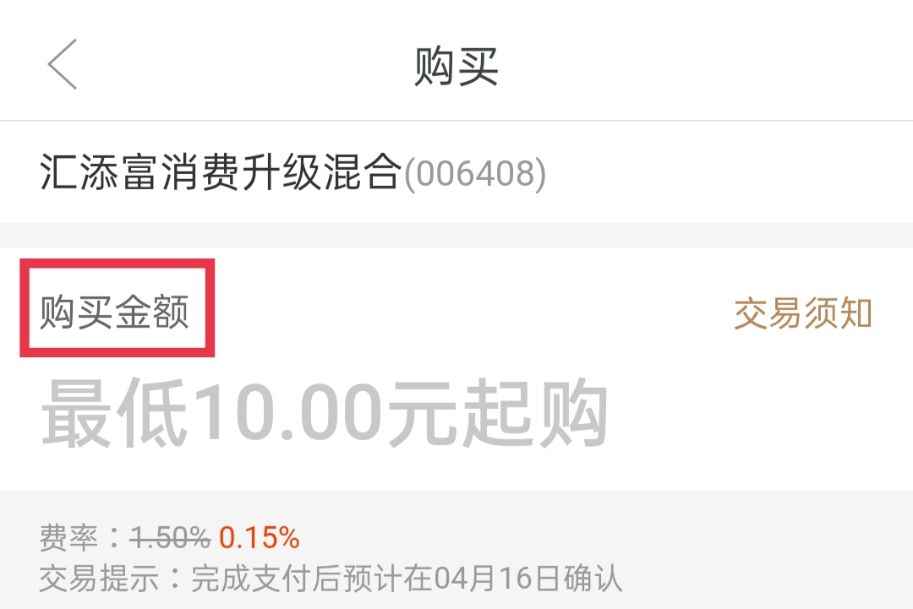
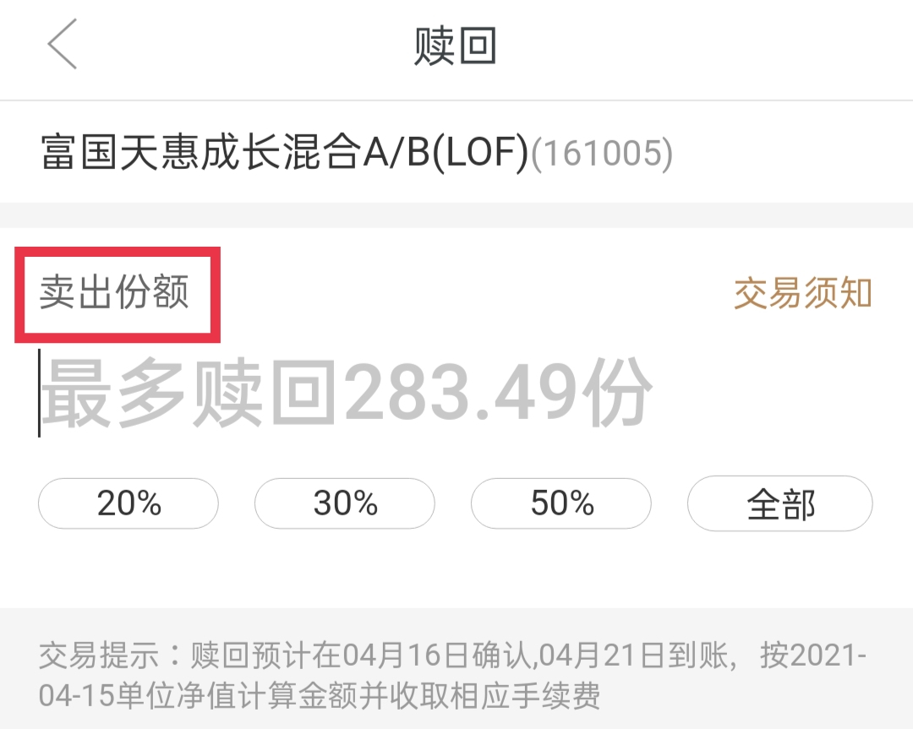
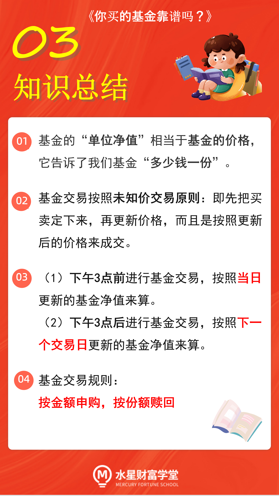

当我们查看一只基金的详情时, 最先看到的是三组数据: 近一年收益、日涨跌幅和单位净值.

## 单位净值

如上图所示:

近一年收益: 最近一年赚了多少,

日涨跌幅: 最近一天赚了多少.

单位净值: 如上图中, 它的意思就是, 买这只基金的价格是每份 2.5089 元.

每天在股市收市之后, 基金公司都要计算出基金最新的单位净值, 作为投资者交易的依据.

不同基金公司的办事效率不太一样, 有些公司更新得比较早, 当晚 8 点就可以公开基金的最新净值; 还有些基金公司更新得比较晚, 要等到第二天早上才显示已更新的单位净值.

## 未知价交易原则

对于余额宝这一类的货币基金来说, 就按照买卖当下的净值来算. 交易的时候显示净值是多少, 就按照这个价格来成交.

但是, 除了货币基金以外, 其他类型的基金, 不管是债券型、股票型还是混合型, 都不能按照当下的净值来算, 而是采用"未知价交易原则".

未知价交易原则: 基金的价格不是买卖当时看到的单位净值, 而是以当日更新的单位净值为准.

相当于先把买卖定下来, 再更新价格, 而且是按照更新后的价格来成交. 这就是"未知价交易原则".

在基金交易中, 下午 3 点之前才能算"当日"哦, 过了 3 点就只能算到下一天了.

假设我们在 T 日下午 3 点前买一只基金, 价格就是 T 日晚上更新的单位净值.

假设我们在 T 日下午 3 点后买一只基金, 那不好意思, 只能算到下一天了, 价格是 T+1 日晚上更新的单位净值.

卖出时也是一样. 下午 3 点之前卖, 就按照当天晚上更新的净值算. 下午 3 点之后卖, 就按照下一个交易日晚上更新的净值算.

## 按金额申购, 按份额赎回

买入环节: 买基金的时候只能按照金额买. 系统会让我们输入"购买金额".

注意, 这里输入的是金额哦, 也就是多少元人民币. 申购基金只能选择申购多少钱的, 不能选择申购多少份.

我们申购完成后, 系统会按照更新以后的单位净值, 自动给我们把金额换算成份额.

比如, 我们申购 100 元, 更新后的单位净值是 2.5 元/份, 那么我们买到的份额就是 100 除以 2.5, 也就是 40 份.

实际申购过程中会从 100 元里面扣掉一点手续费, 所以得到的份额会比 40 份稍微少一些.

卖出环节: 我们只能选择卖多少份, 不能选择卖多少钱的.

赎回完成后, 系统会按照更新以后的单位净值, 自动给我们把份额换算回金额.

比如, 我们卖出 100 份基金份额, 更新后的单位净值是 2 元/份, 那么我们赎回的现金就是 100 乘以 2, 也就是 200 元.

赎回过程中也可能出现手续费, 所以实际拿到手的现金可能会比 200 元稍微少一点.

以上就是基金买卖的整个过程啦, 总结成十个字就是: 按金额申购, 按份额赎回.

## 总结

