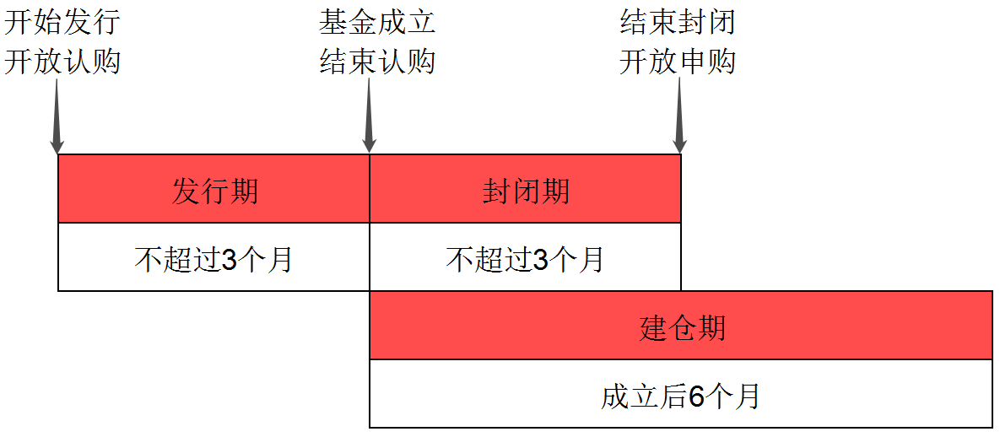
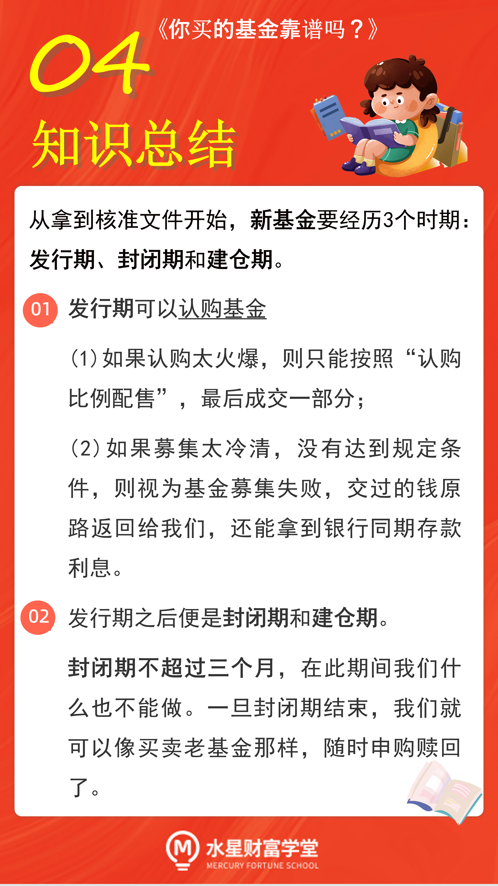

## 认购与申购

认购, 就是在基金刚发行但是还没有正式成立的时候购买基金, 也就是买新基金.

申购, 就是购买已经成立的基金, 也就是买老基金.

## 想认购, 认准基金的"发行期"

基金公司想要发行一只新基金, 首先要向证监会报送各种材料, 拿到核准文件后, 才可以对外发行.

所以, 我们看到一只基金发行的时候, 说明证监会已经为我们把了一道关.

从拿到核准文件开始, 新基金要经历 3 个时期: 发行期、封闭期和建仓期.

## 发行期

发行期也叫"募集期或者"认购期".

在这个时期, 看中该基金的投资者就要开始缴款啦. 想要认购新基金的小伙伴, 一定要抓住这个时机.

认购期间, 单位净值一律按照 1 元/份了来算, 不会出现每日波动, 参与者人人公平.

而且, 基金会在认购期间给出一定的费率优惠, 选择认购可以节省一小笔手续费.

同时, 基金公司募集到的资金也没有闲置, 而是存到金融机构"吃"利息, 帮着咱们"钱生钱". 等到发行期结市这部分利息收入会换算成份额一并确认.

虽然认购有这么多好处, 但是大家仍然要考虑清楚再操作哦. 因为认购申请一经受理, 不可撤销. 一旦提交了, 我们就不能反悔了.

只要我们的认购申请提交了, 认购的钱也付了, 那就只需要耐心等待 2 个工作日, 就能看到我们的认购确认记录啦.

但是大家注意, 认购结果有可能和我们提交申请的时候有出入. 这主要是和认购的规模有关系.

### 基金被"买爆了", 会怎样?

假设一只基金太抢手, 被大家"买爆了", 超过了限定的规模, 那么基金公司就会出面控制一下.

超出限定规模的部分, 基金公司会按比例退回给投资者.

这个过程叫做"认购比例配售". 也就是说, 想买的人还可以买到, 来者有份, 但是, 大家都不会全额成交, 只能按比例成交一部分.

一旦出现了认购比例配售, 也就意味着募集的规模见顶了. 基金将会提前"收摊", 从下一个交易日起不再接受认购申请.

### 基金募集失败了, 会怎样?

证监会已经明确规定了, 新基金募集成立需要满足一系列条件, 不满足条件的就算募集失败. 最核心的条件有两个:

(一)认购人数超过 200 人

(二)认购份额不少于 2 份、认购金额不少于 2 亿元.

正常情况下, 基金的发行期在 1 个月左右, 在此期间达到上面的条件, 就算募集成功.

如果提前达到条件, 发行期也可以提前结束.

如果没有达到条件, 基金公司可以延长发行期, 但是最长不能超过 3 个月.

3 个月仍然没有达到条件的, 那就彻底募集失败啦.

基金募集失败意味着, 咱们的期待落空了, 等待的时间就白白浪费了; 但是, 咱们不用担心交了的钱退不回来.

按照规定, 如果基金募集失败, 基金公司需要在募集期满后 30 个工作日内, 返还投资者已经缴纳的款项, 同时计算银行同期存款利息.

也就是说, 咱们不仅能把本钱要回来, 还能拿利息. 相当于存了同等时间的银行存款.

## 封闭期

基金募集成功后需要验资, 并且向证监会提交备案申请和验资报告. 不过这些流程一般也就 2~3 天的时间, 我们不用过多关注

紧接着, 基金就要进入封闭期啦.

在封闭期内, 基金不能申购, 也不能赎回. 买了的人出不去, 没买的人进不来. 总之就是什么也操作不了, 只能干等着.

封闭期开始的同时, 基金的建仓期也同步启动了.

建仓期也就是基金经理"排兵布阵的时期. 基金经理会将募集到的钱, 按照合同规定的投资范围和投资策略, 投资于各种投资品.

因为正式投资已经开启了, 所以基金的净值也开始出现变化.

基金会在封闭期内公布单位净值, 频率是一周一次, 一般来说是在每周五的晚上.

我们可以每周关注一下净值的变化. 当初我们可是按照 1 元/份认购的, 如果跌到不足 1 元了, 那我们就要小心一点, 很可能在封闭期打开以后就是亏损的局面.

通常情况下, 基金的封闭期为 1~2 个月, 最长不会超过 3 个月. 如果在封闭期不看好它了, 最好在封闭期一打开就赶紧卖掉.

如果持续看好, 还可以在封闭期打开的时候追加更多的资金.

总之, 封闭期一结束, 交易过程就和其他老基金的交易没什么区别了, 随时可以申购和赎回.

## 总结

