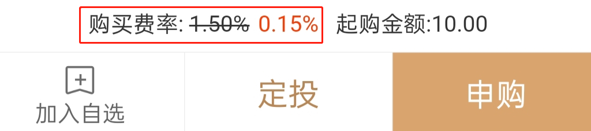
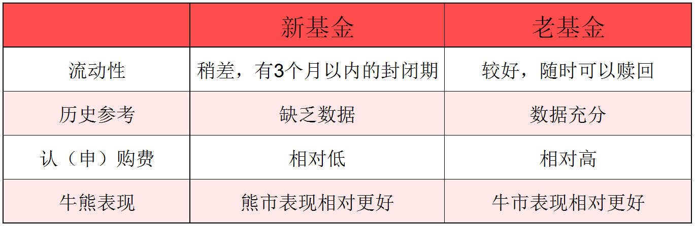
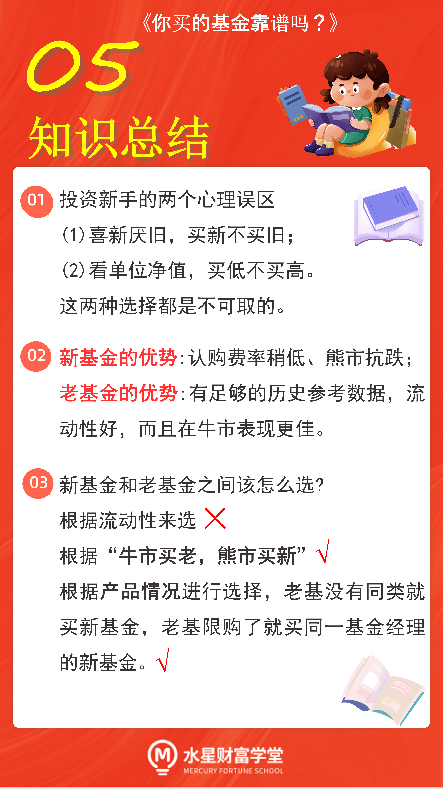

## 投资新手的误解

基金公司、销售机构在做营销的时候, 往往会在新基金发行上倾注更多的资源.

恰好很多投资新手有一种"喜新厌旧的心理, 倾向于买新产品, 所以催生了很多爆款新基金.

学长不得不提醒大家了, 买基金可不是买手机, 新基金不是在老基金的基础上升级换代, 新的不一定比旧的好. 这种"喜新厌旧"的心理是不可取的.

还有的小伙伴在选择基金的时候, 喜欢看单位净值, 以为单位净值小的就是便宜的, 单位净值大的就是贵的.

新基金认购中, 基金的单位净值一律按照 1 元来算. 而很多老基金的单位净值早就超过 1 元了. 这就让很多新手误以为, 新基金比老基金便宜.

选基金可不是这么看的. 单位净值代表的是当前的"价格", 与未来的涨幅没有太大联系, 不存在价格低就涨得多这样的说法.

就像买菜一样. 一块钱一斤的菜看起来便宜, 但可能根本没什么涨价空间. 八块钱一斤的菜看起来很贵, 但有可能涨到十几块钱一斤.

我们做投资要选未来涨得多的那个, 不是选现在价格最低的那个.

因为单位净值小就选择新基金, 抛弃老基金, 这个逻辑可不对.

那么, 新基金难道就一无是处了吗?

其实也不是. 接下来, 学长带着大家做一个全面对比, 看看新基金和老基金的优势分别在哪里.

## 四轮 PK, 看清新基、老基的优劣势

我们把新基金和老基金一起拉出来, 连续 PK 五轮, 仔细研究清楚他们的优势和劣势.

### 第一轮 PK: 看流动性.

流动性指的是基金交易的难易, 也就是咱们买了一只基金以后, 是否容易卖出去.

如果随时可以卖, 那就说明流动性非常好; 如果要等很久才能卖, 那就说明流动性非常差.

咱们在上节课学习过, 新基金在发行期结束后, 要经过一段时间的封闭期, 通常不超过 3 个月. 封闭期内禁止大家买卖.

而选择老基金就不需要等待啦. 老基金的买卖相对灵活, 一般来说, 持有的基金随时都可以卖掉.

所以在第一轮的流动性 PK 中, 老基金胜出.

### 第二轮 PK: 看历史参考.

新基金由于刚刚"出道", 没有历史业绩的积累, 所以没法看它的历史业绩是好是坏.

老基金已经"出道"一段时间了, 有大量的历史数据可以供我们参考, 包括历史收益率、持仓结构等等, 这些历史数据可以辅助我们分析这只基金的好坏.

所以, 在第二轮 PK 中, 老基金胜出.

### 第三轮 PK: 看费率.

买新基金通常享受一定的费率优惠. 也就是说, 认购费往往比申购费更便宜.

通常情况下, 申购老基金的申购费在 1.5%左右, 而认购新基金的认购费在 1%~1.2%左右.

不过呢, 现在很多平台都会给大家提供费率优惠, 原本申购老基金的费率是 1.5%, 优惠后甚至可以达到 0.150%!

所以说, 在能够获得费率优惠的前提下, 新基金的认购也就没有特别大的优势了.

第三轮 PK 就算新老基金打平啦.

### 第四轮 PK: 看牛熊市表现.

这一轮要从新基金的建仓期说起. 咱们上节课讲到, 新基金的封闭期开启以后, 建仓期也就同步开启了.

基金经理在刚开始建仓的时候, 会非常非常谨慎, 一般来说走得都是非常稳健的风格.

因为很多投资者都在盯着基金的单位净值.

如果跌下来了, 会导致大家不看好这只基金. 基金"解封"之后, 大家就会选择赎回. 为了在"解封"之后有一个比较好的表现, 从而留住投资者, 基金经理不会做太多冒险的布局.

这就导致, 新基金刚成立时的收益不会太高. 如果当时市场处于牛市, 涨幅诱人, 那么买新基金很可能就要踏空了. 牛市时, 新基金的表现不如老基金.

反过来说, 如果市场处于熊市, 一直跌跌不休, 那么买稳健的新基金会更加抗跌. 因为新基金还处于建仓阶段, 刚好可以在下跌中捡到便宜的筹码. 熊市中, 新基金的表现胜过老基金.

所以, 基金投资中有个八字口诀, 叫做: 牛市买老, 熊市买新.

在第四轮 PK 中, 没有绝对的胜出者, 老基金在牛市胜出, 新基金在熊市胜出.

学长把四轮 PK 总结在了一个表格里, 方便大家查看.

## 新基、老基, 到底选哪个?

经过四轮 PK, 我们要回答一下本节课的核心问题了: 新基金和老基金, 到底应该选哪个?

首先, 学长不建议大家根据流动性来做选择.

如果你更加关注短期内的流动性, 想要在 3 个月之内快算赎回, 那么毫无疑问, 老基金会更适合你. 但是, 学长更希望大家坚持长期投资, 不要在短期内快速地买入卖出.

根据历史数据统计, 长期持有赚钱的概率更大, 而且, 绝大部分基金经理本身就是长期投资者. 我们只有和基金经理的理念相契合, 才更容易赚到钱.

其次, 如果你擅长判断市场牛熊, 那么就可以根据牛市买老, 熊市买新"来选择.

最后, 我们还可以根据产品情况进行选择.

有些新基金是全新的, 在老基金里面找不到相同投资方向的基金. 如果我们正好看中了这个投资方向, 只能买新基金.

有些明星基金经理管理的老基金比较抢手, 已经出现了限制申购. 如果我们非常看好基金经理, 又没法买他的老基金了, 那么就可以购买他们管理的首发基金.

## 总结

