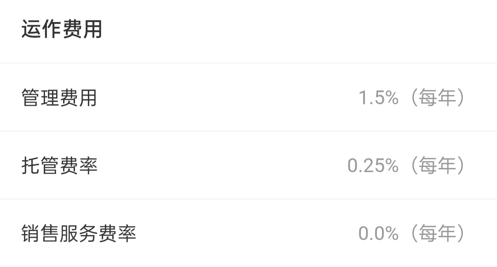

## 申购费: 买得越多越优惠

申购基金要缴纳申购费, 通常来说分为两种情况: 前端收费和后端收费.

前端收费的意思是, 在一买入的时候就要扣除申购费. 后端收费的意思是, 买入的时候暂时不扣除申购费, 等到卖出的时候再一起算账.

绝大多数情况下, 销售平台设置的都是前端收费, 也就是在买入的时候就要扣除申购费. 而且, 前端收费按照申购金额给费率分了很多档, 买的金额越大, 费率优惠也越大.

比如下面这只基金的申购费用, 采用的就是前端收费.

申购费率分成了 4 档.

购买金额不足 100 万的时候, 费率为 0.15%;

购买金额在 100 万到 500 万之间的, 费率为 0.10%;

购买金额在 500 万到 1000 万之间的, 费率是 0.03%;

购买金额在 1000 万以上的, 统一按照 1000 元收取申购费.

## 赎回费: 拿得越久越优惠

基金的赎回, 也就是基金的卖出环节, 需要收取赎回费.

赎回费就不再按照金额来分档啦, 而是按照持有时间来分档. 简而言之, 持有一只基金的时间越久, 赎回费率就越低. 如果持有时间足够久, 甚至可以免除赎回费哦.

比如下面这只基金的赎回费率, 一共分成了 4 档.

0 到 7 天是一档, 也就是持有不到一周的情况, 赎回费率最高, 达到了 1.5%, 而且没有任何优惠. 相当于我们最终的投资收益率要损失 1.5%.

7 天到 365 天是第二档, 也就是持有时间达到一周, 但是不满一年的情况, 赎回费率是 0.5%.

365 天到 730 天是第三档, 也就是持有时间达到一年, 但是不足两年的情况, 赎回费率是 0.25%.

最后一档是持有期限超过两年的情况, 赎回费直接免除.

从赎回费率的设计中也能看出来, 基金公司非常鼓励我们长期持有一只基金. 只有长期持有, 我们才能和基金经理的理念保持一致, 赚钱的概率也会增大.

## 运作费用: 被悄悄扣掉的钱

除了申购和赎回的费用, 基金交易中还会产生其他三种费用: 管理费、托管费和销售服务费. 这些都是基金运作过程中产生的成本.

比如, 下面这只基金的运作费用是这样设置的: 管理费率每年收取 1.5%, 托管费率每年 0.25%, 销售服务费率为 0, 也就是直接免除.

基金公司帮着咱们管钱, 做投资, 为我们提供了专业化的服务, 自然要收取相应的服务费用. 这笔基金公司收的费用就是"管理费".

不同类型的基金, 管理费差别很大. 管理难度越大的种类, 收费越高.

例如, 风险最低的货币基金, 管理费率只有 0.3%左右; 风险稍高点的债券基金, 管理费率在 0.6%左右; 风险更高的股票基金, 管理费率可以达到 1%~1.6%.

在第一课中, 我们学习过基金的"第三方存管制度". 基金公司只负责投资, 不负责管钱; 真正管钱的是托管的银行. 所以, 除了管理费, 负责托管资金的银行也要收取一定的费用, 这笔费用叫做托管费". 通常情况下, 托管费率在 0.25%左右.

最后一项是"销售服务费", 也就是基金公司给基金打广告产生的费用.

不过, 并不是所有的基金都会收取销售服务费, 大部分情况都是一些偏保守型的基金在收取, 比如像余额宝这样的货币基金, 还有一些债券基金, 等等.

管理费、托管费和销售服务费都是按年收取的, 只要我们一直持有, 就要一直收取. 但是, 大部分投资者都感觉不到扣过这些钱.

这是因为, 交易的后台在每天计算基金净值的时候, 就已经自动扣掉了这部分费用, 所以我们感受不到这些费用的发生.

## 总结

