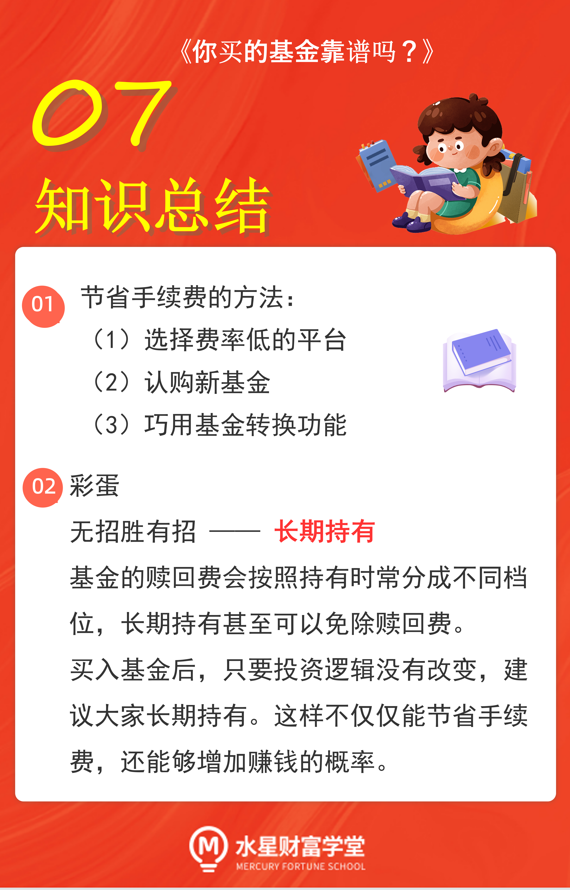

首先, 大家可以考虑余额宝、零钱通这一类的基金, 也就是货币基金. 货币基金的申购费、赎回费都为零, 买卖两头的手续费都省了.

不过, 学长非常懂大家的心态. 货币基金的收益少得可怜, 只买这种基金的话, 和银行存款的差别不大, 没什么吸引力.

为了减少手续费就只选择货币基金, 有些得不偿失. 其他的像债券基金、股票基金和混合基金, 我们该买还是要买. 那么, 这些品种的基金有没有办法节省手续费呢.

## 选择费率低的平台

不同平台之间, 收费标准不一样. 在一些平台买基金会有费率优惠. 也就是销售平台出让一部分利益, 吸引大家都来自家平台购买基金, 薄利多销.

这里, 学长给小伙伴们普及一个基础知识: 基金公司管理的基金可以放在各种平台上销售, 只要大家搜索的代码一样, 不管在哪个平台买, 买到的都是完全一样的东西.

这就像网上购物一样, 同样的货可以在多家店铺销售有的店铺卖得贵, 有的店铺卖得便宜. 东西都一样的情况下, 咱们肯定是挑售价便宜的店下单.

## 认购新基金

这个方法咱们已经在之前的课程里提到过了. 在新基金和老基金的对比中, 新基金的买入费率要更低一些.

所以, 在新基金和老基金各方面差不多的情况下, 我们可以优先考虑选择认购新基金, 节省一部分手续费.

## 巧用基金转换功能

这个方法主要用于我们想把手里的一只基金换成另一只的时候.

学长说一个具体的场景, 这样更方便大家理解.

现在有 A 和 B 两只基金, 学长把它们的申购费率和赎回费率都列出来:

A 的申购费率是 1%, 赎回费率是 1.5%

B 的申购费率是 0.5%, 赎回费率是 1.2%

现在我们手里拿着基金 A, 但是我们发现基金 B 更好, 所以想要先把基金 A 卖掉, 再用收回来的钱去买基金 B.

大家对照一下学长给出的数据可以知道, 卖掉 A 的赎回费率是 1.5%, 再买入 B 的申购费率是 0.5%, 这一卖一买两次收费, 加起来就要扣掉 2%的费率.

以上是没有进行基金转换的常规操作, 手续费全扣, 一点也省不下来.

接下来, 咱们再来看看利用基金转换的情况.

利用基金转换是可以为我们省钱的. 这里学长给大家一个计算公式:

> 基金转换的手续费率=基金 A 的赎回费率+申购补差费率.

其中: 申购补差费率=基金 B 的申购费率-基金 A 的申购费率;

如果申购补差费率算出来是负数, 那就按 0 计算.

只要大家参与基金转换, 都可以套用这个公式计算转换的手续费. 那么, 咱们就按照这个公式来计算一下:

申购补差费率等于 B 的申购费率减去 A 的申购费率, 也就是 0.5%减去 1%, 算出来是负的, 所以我们就按照 0 计算就好了.

那么, A 转换到 B 的手续费率就等于, A 的赎回费率加上申购补差费率, 也就是 1.5%加 0, 最后的结果就是 1.5%.

咱们综合起来对比一下:

不使用基金转换的时候, 手续费率是 2%;

使用基金转换的时候, 手续费率是 1.5%.

相比之下, 使用基金转换真的能帮我们节省手续费.

大家可以自己列几个数据作为例子, 再来算一算, 就会发现, 基金转换确实能省钱.
需要注意的是, 只有同一家基金公司的产品才有可能转换, 不同基金公司的产品之间不能转换.

大家只需要看一下基金名称中最前面的几个字就可以了. 比如说天弘、华夏、国泰、汇添富等等, 这几个字代表的是基金公司的名字. 只要是名字一样, 那就有可能转换.

之所以说"有可能", 是因为, 同一家基金公司的不同产品也要视具体的转换要求而定, 不是想转就能随便转的.

对于可以转换的基金, 一般来说, 大家在基金卖出的界面就能同时看到基金转换的功能.

## 总结

