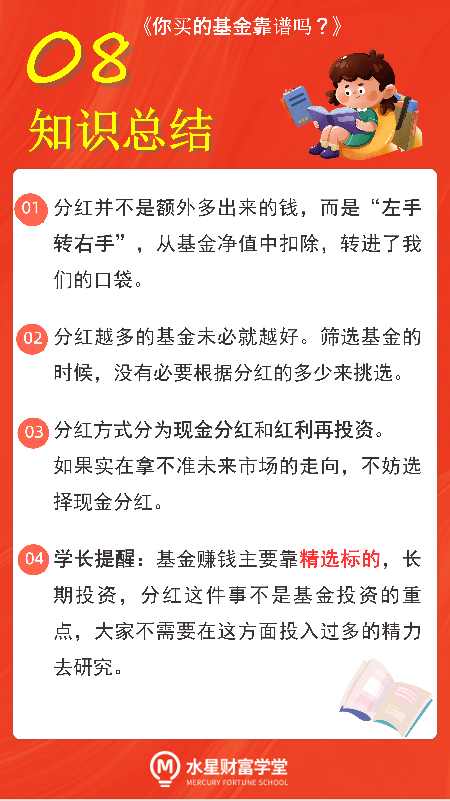

一提到"分红"两个, 想必很多小伙伴都眼前一亮. 这代表基金公司给咱们发钱啦.

但是, 大家知道分红是从哪里来的吗? 基金的分红方式有两种, 我们到底应该怎么选呢?

## 分红只是"左手转右手"

所谓的基金分红, 就是把基金赚的钱返还一部分给投资者.

分红并不是额外多出来的, 而是从基金的净值里扣出来的. 基金一分红, 基金的单位净值就下跌了.

也就是说, 我们的钱不会因为分红就变多, 只不过会"左手转右手". 原来, 我们的钱躺在基金里现在, 基金经理拿出一部分, 塞回我们的口袋, 那么相应地, 躺在基金里的钱就少了.

有些不了解这个道理的小伙伴, 可能会想到一些"歪主意", 比如, 在基金要分红之前赶紧买入, 等到分红一结束就撤退, 薅一把基金分红的羊毛.

现在大家知道了, 分红只是"左手转右手", 你得到的分红款本身就是从你的钱里扣出来的, 企图薅基金分红的羊毛, 根本不现实.

既然只是把钱转移了一下, 没有增值, 那么基金为什么还要进行分红呢?

## 为什么基金会分红?

简单来说, 分红的原因主要有两个.

### 第一个原因, 基金规模太大了.

基金经理在选择投资品的时候会有一定的数量限制, 即使投资标的再好, 也不能想买多少就买多少, 否则容易造成股价剧烈波动, 或者因为重仓股的股价暴跌, 反过来造成基金也跟着暴跌.

如果基金规模过于庞大, 基金经理在操作上就会束手束脚. 因为优秀的股票配满了以后, 剩下的资金就不得不退而求其次, 配置没那么优秀的股票了. 这样就会拉低基金的收益率.

所以, 基金公司和基金经理都不希望基金的规模过大. 如果规模太大了, 基金就可能以分红的方式, 返还一部分资金给投资者, 减小一下基金规模.

### 第二个原因, 股市达到高位了.

很多基金会选择在股市涨到高位的时候分红. 因为它们的成分中大部分都是股票, 当股市涨幅较大时, 基金已经赚到了不小的收益, 如果继续留在高位, 将会承担非常大的下跌风险.

所以这时候, 更明智的做法是撤出一部分资金. 基金分红时, 钱会从基金账户回到我们的现金账户, 相当于基金经理替我们着想, 让一部分钱先落袋为安了.

学了以上内容之后, 相信大家对基金分红都已经心里有底了.

基金分红是基金经理出于对基金规模、投资仓位的考虑做出的决定, 它不是给咱们发奖, 不会带来更多的收益.

所以, 分红越多的基金未必就越好. 大家在挑选基金的时候, 没有必要根据分红的多少来挑选.

## 分红方式怎么选?

不过, 在购买基金的时候, 我们可以选择分红方式.

分红方式主要有两种: 现金分红和红利再投资.

现金分红就是将分红以现金的形式返还到我们的账户, 而且不收赎回费.

红利再投资就是将分红再次投入这只基金, 而且不收取申购费.

简单来说, 选择前者多了现金, 选择后者多了基金份额, 但不管选哪个, 总资产肯定不会变.

那么, 选择哪种方式更划算呢? 有的人说, 选择红利再投资, 把赚到的钱再投入到基金中"利滚利", 可以发挥复利的效果.

复利效果确实有, 但是, 这种说法忽略了一个问题: 如果市场已经处于高位了, 下跌风险比较大, 到了该卖出的时候了, 红利再投资往往会适得其反.

所以, 分红方式的选择, 还得结合市场环境来判断.

如果你发现股市处在低位, 并且看好未来的市场, 可以选择红利再投资, 拿到更多的基金份额, 进而更多地享受基金上涨带来的收益.

如果你发现市场未来下跌的风险比较大, 选择现金分红、及时落袋为安, 会是更好的选择.

对于大部分新手来说, 判断市场环境有不小的难度. 如果你不确定未来市场环境怎么走, 不确定要不要继续持有一只基金, 那么直接选择现金分红就好啦.

一方面, 现金分红可以规避一部分下跌的风险另一方面, 我们不定期有投资收益拿出来, 犒劳一下自己, 可以获得一份小惊喜, 短期尝一点点甜头, 坚定投资的信念.

## 总结

