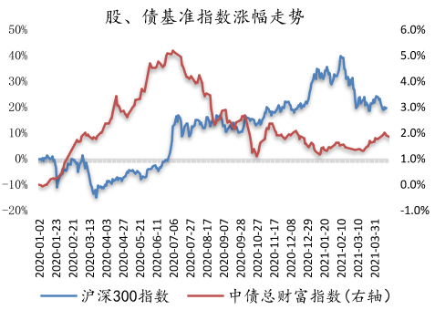
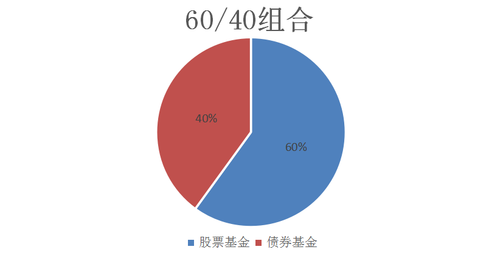
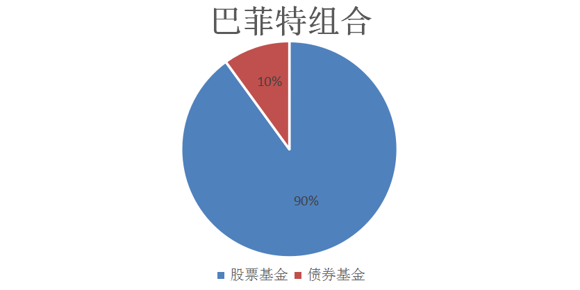
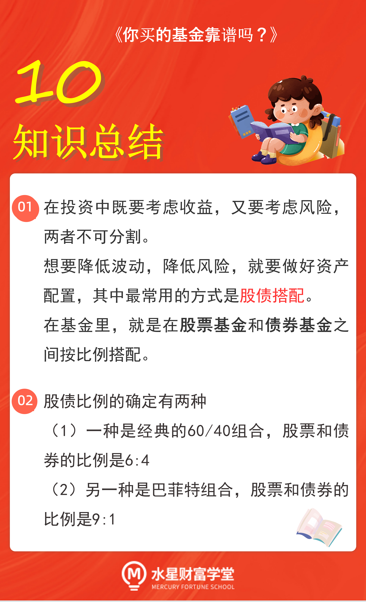

在投资的时候, 很多人只顾着看收益, 哪个涨得多就投哪个, 完全忘记了风险的存在.

就基金而言, 进攻最猛的非股票基金莫属. 毕竟股票基金的成分大多数都是股票, 股票本身的波动是非常大的, 这就导致股票基金的风险等级非常高.

股票基金涨的时候很猛, 跌的时候很惨. 涨了的时候, 咱们可以美美地晒收益, 但是跌了的时候, 我们要承受巨大的压力, 还可能彻夜难眠.

为了避免这种大起大落, 学长强烈建议大家做好一件事, 那就是资产配置. 建立自己的基金组合, 降低波动, 稳稳赚钱.

资产配置到底要怎么做呢? 学长好好给大家讲一讲.

## 股债搭配

资产配置, 也就是把我们的本金分散开, 投资于不同种类的投资品, 最常见的便是股票和债券.

这是因为, 股票和债券的相关性比较低. 这里学长给大家普及一下"相关性"的概念:

在两种投资品之间, "你涨我就涨, 你跌我就跌"的关系, 叫做正相关; "你涨我就跌, 你跌我就涨"的关系, 叫做负相关.

如果一个投资品不管是涨还是跌, 对另一个几乎没什么影响, 那么它们就是相关性低的品种. 我们把相关性低的品种组合在一起, 才能尽可能降低波动.

大家可以看文稿部分, 下面这张图展示了, 从 2020 年 1 月初到 2021 年 3 月底, 这一年多时间里, 股票和债券整体的涨跌情况. 红色线条代表股票, 蓝色线条代表债券.

大家可以发现, 股票涨不涨, 对债券的涨跌没什么必然的影响. 所以我们才说, 两者之间的相关性很低.

我们的资产配置, 就可以在股票和债券之间进行搭配. 不过, 不管是股票还是债券, 对投资新手来说都不太友好, 要么分析太复杂, 要么很难找到购买渠道.

那么, 我们不妨转换思路, 配置股票基金和债券基金, 间接做好股债搭配.

下面学长分享两种经典的股债搭配组合.

## 经典的 60/40 组合

第一种资产配置组合叫做"60/40 组合".

60/40 资产组合是非常经典的配置方案, 也就是配置 60%的股票资产, 再配置 40%的债券资产.

由于资产价格一直在变, 比例也会跟着变化, 所以需要定期进行平衡, 通常来说是每月或者每半年进行一次.

比如经过一个月的价格波动, 股票资产的比例变成了 65%, 债券资产的比例变成了 35%, 那么就需要我们进行一次平衡, 卖掉 5%的股票资产, 再把这笔钱买成债券资产, 恢复 60 比 40 的比例.

## 巴菲特组合

第二种资产配置组合叫做"巴菲特组合".

没错, 这是股神巴菲特提出的一种配置方案.

他在 2013 年《巴菲特致股东的信》中提到, 为了让老婆获得更好的收益, 他对遗产做了如此安排, 将 10%的现金投资于美国债券, 将 90%的现金投资于低成本的标普 500 指数基金, 也就是一只股票基金.

从成分占比上来看, 巴菲特组合的股票占比高达 90%.

和 60/40 组合相比, 巴菲特组合的投资更加激进.

大家可以根据自己的风险承受能力, 在两种方案之中选择一种更适合自己的.

为了帮助大家做选择, 学长给大家看一组数据. 有人统计了 1973 年到 2013 年这 40 年时间里, 巴菲特组合与 60/40 组合的最大回撤率, 结果发现, 巴菲特组合的最大回撤率高达-47.02%, . 而 60/40 组合的最大回撤率是-29.28%.

所谓的最大回撤率, 指的是历史上买入这只基金后, 我们可能遇到的最糟糕的情况. 对于巴菲特组合而言, 这种最糟糕的情况是出现 47.02%的亏损.

当然, 亏损的部分在未来还能涨回来. 但是, 我们不妨问问自己, 如果当时遇到了这么大的亏损, 自己还有勇气坚持下去吗?

如果没有这个胆量, 那么学长就不建议大家选择巴菲特组合, 而是选择相对稳健的 60/40 组合.

## 总结

