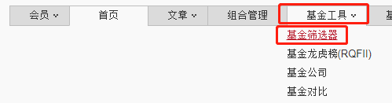

本节课和下一节课, 学长将分别介绍两个基金投资中经常用到的实操工具. 一个是晨星网, 另一个是天天基金网.

## 晨星网

本节课, 我们先来看一看晨星网. 文稿中展示了网址, 大家可以直接复制, 在电脑的浏览器中打开, 也可以直接在搜索引擎中直接搜索"晨星网"打开.

[晨星网](http://www.morningstar.cn/)

晨星公司一家中立的第三方机构, 它最大的亮点就是给基金进行评级, 就像米其林餐厅的星级评选一样.

因为它保持了第三方的中立性, 不会偏袒任何一家基金公司, 所以长期以来受到了大家的信任. 全球很多国家都用晨星评级来作为基金投资的参考.

具体怎么看? 学长给大家实操演示一下.

### 注册"晨星网"账号

晨星网的各种功能需要注册之后才能使用, 所以, 如果你是第一次使用这个网站, 需要首先注册一个账号.

第一步, 打开[晨星网](http://www.morningstar.cn/), 在网页右上角靠近公司图标的地方, 找到"免费注册", 点击进入.

第二步, 注册界面包含了三部分, 登录信息、投资信息和个人信息, 我们如实填写就好. 其中, 登录信息要求我们填写公司邮箱, 大家不需要关注"公司"两个字, 直接填写个人邮箱就好.

最后一步, 填写完成, 点击免费注册, 大功告成.

注册成功后, 我们就要正式开始操练起来了.

### 晨星网的评级划分

在进行评级筛选之前, 我们需要先来了解一下, 晨星评级是怎么评的. 不同的星级分别代表什么水平.

晨星网把每只具备 3 年以上业绩数据的基金归类, 在同类基金中, 基金按照"晨星风险调整后收益"指标由大到小进行排序:

前 10%被评为 5 星; 接下来 22.5%被评为 4 星; 中间 35%被评为 3 星; 随后 22.5%被评为 2 星; 最后 10%被评为 1 星.

首先, 具备 3 年以上业绩数据的基金, 才会有晨星评级. 成立不满三年的基金, 因为时间太短, 业绩没有说服力, 所以没有评级.

晨星网提供三年评级、五年评级、十年评级. 如果不管几年评级都很高, 那就说明基金相对更靠谱.

其次, 大家需要知道, 晨星评级是在同类基金中进行比较的. 比如把股票基金放在一起评比, 这样才有比较的意义. 如果拿股票基金和债券基金比, 收益根本不在一个水平, 咱们配置它们的目的也不一样, 那就没有对比的意义了.

最后, 大家对评级可以这样理解: 五星代表优秀, 四星代表良好, 三星代表一般, 两星代表较差, 一星代表特别差.

再次强调, 不管好还是差, 都是相对于同类基金而言的哦.

了解了这个背景, 我们就可以正式开启实操了.

我们分两种情况来看. 第一种情况是大家已经买了基金, 想要知道手里的基金是几星级. 第二种情况是大家还没有买基金, 想要选出五星级基金.

### 我的基金是几星级?

先来看第一种情况, 查看手里的基金是几星级.

学长以"汇添富价值精选混合"为例, 代码 519069, 教一下大家如何查看星级. 注意哦, 学长拿这只基金举例, 只是作为教学素材, 不构成投资建议.

在[晨星网](http://www.morningstar.cn/)首页的右上角有一个搜索框, 大家在里面输入基金的名称或代码, 点击搜索. 就能找到基金的详情页啦.

在基金详情页, 我们可以看到, 基金名字后面显示了基金的评级. 本例中的评级是三星.

大家注意, 这里的星级是三年评级, 也就是根据过去三年的业绩表现评出来的.

晨星网为我们提供了三年评级、五年评级和十年评级. 其他两个评级怎么看呢?

很简单, 页面往下拉, 就能直接找到"晨星评级"一栏.

这一栏集中显示了三年、五年和十年评级.

我们可以看到, 该基金的三年评级为三星, 五年评级为四星, 十年评级为五星. 总体来说还是不错的, 尤其是放在长期来看, 表现相对更优秀.

晨星评级每个月定期更新一次. 如果大家时间充裕, 可以每月查看一次, 如果没有那么多时间, 也可以每季度或每半年查看一次.

第一种情况就是如此简单. 接下来我们再看第二种情况: 手里没有基金, 如何选出五星级的基金?

### 怎么筛选"五星级"基金?

这种情况要用到晨星网的"基金筛选器".

大家需要在[晨星网](http://www.morningstar.cn/)的首页找到"基金工具", 如文稿中的插图所示, 基金工具里面有个子菜单, 叫"基金筛选器", 我们点开它.

进入基金筛选器以后, 只需三步, 就能搞定. 大家结合文稿中的插图来看.

第一步, 在三年评级和五年评级中, 都选择 3 星以上(包括 3 星).

第二步, 在基金分类中, 选择自己需要的基金分类. 比如我们想要买股票基金, 那么就勾选"普通股票型"即可.

第三步, 点击右下角的"查询"按钮.

好啦, 大功告成. 查询结果显示的, 都是三年评级和五年评级在三星以上的基金. 课程篇幅有限, 学长给大家截图了其中一部分.

## 总结

