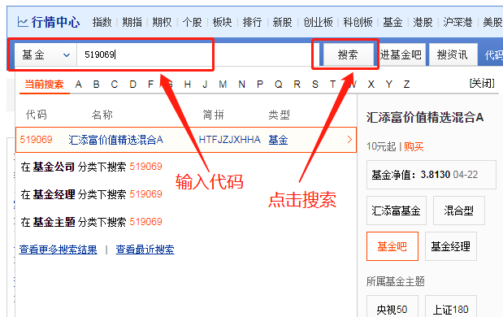
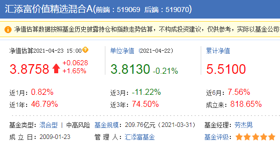
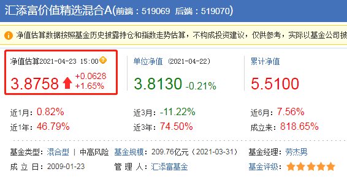
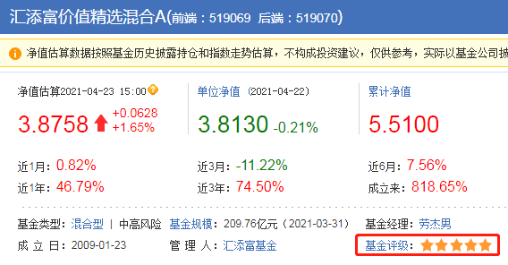
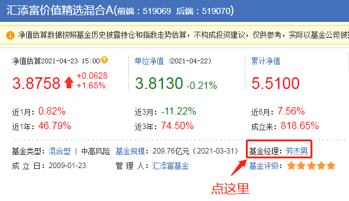
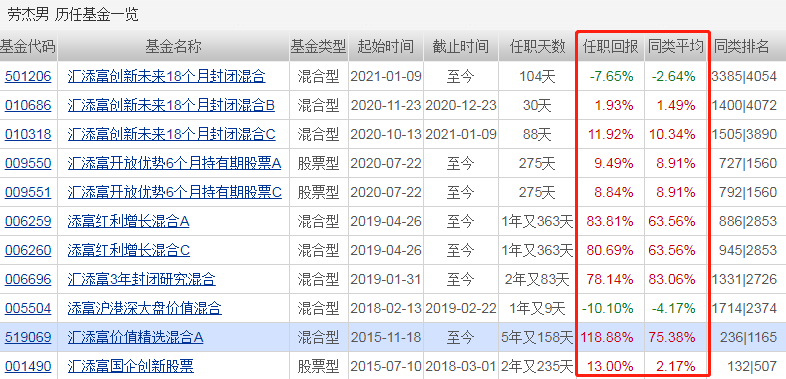

本节课, 我们将学习如何使用基金查询工具: 天天基金网.
通过它, 我们可以查明几乎所有基金的底细, 预防"踩坑".

学长还是以"汇添富价值精选混合"来作为示例, 代码 519069. 再次强调, 这只基金只是用来作为教学演示, 不构成投资建议. 大家可不要照抄代码, 无脑买入哟.

## 认识"天天基金网"

文稿中显示了天天基金网的网址, 大家可以复制下来, 在电脑浏览器中打开. 也可以直接在搜索引擎中搜索"天天基金网五个字, 进入官网.

[网址](https://fund.eastmoney.com/)

和晨星网不同的是, 天天基金网无需注册登录就能使用. 所以咱们绕过注册登录环节, 直接开始使用.

大家会发现, 天天基金网的主页有些花哨, 第一次浏览可能不知道从哪里下手. 没关系, 我们本节课只需要用到中间的搜索框. 学长在文稿中给大家整理了截图.

在搜索框中输入我们想要查询的基金名称或代码, 点击搜索, 就能找到看到基金的基本情况了.

## 基金的基本情况

我们首先来看基金的净值. 在前面的课程中我们学习过, 基金净值的更新会有延迟, 基金公司需要在股市收盘后整理数据, 计算新的净值, 通常来说, 公布最新净值已经到了当天晚上.

所以, 大家在这里搜索出来的净值, 只是一个估算值, 可以作为当日涨跌的一个参考数据, 并不是最终确定下来的净值.

至于后面的"累计净值", 其实就是考虑了基金分红的情况.

基金的分红需要从净值里扣除, 但是"累计净值"保留了基金分红. 相当于告诉咱们, 如果这只基金从来不分红, 净值能够涨到多少. 大家知道"累计净值的意思即可, 不需要过多关注.

净值下面显示的是不同时间段的收益率. 比如, 这只基金成立以来的总收益率是 818.65%, 看起来非常高.

不过, 单看一只基金的收益率意义不大, 因为缺乏对比. 如果我们手里有很多只基金, 可以对比一下它们的收益情况, 选择表现更好的.

接下来我们可以看到, 这只基金的类型是混合型, 风险等级是中高风险, 基金规模为 209.76 亿元, 基金经理是劳洁男, 成立日期是 2009 年 1 月 23 日, 基金公司是汇添富基金.

其中, 大家可以重点关注一下基金规模和成立日.

基金规模不能少于 1 亿元, 否则很容易出现清盘风险.

所谓的清盘, 可以理解为, 这只基金不再搞下去了, 市面上买不到了, 之前买过的会退钱. 清盘浪费咱们的投资精力, 也耽误咱们选择更好的投资机会.

证监会规定的清盘线是 5000 万元, 咱们把标准定到 1 亿元, 可以更好地防范基金清盘风险.

最后还有个基金评级. 我们可以看到, 该基金被评了五颗星.

这里大家注意, 天天基金网的基金评级参考的是招商证券基金评级, 和晨星网的评级方法稍有不同. 实际运用中, 晨星网的评级相对更为广泛.

学长建议大家以晨星评级为主, 时间充裕的话, 可以拿天天基金网的评级作为辅助验证.

## 考察一下基金经理

在基金经理一栏, 我们点击一下基金经理的名字, 就能够考察基金经理的详细情况了.

我们可以看到, 基金经理的上任日期是 2015 年 11 月 18 日. 这个时间指的是基金经理开始管理这只基金的时间.

学长在 2021 年 4 月进行统计发现, 基金经理已经管理这只基金五年多了.

学长的建议是, 基金经理上任不满五年的, 要么说明基金经理的资历太浅, 要么说明基金经理和基金磨合的时间不够久, 这种基金最好不要选.

其次, 我们还可以看到基金经理的历任基金一览.

我们可以看到基金经理的任职回报, 而且还有同类平均水平作为对比, 方便我们了解清楚, 基金的收益水平在同类里面是高还是低, 从而确认基金经理的管理水平是高还是低.

其中, 短时间的收益不足以说明问题, 我们只需要看基金经理任职天数在 1 年以上的基金.

比如, 我们例子中用到的 519069 这只基金, 基金经理的任职天数是 5 年又 158 天, 足够长, 任职回报是 118.88%, 同类平均水平是 75.38%.

这说明, 基金收益跑赢了同类平均值, 基金经理的管理水平还不错.

## 总结

