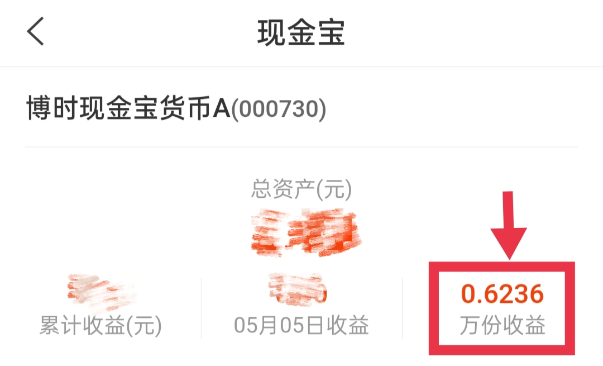
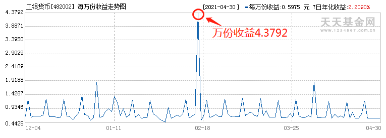
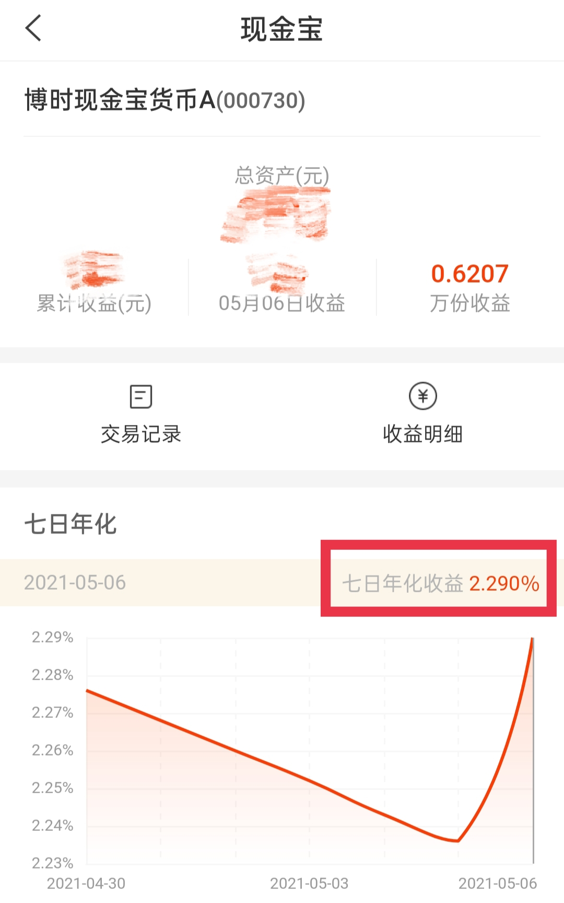
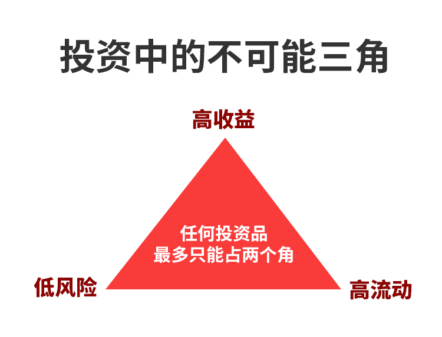
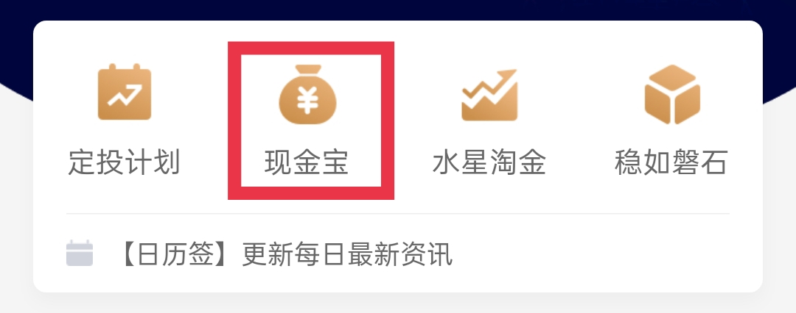
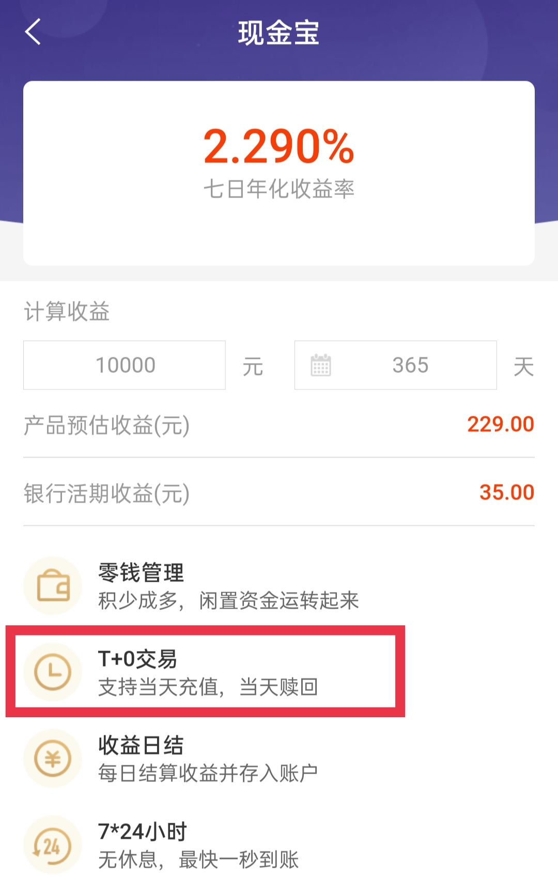
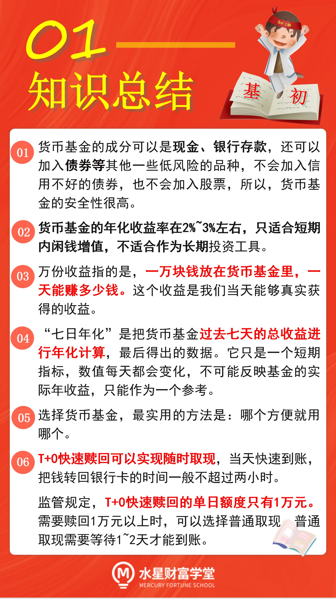
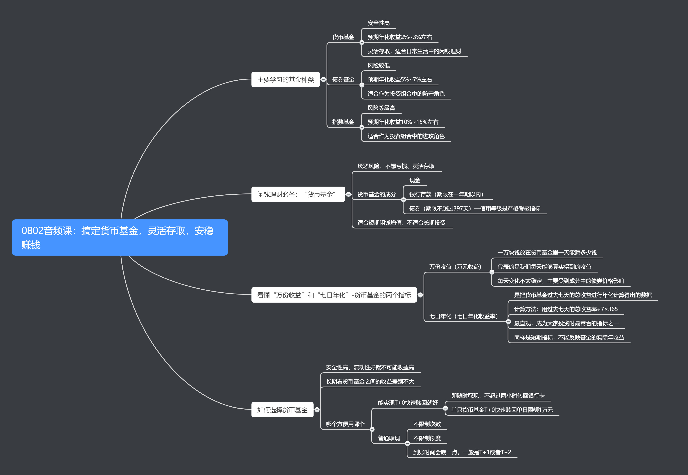
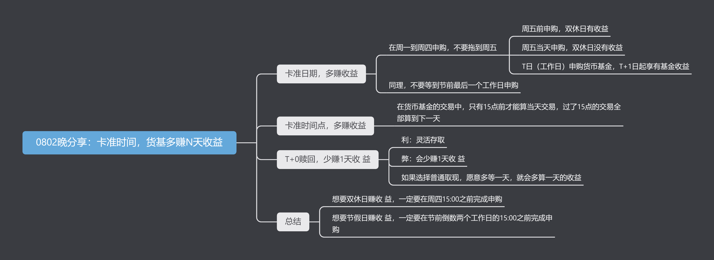

小伙伴们你们好, 欢迎来到《基金初级训练营》, 大家将依次学习到货币基金、债券基金、可转债基金以及指数基金的相关知识, 轻松达到实战水平.

## 货币基金

其中, 货币基金安全性高, 预期年化收益率在 2%~3%左右, 可以灵活存取, 适合日常生活中的闲钱理财.

债券基金和指数基金是一对适合长期投资的"黄金搭档".

债券基金风险较低, 收益水平比货币基金高, 预期年化收益率在 5%~7%左右, 适合作为投资组合中的防守角色.

指数基金风险等级高, 收益水平也较高, 预期年化收益率在 10%~15%左右, 适合作为投资组合中的进攻角色.

如果你厌恶风险、不想面对亏损, 同时又希望手里的钱可以灵活存取, 那么, 货币基金就是你的理想工具.

大家平时经常用到的余额宝和零钱通, 其实都属于货币基金.

我们知道, 基金就像一辆购物车, 里面可以添加各种各样的投资品, 可以是银行存款、债券, 还可以是股票, 添加进来的这些投资品通常称为基金的"成分".

货币基金的成分可以是现金、银行存款, 还可以加入债券等其他一些低风险的品种.

货币基金在选择债券时, 信用等级卡得很严, 信用不好的债券坚决不纳入成分. 至于股票这种高风险的品种, 货币基金根本不会碰它. 这就保证了货币基金的安全性非常高.

而且, 货币基金的成分中, 银行存款的期限在 1 年以内, 债券的剩余期限不超过 397 天, 都是短期投资, 这样可以保证货币基金具有足够的流动性, 方便大家灵活投资, 随时买入卖出.

当然, 这也注定了货币基金的长期收益率较低, 预期年化收益率只有 2%~3%左右, 只适合短期内闲钱增值, 不适合长期投资.

不过大家放心, 我们在后续的课程中会学习适合长期投资的品种哦. 咱们长期、短期都配置, 两手抓, 两手都要硬.

总而言之, 如果我们短期内有些闲钱, 暂时没花掉, 闲着也是闲着, 不如放在货币基金里赚点收益. 这就是货币基金最大的用处.

## "万份收益"和"七日年化"

货币基金短期赚钱, 主要看两个指标, 一个是"万份收益", 另一个是"七日年化".

首先我们来看一下"万份收益".

货币基金永远是按照一元一份来算的, 所以, 大家可以把 "万份收益" 理解为 "万元收益", 也就是一万块钱放在货币基金里, 一天能赚多少钱.

比如, 图中这只基金的万份收益显示为 0.6236, 那么就相当于告诉了我们, 一万元放在这只基金中, 当天的收益是 0.6236 元.

万份收益代表的是我们每天能够真实得到的收益.

万份收益的数字每天都在变, 表现不太稳定, 可能会出现单日收益特别高的情况. 比如, 下面这只货币基金的万份收益, 平时不足 1 元, 但是在 2021 年 2 月 17 日这一天, 突然涨到了 4.3792 元.

出现这种突变的主要原因是, 基金成分中的债券价格存在波动, 如果成分里某只债券价格突然飞涨, 那么涨高的部分就会释放为收益, 导致万份收益的数值变大.

这种情况下, 我们当天赚到的钱也会更多. 不过, 这种突然的高收益可遇不可求, 大家理解涨高的原因就可以了.

除了"万份收益"以外, "七日年化"也可以反映基金的短期业绩.

两者区别很简单: 万份收益看的是当天的收益, 七日年化看的是过去七天的收益.

"七日年化" 的全称叫 "七日年化收益率", 是把货币基金过去七天的总收益进行年化计算, 最后得出的数据.

年化计算的方法很简单, 用基金过去七天的总收益率, 除以 7, 再乘以 365, 就是七日年化收益率啦.

比如, 某货币基金过去七天产生的总收益是 0.07%, 那么它的七日年化收益率就是 0.07%除以 7 再乘以 365, 等于 3.65%.

七日年化收益率是大家在投资货币基金时看得最多的一个指标, 因为它最直观. 一般在货币基金的产品详情中就能直接看到.

不过需要提醒大家, 七日年化只是一个短期指标, 它的数值也是每天变化的, 不可能反映基金的实际年收益, 只能作为一个参考.

## 如何选择货币基金?

很多新手在选择货币基金时, 喜欢对比不同货币基金之间的收益高低. 哪只货币基金的万份收益和七日年化更高, 就选哪一个. 其实这样做选择的意义不大.

我们选择货币基金, 看中的是它的安全性高, 几乎不用担心亏损, 而且流动性高, 可以灵活投资, 生活里需要用钱的时候随时可以取出来.

根据"投资的不可能三角", 安全性高、流动性好的品种, 收益水平就不会太高了.

长期来看, 货币基金之间的收益水平差别不大, 年化收益也是"风水轮流转", 没有哪一只货币基金是"常胜将军".

所以, 大家理解"万份收益"和"七日年化"的意思即可, 不需要专门去对比货币基金之间的收益高低.

选择货币基金, 最实用的方法是: 哪个方便就用哪个.

比如支付宝里面的余额宝, 微信里面的零钱通, 都是很方便的选择.

金斧子基金 App 里面的"现金宝", 也是一款货币基金, 方便大家做好闲钱增值.

而且, 余额宝、零钱通、现金宝都可以实现 T+0 快速赎回.

什么是 T+0 快速赎回呢?

就是我们想用钱的时候, 随时可以取现, 而且当天就可以快速到账, 把钱转回银行卡的时间一般不超过两小时.

不过, 证监会对 T+0 快速赎回有一定的限制. 监管政策要求, 单只货币基金 T+0 快速赎回单日限额 1 万元.

所以, 大家不需要专门去找快速赎回额度更大的平台, 任何平台都要符合监管要求, 都要遵守 1 万元额度限制.

对于大部分人而言, 单日取现 1 万元已经足够覆盖曰常开支了.

如果遇到特殊情况, 需要取现 1 万元以上, 大家可以选择普通取现.

普通取现不限制额度, 也不限制次数, 大家想取出多少就取出多少, 想取几次就取几次.

不过, 普通取现的到账时间更晚一点, 一般来说是 T+1 或 T+2 到账, 也就是说, 大家等待 1~2 天时间, 就可以看到现金回到银行卡上啦.

## 买卖时机

大部分人在买卖货币的时候, 其实非常随便, 什么时候想起来了就什么时候把钱放进去.

但是, 大家忽略了一件事: 在不同的时间申购和赎回, 收益是完全不一样的哦.

### 卡准日期, 多赚收益

班班给大家的第一点建议是: 最好在周一到周四申购, 不要拖到周五才申购.

那么, 周五申购货币基金, 和其他几天有什么区别呢?

区别是: 周五前申购货基, 双休日两天都有收益; 但是等到周五才申购货基, 双休日是没有收益的哦.

这是由货币基金的收益计算方式决定的. 大家可以把下面这条规则记在小本本上:

T 日申购货币基金, T+1 日起享有基金收益.

注意, 这里的 T 指的是工作日. 班班举个例子: 比如周五这一天申购货基, 这一天就是 T 日, 那么 T+1 日呢, 就是下一个工作日, 也就是下周一.

相当于说, 周五申购货币基金, 从下周一起享有基金收益. 直接把中间的周六、周日跳过去了, 少赚两天钱.

如果是周四申购呢? 我们再来看一下:

周四这一天作为 T 日, 那么 T+1 日, 其实就是周五. 也就是说, 周四申购货币基金, 从周五开始享有基金收益.

一旦开始享有了, 那么不管双休日、节假日, 都是有收益计提的哦.

周四申购, 周五开始享有收益, 那么接下来的周六、周日, 两天都有收益入账.

不仅仅是周四, 周一周二周三也可以, 只要是在周五之前就可以.

班班再画一下重点: 最好在周一到周四申购, 不要拖到周五才申购.

以上说的是双休日的情况. 那么, 万一遇上节假日呢? 收益差别会更明显. 班班拿国庆节来作为例子:

假如 9 月 30 日是节前最后一个交易日, 10 月 1 日~10 月 7 日是国庆七天假期, 那么我们应该在哪一天申购货币基金呢?

答案是 9 月 29 日.

因为 9 月 29 日作为 T 日, 那么 9 月 30 日就是 T+1 日, 从 9 月 30 日开始计算收益, 整个过节期间就都覆盖进去了, 都有收益!

但是如果 9 月 30 日才申购, 那么 T+1 日(下一个工作日)就变成节后的 10 月 8 日了. 直接跳过了国庆 7 天, 10 月 8 号才开始计算收益, 少赚一整个假期!

所以, 遇到假期的情况, 大家如果想要让闲钱在假期内计算收益, 记住一句话: 不要等到节前最后一个工作日才申购, 一定要提前申购.

### 卡准时间点, 多赚收益

除了注意日期, 大家还需要注意一下时间节点.

划重点: 在货币基金的交易中, 只有 15 点前才能算当天交易, 过了 15 点的交易全部算到下一天.

什么意思呢? 比如, 大家在周四下午 16 点申购, 已经过了 15 点, 那么这笔申购就只能算成周五申购了.

哪怕是周四 15:01 申购, 也会算到周五, 超过一分钟都不行.

前面班班提到了, 周五申购, 双休日没有收益, 所以, 周四超过 15 点以后申购也算周五, 也没有收益!

班班给大家总结一下:

想要双休日赚收益, 一定要在周四 15:00 之前完成申购; 周四 15:00 后和周五申购一样, 少赚两天收益.

想要节假日赚收益, 一定要在节前倒数两个工作日的 15:00 之前完成申购; 超过 15:00 就跟节前最后一个工作日申购一样, 少赚整个假期的收益.

### T+0 赎回, 少赚 1 天收益

学习了货基申购的技巧, 咱们再来看看货基赎回.

今天咱们的课程里讲到了货币基金的 T+0 快速赎回, 当天申请赎回, 当天就能到账.

听起来很快, 很方便. 但是班班要提醒一下大家: T+0 快速赎回, 有利也有弊.

好处是快, 需要钱了立马就能取出来, 一天也不用多等.

缺点呢? 就是会少赚 1 天收益. 也就是说, 选择快速取现, 当天是没有收益的.

如果是普通取现, 愿意多等一两天到账, 那么赎回当天会计算 1 天收益. 至于选择快速取现, 还是普通取现, 大家可以根据自己的情况来定:

如果着急把钱取出来, 不在乎少 1 天收益, 那么可以选择快速取现, 也就是 T+0 快速赎回.

如果是不着急用钱, 想多赚一点收益, 那么可以选择普通取现, 晚点到账.

## 总结

第一是货基申购的技巧.

想要双休日赚收益, 一定要在周四 15:00 之前完成申购; 周四 15:00 后和周五申购一样, 少赚两天收益.

想要节假日赚收益, 一定要在节前倒数两个工作日的 15:00 之前完成申购; 超过 15:00 就跟节前最后一个工作日申购一样, 少赚整个假期的收益.

第二是货基赎回方式的选择.

如果着急把钱取出来, 不在乎少 1 天收益, 那么可以选择快速取现, 也就是 T+0 快速赎回.

如果是不着急用钱, 想多赚一点收益, 那么可以选择普通取现, 晚点到账.
