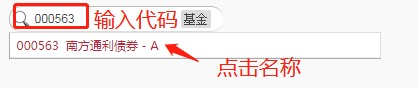
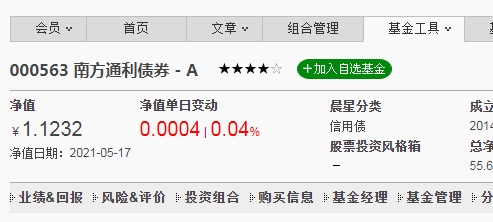
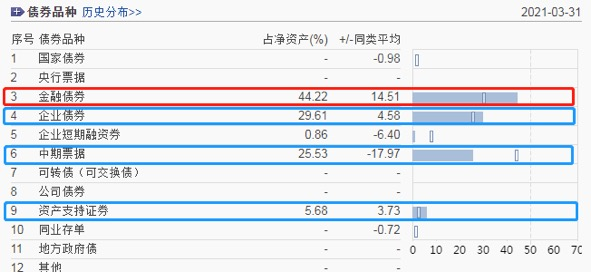

## 债券基金

话说, 在基金大家族中, 有两大基金种类, 堪称基金投资者的"左膀右臂". 它们一个稳健, 一个激进; 稳健的用来防守, 降低整体的波动风险, 守住收益底线; 激进的用来进攻, 为我们博取高收益.

让我们记住这两类基金的名字吧, 它们分别是: 债券基金和股票基金.

债券基金, 以投资债券为主, 80%的非现金资产都用于投资债券. 债券基金的管理比股票基金更简单, 风险比股票基金小, 预期收益也比股票基金低.

股票基金, 以投资股票为主, 80%的非现金资产都用于投资股票. 由于股票本身波动大, 风险高, 所以, 股票基金属于高风险的投资品种, 但是长期来看, 股票基金的收益水平远高于债券基金.

其中, 股票基金中有个特殊品种, 叫做指数基金, 它可以实现长生不老和长期上涨, 更加适合基金初级投资者. 我们将在后续的课程中重点学习它.

债券基金和指数基金完美搭配, 共同组建成攻守兼备的投资组合.

本节课, 我们先一起来认识一下组合中的防守角色: 债券基金.

债券基金的优势在于稳健. 有的小伙伴可能会问了: 既然要稳健, 为什么不直接选择货币基金呢?

我们上节课学习过, 货币基金的风险极低, 几乎不会出现亏损. 但是, 大家还记得吗? 货币基金只适用于短期内的闲钱增值, 不适合长期投资.

债券基金就不一样啦. 债券的剩余期限短则只有几十天, 长则达到十年以上. 无论你想要短期内"盘活"闲钱, 还是长期持有, 都可以找到合适的债券基金.

其次, 市面上可以选择的债券基金, 要比货币基金多得多. 根据中国证券投资基金业协会公布的数据, 截止到 2021 年 3 月, 国内货币基金只有 332 只, 而债券基金已经达到了 1742 只.

最后, 债券基金的收益再低, 长期来看依然高于货币基金. 截止到 2021 年 5 月 13 日, 债券基金过去 3 年的年化收益率达到了 3.95%, 而货币基金过去 3 年的年化收益率只有 2.61%.

有些优秀的债券基金, 年化收益率甚至可以达到 8%以上

听到这里, 想必已经有小伙伴跃跃欲试了. 大家先不要着急, 千万记住一句话: 做任何投资之前, 一定要先搞清楚投资品赚钱的原理.

债券基金到底是靠什么赚钱的呢?

总的来说, 债券基金赚钱有三大秘诀: 票息、价格波动和加杠杆. 我们逐个来认识一下.

## 债基赚钱秘诀一: 票息

票息就是持有债券到期的利息, 这是债券基金最主要的收益来源.

那么, 债券的利息又是从哪里来的呢? 这就要说到债券的本质啦.

所谓的债券, 大家可以理解为借条.

比如, 国债就是国家找大家借钱, 打了一张借条. 借条上会标明借多长时间, 也就是债券的期限.

我们如果买国债, 就相当于拿下一张借条. 等借条到期后, 国家再把借的钱还给我们. 在此期间, 我们还能定期收到一笔利息.

所以, 本质上来说, 债券的票息, 其实就是借钱的一方支付给我们的利息.

除了国债以外, 其他的债券都可以以此类推. 比如, 公司债就是公司借钱打的借条; 金融债就是金融机构借钱打的借条. 谁发行债券借钱, 谁就要支付票息.

只要债券不出现兑付困难, 投资者持有到期就能拿到票息

所以, 本质上来说, 债券的票息, 其实就是借钱的一方支付给我们的利息.

除了国债以外, 其他的债券都可以以此类推. 比如, 公司债就是公司借钱打的借条; 金融债就是金融机构借钱打的借条. 谁发行债券借钱, 谁就要支付票息.

只要债券不出现兑付困难, 投资者持有到期就能拿到票息.

当然, 不排除有些公司或者机构信用很差, 债券到期却无法还本付息, 这就是传说中的债券"暴雷".

从投资安全的角度讲, 债券发行人信用越高, 到期还本付息的能力越强, 票息收入也就越有保障.

不过, 当发债主体的信用特别高时, 人家的债券很抢手, 所以不会给出太高的票息. 反倒是信用没那么好的发债主体, 为了吸引大家来买自己的债券, 往往会给出更高的票息.

而且大家注意, 因为债券存在"暴雷风险, 所以, 选择债券基金比直接买债券更有优势.

如果直接买债券, 一次暴雷, 全部亏光. 如果是选择债券基金呢? 因为债券基金的成分中有很多只债券, 即使其中两三只债券不幸暴雷, 对基金的总体收益也不会造成特别严重的影响.

## 债基赚钱秘诀二: 价格波动

大家都知道, 菜市场的菜价会有价格波动, 股市的股价也会有价格波动. 其实债券也不例外, 债券交易有专门的债券市场, 在这个市场中, 债券也存在价格波动.

大家注意, 如果投资者手里持有债券, 他不仅可以持有到期, 赚取票息收益, 而且可以选择在债券到期之前, 转手卖给别人. 只要能实现低价买入, 高价卖出, 就可以赚到差价, 从价格波动中获益.

如何才能实现债券的"低买高卖"呢? 只要抓住两个关键点就可以啦.

影响债券价格的因素主要有两个: 一是发行人的信用; 二是市场利率.

首先来看发行人的信用.

如果债券发行人的信用恶化, 未来的本息收入有可能减少, 甚至可能出现债券"暴雷", 导致大家都不看好这只债券, 那么它的价格自然会下跌.

这就像在菜市场买菜一样, 大家都不愿意买的菜, 只有降到很低的价格, 才会有人考虑去买.

反之, 如果发行人信用变好, 未来还本付息更有保障, 大家都看好这只债券, 都想买, 那么它的价格就会被推高.

这就好比, 大家都想买的菜, 卖家根本不愁卖, 所以菜价就能定得更高.

投资者想要实现债券的"低买高卖", 赚价格波动的收益, 就要找那些发行人信用持续改善的债券.

接着咱们再来看一下, 影响债券价格的第二个因素: 市场利率.

市场利率和债券价格呈现反向变动的关系. 当市场利率上升时, 债券价格下降; 而当市场利率下降时, 债券价格上升.

这是因为, 当市场利率上升时, 新发行的债券就会给出更高的利息, 但是呢, 市面上已经发行的老债券, 早就已经确定了利息, 和新债券比起来, 老债券利息低, 失去了吸引力, 所以会导致债券价格下跌.

反之, 当市场利率下降时, 新发行的债券给出的利息就会变得更低, 这时候, 老债券的利息更高, 成了抢手货, 所以会导致债券价格上涨.

所以, 市场利率和债券价格总是反着来. 我们想要在债券价格的低点买入债券, 那么就要认准市场利率的高位.

本小节最后, 我们来总结一下:

债券基金赚钱的第二大秘诀是价格波动. 价格波动主要受两个因素的影响, 一是发行人的信用, 二是市场利率.

要想实现低买高卖赚差价, 在价格波动中获益, 就要选择发行人信用改善的债券, 或者是在市场利率的高位买入债券, 市场利率的低位卖出债券.

## 债基赚钱秘诀三: 加杠杆

著名的物理学家阿基米德有句名言:"给我一个支点, 我可以翘起地球."这就是物理中杠杆的巨大威力. 通过使用杠杆, 我们可以将自己的力放大很多倍.

投资中的杠杆也可以"放大", 只不过放大的不是力, 而是盈利和亏损.

在投资中, 大家可以把"杠杆理解为负债, 也就是借钱投资. 所谓的"加杠杆", 其实就是"加负债.

举个例子, 张三总共有 1 万元, 他看中了一笔投资, 最终收益率 5%.

假设张三不借钱, 只是将自己现有的 1 万元拿去投资, 那么他的收益等于 1 万乘以 5%, 也就是 5 百元.

假设张三借了 1 万元, 和自己现有的 1 万元加起来, 一共是 2 万元, 全部拿去做这笔投资, 那么他的收益等于 2 万乘以 5%, 也就是 1 千元. 等到投资结束, 张三再把借来的 1 万元还回去, 相当于用别人的钱赚钱, 放大了自己的收益.

当然, 大家要注意, 如果张三加杠杆以后, 投资以亏损收场, 那么亏损的金额也会被放大. 所以说, 杠杆是对风险和收益的双重放大.

具体放大多少倍, 有一个衡量的指标叫做"杠杆率", 也叫杠杆比例".

杠杆率等于总资产除以净资产, 翻译成大家都能听懂的话就是, 杠杆率等于借来的钱加原有的钱, 最后除以原有的钱.

在张三的例子中, 借来的钱加原有的钱是 2 万元, 除 l 以原有的 1 万元, 最后得出, 杠杆率是 200%.

债券基金和其他类型的基金不一样的地方之一, 就在于它可以加杠杆. 也就是说, 债券基金可以借钱放大自己的投资.

实现的方式非常巧妙:

债券基金的基金经理买了 A 债券后, 在到期前, 可以把 A 债券先质押给银行, 找银行借一笔钱, 再拿借来的钱去买 B 债券, 这就可以放大自己的投资啦.

等到 A 债券到期了, 基金经理再找银行, 把 A 债券回购回来. 只要投资债券的收益高于向银行借钱的利息, 基金就有的赚.

不过, 为了控制投资风险, 国内的政策对债券基金的杠杆率有严格的限制: 开放式债券基金的杠杆率不得超过 140%, 还有其他一些特殊的债券基金, 杠杆率最高可达 200%.

## 债券家族 3 大成员

按照发行主体分类, 债券可以分为三大类: 政府债券、金融债券和公司债券

### 第一类, 政府债券, 指的是政府需要钱了, 找投资者借钱, 并且会给一定的利息.

这里所说的政府, 可以是国家(也就是中央政府), 也可以是地方政府.

国家发行的债券叫国债, 由财政部代表中央政府发行. 地方政府发行的债券叫地方政府债, 可以地方政府自主发行, 也可以由中央财政代理发行.

大家记住国债和地方政府债就可以了, 政府债券就这两种.

政府债券最大的优势就是: 风险低. 因为有政府的财政信誉作担保, 几乎不会发生借钱不还的情况.

尤其是国债, 拥有"金边债券"的美名, 被人们称为"无风险投资". 如果你买到的基金成分里都是政府债券, 那么就可以放心了, 投资风险极低.

不过政府债券也有一定的缺陷, 那就是收益率偏低. 在整个债券家族中, 政府债券的收益率处在较低水平.

毕竟政府信誉好, 基本不愁借不到钱, 所以开出的票息就会比较低. 而且大家都喜欢买政府债券, 无形中推高了债券价格, 价格一高, 投资成本就高了, 收益率就会被拉低.

总的来说, 政府债券特别稳, 但是收益率不高.

### 第二类, 金融债券, 指的是金融机构需要钱了, 找投资者借钱, 并且会给出一定的利息.

金融机构的范围就比较广了. 最上层的是中央银行, 也就是人民币上印的那个名称:"中国人民银行". 大家习惯叫它"央行", 或者"央妈".

中央银行发行的债券叫"央行票据". 名字里就带着"央行"两个字, 很好记.

接下来是政策性银行. 政策性银行不多, 在我国只有三家, 分别是: 国家开发银行、中国进出口银行、中国农业发展银行.

国家开发银行发行的债券叫"国开债"或"国开行债";

中国进出口银行发行的债券叫"进出口行债";

中国农业发展银行发行的债券叫"农发行债".

最后是商业银行, 证券公司和保险公司, 以及其他一些金融机构. 它们发行的债券分别称为: 商业银行债、证券公司债、保险公司债~

班班附带一提, 咱们平时所说的"金融"一词, 主要就是由银行、证券、保险组成的, 它们也被叫做金融的"三驾马车".

那么, 金融债券的风险和收益是什么水平呢?

首先来说央行票据和政策性银行债券, 它们的信用等级和国家相当, 非常高, 几乎没有信用风险.

所以, 在收益率方面, 它们与政府债券也不会相差太多.

接下来是商业银行债、证券公司债和保险公司债, 这三类债券的发行人多少都有一些信用风险.

比如, 在 2020 年, 包商银行曾经进入破产程序, 被中央银行、银保监会联合接管. 很多小伙伴不知道, 我国是允许银行申请破产的, 这意味着银行并不是觉对安全的地方, 老观念需要改变.

商业银行、证券公司和保险公司虽然破产风险极低, 但总归是有这方面风险的. 当然, 和普通的企业比起来, 风险要小得多.

不过, 为了补偿投资者承担更多的风险, 商业银行债、证券公司债和保险公司债的给出的票息也会稍微高一些.

### 第三类, 公司债券, 指的是各类公司需要钱了, 找投资者借钱, 也会给一定的利息.

这一类主要包括公司债、企业债、企业短期融资券、中期票据、资产支持证券、可转换债券, 等等.

普通公司的信用有好有坏, 差别很大, 所以, 它们发行的债券风险相对较高.

当然, 从收益的角度来讲, 公司债券给出的票息是 3 种债券里面最高的. 毕竟如果给低了, 公司债券失去吸引力, 大家更愿意去买政府债券、金融债券, 那么公司就没法借到钱啦. 所以公司债券给出的票息最高.

总之一句话, 风险和收益总是相伴而生的. 三种债券的预期收益依次提高, 风险也依次提高.

## "利率债"和"信用债"

认识了债券家族的 3 大成员后, 班班给大家补充一个小知识点:

投资债券的主要风险有两个. 一个是信用风险, 也就是发行人借钱不还的风险. 另一个是利率风险, 咱们课程里提到过, 市场利率和债券价格是反向变动的, 利率升高, 债券价格下跌, 也有可能造成亏损.

班班所说的信用等级很高的债券, 也就是几乎不用担心借钱不还的债券, 属于没有信用风险的债券.

那么这类债券就只剩下一个风险了: 利率风险. 所以它们也被称为"利率债".

大家记住 6 个名字就可以了, 利率债包括 6 个种类: 国债、地方政府债、央行票据、国开债、 进出口行债、农发行债.

其他类型的债券, 同时有信用风险和利率风险, 被称为"信用债".

班班用以一张图给大家汇总一下:

那么, 大家应该选择哪一种债券呢?

有的小伙伴可能会说, 当然是选择利率债啦, 毕竟利率债没有信用风险.

但是大家要知道, 利率债因为没有信用风险, 给出的利息也会比较低, 整体的收益率并不高.

以国债基金为例, 长期持有下来, 年化收益率大约在 3%~4%左右. 相比较而言, 信用债虽然承担了一定的信用风险, 但是会给更高的利息, 预期收益也会更高.

很多信用债基金的年化收益率都在 4%以上, 有些可以达到 7%~8%. 选择利率债还是信用债, 没有绝对的好坏之分, 而是要根据自己的风险偏好来决定.

## 如何查看债基成分?

大家在拿到一只债券基金时, 如何看它投资的主要是利率债还是信用债呢? 方法很简单, 利用"晨星网"一查便知.(网址:http://www.morningstar.cn/)

以"南方通利债券 A"为例, 代码 000563, 我们在晨星网右上角的搜索框搜索代码 "000563", 点击这只基金.

大家可以看到如下界面:

就在这个界面不用换, 我们直接往下拉找到"债券品种", 就能看到它所投资的债券种类啦.

可以看到, 这只债券基金的成分中, 44.22%投资于金融债券. 需要大家注意, 晨星网在统计时, 把"央行票据"单独拿了出来, 图中序号 2 就是央行票据. 也就是说, 这里的"金融债券"是去掉央行票据以后的.

然后其他几个占比比较大的分别是: 企业债券、中期票据、资产支持证券, 这些都是公司债券, 占比 60%以上.

也就是说, 这只债券基金的成分以金融债券和公司债券为主, 那么我们可以判断, 它的风险水平是债券基金中相对比较高的.

有些同学可能会有疑惑, 为什么图中各种债券的占比加起来超过了 100%?

答案其实就是课程中债券基金赚钱的秘诀: 加杠杆. 这只基金存在加杠杆, 也就是借钱投资的情况, 所以各种债券占净资产的比例加起来超过了 100%, 属于正常现象.

最后提醒, 分享中提到的具体基金只作为演示举例, 不构成投资建议. 好啦, 小伙伴们, 今晚的分享就到这里啦.

## 总结

1. 债券基金家族的三大成员:政府债券、金融债券、公司债券。三者的风险依次递增，收益水平也依次递增。
2. 利率债包括 6 个种类:国债、地方政府债、央行票据、国开债、进出口行债、农发行债。除此之外的债券都属于信用债。
3. 查看债基成分可以用“晨星网”，在“债券品种”一栏查看基金持有哪些种类的债券，进而 可以判断这只基金的风险高低。
