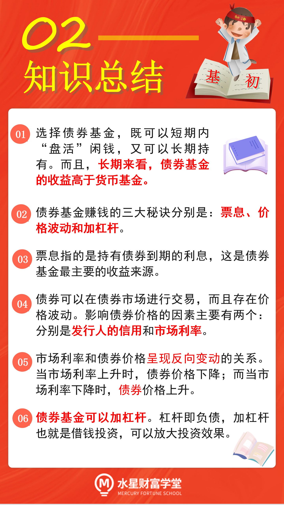
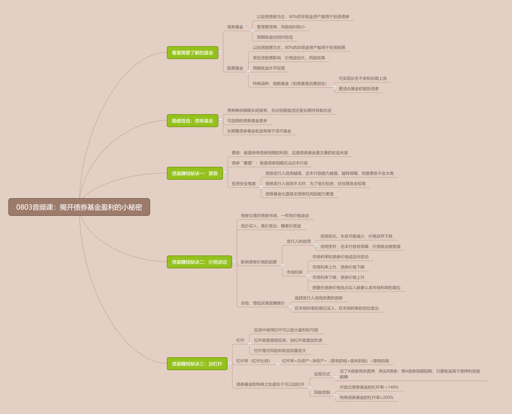

## 债券基金

话说, 在基金大家族中, 有两大基金种类, 堪称基金投资者的"左膀右臂". 它们一个稳健, 一个激进; 稳健的用来防守, 降低整体的波动风险, 守住收益底线; 激进的用来进攻, 为我们博取高收益.

让我们记住这两类基金的名字吧, 它们分别是: 债券基金和股票基金.

债券基金, 以投资债券为主, 80%的非现金资产都用于投资债券. 债券基金的管理比股票基金更简单, 风险比股票基金小, 预期收益也比股票基金低.

股票基金, 以投资股票为主, 80%的非现金资产都用于投资股票. 由于股票本身波动大, 风险高, 所以, 股票基金属于高风险的投资品种, 但是长期来看, 股票基金的收益水平远高于债券基金.

其中, 股票基金中有个特殊品种, 叫做指数基金, 它可以实现长生不老和长期上涨, 更加适合基金初级投资者. 我们将在后续的课程中重点学习它.

债券基金和指数基金完美搭配, 共同组建成攻守兼备的投资组合.

本节课, 我们先一起来认识一下组合中的防守角色: 债券基金.

债券基金的优势在于稳健. 有的小伙伴可能会问了: 既然要稳健, 为什么不直接选择货币基金呢?

我们上节课学习过, 货币基金的风险极低, 几乎不会出现亏损. 但是, 大家还记得吗? 货币基金只适用于短期内的闲钱增值, 不适合长期投资.

债券基金就不一样啦. 债券的剩余期限短则只有几十天, 长则达到十年以上. 无论你想要短期内"盘活"闲钱, 还是长期持有, 都可以找到合适的债券基金.

其次, 市面上可以选择的债券基金, 要比货币基金多得多. 根据中国证券投资基金业协会公布的数据, 截止到 2021 年 3 月, 国内货币基金只有 332 只, 而债券基金已经达到了 1742 只.

最后, 债券基金的收益再低, 长期来看依然高于货币基金. 截止到 2021 年 5 月 13 日, 债券基金过去 3 年的年化收益率达到了 3.95%, 而货币基金过去 3 年的年化收益率只有 2.61%.

有些优秀的债券基金, 年化收益率甚至可以达到 8%以上

听到这里, 想必已经有小伙伴跃跃欲试了. 大家先不要着急, 千万记住一句话: 做任何投资之前, 一定要先搞清楚投资品赚钱的原理.

债券基金到底是靠什么赚钱的呢?

总的来说, 债券基金赚钱有三大秘诀: 票息、价格波动和加杠杆. 我们逐个来认识一下.

### 债基赚钱秘诀一: 票息

票息就是持有债券到期的利息, 这是债券基金最主要的收益来源.

那么, 债券的利息又是从哪里来的呢? 这就要说到债券的本质啦.

所谓的债券, 大家可以理解为借条.

比如, 国债就是国家找大家借钱, 打了一张借条. 借条上会标明借多长时间, 也就是债券的期限.

我们如果买国债, 就相当于拿下一张借条. 等借条到期后, 国家再把借的钱还给我们. 在此期间, 我们还能定期收到一笔利息.

所以, 本质上来说, 债券的票息, 其实就是借钱的一方支付给我们的利息.

除了国债以外, 其他的债券都可以以此类推. 比如, 公司债就是公司借钱打的借条; 金融债就是金融机构借钱打的借条. 谁发行债券借钱, 谁就要支付票息.

只要债券不出现兑付困难, 投资者持有到期就能拿到票息

所以, 本质上来说, 债券的票息, 其实就是借钱的一方支付给我们的利息.

除了国债以外, 其他的债券都可以以此类推. 比如, 公司债就是公司借钱打的借条; 金融债就是金融机构借钱打的借条. 谁发行债券借钱, 谁就要支付票息.

只要债券不出现兑付困难, 投资者持有到期就能拿到票息.

当然, 不排除有些公司或者机构信用很差, 债券到期却无法还本付息, 这就是传说中的债券"暴雷".

从投资安全的角度讲, 债券发行人信用越高, 到期还本付息的能力越强, 票息收入也就越有保障.

不过, 当发债主体的信用特别高时, 人家的债券很抢手, 所以不会给出太高的票息. 反倒是信用没那么好的发债主体, 为了吸引大家来买自己的债券, 往往会给出更高的票息.

而且大家注意, 因为债券存在"暴雷风险, 所以, 选择债券基金比直接买债券更有优势.

如果直接买债券, 一次暴雷, 全部亏光. 如果是选择债券基金呢? 因为债券基金的成分中有很多只债券, 即使其中两三只债券不幸暴雷, 对基金的总体收益也不会造成特别严重的影响.

### 债基赚钱秘诀二: 价格波动

大家都知道, 菜市场的菜价会有价格波动, 股市的股价也会有价格波动. 其实债券也不例外, 债券交易有专门的债券市场, 在这个市场中, 债券也存在价格波动.

大家注意, 如果投资者手里持有债券, 他不仅可以持有到期, 赚取票息收益, 而且可以选择在债券到期之前, 转手卖给别人. 只要能实现低价买入, 高价卖出, 就可以赚到差价, 从价格波动中获益.

如何才能实现债券的"低买高卖"呢? 只要抓住两个关键点就可以啦.

影响债券价格的因素主要有两个: 一是发行人的信用; 二是市场利率.

首先来看发行人的信用.

如果债券发行人的信用恶化, 未来的本息收入有可能减少, 甚至可能出现债券"暴雷", 导致大家都不看好这只债券, 那么它的价格自然会下跌.

这就像在菜市场买菜一样, 大家都不愿意买的菜, 只有降到很低的价格, 才会有人考虑去买.

反之, 如果发行人信用变好, 未来还本付息更有保障, 大家都看好这只债券, 都想买, 那么它的价格就会被推高.

这就好比, 大家都想买的菜, 卖家根本不愁卖, 所以菜价就能定得更高.

投资者想要实现债券的"低买高卖", 赚价格波动的收益, 就要找那些发行人信用持续改善的债券.

接着咱们再来看一下, 影响债券价格的第二个因素: 市场利率.

市场利率和债券价格呈现反向变动的关系. 当市场利率上升时, 债券价格下降; 而当市场利率下降时, 债券价格上升.

这是因为, 当市场利率上升时, 新发行的债券就会给出更高的利息, 但是呢, 市面上已经发行的老债券, 早就已经确定了利息, 和新债券比起来, 老债券利息低, 失去了吸引力, 所以会导致债券价格下跌.

反之, 当市场利率下降时, 新发行的债券给出的利息就会变得更低, 这时候, 老债券的利息更高, 成了抢手货, 所以会导致债券价格上涨.

所以, 市场利率和债券价格总是反着来. 我们想要在债券价格的低点买入债券, 那么就要认准市场利率的高位.

本小节最后, 我们来总结一下:

债券基金赚钱的第二大秘诀是价格波动. 价格波动主要受两个因素的影响, 一是发行人的信用, 二是市场利率.

要想实现低买高卖赚差价, 在价格波动中获益, 就要选择发行人信用改善的债券, 或者是在市场利率的高位买入债券, 市场利率的低位卖出债券.

### 债基赚钱秘诀三: 加杠杆

著名的物理学家阿基米德有句名言:"给我一个支点, 我可以翘起地球."这就是物理中杠杆的巨大威力. 通过使用杠杆, 我们可以将自己的力放大很多倍.

投资中的杠杆也可以"放大", 只不过放大的不是力, 而是盈利和亏损.

在投资中, 大家可以把"杠杆理解为负债, 也就是借钱投资. 所谓的"加杠杆", 其实就是"加负债.

举个例子, 张三总共有 1 万元, 他看中了一笔投资, 最终收益率 5%.

假设张三不借钱, 只是将自己现有的 1 万元拿去投资, 那么他的收益等于 1 万乘以 5%, 也就是 5 百元.

假设张三借了 1 万元, 和自己现有的 1 万元加起来, 一共是 2 万元, 全部拿去做这笔投资, 那么他的收益等于 2 万乘以 5%, 也就是 1 千元. 等到投资结束, 张三再把借来的 1 万元还回去, 相当于用别人的钱赚钱, 放大了自己的收益.

当然, 大家要注意, 如果张三加杠杆以后, 投资以亏损收场, 那么亏损的金额也会被放大. 所以说, 杠杆是对风险和收益的双重放大.

具体放大多少倍, 有一个衡量的指标叫做"杠杆率", 也叫杠杆比例".

杠杆率等于总资产除以净资产, 翻译成大家都能听懂的话就是, 杠杆率等于借来的钱加原有的钱, 最后除以原有的钱.

在张三的例子中, 借来的钱加原有的钱是 2 万元, 除 l 以原有的 1 万元, 最后得出, 杠杆率是 200%.

债券基金和其他类型的基金不一样的地方之一, 就在于它可以加杠杆. 也就是说, 债券基金可以借钱放大自己的投资.

实现的方式非常巧妙:

债券基金的基金经理买了 A 债券后, 在到期前, 可以把 A 债券先质押给银行, 找银行借一笔钱, 再拿借来的钱去买 B 债券, 这就可以放大自己的投资啦.

等到 A 债券到期了, 基金经理再找银行, 把 A 债券回购回来. 只要投资债券的收益高于向银行借钱的利息, 基金就有的赚.

不过, 为了控制投资风险, 国内的政策对债券基金的杠杆率有严格的限制: 开放式债券基金的杠杆率不得超过 140%, 还有其他一些特殊的债券基金, 杠杆率最高可达 200%.

## 总结

