## 短债基金

在上节课中, 我们学习过, 债券基金既可以短期内"盘活"闲钱, 又可以实现长期投资.

本节课, 我们就先来搞定短期投资, 用短债基金"盘活"自己的闲钱.

短债基金近年来非常火爆, 是当之无愧的"网红"品种.

名字里的"短", 指的是所投资债券的剩余期限比较短, 一般不超过 3 年. 也就是说, 3 年之内, 基金成分里的债券就会到期, 接着就能兑现票息.

根据所投资债券的剩余期限不同, 短债基金的成分又可以分为三类, 分别是: 超短债、短债和中短债.

超短债的剩余期限不超过 270 天, 短债的剩余期限不超过 397 天, 中短债的剩余期限不超过 3 年.

由于所投债券的期限很短, 短期内受利率变化的影响很小, 所以, 短债基金的波动较低, 风险较小.

不过, 短债基金仍然有亏损的可能. 虽然短债基金波动不大, 但毕竟存在下跌风险. 和货币基金比起来, 短债基金的风险要更高一些.

以 2019 年为例, 短债基金的平均最大回撤率是-0.11%, 这个数据表示: 在 2019 年, 即使你运气不好, 买在最高点, 卖在最低点, 那么 1 万元最多亏 11 元.

这个风险确实有, 但说实话并不高. 有小伙伴可能要问了: 既然短债基金有风险, 干嘛不直接选择货币基金?

选择短债基金是因为, 它的投资范围更广泛, 可期待的收益也会更高.

截止到 2021 年 5 月, 货币基金过去 3 年的年化收益率为 2.68%, 过去 5 年的年化收益率为 2.98%, 都没有达到 3%.

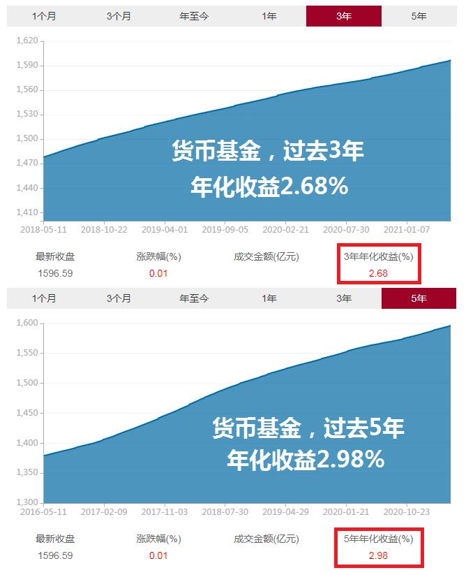

相比之下, 短债基金表现更出色. 截止到 2021 年 5 月, 短债基金过去 3 年的年化收益率为 3.12%, 过去 5 年的年化收益率为 3.30%, 全部达到了 3%以上.

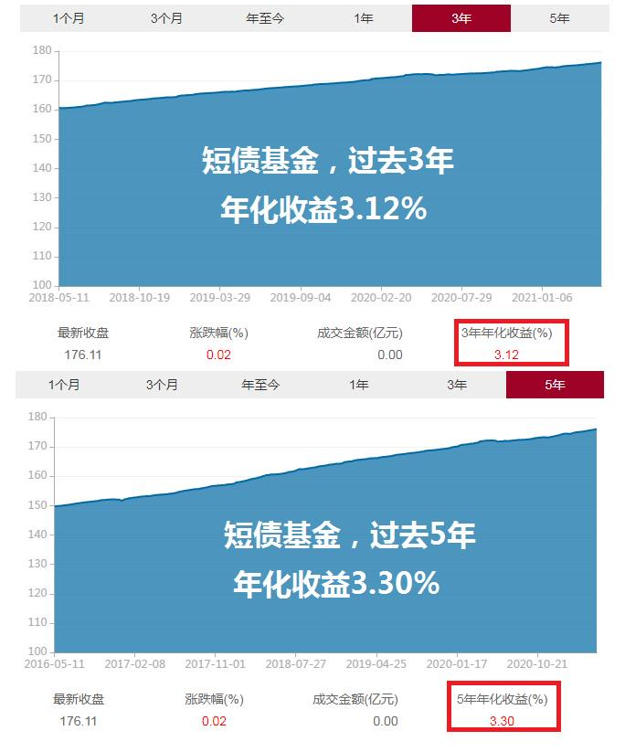

基金赚钱存在复利效应, 年化收益率高一点, 日积月累会多赚不少钱!

总而言之, 短债基金风险相对可控, 还有望实现高于货币基金的收益率, 几乎可以匹配所有类型的投资者, 尤其是不愿意承担过高风险的稳健型投资者.

## 看业绩: 锁定历史年化 3%+的短债基金

如何才能找到年化收益率 3% 以上的短债基金呢?

我们要用到的筛选工具是"天天基金网".(网址:https://fund.eastmoney.com/)

大家可以直接复制文稿中的网址, 打开该网站, 也可以用搜索工具搜索"天天基金网"五个字, 点击进入官网.

接下来, 我们就要实操筛选啦.

第一步, 在天天基金网首页找到"基金数据", 点击"基金排行".

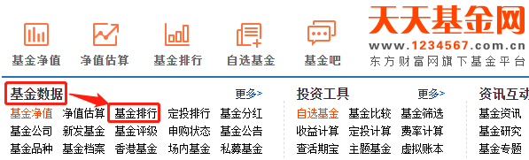

点击完成后, 网页跳转到如下界面. 请大家结合文稿来看

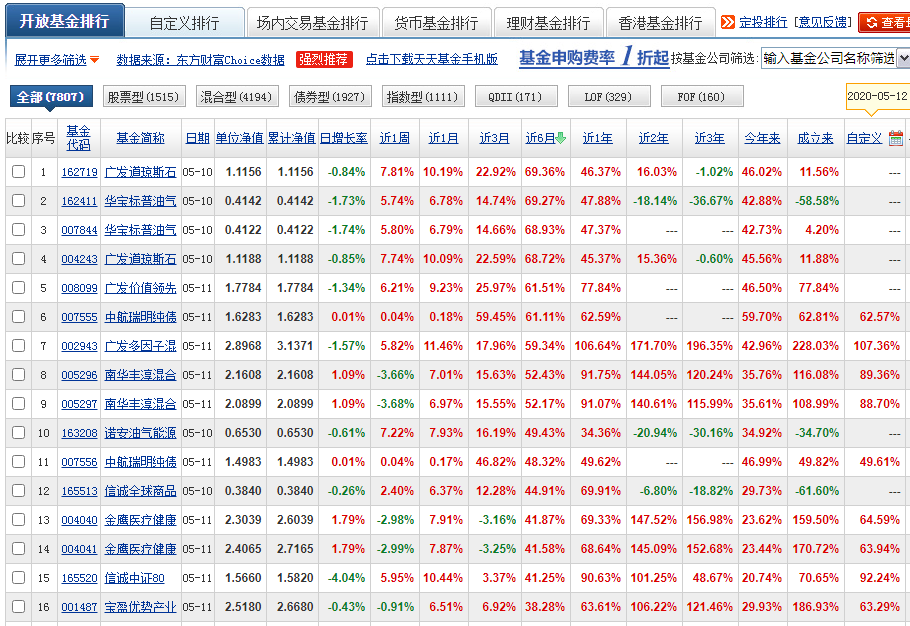

大家可以看到很多基金, 密密麻麻, 不过完全不用慌, 只需要简单几步, 就能选出我们想要的短债基金.

第二步, 点击"债券型". 这一步是为了锁定债券基金, 把其他各种类型的基金都排除.

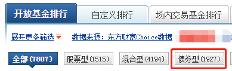

点击"债券型"之后, 网站会让我们进一步选择"分类"和 "杠杆比例". 我们在"分类"中选择"短期纯债", 杠杆比例选择"全部"

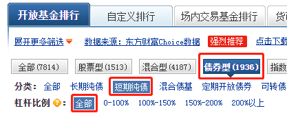

短期纯债, 就是我们要找的短债基金.

这里的"纯债", 是"纯债基金"的意思, 也就是基金所投资的资产 100%都是债券, 没有任何其他成分. 我们要筛选的短债基金就属于纯债基金.

大家简单理解这个概念就好啦, 下一节课, 我们将专门学习纯债基金.

至于杠杆比例, 我们在上节课学习过, 债券基金的一大收益来源就是杠杆收益, 也就是把手里的债券抵押出去, 借一笔钱, 买入新的债券. 加杠杆可以放大收益效果.

杠杆收益也是真金白银. 能用杠杆赚到钱, 也算是基金经理的本事. 而且, 国内政策规定, 普通开放式基金的杠杆比例不超过 140%, 已经为我们控制了杠杆过高的风险. 所以, 我们不用挑剔, "杠杆比例"选择"全部"即可.

好啦, 两步完成后, 我们就锁定了短债基金这个小范围. 不过, 短债基金一共接近 300 只, 全部都买不太现实, 我们还得进一步挑选.

第三步, 点击"近 3 年", 网站会自动按照近 3 年的总收益率进行排名.

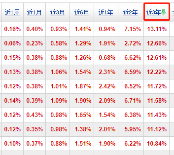

如果总收益率没有按照从大到小进行排名, 大家可以再点击一下"近 3 年", 完成排名.

之所以选择"近 3 年", 是因为短期的业绩存在运气成分. 如果基金长期回报经得起检验, 那才是真的好基金.

近 3 年的收益率达到多少算合格呢?

大家还记得我们的目标吗? 我们要选择的是, 年化收益达到 3%以上的短债基金.

根据复利计算公式: 总收益率=(1+年化收益率)^年数-1

如果按照年化收益率 3%计算, 3 年时间的总收益率应该是 9.27%, 所以, 我们在看短债基金"近 3 年"的收益率时, 底线就是 9.27%, 低于 9.27%的一律不通过.

我们课程的筛选时间是 2021 年 5 月 11 日. 筛选结果中, 共有 20 只基金满足条件, "近 3 年"收益率高于 9.27%.

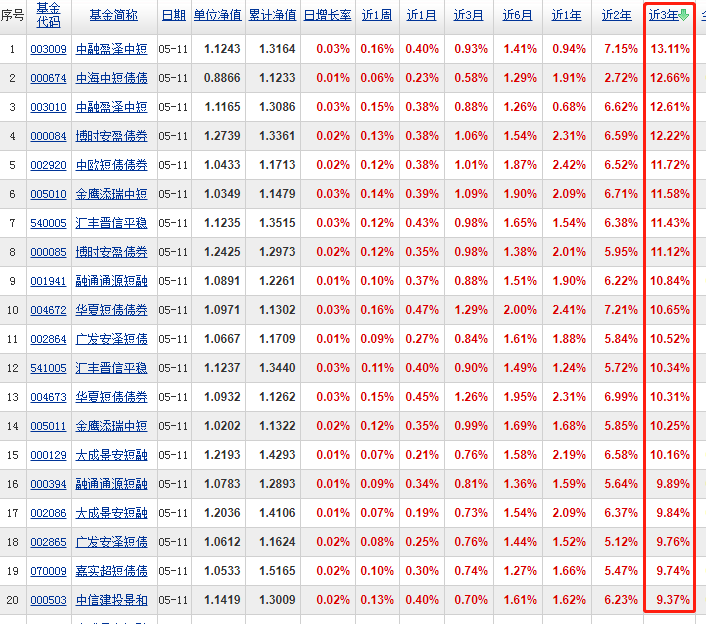

## 看规模: 水星专属筛选表

经过"天天基金网"3 步筛选, 我们得到了一组业绩合格的短债基金.

接下来, 我们把"近 3 年"收益率高于 9.27%的基金信息, 汇总统计在一张表格中, 方便我们做进一步筛选.

水星财富学堂为大家准备了现成的表格工具, 大家可以咨询自己的训练营班班, 直接下载使用, 以后筛选短债基金都可以直接用它哦.

<a href="../../.vuepress/public/基金筛选表-基金初级专用.xlsx" target="_blank">基金筛选表-基金初级专用.xlsx</a>

大家可以在文稿中看到表格工具的样子. 我们首先在"统计时间"一栏, 填入自己实操筛选的日期, 方便筛选结束后可以复查.

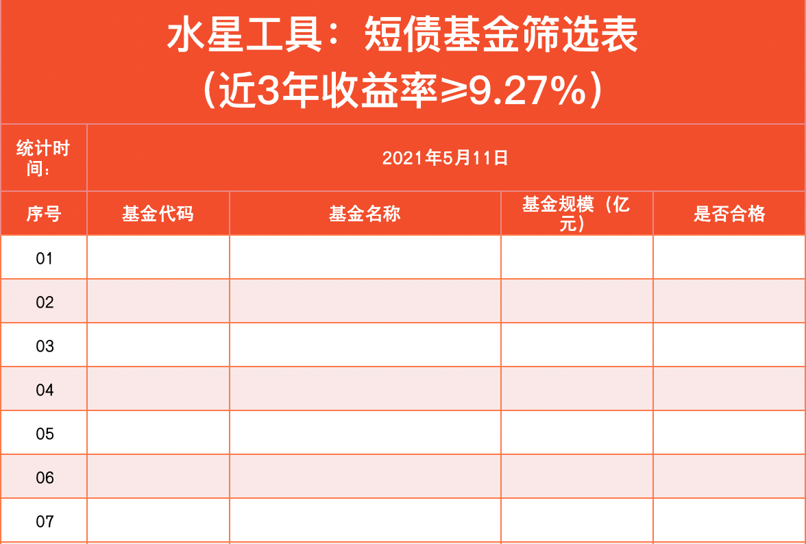

然后, 我们把之前选出来的 20 只短债基金的代码和名称, 录入到表格中.

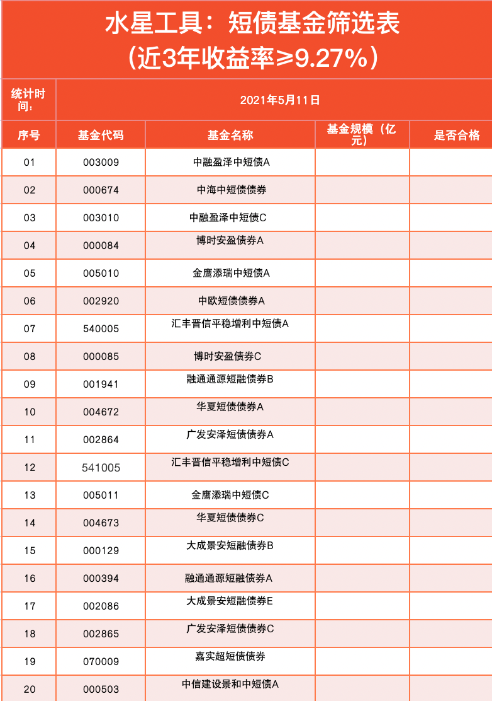

大家注意, 如果筛选出来的基金超过了 30 只, 那么我们就录入前 30 只基金就好啦. 因为 30 名以后的基金都是收益率排名靠后的, 从收益率的角度讲要差一些, 全部统计会增加我们的工作量, 完全没必要.

符合近 3 年收益率 9.27%的基金已经选出来啦, 不过 20 只还是有点多, 我们还需要根据基金规模, 做进一步筛选.

关于基金规模, 建议大家选择 5 亿~50 亿之间.

这是因为, 优秀的债券份额本身有限. 如果债券基金的规模太大, 基金经理就只能退而求其次, 把多余的钱投给次优的债券, 拉低我们的收益率. 所以债基规模太大了不好, 应该小一些.

但是基金规模也不能太小. 如果规模太小, 一旦遇上投资者大额赎回, 基金的正常运作会受到很大影响.

根据经验, 5 亿~50 亿是个相对合理的范围.

接下来, 我们要在前面筛选出的 20 只基金里, 进一步挑选规模在这个范围内的基金.

基金规模怎么看呢? 方法还是利用天天基金网.

在我们之前进行业绩筛选的界面, 点击每一只基金的代码或者名字. 大家可以看文稿, 也就是点击图中框出来的部分.

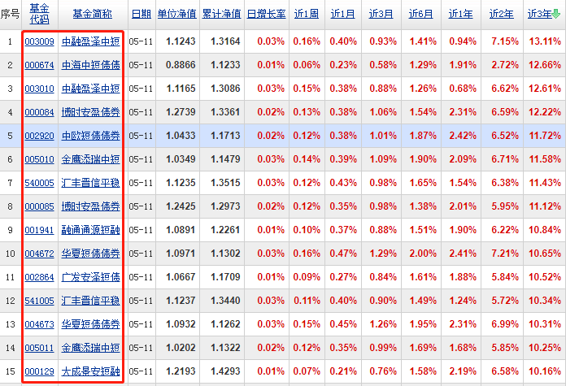

以第一只基金 003009 为例. 我们点击此代码, 会跳转到 基金的详情页面.

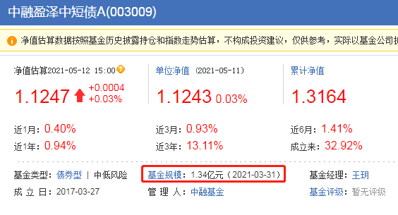

网站显示, 这只基金的规模是 1.34 亿元. 查到以后, 把这个数据录入我们的表格.

20 只基金的规模全部录入表格后, 我们就要最终确定符合条件的短债基金啦. 如前所述, 基金规模在 5 亿~50 亿之间的, 判定为合格.

在本次筛选中, 我们评出了 8 个合格.

不过大家注意, 它们并不是 8 只不同的基金哦, 有的基金完全重名, 只是最后的字母 A 和 C 不一样.

比如, 我们统计的列表里同时出现了: 华夏短债债券 A、华夏短债债券 C

其实它们是同一只基金下面不同种类的份额, 投资策略、投资标的完全一样, 区别只是手续费收取的方式不一样.

A 类要收取申购赎回费用, C 类不收取申购赎回费用. 但是 C 类要收取销售服务费. 所谓的销售服务费, 可以理解为基金打广告销售时花的钱.

至于 A 和 C 以外的其他字母, 大家不用管, 也不建议大家选择, 因为它们或多或少都有一些限制. 比如大成景安短融债券 B, 设置了申购金额 1000 万起步, 明显不适合个人投资者. 所以, 建议大家聚焦 A 类和 C 类就好啦.

如果你打算持有 1 年以上, 那么选择 A 类更划算. 如果你只打算短期持有, 1 年以内就卖掉, 那么选择 C 类更划算.

假设我们做一年以内的投资, 那么就在之前筛选合格的 8 只基金里, 选择 C 类的 3 只基金就可以啦.

建议大家不用配置太多, 短债基金选择 3 只以内就可以. 如果最后筛选出来的结果超过 3 只, 大家就从前往后选择前 3 只就好啦!

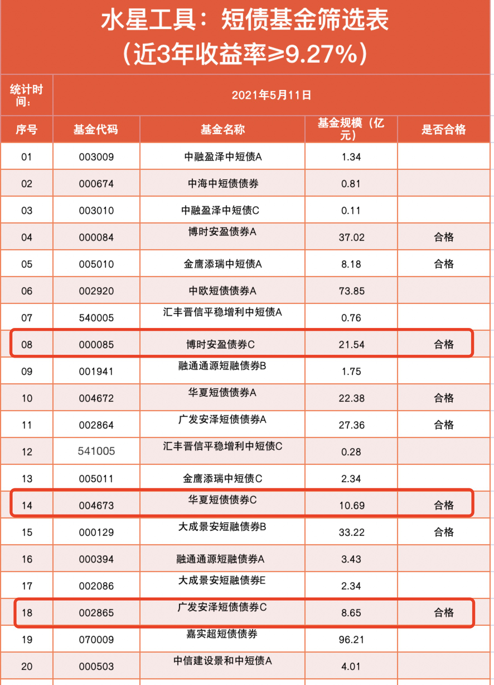

最后提醒一下: 本课中出现的基金不作为投资建议. 筛选时间不同, 筛选结果会有区别, 请大家不要照抄课程中的筛选结果.

## 总结

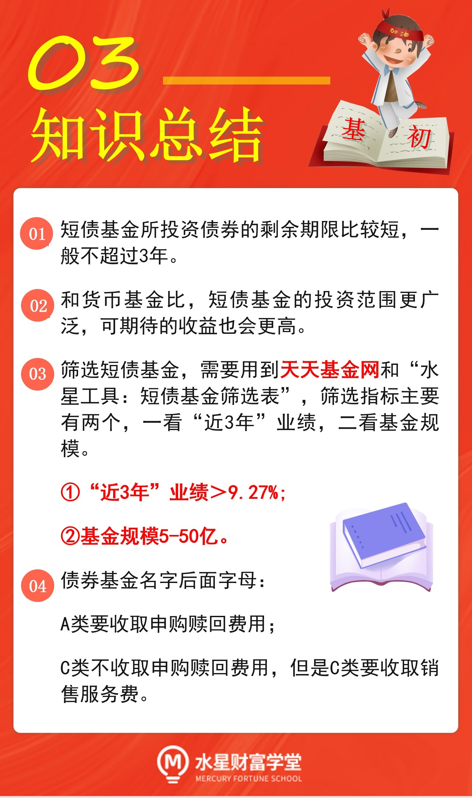

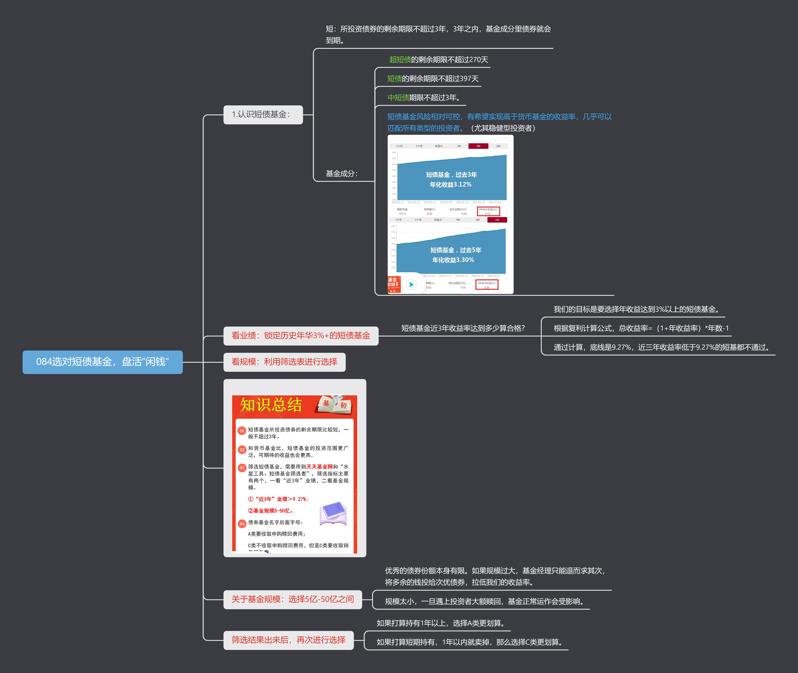
