## 短债基金

在上节课中, 我们学习过, 债券基金既可以短期内"盘活"闲钱, 又可以实现长期投资.

本节课, 我们就先来搞定短期投资, 用短债基金"盘活"自己的闲钱.

短债基金近年来非常火爆, 是当之无愧的"网红"品种.

名字里的"短", 指的是所投资债券的剩余期限比较短, 一般不超过 3 年. 也就是说, 3 年之内, 基金成分里的债券就会到期, 接着就能兑现票息.

根据所投资债券的剩余期限不同, 短债基金的成分又可以分为三类, 分别是: 超短债、短债和中短债.

超短债的剩余期限不超过 270 天, 短债的剩余期限不超过 397 天, 中短债的剩余期限不超过 3 年.

由于所投债券的期限很短, 短期内受利率变化的影响很小, 所以, 短债基金的波动较低, 风险较小.

不过, 短债基金仍然有亏损的可能. 虽然短债基金波动不大, 但毕竟存在下跌风险. 和货币基金比起来, 短债基金的风险要更高一些.

以 2019 年为例, 短债基金的平均最大回撤率是-0.11%, 这个数据表示: 在 2019 年, 即使你运气不好, 买在最高点, 卖在最低点, 那么 1 万元最多亏 11 元.

这个风险确实有, 但说实话并不高. 有小伙伴可能要问了: 既然短债基金有风险, 干嘛不直接选择货币基金?

选择短债基金是因为, 它的投资范围更广泛, 可期待的收益也会更高.

截止到 2021 年 5 月, 货币基金过去 3 年的年化收益率为 2.68%, 过去 5 年的年化收益率为 2.98%, 都没有达到 3%.

相比之下, 短债基金表现更出色. 截止到 2021 年 5 月, 短债基金过去 3 年的年化收益率为 3.12%, 过去 5 年的年化收益率为 3.30%, 全部达到了 3%以上.

基金赚钱存在复利效应, 年化收益率高一点, 日积月累会多赚不少钱!

总而言之, 短债基金风险相对可控, 还有望实现高于货币基金的收益率, 几乎可以匹配所有类型的投资者, 尤其是不愿意承担过高风险的稳健型投资者.

## 看业绩: 锁定历史年化 3%+的短债基金

如何才能找到年化收益率 3% 以上的短债基金呢?

我们要用到的筛选工具是"天天基金网".(网址:https://fund.eastmoney.com/)

大家可以直接复制文稿中的网址, 打开该网站, 也可以用搜索工具搜索"天天基金网"五个字, 点击进入官网.

接下来, 我们就要实操筛选啦.

第一步, 在天天基金网首页找到"基金数据", 点击"基金排行".

点击完成后, 网页跳转到如下界面. 请大家结合文稿来看

大家可以看到很多基金, 密密麻麻, 不过完全不用慌, 只需要简单几步, 就能选出我们想要的短债基金.

第二步, 点击"债券型". 这一步是为了锁定债券基金, 把其他各种类型的基金都排除.

点击"债券型"之后, 网站会让我们进一步选择"分类"和 "杠杆比例". 我们在"分类"中选择"短期纯债", 杠杆比例选择"全部"

短期纯债, 就是我们要找的短债基金.

这里的"纯债", 是"纯债基金"的意思, 也就是基金所投资的资产 100%都是债券, 没有任何其他成分. 我们要筛选的短债基金就属于纯债基金.

大家简单理解这个概念就好啦, 下一节课, 我们将专门学习纯债基金.

至于杠杆比例, 我们在上节课学习过, 债券基金的一大收益来源就是杠杆收益, 也就是把手里的债券抵押出去, 借一笔钱, 买入新的债券. 加杠杆可以放大收益效果.

杠杆收益也是真金白银. 能用杠杆赚到钱, 也算是基金经理的本事. 而且, 国内政策规定, 普通开放式基金的杠杆比例不超过 140%, 已经为我们控制了杠杆过高的风险. 所以, 我们不用挑剔, "杠杆比例"选择"全部"即可.

好啦, 两步完成后, 我们就锁定了短债基金这个小范围. 不过, 短债基金一共接近 300 只, 全部都买不太现实, 我们还得进一步挑选.

第三步, 点击"近 3 年", 网站会自动按照近 3 年的总收益率进行排名.

如果总收益率没有按照从大到小进行排名, 大家可以再点击一下"近 3 年", 完成排名.

之所以选择"近 3 年", 是因为短期的业绩存在运气成分. 如果基金长期回报经得起检验, 那才是真的好基金.

近 3 年的收益率达到多少算合格呢?

大家还记得我们的目标吗? 我们要选择的是, 年化收益达到 3%以上的短债基金.

根据复利计算公式: 总收益率=(1+年化收益率)^年数-1

如果按照年化收益率 3%计算, 3 年时间的总收益率应该是 9.27%, 所以, 我们在看短债基金"近 3 年"的收益率时, 底线就是 9.27%, 低于 9.27%的一律不通过.

我们课程的筛选时间是 2021 年 5 月 11 日. 筛选结果中, 共有 20 只基金满足条件, "近 3 年"收益率高于 9.27%.

## 看规模: 水星专属筛选表

经过"天天基金网"3 步筛选, 我们得到了一组业绩合格的短债基金.

接下来, 我们把"近 3 年"收益率高于 9.27%的基金信息, 汇总统计在一张表格中, 方便我们做进一步筛选.

水星财富学堂为大家准备了现成的表格工具, 大家可以咨询自己的训练营班班, 直接下载使用, 以后筛选短债基金都可以直接用它哦.

<a href="/基金筛选表-基金初级专用.xlsx" target="_blank">基金筛选表-基金初级专用.xlsx</a>

大家可以在文稿中看到表格工具的样子. 我们首先在"统计时间"一栏, 填入自己实操筛选的日期, 方便筛选结束后可以复查.

然后, 我们把之前选出来的 20 只短债基金的代码和名称, 录入到表格中.

大家注意, 如果筛选出来的基金超过了 30 只, 那么我们就录入前 30 只基金就好啦. 因为 30 名以后的基金都是收益率排名靠后的, 从收益率的角度讲要差一些, 全部统计会增加我们的工作量, 完全没必要.

符合近 3 年收益率 9.27%的基金已经选出来啦, 不过 20 只还是有点多, 我们还需要根据基金规模, 做进一步筛选.

关于基金规模, 建议大家选择 5 亿~50 亿之间.

这是因为, 优秀的债券份额本身有限. 如果债券基金的规模太大, 基金经理就只能退而求其次, 把多余的钱投给次优的债券, 拉低我们的收益率. 所以债基规模太大了不好, 应该小一些.

但是基金规模也不能太小. 如果规模太小, 一旦遇上投资者大额赎回, 基金的正常运作会受到很大影响.

根据经验, 5 亿~50 亿是个相对合理的范围.

接下来, 我们要在前面筛选出的 20 只基金里, 进一步挑选规模在这个范围内的基金.

基金规模怎么看呢? 方法还是利用天天基金网.

在我们之前进行业绩筛选的界面, 点击每一只基金的代码或者名字. 大家可以看文稿, 也就是点击图中框出来的部分.

以第一只基金 003009 为例. 我们点击此代码, 会跳转到 基金的详情页面.

网站显示, 这只基金的规模是 1.34 亿元. 查到以后, 把这个数据录入我们的表格.

20 只基金的规模全部录入表格后, 我们就要最终确定符合条件的短债基金啦. 如前所述, 基金规模在 5 亿~50 亿之间的, 判定为合格.

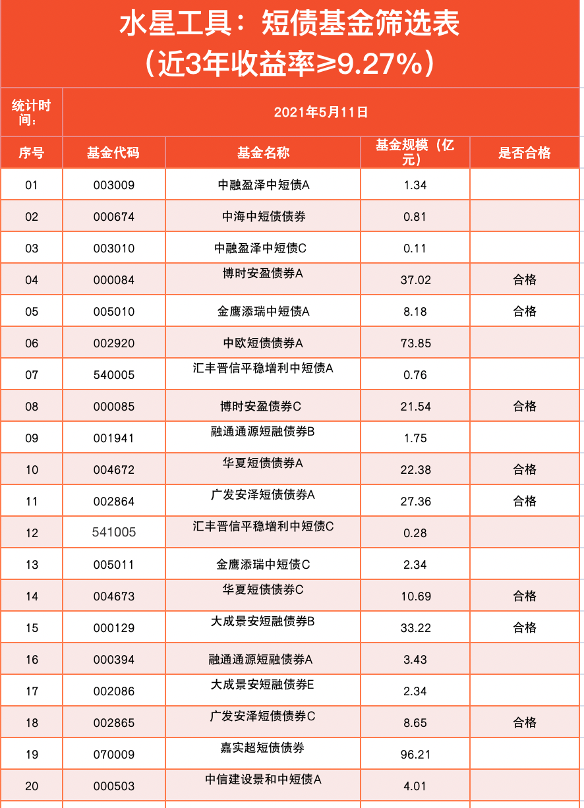

在本次筛选中, 我们评出了 8 个合格.

不过大家注意, 它们并不是 8 只不同的基金哦, 有的基金完全重名, 只是最后的字母 A 和 C 不一样.

比如, 我们统计的列表里同时出现了: 华夏短债债券 A、华夏短债债券 C

其实它们是同一只基金下面不同种类的份额, 投资策略、投资标的完全一样, 区别只是手续费收取的方式不一样.

A 类要收取申购赎回费用, C 类不收取申购赎回费用. 但是 C 类要收取销售服务费. 所谓的销售服务费, 可以理解为基金打广告销售时花的钱.

至于 A 和 C 以外的其他字母, 大家不用管, 也不建议大家选择, 因为它们或多或少都有一些限制. 比如大成景安短融债券 B, 设置了申购金额 1000 万起步, 明显不适合个人投资者. 所以, 建议大家聚焦 A 类和 C 类就好啦.

如果你打算持有 1 年以上, 那么选择 A 类更划算. 如果你只打算短期持有, 1 年以内就卖掉, 那么选择 C 类更划算.

假设我们做一年以内的投资, 那么就在之前筛选合格的 8 只基金里, 选择 C 类的 3 只基金就可以啦.

建议大家不用配置太多, 短债基金选择 3 只以内就可以. 如果最后筛选出来的结果超过 3 只, 大家就从前往后选择前 3 只就好啦!

最后提醒一下: 本课中出现的基金不作为投资建议. 筛选时间不同, 筛选结果会有区别, 请大家不要照抄课程中的筛选结果.

## 债券基金的投资方向

### 债基取名字的小秘密

很多债券基金在取名字的时候, 会直接把所投资的债券品种、债券期限写在名字中. 举个例子, 平安 3-5 年期政策性金融债债券 A, 代码 006934

平安, 是基金公司的名字.

3-5 年期, 指的是这只基金所投资债券的剩余期限在 3-5 年之间. 政策性金融债, 也就是政策性银行发行的债券.

咱们昨晚的加餐提到过, 政策性银行一共就 3 家: 国家开发银行、中国进出口银行、中国农业发展银行, 它们发行的债券分别叫: 国开债(或"国开行债")、进出口行债、农发行债.

也就是说, 这只基金专门投资于国开债、进出口行债和农发行债. 那么, 名字里这些信息靠不靠谱呢? 基金这么取名字, 真的会按照名字里说的去投资吗?

答案是肯定的. 根据《证券投资基金运作管理办法》, 如果基金名称显示投资方向的, 应当有 80%以上的非现金基金资产属于投资方向确定的内容.

说白了就是, 只要写在名字里的, 就不能骗人, 80%的钱必须按照名字里所说的去投资. 实际咱们也可以用"晨星网"检验一下. 大家看图:

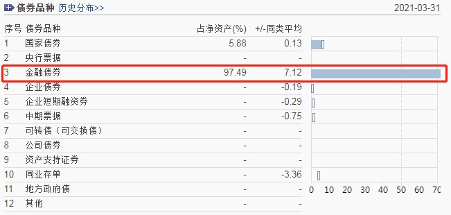

这只基金所投资的债券品种里面, 金融债券 97.49%, 符合基金名称规定.

### 债券的"等级"

有些债券基金的名字里还会体现债券的"等级". 比如下面这几只:

平安高等级债 A, 代码 006097 易方达高等级信用债债券 A, 代码 000147 光大中高等级债券 A, 代码 002405

这些基金名字中的"高等级"和"中高等级"是什么意思呢?

其实它们代表的是债券的信用等级. 我国的评级体系把债券分成了五档, 从高到低分别是: AAA、AA+、AA、AA-、A+

高等级指的是: AAA、AA+ 中等级指的是: AA 低等级指的是: AA-和 A+

那么, 等级高有什么用呢?

债券等级越高, 说明信用越高, 债券的违约、到期还不起钱的风险越小, 咱们承担的信用风险 也就越小.

而且大家注意, 只有信用债才有信用等级, 利率债是不参与评级的.

也就是说, 国债、地方政府债、中央票据、政策性银行债不存在评级一说.

目前, 国内的债券基金在选择信用债的时候, 大多数偏向于选择信用等级好的债券, 也就是"中等级"和"高等级"的债券, 即 AA、AA+、AAA. 很少有人会选择"低等级"债券. 这么选 择, 主要是出于资金安全的考虑.

不过, 投资江湖上也有另一个流派, 特别喜欢"低等级"债券.

这些信用等级不好的债券, 通常也被称为"垃圾债".

垃圾债主要出现在公司债券这个类别里, 通常指的是资产品质较低、欠钱不还的风险较高的品种. 背后的原因可能是公司本身实力不行, 或者资金链吃紧.

既然是"垃圾", 为什么还有人愿意要呢?

这是因为, 这样的公司想要渡过难关, 本身就特别需要钱, 所以急于找大家借钱. 如果给的利息低, 根本吸引不到债券投资者, 所以只能开出更高的利息. 当这个潜在的收益足够高的时候, 很多投资者就会想要"赌"一把.

如果运气好, 公司渡过难关, 到期还本付息, 投资者就能赚到比其他人更多的钱. 如果运气不好, 公司没有挺到最后, 或者到期还不起钱, 投资者就要面临亏损.

所以, 垃圾债可以说是风险最高的债券品种之一. 当然, 垃圾债只是一种俗称, 实际发行的时候, 没有公司会把自己的债券取名"垃圾债". 大家都会宣传预期收益高的一面, 把这种债券取名"高收益债". 如果你在债券基金的名字里发现了"高收益债"的字眼, 那么注意了, 不要被"高收益"蒙蔽了双眼, 它的背后其实是信用等级很低的债券.

比如下面这只基金: 鹏华全球高收益债, 代码 000290

它投资的是全球各个市场的高收益债, 而且大家可以看它过去 5 年的历史走势, 堪称波澜起伏, 不亚于投资股票.

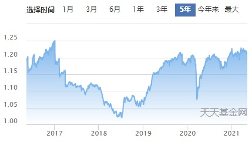

咱们投资债券基金的本意就是为了稳健, 投资"高收益债"就起不到稳健的效果啦. 所以, 班班不推荐大家选择投资高收益债.

### 深扒基金合同, 全面了解基金投资方向

经过以上的学习, 想必很多小伙伴都学会了, 从债券基金的名字可以挖掘很多信息, 比如基金所投资的债券期限、债券品种或者债券等级.

不过班班要提醒一下, 看名字只是一个比较取巧的方法, 不是万能的. 债券基金取名字没有强制规定, 不是所有债基都必须在名字里体现债券期限和品种.

而且, 有些基金名字, 非但不体现债券期限和品种, 还会增加一些花哨的"修饰词". 比如下面这几只:

工银添福债券 B, 代码 000185 华泰柏瑞季季红债券, 代码 000186 易方达安心回报债券 A, 代码 110027

这些基金名字里的"添福", "季季红", 还有"安心回报", 都是一些修饰词, 只是好听而已, 对咱们分析基金起不到任何作用.

如果我们在债券基金的名字里找不到有用的信息, 那么该怎么办呢?

这种情况下, 我们还可以借助基金合同. 任何一只基金的投资范围, 都必须在基金合同里面讲清楚.

我们以"易方达安心回报债券 A"为例, 代码 110027, 看一下怎么查基金合同. 方法是利用天天基金网.

第一步, 在天天基金网搜索基金代码 110027, 点击这只基金, 打开它的详情页面.

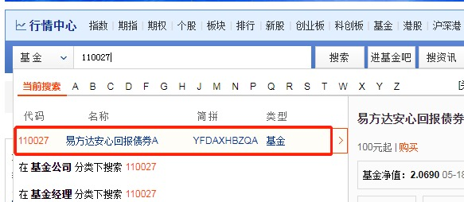

第二步, 如下图所示位置, 找到"基金公告", 点击进入.

第三步, 在基金公告中, 选择"发行运作"菜单, 在这个菜单下面就可以找到基金合同啦.

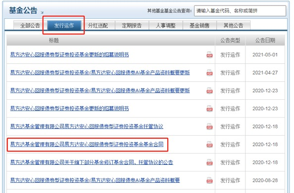

第四步, 我们把这份合同点开, 找到"查看 pdf 原文", 点击进入.

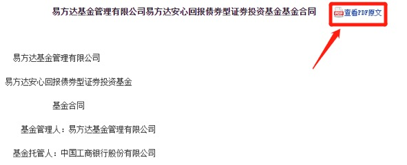

第五步, 在合同目录中, 有一行是"基金的投资", 我们在这一行点击一下.

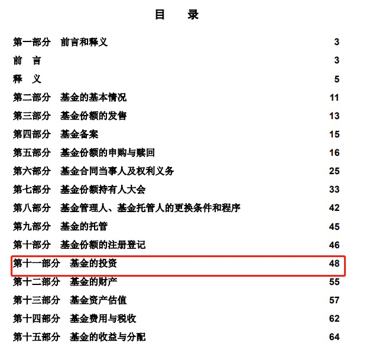

接着会跳转到"基金的投资"详细描述. 我们重点看它的"投资范围".

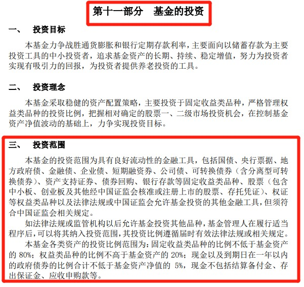

可以看到, 这只基金可以投资于政府债券、金融债券、企业债券, 全部都可以投, 没有"忌口".

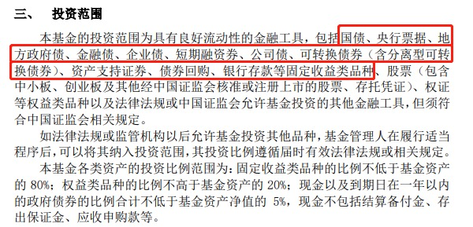

而且注意, 这只债券基金还可以投资于股票等高风险的品种, 并非只有纯纯的债券.

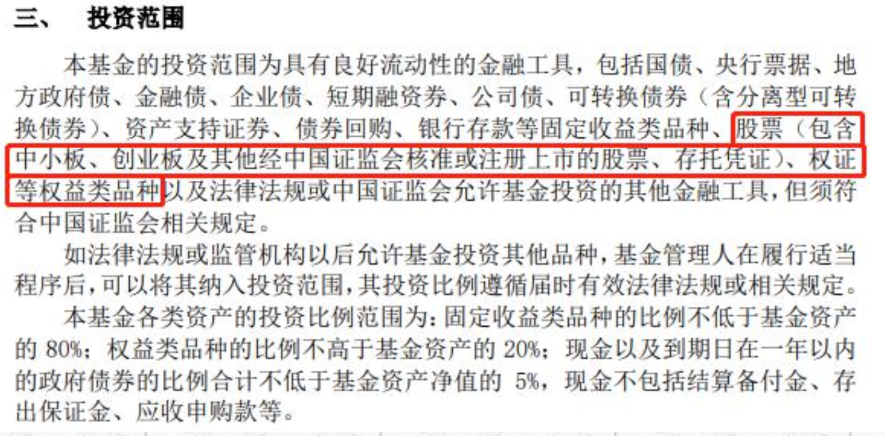

接下来还展示了投资比例范围, 债券不低于 80%, 股票等不高于 20%.

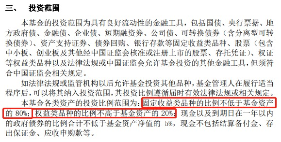

以上就是这只基金的投资范围啦.

大家注意, 对于基金合同中没有提到的点, 就说明这只基金没有限制. 比如, 基金合同没有规定, 在选择债券的时候是否要坚持 AA 级别以上, 这就说明, 这只基金对选择债券的信用等级 没有限制, 垃圾债也是可以投资的.

至于债券期限, 合同中没有提, 就说明在期限方面也没有限制.

如果有限制, 基金合同一定会说明清楚. 比如, 班班再举个例子, 中银中高等级 A, 代码 000305, 基金合同中是这么写的:

投资于 AA 级或以上的中高等级债券的比例不低于非现金资产的 80%, 妥妥的一只投资于中高等级债券的基金.

## 总结

1. 债券基金的名字中可能会透露他所投资的债券期限、债券品种以及债券的信用等级。
2. 债券的信用等级分为 AAA，AA+，AA，AA-，A+，其中 AAA 和 AA+是高等级，AA 是中等级，AA-和 A+是低等级。只有信用债参与评级，利率债不参与评级。
3. 如果债券基金的名字里没有透露基金的投资方向，我们还可以借助天天基金网，深扒基金合同，查看基金的投资范围。
