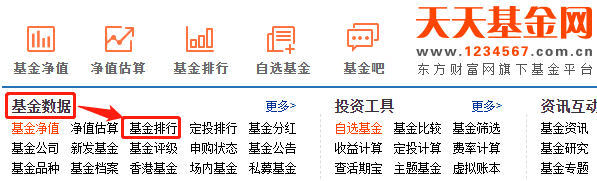

上节课我们学习了短债基金, 通过它可以实现短期投资, "盘活"自己的闲钱, 而且预期收益比货币基金的更高.

不过, 从收益的角度来说, 短债基金只能算是"债基家族"中的一位"小弟", 真正的"大哥"会在本节课登场.

本节课, 我们就来一起学习, 如何通过债券基金做到长期投资, 博取更高收益.

## 长期纯债

相信很多小伙伴都会冒出相同的疑问: 为什么长期投资的收益会更高呢?

这主要是因为, 债券的偿还期限越久, 利息就越高.

咱们学习过, 债券的本质相当于借条. 借钱的时间越久, 发行人的信用变化越无法保证, 而且市场利变化的风险也越大, 投资者会承担更高的风险. 为了补偿投资者承担的风险, 偿还期限更久的债券理应给出更高的利率.

所以, 债券基金投资于长期债券时, 可以赚到更多票息, 从而可以达到更高的收益率.

既然如此, 咱们就得和基金经理保持步调一致, 买入后做到长期持有.

根据投资范围来划分, 可以长期投资的债券总共有两类, 一类是纯债基金, 另一类是偏债基金.

它们之间有什么区别呢?

咱们学习过, 债券基金以投资债券为主, 80% 的非现金资产都用于投资债券.

剩下不超过 20% 的非现金资产可以投资于其他的品种, 通常来说主要是股票.

如果债券基金投资了债券以外的其他品种, 那么它就是一只偏债基金. 如果债券基金 100% 投资于债券, 那么它就是一只纯债基金.

因为偏债基金的成分里加入了股票, 所以它的波动更高, 风险更大, 但长期来看, 预期收益比较好.

不过, 我们依然建议大家优先选择纯债基金. 因为只有投资于纯粹的债券, 我们才能够知道自己的钱到底买的是什么, 才能更加纯粹地利用债券基金的防守功能. 至于博取高收益的进攻选手, 还是专门留给股票基金比较好. 这就像在一场球赛中, 前锋是前锋, 后卫是后卫, 它们分工明确, 各有所长, 便有助于赢得比赛.

综合以上分析, 我们就把目光锁定在了一件事情上: 选择长期纯债基金.

## 三个指标, 精选长期纯债基金

长期纯债基金那么多, 我们到底该怎么选择呢?

方法很简单, 只需要看三个指标就足够了.

### 第一个指标: 基金历史业绩.

还记得我们上节课的操作吗? 短债基金的目标年化收益至少要达到 3% , 换算成近 3 年的总收益率为 9.27% , 所以, 我们上节课把 9.27%作为近 3 年收益率的底线, 对短债基金进行了筛选. 筛选长期纯债基金的方法是一样的. 只不过目标收益率有所不同, 长期投资的目标收益率肯定要定得更高一点

根据近十年的历史表现, 长期纯债基的平均年化收益率在 6%~7%左右, 换算成近 3 年的总收益率为 19.10%~22.5%, 我们取一个中间数, 定在 20%就好啦.

也就是说, 我们对长期纯债基金的历史业绩要求是: 近 3 年的总收益率不低于 20%.

### 第二个指标: 基金规模.

筛选短债基金时, 我们确定的基金规模是 5 亿~50 亿. 这个范围对筛选所有债券基金都适用.

所以, 我们对基金规模的要求保持不变, 还是 5 亿~50 亿.

### 第三个指标: 基经理任职天数.

基金经理的长期布局对我们的收益至关重要. 所以, 在长期投资开始前, 我们要着重考察一下基金经理的任职情况.

我们的考察标准是: 基金经理任职天数不得少于 3 年. 毕竟基经理也属于正式工作岗位, 在任何的工作中, 都要关注员工的资历. 基金经理管理相应基金的时间越长, 经验越丰富, 未来做投资也就更加游刃有余. 这样, 我们投资基金赚钱才更可靠.

通常来说, 做同一件事达到 3 年以上, 就算是一名职业"老将"啦. 所以我们的标准定为不少于 3 年.

总结一下, 精选长期纯债基金总共要看三个指标, 分别是: 基金历史业绩、基金规模和基金经理任职天数.

接下来, 我们就要用这三个指标实操筛选啦.

## 实操筛选: 水星专属筛选表

筛选长期纯债基金用到的工具依然是"天天基金网". [网址](https://fund.eastmoney.com/)

大家可以直接复制文稿中的网址, 打开该网站, 也可以用搜索工具搜索"天天基金网五个字, 击进入官网.

一开始的流程和筛选短债基金时类似.

第一步, 在天天基金网首页找到"基金数据", 点击基金排行".

点击完成后, 网页跳转到如下界面. 请大家结合文稿来看.

第二步, 点击"债券型". 这一步是为了锁定债券基金, 把其他各种类型的基金都排除.

点击"债券型"之后, 网站会让我们进一步选择"分类"和 "杠杆比例". 我们在"分类"中选择"长期纯债", 杠杆比例选择"全部".

第三步, 点击"近 3 年", 网站会自动按照近 3 年的总收益率进行排名.

上一节我们已经确定了业绩筛选标准. 我们对纯债基金的历史业绩要求是: 近 3 年的总收益率不低于 20%.

按照这一标准, 筛选结果中一共有 24 只基金满足条件. 在此提醒, 课程进行筛选的时间是 2021 年 5 月 16 日, 不同时间的筛选结果会有所不同. 大家按照自己的实际筛选结果往下进行就好啦.

经过"天天基金网"3 步筛选, 我们得到了一组业绩合格的长期纯债基金. 接下来, 我们把近 3 年收益率高于 20%的基金信息, 汇总统计在一张表格中, 方便我们做进一步筛选.

水星财富学堂依然为大家准备了现成的表格工具, 大家可以咨自己的训练营班班, 直接下载使用. 在文稿中可以看到表格工具的样子. 我们首先在"统计时间"一栏, 填入自己实操筛选的日期, 方便筛选结束后可以复查.

<a href="/基金筛选表-基金初级专用.xlsx" target="_blank">基金筛选表-基金初级专用.xlsx</a>

然后, 我们把之前选出来的 24 只基金的代码和名称, 录入到表格中. 如果大家实际筛选出来的基金超过了 30 只, 那么就录入前 30 只基金就好啦.

基金代码和名称录入完成后, 我们就要录入剩下的两列啦, 分别是基金规模和基金经理任职天数.

方法很简单, 在我们之前进行业绩筛选的界面, 点击每一只基金的代码或者名字. 大家可以看文稿, 也就是点击图中框出来的部分.

以第一只基金为例, 我们点击代码 003793, 会跳转到基金的详情页面

网站显示, 这只基金的规模是 36.44 亿元. 查到以后, 把这个数据录入我们的表格.

至于基金经理任职天数, 查询方法也很简单. 在基金的详情页面中, 除了可以看到基金规模, 我们还可以看到基金经理的名字.

我们点击蓝色的基金经理名字, 就可以查到他的任职天数啦.

我们可以看到, 这只基金当前的基金经理一共有两位. 这种情况下, 该基金由名字在前的经理主要负责, 我们只需要考察名字在前的这一位就好啦.

页面往下拉, 我们可以看到一行底色为蓝色的数据, 这里会显示基金经理的任职天数.

我们可以看到, 该基金经理的任职天数为 1 年又 115 天.

好啦, 基金规模和基金经理任职天数的数据都有了, 我们接下来就把数据统计到表格里. 大家可以看文稿, 24 只基金的数据已经全部统计完毕啦.

最后, 我们只需要检查一遍, 把基金规模在 5 亿~50 亿之间, 同时基金经理任职天数不少于 3 年的基金, 判定为合格就可以啦.

经检查, 合格的基金一共有 10 只.

## 独具魅力的"定开债"

由于我们的目标是长期投资, 长期来看, A 类基金的手续费比 c 类基金的更低, 所以在筛选合格的基金中, 优先选择投资 A 类基金. 如果基金名字最后没有带字母, 说明这只基金没有区分 A 类和 C 类, 这时候不用纠结, 直接选择它即可.

除此之外, 大家还需要注意筛选结果中的定开债基金.

所谓的"定开", 就是定期开放. 开债基金在申购成功之后, 有一段时间的封闭期, 短则 3 个月, 长则 3 年. 这段时期内不准赎回, 只有等到封闭期结束才可以赎回.

封闭期的设立是为了基金经理更好地布局, 买期限比较长的高息债, 避免投资者意志不坚定, 短期内就要赎回资金, 影响到基金经理的操作.

且定开债基金可以达到最高 200%的高杠杆率, 充分放大收益效果, 普通债券基金的杠杆率最高只能达到 140%.

封闭期的设立可以帮助投资者遵守投资纪律, 坚定地长期投资, 而且这种机制可以促使定开债基金比普通债券基金更容易获得高收益, 对我们是有利的.

一般来说, 研债基金的名字中就包含了"定开债"或者"定期开放债券"的字眼, 很好判断.

比如, 我们本节课的筛选结果中, 就有一只判定合格的定开债. 我们可以在它的详情介绍中查到, 它的封闭期是 12 个月.

如果筛选结果中有定开债基金, 建议大家保留, 不建议剔除.

综合以上分析, 我们就能确定最终的投资对象啦.

长期纯债基金的数量也不需要太多, 选择数量过多容易摊薄收益, 降低我们的收益率. 但是也不能选择数量过少, 否则投资过于集中, 会增加投资风险.

一般来说, 选择 3 只就可以了.

我们在筛选合格的基金中, 排除 C 类基金, 然后选择前 3 只进行投资就好啦.

想必大家都理解了, 定开债基金中的"定开", 指的是定期开放.

一般我们大众申购的基金都是开放型的, 也就是投资者可以随时申购赎回.

和普通的开放式基金的区别在于: 选择定开债基金时, 投资者无法随时申购赎回, 而是要度过一段封闭运作期, 等到封闭期打开以后, 才可以申购赎回.

很多投资者讨厌封闭期, 所以不选择定开债基金, 殊不知, 定开债基金更有利于我们赚到钱哦. 简而言之, 定开债基金的优势可以概括成 3 个方面: 无惧大额赎回、无惧大额申购、加杠杆更自由.

### 先来看第一个方面: 无惧大额赎回.

投资定开债需要坚定地长期投资, 买入之后, 要在长达 1 年甚至 3 年的时间里, 保持耐心等待.

这段时间, 基金经理不用担心突如其来的赎回, 反正在封闭期内, 任何人不可以赎回, 基金经理就可以大胆运用长期投资策略, 去买期限比较长的债券.

期限越长的债券, 票息就会越高. 票息就是基金赚到的真金白银! 咱们投资相应的基金, 也就能赚到更多的钱.

### 再来看第二个方面: 无惧大额申购.

除了不用担心大额赎回, 定开债基金还有另一个好处, 就是不用担心大额申购.

在牛市期间, 市场涨得特别诱人的时候, 大众经常选择跟风买基金. 其中一些规模不大的基金, 经过大家一顿买买买, 规模变得很大, 超过 50 亿元是常有的事.

咱们的课程里学过, 基金规模太大不是好事. 优秀的债券份额本身有限, 基金规模过大的时候, 钱有了多余, 但是好债券配置完了, 基金经理只能拿多余的钱去买不那么好的债券.

这种情况下, 基金收益率就会被拉低. 所有投资这只基金的人, 都只能赚到更少的钱, 这就叫收益被"摊薄"了. 新人涌入, 老人吃亏.

但如果投资定开债基金的话, 就不用担心规模过大、收益被摊薄的问题啦.

定开债基金一旦进入封闭期, 不但不能赎回, 而且禁止任何人申购. 也就是说, 封闭期内, 基金规模定死了, 不能变.

期间如果碰到牛市, 新人不可以申购封闭的定开债基金, 瓜分收益的都是早就申购过的老人, 收益不会被摊薄.

### 最后来看第三个方面: 加杠杆更自由.

普通的开放式债基, 虽然可以加杠杆, 但是杠杆率最高只能到 140%. 也就是说, 如果基金规模 10 亿, 它最多只能借 4 亿来加大投资.

定开债基金就不一样了, 杠杆率最高可以到 200%. 如果定开债基金的规模是 10 亿, 它最多可以再借 10 亿来加大投资, 相当于放大一倍.

如果遇到特别好的债券买入机会, 定开债基金的基金经理就可以加更多杠杆, 将投资收益放大更多.

以上就是定开债基金的三大优势: 无惧大额赎回、无惧大额申购、加杠杆更自由.

## "定开债基金"的封闭期

定开债基金的封闭期通常是:3 个月、6 个月、1 年、18 个月、2 年和 3 年. 在封闭期内, 不允许投资者申购赎回.

封闭期具体有多长呢? 一般来说, 我们看基金的名字就能看出来.

大家可以看下面几个例子:

华泰保兴尊诚一年定开债, 封闭期是一年, 也就是 12 个月. 博时安丰 18 个月定开债, 封闭期是 18 个月. 平安增鑫六个月定开债, 封闭期是 6 个月

当然, 也有一部分定开债没有在名字里体现封闭期有多久, 这时候我们用天天基金网查一下就好啦.

比如这只债基: 新华安享惠金定期债券 A(519160) 我们在天天基金网搜索一下这只债券:

点击进入基金的详情页面. 我们就可以看到, 它的封闭期是 12 个月.

那么, 封闭期多久的定开债基金比较好呢?

封闭期如果只有 3 个月、6 个月, 那么时间太短, 对大家来说和没封闭差不多, 意义不大.

即使不选定开债基金, 大家坚持 3 个月、6 个月不申赎也不难. 封闭期太短的话, 对强制遵守投资纪律没什么效果.

而且, 定开债基金的另一个优势, 是让基金经理更好地投资布局, 去买期限比较长的高息债. 如果封闭期只有 3 个月、6 个月, 那么基金经理的布局也没法"放得开", 对提高投资收益的帮助不大.

所以, 建议大家选择定开债基金时, 锁定那些封闭期在 1 年以上的.

如果你觉得封闭期 3 年太久了, 一开始很难接受这么久的苦苦等待, 可以从封闭期 1 年的定开债基金开始尝试.

## 实操筛选

在今天的课程中, 大家学习了长期纯债基金的筛选. 在筛选结果中, 偶尔可能会选出定开债基金.

遇到这种情况, 建议大家保留选出来的定开债基金, 不建议剔除.

不过, 如果你把定开债基金当做自己的"真爱", 想通过投资它, 做一名坚定的长期投资者, 也可以只选择定开债基金哦!

定开债基金的筛选, 和长期纯债基金的筛选类似, 班班给大家演示一遍. 筛选工具和课程一致, 我们用"天天基金网".

第一步, 在天天基金网首页找到"基金数据", 点击"基金排行".

点击完成后, 网页跳转到如下界面:

不要眼花, 我们认准"债券型"就好啦.

第二步, 点击"债券型". 这一步是为了锁定债券基金, 把其他各种类型的基金都排除.

点击"债券型"之后, 网站会让我们进一步选择"分类"和"杠杆比例". 我们在"分类"中 选择"定期开放债券", 它就是我们要找的"定开债". 杠杆比例选择"全部"即可. 如图所示:

可投资的定开债基金数量不多, 这个是在 5 月 19 日进行过的筛选, 只筛选出 18 只定开债基金.

第三步, 点击"近 3 年", 网站会自动按照近 3 年的总收益率进行排名.

对于定开债基金, 我们对收益率的要求和课程中一致: 近 3 年的总收益率不低于 20%. 否则如果收益不如其他的长期纯债基金, 那么选择定开债基金就没什么意义了.

根据 20%的标准, 筛选结果一共有 4 只基金符合要求.

第四步, 把业绩过关的基金统计在表格中, 方便我们做进一步筛选.

关于定开债基金, 我们水星财富学堂也给大家提供专门的筛选表格哦.

<a href="/基金筛选表-基金初级专用.xlsx" target="_blank">基金筛选表-基金初级专用.xlsx</a>

我们首先在"统计时间"一栏, 填入自己实操筛选的日期, 方便筛选结束后可以复查.

然后, 我们把之前选出来的 4 只基金的代码和名称, 录入到表格中.

接下来要录入"封闭期". 今晚咱们刚分享过, 封闭期可以从基金名字里看, 名字里看不出来的, 可以看基金的详情页面.

比如第一只 160128, 南方金利定开债 A, 可以查到它的封闭期是 3 年.

我们把 4 只基金的封闭期全部统计在表格中.

接下来式基金规模和基金经理任职天数. 这里和课程中查询的方法一样, 也是在基金的详情页面查看. 班班带着大家回顾一下.

还是以第一只 160128 为例, 南方金利定开债 A, 可以查到它的基金规模是 2.39 亿元.

点击蓝色的基金经理名字, 可以查到基金经理的任职天数.

可以看到, 基金经理任职天数是 9 年又 4 天. 其他基金的查询方法也是一样. 查询完成后, 我们把结果统计在表格中.

数据统计完啦. 接下来, 咱们就要来判定哪些基金合格啦.

### 第一是看封闭期.

咱们提过, 封闭期不满 1 年的意义不大, 所以我们保留封闭期在 1 年以上的. 表中的基金封闭期分别是 3 年、1 年、2 年、2 年, 全都符合规定.

### 第二是看基金规模.

咱们在课程中选择基金时, 基金规模定在 5 亿~50 亿之间. 之所以下限定了 5 亿, 是因为基金规模太小的话, 如果遇到投资者大额赎回, 基金运作会受到很大影响.

不过对于定开债基金来说, 投资者在封闭期内无法赎回, 也就不用担心面对大额赎回的情况啦, 所以, 我们对定开债基金不用设置下限, 只保留上限 50 亿就好啦.

也就是说, 定开债基金的规模只要不超过 50 亿就可以.

表格中基金的规模分别是:2.39 亿, 18.93 亿, 4.03 亿, 0.31 亿, 全部符合规定.

### 第三看基金经理任职天数.

对于定开债基金而言, 也是基金经理经验越多越好. 这里的要求和课程中保持一致即可, 基金经理任职天数不少于 3 年.

表格中基金经理任职天数分别是:9 年、4 年、8 年、8 年, 全部符合规定. 所以, 经过筛选, 表格中的基金全部合格啦.

不过需要大家注意最后两只:"富国强回报定开债 A/B"和"富国强回报定开债 C", 严格来说, 它们不是两只基金, 而是同一只基金的不同份额类别, 主要区别在于手续费.

长期选 A 类更划算, 短期选 C 类更划算. 我们选择投资定开债基金, 肯定是为了长期投资, 所以选 A 类就好.

定开债基金的投资数量在 3 只左右即可. 如果最终筛选合格的超过 3 只, 我们选择前 3 只就可以啦.

如果筛选合格的不足 3 只, 我们可以先投资于合格的 1~2 只, 同时保留一部分本金, 未来筛选有其他合格的, 再用剩余的本金进行投资.

长期来看, 债券基金赚钱更率很高. 所以, 大家买入定开债基金以后, 坚定持有到期, 到期之后选择卖出就好啦.

卖出之后, 就可以进行新一轮的筛选和投资啦.

## 总结

1. 定开债基金, 全名"定期开放式基金", 存在一段时间的封闭期, 封闭期通常是:3 个月、6 个月、1 年、18 个月、2 年和 3 年. 在封闭期内, 不允许投资者申购赎回.
2. 封闭期的时长一般体现在基金的名字里, 如果名字里不体现, 也可以在天天基金网的基金详情页面查看.
3. 筛选定开债基金用的是天天基金网, 筛选指标包括: 近 3 年收益率不低于 20%; 封闭期至少 1 年; 基金规模不超过 50 亿; 基金经理任职天数不少于 3 年.
