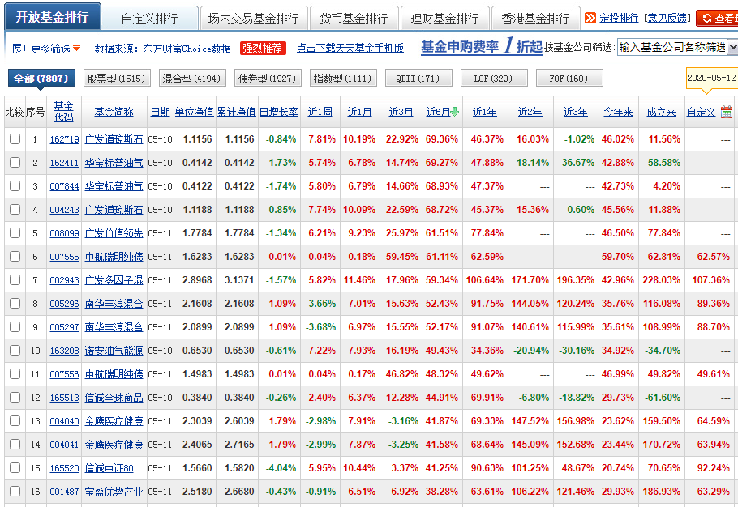
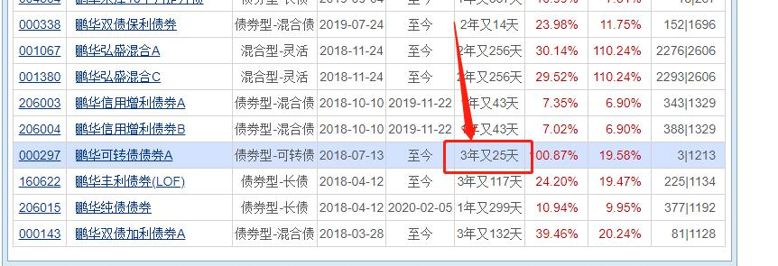

上一节课, 我们学习了如何筛选长期纯债基金. 筛选完成后, 我们就要进行买卖啦.

理论上来说, 长期纯债基金作为长期配置的品种, 并不需要我们择时. 也就是说, 不需要我们专门去挑选买卖的时间点.

这是因为, 即使债券价格有波动, 债券基金偶尔也会出现浮亏, 但由于有票息收入的持续流入, 只要持有时间足够长, 投资债券基金亏损的概率非常小.

请大家看文稿, 下图反映了纯债基金从 2016 年 5 月到 2021 年 5 月的总体走势, 在这 5 年时间里, 纯债基金基本保持平稳向上, 只要坚持长期持有, 基本人人都可以赚钱.

不过, 如果你想成为一名更高段位的投资者, 也可以考虑择时操作. 长期来看, 择时有助于提升债券基金投资的收益率, 帮助我们赚更多的钱.

这是因为, 在债券价格波动的过程中, 投资者可以选择债券价格低的时候入手, 债券价格高的时候卖出, 尽可能"低买高卖", 赚到更多价格波动的收益.

那么, 如何才能判断债券价格高低, 进而实现"低买高卖"呢?

我们只需要看一个指标就可以啦. 它就是: 市场利率.

## 市场利率

还记得我们在第二课学到的知识点吗? 市场利率和债券价格呈现反向变动的关系. 当市场利率上升时, 债券价格下降; 而当市场利率下降时, 债券价格上升.

我们来简单回顾一下背后的原因:

当市场利率上升时, 新发行的债券就会给出更高的利息, 但是呢, 市面上已经发行的老债券, 早就已经确定了利息, 和新债券比起来, 老债券利息低, 失去了吸引力, 所以会导致债券价格下跌.

反之, 当市场利率下降时, 新发行的债券给出的利息就会变得更低, 这时候, 老债券的利息更高, 成了抢手货, 所以会导致债券价格上涨.

总而言之, 市场利率和债券价格总是反着来.

所以, "低价买入、高价卖出"的说法就可以替换为: 在市场利率高的时候买入, 在市场利率低的时候卖出.

那么, 择时买卖的关键问题, 就是查看市场利率的数据啦.

## 一个指标, 看懂市场利率

市场利率的数据应该如何确定呢?

首先我们需要了解一个"大背景", 那就是我们国家的利率没有完全市场化, 而是实行"利率双轨制".

"双轨制"的其中一轨是官定利率, 主要指的是银行的存贷款利率. 官定利率由于受到管制, 数值由国家来规定, 所以不能完全真实地反映市场上的资金供需关系.

"双轨制"的另一轨, 就是我们要查找的市场利率啦, 也就是由市场上的资金供需关系直接决定的利率.

在我国, 市场利率的参考指标是"上海银行间同业拆放利率", 简称 Shibor.

所谓的上海银行间同业拆放利率, 大家可以理解为, 银行之间短期内互相借钱, 双方会形成一个借贷利率, 由于银行之间的借贷需要根据市场资金情况来决定, 所以, Shibor 可以作为市场利率的参考指标.

我们统计了过去 15 年的时间里, 1 年期 Shibor 的变化趋势, 大家可以看文稿, Shibor 的历史平均水平在 3.5%左右.

在上一小节中, 我们已经确定了买卖债券基金的原则, 那就是: 在市场利率高的时候买入, 在市场利率低的时候卖出.

结合 3.5%这个平均水平, 我们可以把买卖标准进一步量化:

当 1 年期 Shibor 大于 3.5%时, 买入长期纯债基金;

当 1 年期 Shibor 小于或等于 3.5%时, 卖出长期纯债基金.

Shibor 的数据会在其官网公布, 文稿中为大家展示了网址, 大家可以复制网址后, 在浏览器中打开, 直接就能看到 Shibor 的数据.[网址](http://www.shibor.org/)

当然, 大家也可以在搜索引擎中搜索"上海银行间同业拆放利率", 打开其官网.

网站为我们展示了 8 个最新 Shibor 数据, 大家认准最后一行的"1Y", 这个 Y"是英文中的 Year, 也就是"年"的意思.

课程中的查询时间为 2021 年 5 月 17 日, 1 年期 Shibor 的值为 2.9320%, 根据我们的择时标准, 1 年期 Shibor 小于 3.5%, 说明这个时间节点不适合买入长期纯债基金.

如果小伙伴们在分析的时候, 也发现当下不符合买入条件, 那么, 我们的投资难道要暂停了吗?

当然不是. 我们在本节课所学习的择时标准, 主要适用于长期投资. 因为只有在长期投资的情况下, 市场利率的变化才会产生明显的影响. 如果是短期投资, 则受到利率变化的影响很小.

大家不要忘了, 除了选择长期纯债基金以外, 我们还可以选择短债基金哦.

当 Shibor 或 10 年期国债到期收益率不足 3.5%时, 按照择时标准, 不适合买入长期纯债基金. 此时, 我们可以把闲下来的钱投资于"性价比"更高的短债基金.

## 看懂"10 年期国债到期收益率"

除了 Shibor 以外, 大家还可以把"10 年期国债到期收益率"作为市场利率的参考指标.

10 年期国债是以国家信用为担保的长期债券, 其收益率在一定程度上代表了我国境内市场的无风险收益率.

我们把 10 年期国债到期收益率和 1 年期 Shibor 统计在一张图中会发现, 两者在过去 15 年的变化趋势基本一致, 要涨一起涨, 要跌一起跌, 而且平均值也接近, 都在 3.5%左右.

所以, 大家也可以把 10 年期国债到期收益率作为择时标准:

当 10 年期国债到期收益率大于 3.5%时, 买入长期纯债基金;

当 10 年期国债到期收益率小于或等于 3.5%时, 卖出长期纯债基金.

10 年期国债到期收益率的查看方法也很简单, 在中国债券信息网就可以查询. 网址已经展示在了文稿中.[网址](http://yield.chinabond.com.cn/)

大家也可以在搜索引擎中搜索"中债收益率"5 个字, 点击进入中国债券信息网.

进入网址后, 我们把页面往下拉, 可以看到一张表格, 大家可以看文稿, 这张表格展示的是不同期限的国债所对应的收益率.

我们要找的是 10 年期国债, 所以只需要看"10.0y"这一行就行啦. 这里的"y"是英文中的"year", 也就是"年"的意思.

课程中的查询时间为 2021 年 5 月 17 日, 10 年期国债到期收益率为 3.1422%, 根据我们的择时标准, 数值不到 3.5%, 说明这个时间节点不适合买入长期纯债基金.

需要大家注意的是, Shibor 和 10 年期国债到期收益率是两个指标, 无法保证数据完全一样, 但总体来说, 两者趋势基本一致, 大家选择其中一个作为择时标准即可.

如果你希望更加谨慎一些, 也可以两个指标互相印证, 在同时符合买卖标准的时候再进行操作.

股神巴菲特有句名言: 模糊的正确远胜于精准的错误. 投资不是做数学题, 数据只是我们的一个参考, 不需要追求过分精确. 在数据大体符合择时标准的时候, 及时下手, 不要错过.

## 可转债

可转债, 是债券中的一个特殊品种. 它不仅有普通债券的属性, 而且还多了一个"转股"的功能.

班班给大家举一个形象的例子:

翠花想开美容店, 钱不够, 找隔壁老王借钱. 老王借给她 5 万, 并且要求她打了一张借条. 翠花拿到钱, 开了店, 生意做得风生水起, 这时候翠花就对老王说:

老王啊, 我现在给你一个机会, 你可以等到借条到期, 到时候我还给你本金和利息; 你也可以把借条换成美容店的股份, 以后美容店只要赚钱, 我就按照你的持股比例, 年年给你分配利润, 当然如果美容店亏了, 你作为股东也得共同承担.

有一点先说好哦, 如果你选择换成股份, 借条就失效了, 到期也就没有本金和利息了. 你想做债主, 还是想做股东, 你选吧~

通过这个例子, 大家应该能理解可转债了吧?

班班总结一下: 本质上来说, 可转债就是债券, 债券也就相当于借条, 只要规规矩矩拿着, 就可以赚它作为债券的钱; 不过可转债和其他债券不同的地方, 是"转股", 也就是放弃持有债券的机会, 换来做股东的机会.

转股还是不转股, 这个决定权在投资者自己. 如果觉得公司表现很给力, 成为股东收益更好, 就可以转股; 如果觉得公司前景不明朗, 也可以保守一点, 不转股.

懂了可转债, 那么"可转债基金"也就能一句话说清楚了. 可转债基金主要投资于可转债, 通常可转债的比例在 60%左右, 有些甚至可以达到 80%以上.

## 看看风险和收益

大家要特别注意, 可转债基金的风险, 要远远大于普通的债券基金哦. 原因主要有四个:

原因一: 可转债也叫"可转换公司债券", 听名字就可以知道, 它属于公司债, 和国债、金融债等等比起来, 公司债的风险会更高一些;

原因二: 大部分的可转债基金都是偏债基金, 也就是保留了不超过 20%的资产比例, 可直接投资于股票, 所以要承担一定的股市风险.

原因三: 可转债涉及到"转股", 只要一"转股", 就要承担更多的股市风险.

原因四: 可转债的价格波动剧烈, 有时甚至比股票的波动还要大; 可转债单日的价格波动最高可以达到 ±30%, 而股票单日的价格波动最高只能是 ±10%;

说了这么多风险, 大家有没有被可转债基金吓到? 其实, 风险背后隐含着巨大的机会哦~

尤其是因为可转债的价格波动大, 如果在熊市布局, 价格已经很低了, 跌也跌不到哪里去; 等到牛市来了, 价格一飞冲天, 可以帮助我们赚到非常可观的收益, 远远跑赢其他债券基金!

大家要记得一句话哦: 风险和收益总是相生相伴. 由于需要承担更高的投资风险, 可转债基金的收益表现也更加优秀~

长期来看, 预期年化收益有望实现 10%~12%左右哦~ 接下来, 班班就带着大家实操筛选可转债.

## 实操筛选

筛选工具和课程一致, 我们用"天天基金网".

第一步, 在[天天基金网](https://fund.eastmoney.com/)首页找到"基金数据", 点击"基金排行".

点击完成后, 网页跳转到如下界面:(和其他基金的筛选步骤几乎完全一致)

第二步, 点击"债券型". 这一步是为了锁定债券基金, 把其他各种类型的基金都排除.

点击"债券型"之后, 网站会让我们进一步选择"分类"和"杠杆比例". 我们在"分类"中选择"可转债", 杠杆比例选择"全部"即可. 如图所示:

第三步, 点击"近 3 年", 网站会自动按照近 3 年的总收益率进行排名.

对于可转债而言, 我们的收益预期可以提高到年化 10%~12%, 换算成"近 3 年"总收益率就是 33.1%~40.5%; 我们取个中间值, 定位 37%即可.

也就是说, "近 3 年"收益率不低于 37%.

第四步, 把业绩过关的基金统计在表格中, 方便我们做进一步筛选.

关于可转债基金, 我们水星财富学堂也给大家提供专门的筛选表格哦.

<a href="/基金筛选表-基金初级专用.xlsx" target="_blank">基金筛选表-基金初级专用.xlsx</a>

我们首先在"统计时间"一栏, 填入自己实操筛选的日期, 方便筛选结束后可以复查.

然后, 我们把之前选出来的基金的代码和名称, 录入到表格中.

如果结果超过 30 只, 就只录入前 30 只就好啦. 接下来, 我们要录入基金规模和基金经理任职天数.

查询方法和筛选其他债基时一样, 在[天天基金网](https://fund.eastmoney.com/)的基金详情介绍中就可以看到.

以第一只基金为例, 代码 000297, 可以查到它的基金规模是 26.11 亿元.

点击蓝色的基金经理名字, 可以查到任职天数

其他基金的查询方法也是一样. 查询完成后, 我们把结果统计在表格中.

数据统计完啦. 接下来, 咱们就要来判定哪些基金合格啦.

我们和课程中筛选长期纯债基金时, 保持一致即可. 也就是基金规模在 5~50 亿之间, 基金经理任职天数不少于 3 年.

经判断, 共有 4 只基金符合要求.

可转债基金建议长期投资, 如果同一只基金分为 A 类和 C 类, 优先选择 A 类, 长期来看手续费更划算.

而且可转债基金选择也不用太多, 一般选 3 只即可.

所以, 在表格里合格的 4 只基金中, 我们投资于前 3 只就好啦.

如果筛选出来不足 3 只, 可以先用少量的资金投资筛选合格的, 留出部分资金, 后续筛选有合格的再补充进来.

最后班班要特别强调一下, 咱们投资债券基金, 重点是想让它作为投资组合的防守角色, 看中的是稳健; 而可转债基金不具备稳健的优势.

所以, 投资可转债基金不建议花太多钱, 拿出自己总资产的 10%左右即可.

## 买卖时机

可转债基金的投资也要讲究买卖时机.

如果可转债市场过热, 可转债价格普遍过高, 那么此时投资可转债基金, 相当于高位入场, 承担的下跌风险会非常大.

想要低买高卖赚差价, 咱们得挑可转债便宜的时候布局, 在可转债贵了的时候, 及时撤退. 怎么看可转债价格高低呢?

这里咱们要用到一个新工具啦, 它就是: 集思录. [网址](https://www.jisilu.cn/)

大家可以复制网址, 在浏览器打开, 也可以直接搜索"集思录"三个字, 点击进入官网.

进入之后, 在网站最顶部的位置, 点击"实时数据"菜单.

此时注意子菜单锁定在了"可转债", 如果没有, 那么我们点击一下"可转债"三个字即可.

此时可以在右上角看到可转债的平均价格. 大家看图, 位置如下:

可以看到, 本次搜索中, 可转债平均价格 125.707 元.

通常来说, 可转债的平均价格在 120~130 之间变化, 如果我们想低买高卖, 可以遵循如下原则:

当可转债平均价格小于 120 元时, 买入可转债基金;

当可转债平均价格在 120~130 元之间时, 保持不动, 持有观望;

当可转债平均价格高于 130 元时, 卖出可转债基金.

## 总结

1. 可转债不仅有普通债券的属性, 而且还多了"转股"的功能. 可转债基金主要投资于可转债, 通常可转债的比例在 60%左右, 有些甚至可以达到 80%以上.
2. 可转债基金风险大, 远远大于普通债券基金的风险, 不过预期收益也更加优秀, 长期来看, 预期年化收益有望实现 10%~12%左右.
3. 筛选可转债基金需要用到天天基金网. 筛选指标包括: 近 3 年收益率不小于 37%; 基金规模在 5 亿~50 亿之间; 基金经理任职天数不少于 3 年.
4. 要想实现低买高卖, 需要参考可转债平均价格, 查询工具是"集思录"网站. 当可转债平均价格小于 120 元时, 买入; 当可转债平均价格在 120~130 元之间时, 观望; 当可转债平均价格高于 130 元时, 卖出.
