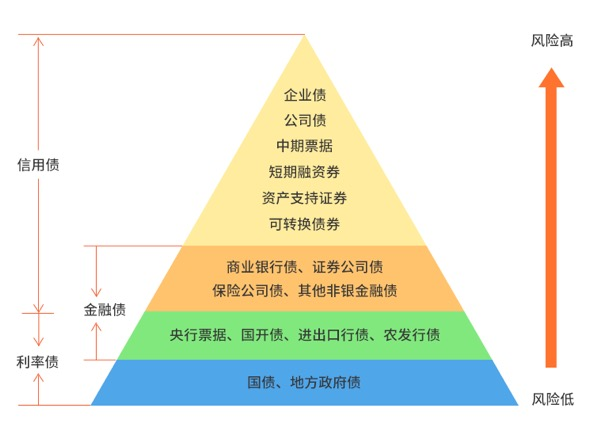

## 货币基金

首先, 我们学习了货币基金

货币基金的成分可以是现金、银行存款, 还可以加入债券等其他一些低风险的品种, 不会加入信用不好的债券, 也不会加入股票

所以, 货币基金的安全性很高.

货币基金的年化收益率在 2%~3%左右, 只适合短期内闲钱增值, 不适合作为长期投资工具

货币基金有 2 个特有的收益指标: 一个是万份收益, 指的是一万块钱放在货币基金里, 一天能赚多少钱. 这个收益是我们当天能够真实获得的收益.

另一个是 "七日年化", 是把货币基金过去七天的总收益进行年化计算, 最后得出的数据

它只是一个短期指标, 数值每天都会变化, 不可能反映基金的实际年收益, 只能作为一个参考

选择货币基金方法是: 哪个方便就用哪个

货币基金的赎回方式有 2 种:

一个是 T+0 快速赎回, 可以实现随时取现, 当天快速到账, 把钱转回银行卡的时间一般不超过两小时

不过监管规定, T+0 快速赎回的单日额度只有 1 万元. 注意: 赎回当天并没有收益!

另一个是普通取现, 需要等待 1~2 天才能到账, 但是赎回当天有收益

那怎么选择呢

如果着急把钱取出来, 不在乎少 1 天收益, 那么可以选择快速取现, 也就是 T+0 快速赎回

如果是不着急用钱, 想多赚一点收益, 那么可以选择普通取现, 晚点到账

我们还学习了货基的申购技巧

1、想要双休日赚收益, 一定要在周四 15:0 之前完成申购; 周四 15:00 后和周五申购一样, 少赚两天收益

2、想要节假日赚收益, 一定要在节前倒数两个工作日的 15:0 之前完成申购; 超过 15:0 就跟节前最后一个工作日申购一样, 少赚整个假期的收益

## 债券基金

接下来的 4 天, 我们开始学习了债券基金

我们投资债券基金, 既可以短期内"盘活"闲钱, 又可以长期持有. 而且, 长期来看, 债券基金的收益高于货币基金

债券基金赚钱的三大秘诀分别是: 票息、价格波动和加杠杆

1、票息指的是持有债券到期的利息, 这是债券基金最主要的收益来源

2、债券可以在债券市场进行交易, 而且存在价格波动

影响债券价格的因素主要有两个, 分别是发行人的信用和市场利率

市场利率和债券价格呈现反向变动的关系 当市场利率上升时, 债券价格下降; 而当市场利率下降时, 债券价格上升

我们在周二晚上还学习了市面上所有债券的类型

债券基金家族有三大成员: 政府债券、金融债券、公司债券

三者的风险依次递增, 收益水平也依次递增

利率债包括 6 个种类: 国债、地方政府债、央行票据、国开债、 进出口行债、农发行债. 除此之外的债券都属于信用债

债券的信用等级分为 AAA, AA+, AA, AA-, A+, 其中 AAA 和 AA+是高等级, AA 是中等级, AA-和 A+是低等级

只有信用债参与评级, 利率债不参与评级

如果想要了解债基的投资成分可以用"晨星网", 在"债券品种" 一栏查看基金持有哪些种类的债券, 进而可以判断这只基金的风险高低

还有一个小秘密: 债券基金的名字中可能会透露他所投资的债券期限、债券品种以及债券的信用等级

如果债券基金的名字里没有透露基金的投资方向, 我们还可以借助天天基金网, 深扒基金合同, 查看基金的投资范围

关于债券, 我们了解到这里就足够了~挑选合适债券这件事情, 就直接交给基金经理, 我们负责选择合适的债券基金就可以了

接下来, 我们来看具体的基金了

### 短债基金

首先是短债基金

短债基金所投资债券的剩余期限比较短, 一般不超过 3 年. 而且和货币基金比, 短债基金的投资范围更广泛, 可期待的收益也会更高, 收益约在 3%+

筛选短债基金, 需要用到天天基金网和"水星工具: 短债基金筛选表"

筛选指标主要有两个, 一看"近 3 年"业绩要高于 9.27%, 二看基金规模选择 5 亿~50 亿之间即可

### 长期纯债

接着, 我们学习了长期纯债基金

先来看概念 如果债券基金投资了债券以外的其他品种, 那么它就是一只偏债基金. 如果债券基金 100%投资于债券, 那么它就是一只纯债基金

长期纯债基金投资于长期债券时, 可以赚到更多票息, 从而可以达到更高的收益率, 平均年化收益率在 6%~7%左右. 我们需要和基金经理保持步调一致, 买入基金后做到长期持有

筛选长期纯债基金, 也是需要用到天天基金网和"水星工具: 长期纯债基金筛选表"

筛选指标主要有三个, 一看近 3 年的总收益率不低于 20%, 二看基金规模在 5 亿~50 亿之间, 三看基金经理任职天数不得少于 3 年

小提醒: 如果筛选结果中有定开债基金, 建议大家保留, 不建议剔除

如果你打算长期持有长期纯债基金的话, 也可以多花点精力进行择时

择时标准可以看"上海银行间同业拆放利率", 简称 Shibor

当 1 年期 Shibor 大于 3.5%时, 买入长期纯债基金; 当 1 年期 Shibor 小于或等于 3.5%时, 卖出长期纯债基金

还可以看"10 年期国债到期收益率"

当 10 年期国债到期收益率大于 3.5%时, 买入长期纯债基金; 当 10 年期国债到期收益率小于或等于 3.5%时, 卖出长期纯债基金

需要大家注意的是, Shibor 和 10 年期国债到期收益率是两个指标, 无法保证数据完全一样, 但总体来说, 两者趋势基本一致, 大家选择其中一个作为择时标准即可

而且只有在长期投资的情况下, 市场利率的变化才会产生明显的影响. 如果是短期投资, 则受到利率变化的影响很小

如果经过择时判断, 不符合买入长期纯债基金的标准, 可以先把钱投入到短债基金上面, 实现短债基金和长期纯债基金轮流赚钱

### 定开债基金

此外, 我们还学习了一种定期开放的债基

定开债基金, 全名"定期开放式基金", 存在一段时间的封闭期, 方便基金经理更好地布局, 买期限比较长的高息债

而且, 定开债基金的杠杆率最高可以达到 200%

定开债基金的封闭期通常是:3 个月、6 个月、1 年、18 个月、2 年和 3 年. 在封闭期内, 不允许投资者申购赎回

封闭期的时长一般体现在基金的名字里, 如果名字里不体现, 也可以在天天基金网的基金详情页面查看

筛选定开债基金用的是天天基金网和"水星工具: 定开债基金筛选表"

筛选指标包括: 近 3 年收益率不低于 20%; 封闭期至少 1 年; 基金规模不超过 50 亿; 基金经理任职天数不少于 3 年

### 可转债基金

最后, 我们昨晚学习了一种高收益且不具备稳健性的基金——可转债基金

它的主要成分——可转债不仅有普通债券的属性, 而且还多了"转股"的功能

可转债基金主要投资于可转债, 通常可转债的比例在 60%左右, 有些甚至可以达到 80%以上

可转债基金风险大, 远远大于普通债券基金的风险, 不过预期收益也更加优秀, 长期来看, 预期年化收益有望实现 10%~12%左右

筛选可转债基金需要用到天天基金网和"水星工具: 可转债基金筛选表"

筛选指标包括: 近 3 年收益率不小于 37%; 基金规模在 5 亿~50 亿之间; 基金经理任职天数不少于 3 年

想要择时, 需要参考可转债平均价格, 查询工具是"集思录"网站

当可转债平均价格小于 120 元时, 买入; 当可转债平均价格在 120~130 元之间时, 观望; 当可转债平均价格高于 130 元时, 卖出

债券基金的复习就结束了
