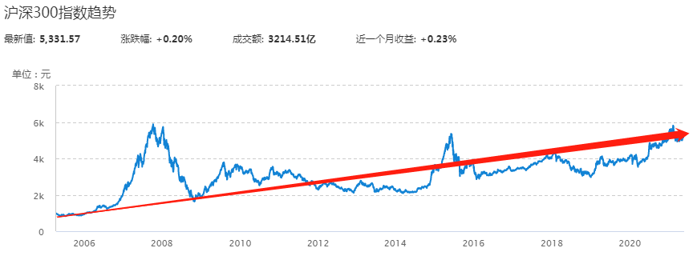
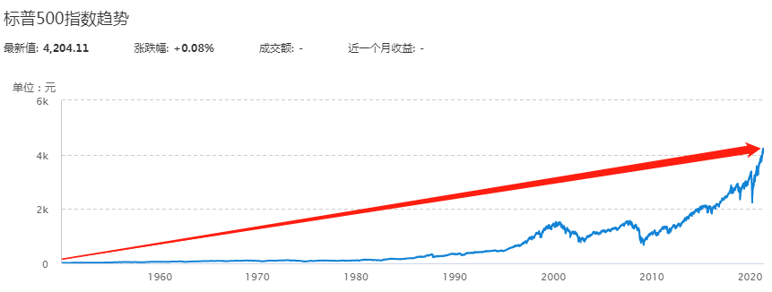
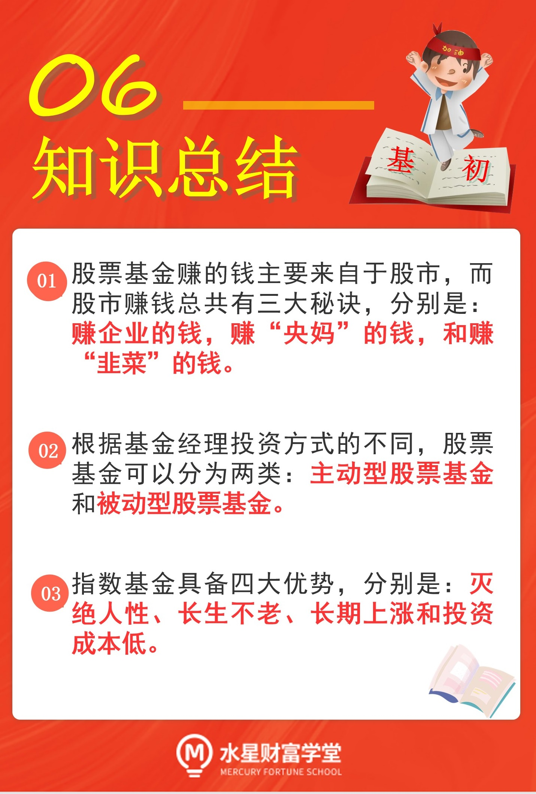

## 股票基金靠什么赚钱?

股票基金以投资股票为主, 80%的非现金资产都用于投资股票.

选择股票基金, 就是让基金经理代替我们去投资股票. 赚到钱以后, 再按照大家持有的份额比例进行分配.

和股市的个人投资者相比, 基金经理拥有专业背景, 而且背靠基金公司, 有强大的投资研究团队来支持他的工作, 所以赚钱的概率更大.

不过, 即使股票基金可以赚更多, 大家也不要忘了课程的忠告: 在做任何投资之前, 一定要先搞清楚投资品赚钱的原理.

投资股票基金的时候, 我们虽然把股票投资交给了基金经理去做, 但是起码得了解清楚, 股市的钱到底是从哪里来的; 基金经理进入股市赚钱, 到底在赚谁的钱.

简单来说, 股票基金赚钱有三大秘诀, 分别是: 赚企业的钱, 赚"央妈"的钱和赚"韭菜"的钱.

### 秘诀一, 赚企业的钱.

优秀的上市公司会每年保持稳定的盈利, 甚至规模不断发展壮大, 赚得越来越多.

基金经理选择投资这样的上市公司, 就相当于成为了公司股东. 只要公司一直赚钱, 市值越来越大, 投资者就能赚到股价上涨的钱.

而且, 很多公司赚到钱以后, 会给股东支付红利, 投资者还可以赚到企业的分红.

### 秘诀二, 赚"央妈"的钱.

"史妈"是中央银行的昵称, 也就是中国人民银行.

"央妈"掌管着国家的货币流通, 根据市场需要增加货币供应量.

货币流向哪里, 哪里的钱就会变多. 只要货币流向股市, 股市的钱变多, 参与者能分到的钱就会变多.

### 秘诀三, 赚"韭菜"的钱.

很多小伙伴都听说过, 股市里充满了"韭菜", 也就是无知的散户.

"韭菜"经常追高买入, 跌到低位再忍痛割肉, 亏得"底裤都不剩".

每一笔交易都是由买方和卖方共同完成的, 有人亏肯定就会有人赚. 在这个过程中, 钱就从"韭菜"的口袋转移到了聪明投资者的口袋.

通过以上分析, 我们就知道啦, 股票基金赚的钱主要来自于股市, 而股市赚钱总共有三大秘诀, 分别是: 赚企业的钱, 赚"央妈"的钱, 和赚"韭菜"的钱.

有了逻辑支撑, 投资才能更安心.

## "股神"力荐, 首选指数基金

根据基金经理投资方式的不同, 股票基金可以分为两类: 主动型股票基金和被动型股票基金.

主动型股票基金, 依靠的是基金经理的主观分析判断. 在基金合同约定的范围内, 基金经理可以主动决定投资哪些股票, 每只股票投资多少比例.

被动型股票基金, 也简称为指数基金, 指的是基金经理不主动选择股票, 而是直接"抄作业", 原样复制股票指数的成分.

这里出现了一个生僻词, 叫做"股票指数". 简单来说, 股票指数可以理解为一篮子股票的组合, 有专门的官方机构负责制定. 这个篮子里有什么股票, 基金经理就依葫芦画瓢, 投资相同的股票即可.

那么, 到底是主动型基金好, 还是指数基金好呢? 按照股神巴菲特的观点, 普通投资者更适合投资指数基金.

巴菲特曾经立下十年赌约, 赌注高达百万美元. 赌约的大致内容是:2008 年到 2017 年这 10 年间, 投资指数基金的收益将会高于投资主动型基金的收益. 相当于说, 基金经理主动投资十年, 还不如"照抄"股票指数赚钱多.

最后的结果是, 应战方在第九年就彻底认输了, 巴菲特完胜.

在 2008 年 5 月, 有人问巴菲特:"如果你现在只有 30 来岁, 没有什么其他经济依靠, 你攒的第一个 100 万美元将会如何投资? 麻烦你告诉我们具体投资的资产种类和配置比例."

巴菲特说:"我会把所有的钱都投资到一个低成本的追踪标准普尔 500 指数的指数基金, 然后继续努力工作."

而且, 巴菲特已经把投资指数基金写进了遗嘱. 他要求在他死后, 为了保障妻子的生活, 遗产的 10%购买短期政府债券, 另外 90%配置在低费率的标准普尔 500 指数基金上.

巴菲特所说的标准普尔 500 指数, 是一个美国市场的指数. 大家不用担心, 我们国家也有很多属于自己的指数. 虽然指数不一样, 但是指数化投资的方法都是一样的. 后续的课程会详细讲解如何投资指数基金, 我们学会方法之后, 直接利用国内的指数进行投资即可.

## 指数基金的四大优势

为什么巴菲特如此推崇指数基金呢? 原因可以总结为四个方面, 也就是指数基金的四大优势.

### 指数基金的第一个优势: 灭绝人性.

这里所说的"灭绝人性", 指的是弱化了基金经理的角色, 不再凭基金经理的个人能力赚钱.

对于主动型股票基金来说, 基金经理的能力至关重要, 直接决定了我们最终的收益水平. 能力强的基金经理可以带领我们"大口吃肉", 远远跑赢市场平均水平; 能力差的基金经理却会拉低我们的收益, 甚至连市场平均收益水平都达不到.

而且大家要注意, 即使是能力强大的基金经理, 偶尔也可能判断失误."股神"巴菲特在 2021 年的股东大会上承认, 他在 2020 年卖出苹果公司的股票, 可能是一个错误的决策."股神"都有失策的时候, 更何况广大的基金经理呢?

总而言之, 基金经理个个都是凡人, 可能能力有限, 也可能发挥失误, 在投资中会带来很大的不确定性.

反观指数基金, 就很好地避免了基金经理带来的不确定性. 不管基金经理的能力强还是弱, 只要跟着指数投资就可以了. 这就相当于, 不管学生的学习能力强还是弱, 直接抄参考答案, 最终成绩就跟个人水平没多大关系了.

### 指数基金的第二个优势: 长生不老.

对于单独一家公司而言, 难免存在破产倒闭的风险. 即使是有些看起来运营良好的公司, 可能转瞬之间就要面临破产清算. 如果大家投资股票, 就要面临上市公司倒闭的风险.

但是指数基金就不一样了. 指数的成分股会定期更换, 经过重新编制以后, 仍然符合筛选规则的股票, 留下; 不再符合筛选规则的股票, 剔除; 以前不符合筛选规则但是现在符合了的, 补充进来.

也就是说, 单个股票"死"了没关系, 总会有新的、合格的股票会被吸收到指数里来. 所以, 只要国家经济在运转, 指数就不会死.

进一步说, 只要指数基金一直跟踪这只指数, 它就可以实现"长生不老".

主动型股票基金无法做到这一点. 因为主动型股票基金的表现主要取决于基金经理的个人能力, 而基金经理总有离职、退休的那一天, 所以它一般无法长期存在下去.

### 指数基金的第三个优势: 长期上涨.

以国内著名的"沪深 300 指数"为例, 这只指数是 2005 年 4 月 8 日发布的, 截止到 2021 年 5 月 31 日, 16 年时间里上涨了 4 倍多. 也就是说, 即使你不做任何择时操作, 在 16 年前买入沪深 300 指数基金后什么也不管, 一直拿到 2021 年 5 月, 年化收益率也能达到 9.6%左右.

大家可以看文稿中的图片, 沪深 300 指数的整个历史走势虽然很曲折, 但总体呈现的是长期向上的趋势.

在发达市场中, 指数长期上涨的表现会更加明显. 比如, 巴菲特经常提到的标准普尔 500 指数, 成立几十年以来上涨了 400 多倍.

指数基金为什么会长期上涨呢? 这是因为, 只要国家经济在发展, 优秀的上市公司就能持续创造价值. 公司每年赚的钱会不断投入再生产, 从而带来更多的盈利.

巴菲特说过, 买指数基金就是买国运. 这句话不无道理. 只要国家持续发展, 指数基金就能长期上涨, 我们就能通过投资指数基金, 分享国家经济增长的红利.

### 指数基金的第四个优势: 投资成本低.

这里所说的成本, 主要是指基金自身的运作成本, 也就是基金每年都会收取的管理费和托管费.

管理费是基金公司的主要收入来源. 主动型股票基金高度依赖基金经理的能力, 需要基金公司投入很大的人力、物力成本, 所以收取的管理费会相对高一些, 通常按照每年 1.5%的费率来收取.

指数基金收取的管理费相对更低. 国内指数基金的平均管理费率在 0.69%左右, 有些老基金的管理费率甚至不到 0.5%.

也就是说, 我们拿出 1 万元投资基金, 如果投资的是主动型股票基金, 那么一年的管理费大约是 150 元; 但如果投资的是指数基金, 一年的管理费大约是 69 元, 甚至可能不到 50 元.

本金数额越大, 差距越明显; 投资时间越长, 差距也会越明显.

至于托管费, 它是基金中的托管方收取的费用. 我们投资于基金的钱, 并不是直接放在基金公司, 而是存在第三方托管方, 通常来说是某家大型银行.

主动型股票基金的托管费通常在 0.25%左右, 而指数基金的托管费率平均在 0.14%左右, 低的可以做到 0.1%.

所以说, 不管是管理费还是托管费, 指数基金收取的比率都相对更少. 这也就意味着, 投资指数基金的成本更低.

## 看清指数和指数基金的关系

今天的课程讲到了指数、指数基金. 可能有的小伙伴感觉有点"懵懵的", 还是有点分不清它们的关系.

没关系, 今晚班班加餐给大家解释明白. 今晚内容很关键哦. 能不能跟上学习节奏, 就看今晚参与的情况啦.

加餐主题: 看清指数和指数基金的关系

### 指数就是"参考答案"

大家都参加过考试吧? 有没有小可爱曾经抄过"参考答案"?

其实指数就相当于投资中的"参考答案". 基金经理投资的时候复制指数, 就相当于不主动答题了, 直接抄"参考答案".

因为投资比考试复杂多了, 未来有很大不确定性, 不可能有一套满分答案. 比方说, 基金经理去抄指数这个"参考答案", 最后可能只得 80 分.

但是没关系, 因为基金经理主动发挥的话, 可能连 80 分都拿不到. 当然也有可能拿 90 分或更高, 但总归是不怎么确定.

直接照抄指数, 基金经理不会发挥失常, 也不会发挥超常, 只求一个中规中矩的发挥, 要的就是稳. 所以我们才说, 投资指数基金获得的是市场平均收益.

那么, 这套参考答案是谁给的呢? 也就是说, 指数是谁编制的呢?

### 指数是谁编制的?

指数不可能是凭空捏造出来的, 而且呢, 也不能是名不见经传的小公司来编制. 试想一下, 如果编制指数的公司听都没听过, 基金经理还敢去复制投资, 那就相当于不知道来源的答案都敢去抄. 电线杆上插鸡毛, 好大的胆子(掸子)~

总之一句话, 编制指数的机构得有一定的公信力, 通常来说就两类: 证券交易所和指数公司. 在咱们国家, 具体就是: 上海证券交易所、深圳证券交易所、中证指数有限公司.

这些机构开发的指数, 其实就相当于各种股票的组合, 比如, 上证 50 指数, 就是从上海市场挑了 50 只股票; 再比如沪深 300 指数, 就是从上海和深圳两个市场挑了 300 只股票.

我们下一节课就会展开讲解各类指数哈. 今晚大家明白大致的意思就行.

### 指数具体是怎么编制的?

机构编制指数, 可以总结为三步: 确定样本空间; 确定选样方法和计算指数点位.

这部分知识相对比较专业一点, 班班说的细一点, 大家能一次性看懂最好, 一次看不明白也可以回头多琢磨一下, 或者再跟班班多交流哈.

为了方便理解, 班班来打个比方:

假设有一所水星高中, 每年都要选拔三名学生去参加数学竞赛. 选拔过程要如何进行呢?

第一步, 我们要确定样本空间. 也就是要先确定, 参赛者要从哪些学生里选拔.

经过确认, 高三学生参加竞赛有机会享受高考加分政策, 所以, 选拔范围就定在了全体高三学生. 这个范围就是样本空间.

有了样本空间还不够, 我们还得在高三学生里进一步筛选, 究竟要派哪几名学生去参赛.

这就来到了第二步, 确定选样方法.

派谁去参赛的问题, 可以参考学生过去的数学成绩. 学校已经开展过一次模拟考试, 所以就决定, 选择成绩排在前三名的学生去参加竞赛.

在模拟考试中, 前三名分别是: 张三, 成绩 100 分; 李四, 成绩 98 分; 王五, 成绩 95 分.

所以, 第二步, 选样方法, 就是看历史成绩.

选样方法一确定, 人选也就确定了.

接下来, 我们就来到了最后一步, 计算指数点位.

学校在派学生去参加竞赛之前, 想要了解一下这一届参赛学生的实力, 而且想和过去几届比一比, 看看这一届的实力究竟变强了, 还是变弱了.

所以, 学校就定了一个"参赛学生指数", 每年将前三名的成绩加起来, 把这个总数作为当年的"指数点位".

经计算, 张三、李四、王五的成绩加起来等于 293 分, 本年度的指数点位就是 293 点; 而上一届参赛学生的模拟考试成绩加起来等于 280 分, 上一年的指数点位就是 280 点.

本年度的点位升高, 可以看出, 这一届学生的实力变强了.

打比方结束. 下面咱们回到股票指数的编制上来

上面整个过程, 和股票指数的制定非常相似. 我们把学生替换为股票, 参赛学生指数其实就相当于股票指数.

在第一步, 确定样本空间时, 学生的范围锁定为高三学生, 股票的范围则可以锁定在某个交易市场.

在第二步, 确定选样方法时, 学生可以按照成绩高低来选, 股票则可以按照市值大小、交易量大小等等来选.

在第三步, 计算指数点位时, 可以把每名学生的成绩相加作为点位, 同样地, 也可以把每只股票的股价相加作为点位.

因为每个交易日都有股价波动; 所以, 指数点位在每个交易日都会发生变化.

不过大家要注意, 股票指数的点位计算更加复杂, 通常不是简单地把股价加起来, 而是涉及到复杂的数学运算. 对于投资而言, 我们理解指数点位的意思就足够了, 不需要钻研数学公式.

### 基金怎么复制指数?

机构编制出来的指数, 大部分都是公用的, 也就是说不只服务于一家基金公司, 各个基金公司都可以拿来复制. 相当于说, 一班要抄答案, 就给一班拿去抄; 二班要抄答案, 就给二班拿去抄, 大家共用参考答案~

举个例子: 天弘上证 50 指数 A, 就是一只指数基金."天弘"是基金公司的名字, "上证 50" 就是基金所跟踪的指数. 也就是说, 这只基金原样照抄上证 50 指数的 50 只成分股, 进行投资.

"上证 50 指数"是上海证券交易所开发的、公用的指数, 不是天弘基金一家独占的, 其他的基金公司也可以推出自己的基金, 同样追踪上证 50 指数.

比如, 华夏上证 50ETF, 还有易方达上证 50ETF, 它们分别是华夏基金和易方达基金推出的产品, 同样都是追踪上证 50 指数.

截止到 2021 年 5 月 24 日, 市面上追踪上证 50 指数的基金一共有 30 只. 再看追踪沪深 300 指数的基金, 那就更多啦, 已经达到了 155 只.

总结一下: 每一个指数, 都可以有很多家基金公司, 很多只基金去复制; 所以, 一个指数可以对应着 N 只指数基金哦.

## 总结

1. 指数就相当于投资中的"参考答案". 基金经理投资的时候复制指数, 就相当于不主动答题了, 直接抄"参考答案".
2. 编制指数的机构需要具备一定的公信力, 在中国有三家: 上海证券交易所、深圳证券交易所、 中证指数有限公司.
3. 编制一个指数分为三步: 确定样本空间; 确定选样方法和计算指数点位.
4. 每一个指数, 都可以有很多家基金公司, 很多只基金去复制; 所以, 一个指数可以对应着 N 只指数基金.
