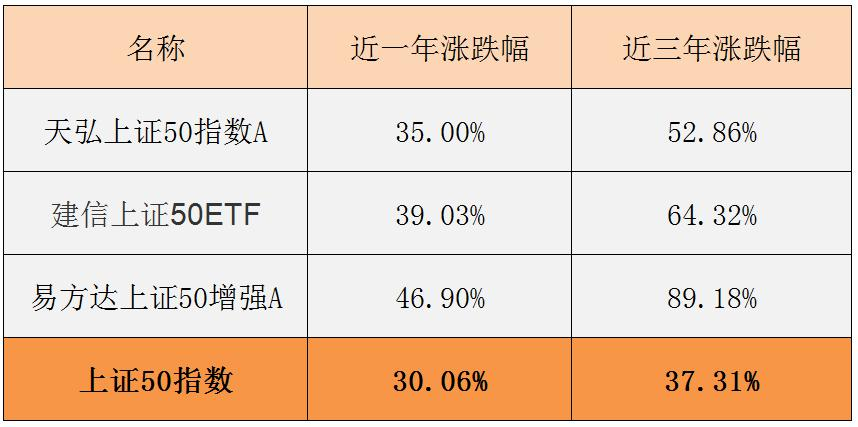
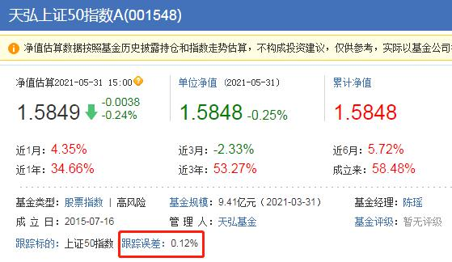
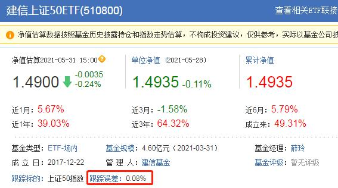

## 股票指数三大类

上一节课, 我们了解了指数基金的三大优势.

实际上, 指数家族的成员非常丰富, 不同的指数具备不同的特色, 追踪它们的基金之间也表现各异.

如果把指数加以归类, 总共可以分成三大类, 分别是: 宽基指数, 行业指数和主题指数.

### 宽基指数.

它主要是根据成分股的市值等因素进行分类和编制. 也就是说, 不管股票背后的上市公司属于什么行业, 也不管它具体做什么业务, 只要它的市值等等符合要求, 就可以把股票纳入指数的成分.

总结成一句话就是, 宽基指数覆盖的行业范围很"宽", 各行各业的上市公司股票都可以选择.

比如著名的"沪深 300"指数, 它的成分股是上海和深圳两个市场中市值大、流动性好的 300 只股票. 只要满足市值大、流动性好就可以, 对具体的行业没有要求.

### 行业指数.

它根据成分股所属的行业进行分类和编制. 也就是说, 行业指数的成分股全部来自于同一个行业.

比如"中证医药指数", 它的成分股全部属于医药行业;

再比如"中证白酒指数", 它的成分股全部属于白酒行业

### 主题指数.

它根据成分股所属的主题、概念等等进行分类和编制.

比如"中证深圳科技创新主题指数", 它的成分股全部属于"深圳科技创新"这个主题; 再比如"中证一带一路主题指数", 它的成分股全部属于"一带一路"这个主题.

在以上三大类股票指数中, 宽基指数是历史最悠久、数量最多的一个类型. 宽基指数的成分股分散在各行各业, 不但帮助投资者分散了投资风险, 且省去了分析具体行业的麻烦.

我们的初级课程将主要围绕宽基指数展开学习.

### 宽基中的大中小盘指数

根据成分股的市值大小, 宽基指数还可以进一步细分为三个类型: 大盘类、中小盘类和全市场类.

如何区分大盘、中小盘和全市场呢?

我们需要按照市值大小, 给所有股票排一下名次.

市值排在前列的股票组合起来, 就叫"大盘"; 市值排名在中下游的股票组合起来, 就叫"中小盘".

大盘类的指数, 指的是成分股市值较大的指数;

中小盘类的指数, 指的是成分股市值处于中间水平或以下的指数;

市场类的指数, 指的是大、中、小市值的股票全包含的指数.

不管是大盘类、中小盘类还是全市场类, 都有一些经典的指数, 吸引了万千投资者追随.

接下来, 我们就来见识一下, 大陆市场中名气比较高的 8 个宽基指数.

## "上证"、"深证"系列指数

在大陆市场, 通常由证券交易所下属的公司来编制指数.

大陆的证券交易所一共有两家, 一家是上海证券交易所, 简称"上交所", 旗下比较有名的是"上证"系列指数; 另一家是深圳证券交易所, 简称"深交所", 旗下此较有名的是"深证"系列指数.

下面我们就来认识一下"上证"和"深证"两个系列.

"上证"系列中, 比较有名的指数有三个.

### (1)上证指数

它的成分股是在上交所上市的全部股票, 不管市值大小, 全部纳入成分. 所以, 它是一个很典型的全市场类指数, 反映了上海市场全部股票的总体价格表现.

虽然是全市场类指数, 但是, 股民们也常把"上证指数"俗称为"大盘". 如果你听到投资者说"大盘涨到了 3000 点", 那么要知道他的意思是, 上证指数的点位到了 3000 点.

### (2)上证 180 指数

它的成分股是上海市场中规模大、流动性好的 180 只股票. 所以, 上证 180 是一个大盘类指数, 反映的是上海市场一批大市值公司的股票价格表现.

### (3)上证 50 指数

它在上证 180 指数的基础上"优中选优", 成分股是上海市场中规模大、流动性好的最具代表性的 50 只股票. 上证 50 指数也是一个大盘类指数, 反映的是上海市场最具影响力的一批龙头公司的股票价格表现.

接下来, 我们再来看一下"深证"系列, 其中比较有名的指数有两个.

### (1)深证 100 指数

它的成分股是深圳市场中市值大、流动性好的 100 只股票. 深证 100 指数是一个大盘类的指数, 反映的是一批创新型、 成长型龙头企业的股票价格表现.

### (2)创业板指

它的成分股是最具代表性的 100 家创业板上市公司的股票, 反映的是创业板股票的总体价格表现. 于创业板上市的公司大都是中小市值的公司, 所以, 创业板指是一个中小盘类的指数.

## "中证"系列指数

前面我们学习了"上证"系列指数和"深证"系列指数, 然而, 不管是"上证"还是"深证", 都带有一个明显的短板, 那就是在编制指数的时候, 两家交易所只能选择在自家上市的公司的股票, 无法选择对方市场的股票.

为了克服这个缺陷, 在 2005 年的时候, 上交所和深交所共同出资成立了一家公司: 中证指数公司, 专门负责编制指数.

中证指数公司是目前国内最大、最具有影响力的指数提供商, 旗下比较有名的是"中证"系列指数.

现如今, "中证"系列已经成了产品最多最全的一个系列. 其中, 比较知名的指数主要有三个.

### (1)沪深 300 指数

在"中证"系列指数中, 最有名的一个是沪深 300 指数. 沪深 300 指数在上海、深圳两个市场挑选股票, 选择的是市值大、流动性好的 300 只股票.

所以, 沪深 300 指数是一个大盘类的指数, 反映的是大市值公司的股票价格表现.

### (2)中证 500 指数

名气仅次于"沪深 300 指数"的, 是中证 500 指数.

中证 500 指数在选择成分时, 首先在上海、深圳两个市场的股票中, 剔除沪深 300 的成分股, 然后把总市值排在前 300 名的股票也剔除, 最后在剩下的股票中, 选择总市值排名靠前的 500 只股票.

中证 500 指数把大市值的股票都剔除了, 所以它是一个中小盘类的指数, 反映的是中小市值公司的股票价格表现.

### (3)中证 800 指数

中证 800 指数的成分股组成很简单, 就是把沪深 300 的成分股和中证 500 的成分股加起来. 300 加 500 等于 800, 很好记.

中证 800 指数是一个全市场类的指数 , 反映的是大、中、小市值公司合起来的股票价格表现.

以上就是"中证"系列的三个常见指数啦.

最后, 我们按照大盘类、中小盘类和全市场类, 对本节课出现的 8 个指数进行一下归类.

大盘类的指数包括: 上证 180 指数、 上证 50 指数、 深证 100 指数和沪深 300 指数.

中小盘类的指数包括: 创业板指和中证 500 指数.

市场类的指数包括: 上证指数和中证 800.

不管是大盘类、中小盘类还是全市场类, 它们之间没有绝对的好坏之分, 在市场环境的变化中, 它们各自都有表现优异的时候.

在后续的课程中, 我们将深入学习, 如何在合适的时机选择合适的指数.

## 跟踪同一指数的基金, 为何收益不一样?

班班以"上证 50 指数"为例, 列出三只跟踪它的基金, 我们一起来对比一下.

天弘上证 50 指数 A, 代码 001548

建信上证 50ETF, 代码 510800

易方达上证 50 增强 A, 代码 110003

这三只基金全部都是跟踪上证 50 的, 但是它们的收益情况却不一样.

以 2021 年 5 月 31 日的统计为准, 他们近一年、近三年的涨跌幅分别如下:

为了方便对比, 班班把上证 50 指数点位的涨跌幅也列出来了. 表中最后一行就是.

我们可以看到, 虽然这些基金都是跟踪上证 50 指数, 但收益率表现是不同的. 这是什么原因导致的呢?

真相有两个: 一是因为跟踪误差, 二是因为复制方式. 咱们一个一个来说哈~

### 一、跟踪误差

昨晚班班在分享中说过, 指数就相当于是投资中的"参考答案".

在"抄答案"的过程中呢, 不是人人抄出来都一样. 也就是说, 基金经理在跟踪指数做投资的时候, 偶尔会出现跟踪不准的情况, 造成误差. 这就是"跟踪误差".

为什么会跟踪不准呢? 原因其实有很多, 班班列了五个非常典型的原因.

原因一: 现金留存

一般来说, 普通指数基金为了在大额赎回时有备无患, 会留出 5%的现金资产. 也就是说, 只拿出 95%的钱去复制指数进行投资.

不考虑其他因素的情况下, 指数涨 1%, 指数基金也只能涨 0.95%; 同样, 指数跌了 1%, 指数基金只会跌 0.95%. 所以两者之间不完全一致.

原因二: 运作费用

基金运作过程中要扣除一部分运作费用, 比如管理费、托管费. 这些在前面的课程中学习过的哈. 这些费用年年都要收取, 从基金净值里扣除. 费率虽然不高, 但是也会对收益产生细微的影响.

而指数本身只是一个数学算法的结果, 不涉及运作费用的问题, 所以指数涨幅会跟指数基金收益率之间有所偏差.

原因三: 指数成分股调整

各大指数会定期更新成分股, 在重新评估之后, 不满足条件的股票会被新的股票替代. 指数成分股的替换可以根据条件直接进行, 毕竟是算法嘛, 算完了就直接纳入成分了.

但是, 指数基金看到指数调整之后, 没办法立马做出反应. 基金要通过卖出旧股票, 买入新股票, 从而跟上指数调整的步伐. 这中间有个时间差, 期间股票会有一定的价格波动, 就会造成跟踪误差.

原因四: 指数成分股停牌

股票停牌, 就是停止上市交易. 原因有很多, 比如上市公司有重大的消息要宣布, 可能造成股价剧烈波动, 所以临时性停牌; 再比如上市公司涉嫌违规, 需要接受证监会调查, 也会停牌.

股票停牌后, 指数可以把它剔除出去, 成分里就没有它了.

但是, 指数基金可没法直接把股票剔除出去, 毕竟想要剔除出去只能把股票卖掉, 而停牌阶段禁止交易, 卖又卖不掉, 只能等到停牌结束.

这种情况下, 指数早就调整完了, 指数基金可能迟迟跟不上节奏, 相当于参考答案更新了, 但是学生还没得到修改答案的机会, 只能干瞪眼, 于是就会造成跟踪误差.

原因五: 大额申购赎回

如果发生了大额申购, 也就是有投资者突然投进来一大笔钱, 那么根据规则, 他在投资后的下一个交易日就可以开始享受收益了.

但是, 基金经理昨天才看到这笔钱, 还没有来得及全部投资出去, 这笔钱就没有产生收益.

如果遇到上涨, 这种情况就会拉低收益率; 当然, 如果遇到的是下跌, 这笔没来得及投出去的钱反倒躲过了下跌, 收益率相对就提高了.

以上是大额申购. 其实大额赎回也会造成跟踪误差. 赎回价格是按照当前交易日结算价计算, 而基金经理减仓则是要按照次一交易日价格卖出, 两者存在差距.

### 二、复制方式

除了跟踪误差会造成不同指数基金之间的收益不同, 复制方式也是一个重要的原因. 而且, 复制方式不同, 造成的收益率差距会更大.

指数基金在复制指数成分做投资的时候, 分为两种复制方式: 一是完全复制型, 二是指数增强型.

完全复制型, 就是基金完全复制指数的成分做投资, 本意就是"我想跟你一模一样"~

指数增强型, 就是基金虽然也会复制指数基金的成分, 但做不到完全复制, 只能保证 80%以上的投资会复制指数, 还保留了不超过 20%的投资, 由基金经理说了算.

基金经理说了算的基金, 叫什么来着? 还有小可爱记得吗?

基金经理主动投资的, 叫主动型基金. 所以说, 指数增强型, 其实就是一大半被动, 加了一小半主动, 杂合在一起.

基金经理主动发挥的这一小部分, 就和指数涨跌关系不大了. 所以最终就导致, 指数增强型基金的收益和指数涨幅不一致.

### 三、如何选择基金?

跟踪同一指数的基金, 最终收益却不同. 两个原因咱们已经找到了哈, 一个是跟踪误差, 另一个是指数增强.

咱们现在回头看看, 开头提到的 3 只跟踪上证 50 指数的基金, 到底是因为哪个原因导致的收益不同?

一般来说, 指数增强型基金的名字里会带着"增强"两个字, 所以很容易判断, 第三只基金"易方达上证 50 增强 A"属于指数增强型, 这只基金有 20%以内的比例是基金经理主动投资, 所以它的收益跟指数的涨幅差别最大.

其次我们再来看前面两只, 天弘上证 50 指数 A, 和建信上证 50ETF. 看名字, 它们不是指数增强型, 那么收益不同的原因就是跟踪误差了.

班班搜了一下它们的跟踪误差, 给大家展示一下:

可以看到, 天弘的跟踪误差是 0.12%, 建信的跟踪误差是 0.08%. 跟踪误差导致了它们的收益率跟指数涨幅不一致, 而且因为他们俩之间跟踪误差不同, 互相之前收益率也不同.

那么, 问题来了, 我们该如何根据跟踪误差、复制方式来选择基金呢?

首先说跟踪误差. 班班的观点是: 跟踪误差越小越好.

这倒不是说跟踪误差越小就能赚得越多, 而是因为, 跟踪误差越小, 复制越靠谱. 误差大的时候, 收益可能超前, 也可能落后, 不稳定. 咱们既然是指数化投资, 就要尽可能做到和指数保持一致.

跟踪误差无法彻底消除, 只能是尽最大可能调整到最小.

在基金筛选中, 跟踪误差越小越好. 这一点在后续课程中实操筛选基金的时候, 大家就知道怎么用了哈. 今晚大家先明白跟踪误差是什么、跟踪误差越小越好, 就可以了.

其次再说复制方式. 完全复制型好, 还是指数增强型好?

其实他俩没有谁好谁坏之分. 还是要看基金经理的能力如何, 如果能力 OK, 那么添加一点主动型的效果会更好, 选择指数增强型可以赚更多.
但是如果基金经理能力不 OK, 那么主动投资反倒成了"累赘".

对于初级课的小伙伴来说, 判断基金经理的能力可能是比较困难的, 优先推荐大家选择完全复制型, 可以少操点心~

投资指数基金的初衷, 就是为了"灭绝人性", 为了摆脱基金经理主观的干扰.

如果想要靠基金经理的本事赚钱, 完全可以直接投资主动型股票基金. 咱们的基金高阶课就会讲到主动型基金的投资.

还是那句话, 咱们既然是指数化投资, 就要尽可能做到和指数保持一致.

## 总结

1. 跟踪同一指数的基金, 收益不同的原因有两个: 跟踪误差和复制方式.
2. 跟踪误差的五个典型原因分别是: 现金留存、运作费用、指数成分股调整、指数成分股停牌和大额申购赎回.
3. 完全复制型, 就是基金完全复制指数的成分做投资; 指数增强型, 就是基金只能保证 80%以上的投资会复制指数, 还保留了不超过 20%的投资, 由基金经理主动安排.
4. 选择指数基金时, 跟踪误差越小越好; 对于初级课学员来说, 推荐大家优先选择完全复制型基金.
