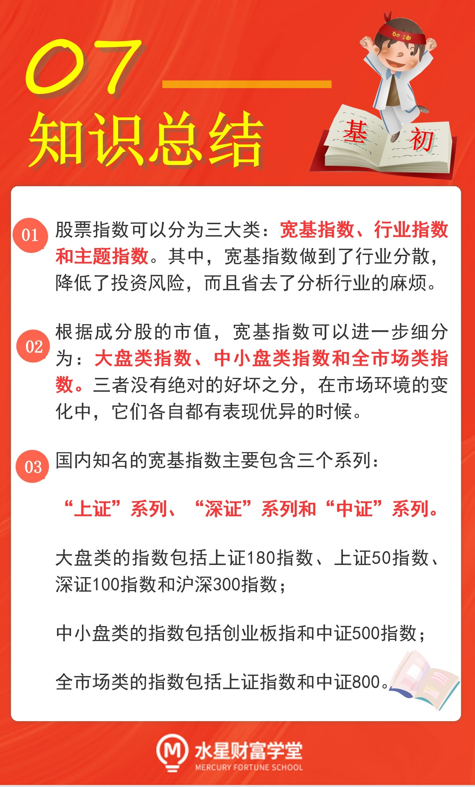
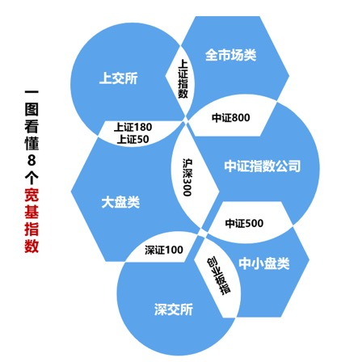

## 股票指数三大类

上一节课, 我们了解了指数基金的三大优势.

实际上, 指数家族的成员非常丰富, 不同的指数具备不同的特色, 追踪它们的基金之间也表现各异.

如果把指数加以归类, 总共可以分成三大类, 分别是: 宽基指数, 行业指数和主题指数.

### 宽基指数.

它主要是根据成分股的市值等因素进行分类和编制. 也就是说, 不管股票背后的上市公司属于什么行业, 也不管它具体做什么业务, 只要它的市值等等符合要求, 就可以把股票纳入指数的成分.

总结成一句话就是, 宽基指数覆盖的行业范围很"宽", 各行各业的上市公司股票都可以选择.

比如著名的"沪深 300"指数, 它的成分股是上海和深圳两个市场中市值大、流动性好的 300 只股票. 只要满足市值大、流动性好就可以, 对具体的行业没有要求.

### 行业指数.

它根据成分股所属的行业进行分类和编制. 也就是说, 行业指数的成分股全部来自于同一个行业.

比如"中证医药指数", 它的成分股全部属于医药行业;

再比如"中证白酒指数", 它的成分股全部属于白酒行业

### 主题指数.

它根据成分股所属的主题、概念等等进行分类和编制.

比如"中证深圳科技创新主题指数", 它的成分股全部属于"深圳科技创新"这个主题; 再比如"中证一带一路主题指数", 它的成分股全部属于"一带一路"这个主题.

在以上三大类股票指数中, 宽基指数是历史最悠久、数量最多的一个类型. 宽基指数的成分股分散在各行各业, 不但帮助投资者分散了投资风险, 且省去了分析具体行业的麻烦.

我们的初级课程将主要围绕宽基指数展开学习.

### 宽基中的大中小盘指数

根据成分股的市值大小, 宽基指数还可以进一步细分为三个类型: 大盘类、中小盘类和全市场类.

如何区分大盘、中小盘和全市场呢?

我们需要按照市值大小, 给所有股票排一下名次.

市值排在前列的股票组合起来, 就叫"大盘"; 市值排名在中下游的股票组合起来, 就叫"中小盘".

大盘类的指数, 指的是成分股市值较大的指数;

中小盘类的指数, 指的是成分股市值处于中间水平或以下的指数;

市场类的指数, 指的是大、中、小市值的股票全包含的指数.

不管是大盘类、中小盘类还是全市场类, 都有一些经典的指数, 吸引了万千投资者追随.

接下来, 我们就来见识一下, 大陆市场中名气比较高的 8 个宽基指数.

## "上证"、"深证"系列指数

在大陆市场, 通常由证券交易所下属的公司来编制指数.

大陆的证券交易所一共有两家, 一家是上海证券交易所, 简称"上交所", 旗下比较有名的是"上证"系列指数; 另一家是深圳证券交易所, 简称"深交所", 旗下此较有名的是"深证"系列指数.

下面我们就来认识一下"上证和"深证"两个系列.

"上证"系列中, 比较有名的指数有三个.

### (1)上证指数

它的成分股是在上交所上市的全部股票, 不管市值大小, 全部纳入成分. 所以, 它是一个很典型的全市场类指数, 反映了上海市场全部股票的总体价格表现.

虽然是全市场类指数, 但是, 股民们也常把"上证指数"俗称为"大盘". 如果你听到投资者说"大盘涨到了 3000 点", 那么要知道他的意思是, 上证指数的点位到了 3000 点.

### (2)上证 180 指数

它的成分股是上海市场中规模大、流动性好的 180 只股票. 所以, 上证 180 是一个大盘类指数, 反映的是上海市场一批大市值公司的股票价格表现.

### (3)上证 50 指数

它在上证 180 指数的基础上"优中选优", 成分股是上海市场中规模大、流动性好的最具代表性的 50 只股票. 上证 50 指数也是一个大盘类指数, 反映的是上海市场最具影响力的一批龙头公司的股票价格表现.

接下来, 我们再来看一下"深证"系列, 其中比较有名的指数有两个.

### (1)深证 100 指数

它的成分股是深圳市场中市值大、流动性好的 100 只股票. 深证 100 指数是一个大盘类的指数, 反映的是一批创新型、 成长型龙头企业的股票价格表现.

### (2)创业板指

它的成分股是最具代表性的 100 家创业板上市公司的股票, 反映的是创业板股票的总体价格表现. 于创业板上市的公司大都是中小市值的公司, 所以, 创业板指是一个中小盘类的指数.

## "中证"系列指数

前面我们学习了"上证"系列指数和"深证"系列指数, 然而, 不管是"上证"还是"深证", 都带有一个明显的短板, 那就是在编制指数的时候, 两家交易所只能选择在自家上市的公司的股票, 无法选择对方市场的股票.

为了克服这个缺陷, 在 2005 年的时候, 上交所和深交所共同出资成立了一家公司: 中证指数公司, 专门负责编制指数.

中证指数公司是目前国内最大、最具有影响力的指数提供商, 旗下比较有名的是"中证"系列指数.

现如今, "中证"系列已经成了产品最多最全的一个系列. 其中, 比较知名的指数主要有三个.

### (1)沪深 300 指数

在"中证"系列指数中, 最有名的一个是沪深 300 指数. 沪深 300 指数在上海、深圳两个市场挑选股票, 选择的是市值大、流动性好的 300 只股票.

所以, 沪深 300 指数是一个大盘类的指数, 反映的是大市值公司的股票价格表现.

### (2)中证 500 指数

名气仅次于"沪深 300 指数"的, 是中证 500 指数.

中证 500 指数在选择成分时, 首先在上海、深圳两个市场的股票中, 剔除沪深 300 的成分股, 然后把总市值排在前 300 名的股票也剔除, 最后在剩下的股票中, 选择总市值排名靠前的 500 只股票.

中证 500 指数把大市值的股票都剔除了, 所以它是一个中小盘类的指数, 反映的是中小市值公司的股票价格表现.

### (3)中证 800 指数

中证 800 指数的成分股组成很简单, 就是把沪深 300 的成分股和中证 500 的成分股加起来. 300 加 500 等于 800, 很好记.

中证 800 指数是一个全市场类的指数 , 反映的是大、中、小市值公司合起来的股票价格表现.

以上就是"中证"系列的三个常见指数啦.

最后, 我们按照大盘类、中小盘类和全市场类, 对本节课出现的 8 个指数进行一下归类.

大盘类的指数包括: 上证 180 指数、 上证 50 指数、 深证 100 指数和沪深 300 指数.

中小盘类的指数包括: 创业板指和中证 500 指数.

市场类的指数包括: 上证指数和中证 800.

不管是大盘类、中小盘类还是全市场类, 它们之间没有绝对的好坏之分, 在市场环境的变化中, 它们各自都有表现优异的时候.

在后续的课程中, 我们将深入学习, 如何在合适的时机选择合适的指数.

## 总结

