上一节课, 我们学习了 8 个常见的宽基指数, 它们涵盖了大盘类、中小盘类以及全市场类. 作为基金初级投资者, 我们有这 8 个指数就完全足够用啦.

不过指数本身不是投资品, 不能直接进行投资. 真正能投资的是追踪指数的基金. 每一只指数的背后, 可以有很多只基金追踪它, 复制它.

那么, 在这么多基金中, 如何决定最终投资哪一只呢? 本节课我们就来解决这个问题

## 筛选指数基分为三步.

### 第一步, 看基金规模.

指数基金的规模需要一个下限. 基金规模太小的话, 会面临清盘的风险.

所谓的清盘, 可以理解为, 这只基金不再搞下去了, 市面买不到了, 之前买过的会退钱. 清盘浪费大家的投资精力, 也耽误大家选择更好的投资机会.

通常来说, 基金规模不小于 1 亿元时, 基金清盘的概率比较小.

因为追踪宽基指数的基金太多啦, 所以, 我们可以把标准定高一点, 要求基金规模不少于 5 亿元. 这样可以让我们的筛选过程更精简.

那么, 指数基金的规模需不需要一个上限呢? 答案是不需要.

指数基金复制指数的成分进行投资, 不管募集到多少钱, 都可以按比例分配到指数的成分股上面. 所以说, 规模过大对我们投资指数基金没有负面影响.

而且, 规模大代表大家都看好, 都愿意把钱投资到这只基金上面. 这样的基金交易者多, 流动性好, 不怕买不进来, 也不怕卖不出去.

总结一下: 我们对指数基金规模的要求是不少于 5 亿元, 而且基金规模越大越好.

### 第二步, 看跟踪误差.

指数基金的原理就是复制指数的成分, 尽可能保持和指数走势一样. 所以, 判断一只指数基金好不好, 重点不是看它业绩好不好, 而是看它对指数的跟踪误差大不大.

跟踪误差越小, 说明复制越精确; 跟踪误差越大, 说明复制越糟糕.

我们在筛选的时候, 要尽可能选跟踪误差小的基金.

### 第三步, 剔除"指数增强型基金".

指数基金可以分为完全复制型和指数增强型.

完全复制型, 指的是基金完全复制指数的成分, 依葫芦画瓢进行投资就行了.

指数增强型, 指的是基金 80%l 以上的投资复制指数, 还留出不到 20%的比例, 留给基经理主动发挥.

指数增强型基金不满足于和指数的涨幅一致, 而是想超越指数的涨幅, 获得更多收益.

但是实际上, 我们学习过, 基经理的水平良莠不齐, 有些基金经理的能力较差, 增强之后的收益还不如完全复制的收益. 而且, 能力强大的基经理也未必长期发挥稳定, 保不齐有发挥失误的时候. 为了让投资更纯粹, 更省心, 建议大家优先选择完全复制型.

## 实操筛选(上) : 巧用指数官网

学习了挑选指数基金的三个步骤以后, 我们就要开始实操演练啦.

我们以上证 50 指数为例, 来看一下挑选过程究竟如何操作.

我们要用到的工具有两个, 一个是中证指数有限公司的官网, 另一个是天天基金网.

[中证指数](http://www.csindex.com.cn/)

[天天基金网](https://fund.eastmoney.com/)

首先需要大家复制中证指数有限公司的网址, 在电脑浏览器中打开, 也可以在搜索引擎中直接搜索"中证指数有限公司", 点击进入.

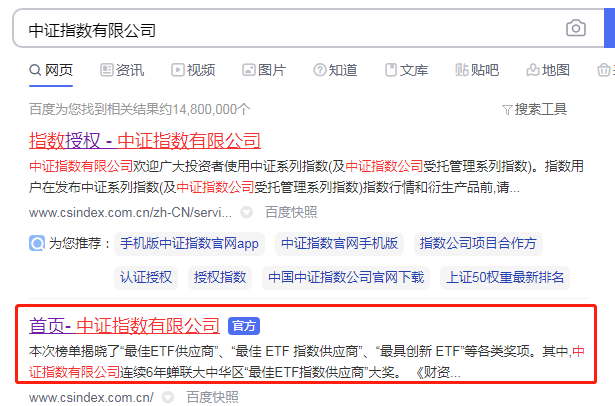

在中证指数有限公司的官网首页左上角, 有一个搜索框, 在此输入"上证 50", 点击搜索.

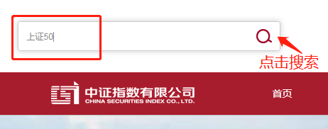

在搜索结果中, 找到"上证 50", 点击进入.

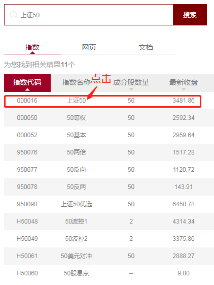

我们可以看到, 跳转页面中有. 上证 50 的指数简介、资料下载和相关产品. 我们的目的是筛选基金, 所以直接看"相关产品"就好. 在"相关产品"这一栏, 点击"更多"就可以看到所有追踪上证 50 的基金啦.

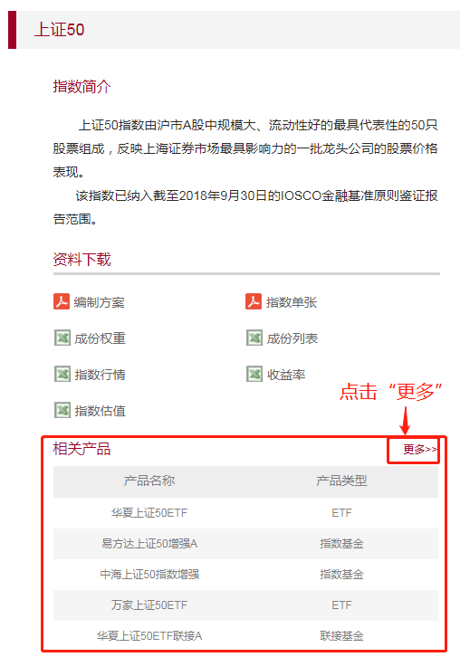

我们可以看到, "相关产品"有几十只, 占了满满一屏幕. 不要紧张, 在这里, 我们只需要用"基金规模"这一个指标, 就可以排除绝大部分基金啦.

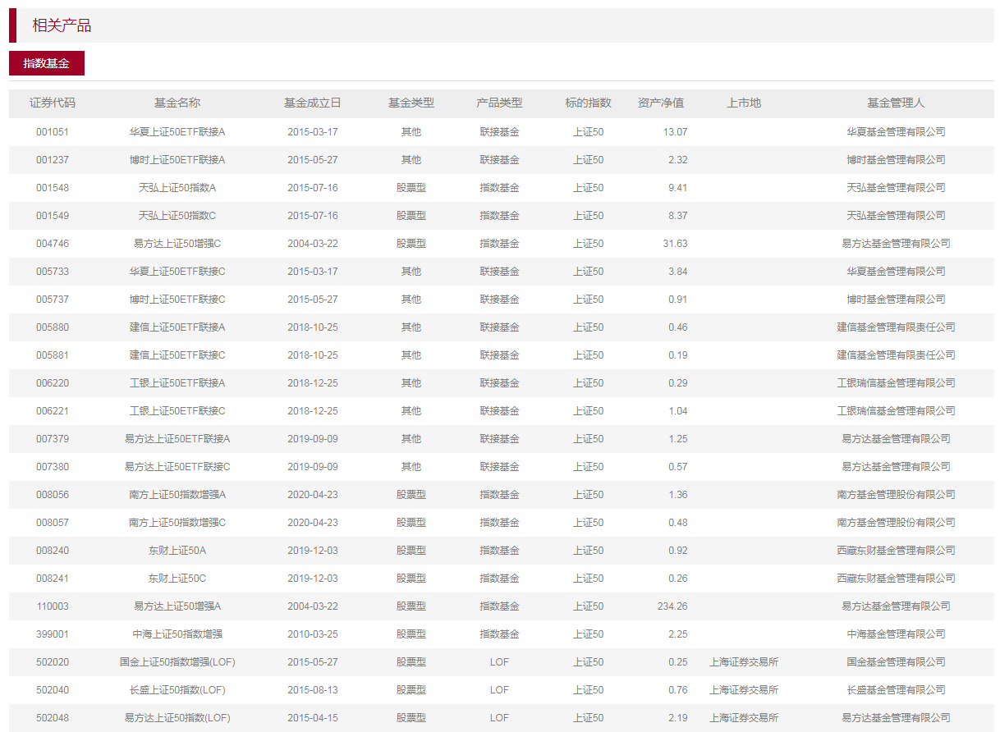

三步精选指数基金的第一步, 看基金规模, 不能小于 5 亿元. 网页中的"资产净值", 代表的就是基金规模. 我们只需要保留资产净值不小于 5 亿元的就好啦.

水星财富学堂为大家准备了专属工具: 指数基金筛选表. 大家可以联系自己的训练营班班获取.

<a href="/基金筛选表-基金初级专用.xlsx" target="_blank">基金筛选表-基金初级专用.xlsx</a>

我们首先录入自己的统计时间, 方便在筛选结束后进行复查.

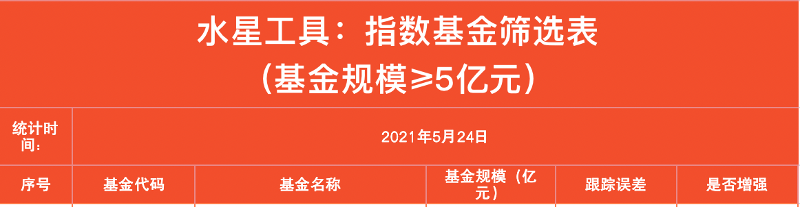

接下来, 我们把规模不小于 5 亿元的基金代码、名称和规 模, 全部统计在表格里.

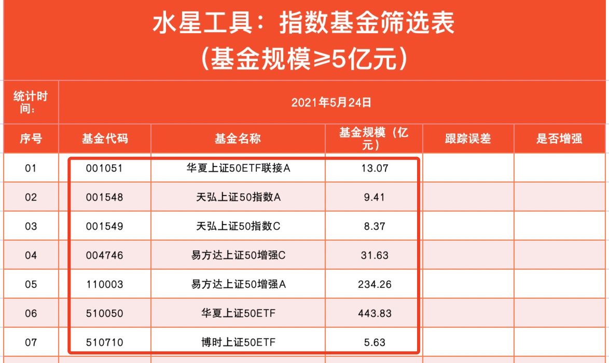

经过第一步筛选, 我们就从几十只基金当中, 选出了 7 只符合规模要求的基金.

## 实操筛选(下) : 水星专属筛选表

三步精选指数基金的第二步: 看跟踪误差. 这一步需要我们切换工具, 进入天天基金网.

在天天基金网中, 我们需要逐一搜索 7 只基金. 以第一只基金为例, 华夏上证 50ETF 联接 A , 代码 001051 , 我们在天天基金网主页的搜索框中搜索它的名字或代码, 并且点击.

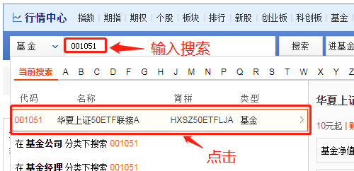

可以看到, 这只基金的跟踪误差是 0.07%. 剩余几只基金也是用上述方法查询跟踪误差.

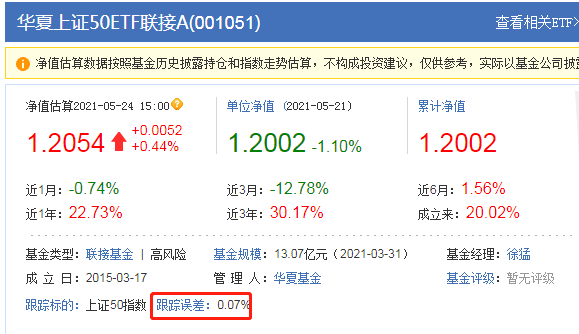

我们把每一只基金的跟踪误差都录入到表格之中, 方便进一步筛选

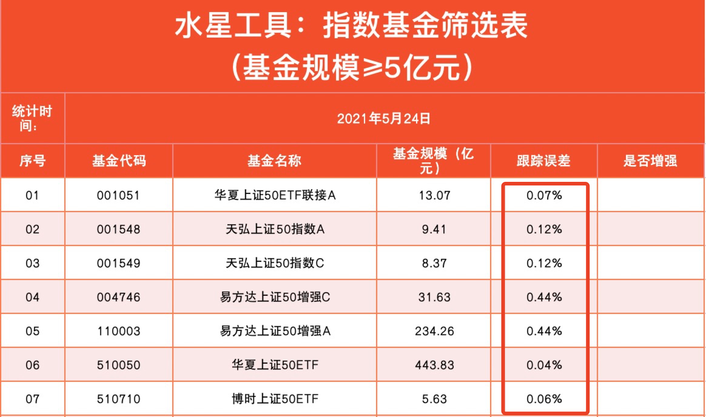

三步精选指数基金的最后一步: 排除指数增强型基金". 排除方法很简单, 指数增强型基金的名字里会带有"增强"两个字, 我们一看基金名字就知道了.

在"是否增强"这一列, 我们根据实际情况填写是或否.

注意, 我们要选择的是不增强的基金, 所以, 结果为"否"的基金才是我们要选择的哦. 经过筛选, 最后符合标准的还剩五只基金.

这些基金不需要全部投资. 一般来说, 追踪同一只指数的基金, 选择一只就可以了. 所以, 我们只需要挑选其中一只最满意的进行投资即可.

在这五只基金里面, 我们挑选规模相对更大、跟踪误差相对更小的那一只即可. 综合比较下来, "华夏上证 50ETF"是最理想的选择. 因为它的规模最大, 达到了 443.83 亿元, 跟踪误差最小, 只贿 0.04%.

在此提醒, 课程中展示的所有基金, 均不构成投资建议. 在不同的时间进行筛选, 结果也会千差万别. 大家重点学习方法, 亲自按照步骤筛选一遍, 才能选出适合投资的基金哦.

## 补充:"深证"有点不一样

经过前面两个小节的学习, 我们了解了如何筛选追踪"上证 50 指数的基金.

如果要筛选追踪其他指数的基金, 方法也是类似的. 比如, 筛选一只追踪"沪深 300 指数"的基金, 只要打开中证指数有限公司的官网, 搜索"沪深 300"就可以啦, 接下来的流程完全一样, 这里就不赘述了.

不过大家要注意, 中证指数有限公司的官网有一个缺陷, 那就是只能查到"上证"系列指数和"中证"系列指数, 没有包含"深证"系列指数.

在上节课学习的 8 个宽基指数中, 有两个指数属于"深证"列, 分别是大盘类的"深证 100 指数"和中小盘类的"创业板指".

这两个指数需要特殊对待. 追踪它们的基金就不能用中证指数有限公司的网站来筛选了, 而是要用到"国证指数网".

网址已经附在了文稿中, 大家可以复制网址, 在电脑浏览器中打开, 也可以通过搜索引擎搜索"国证指数网首页", 点击进入.

[国证指数网](http://www.cnindex.com.cn/)

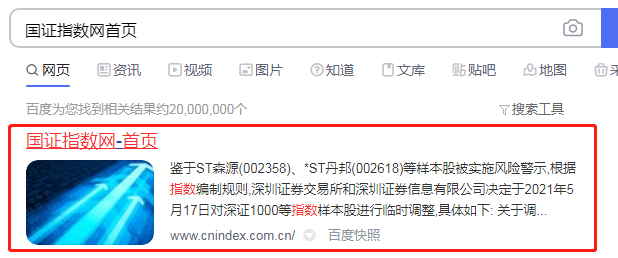

在国证指数网首页的右上角, 有一个搜索框, 在此输入"创业板指", 在弹出的下拉菜单中选择"创业板指"四个字, 点击进入下一步.

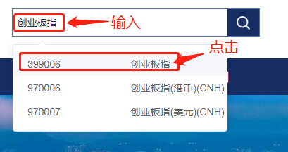

我们可以看到, 在跳转后的页面中, 出现了四个菜单, 分别是: 指数表现、历史行情、样本行情、相关产品. 我们是来寻找基金产品的, 所以直接点击"相关产品"就好啦

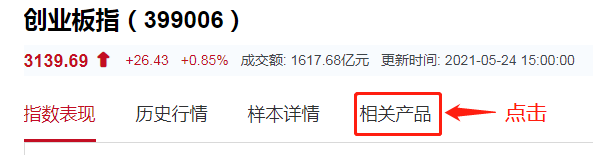

点击之后, 就可以看到追踪创业板指的所有基金啦. 不仅可以看到基金的名字、代码, 而且可以看到净值规模. 我们按照净值规模不小于 5 亿元的要求, 初步进行筛选.

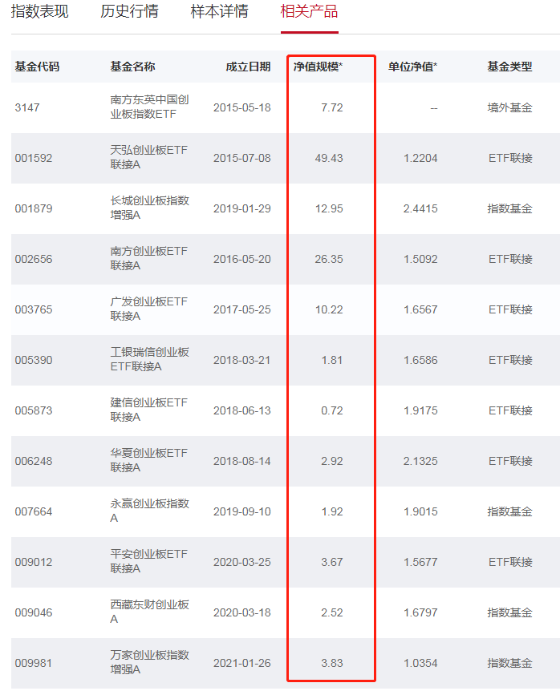

接下来, 我们把规模符合要求的基金代码、名字和规模录入到水星专属表格中. 剩下的步骤跟前面两小节完全一样, 我们就不往下进行了.

总结一下

用"中证指数有限公司官网搜索的指数是"上证"系列和"中证"系列, 具体包括: 上证 50、上证 180、 上证指数、沪深 300、中证 500 和中证 800.

用"国证指数网搜索的指数是"深证"系列, 具体包括两个: 深证 100 和创业板指.

## 总结

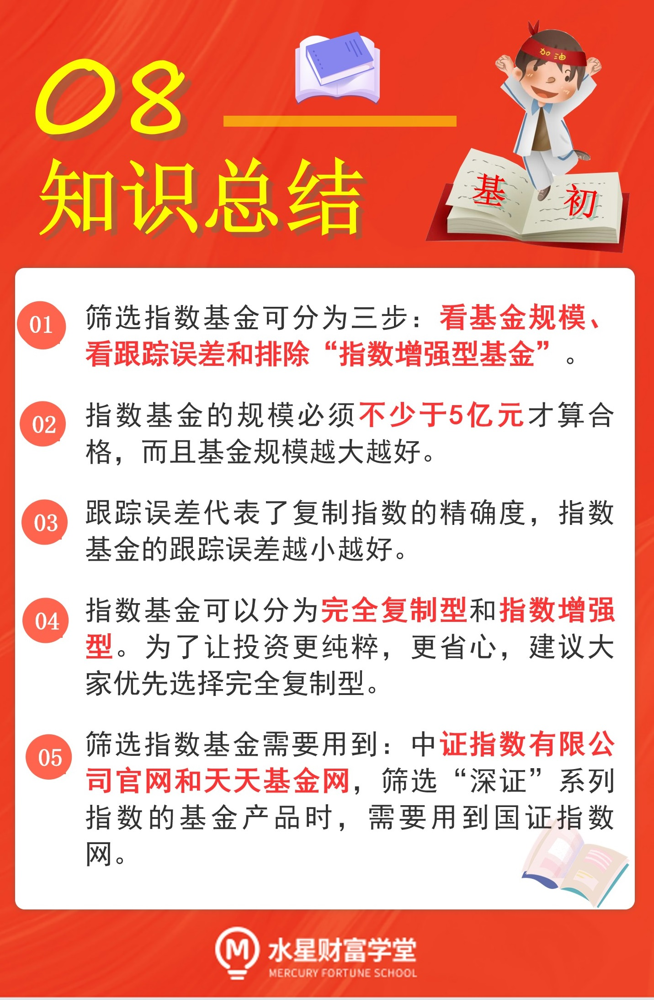
