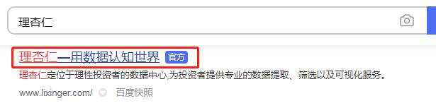
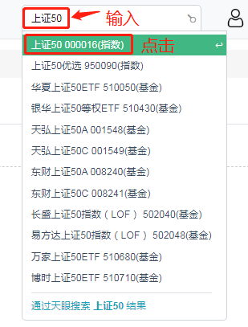
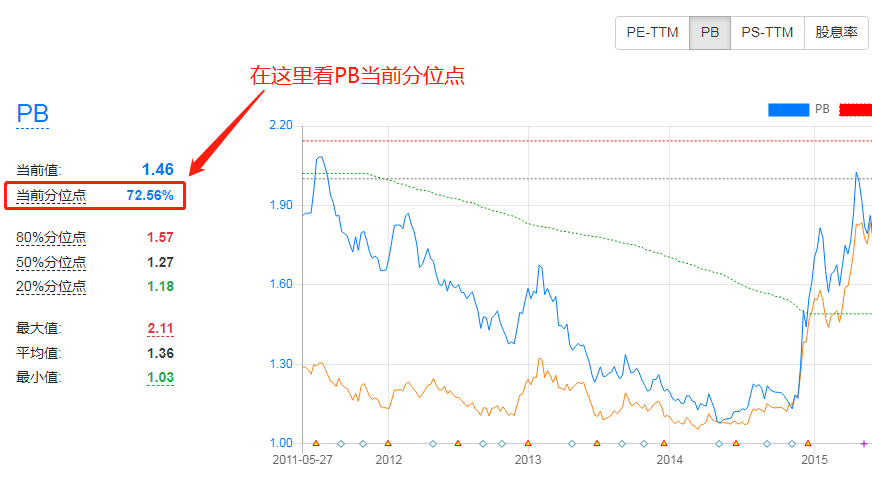
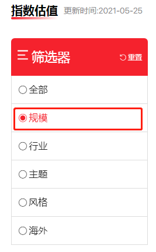
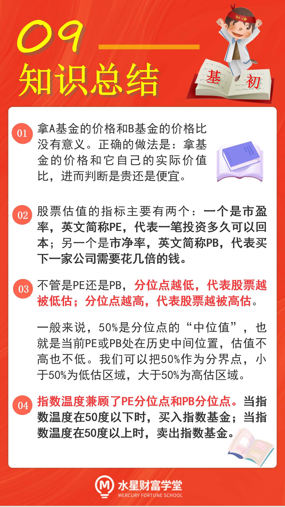

## 交易的灵魂: 估值

这一节课学习如何选择指数基的买卖时机, 实现低买卖, 轻松赚差价.

不少新手在买基金的时候, 喜欢挑选买价最低的. 比如, A 基金的净值为 1, B 基金的净值为 2, 两个一比较会发现, 买 A 基金花的钱更少, 所以 A 基金更便宜, 投资就要买便宜的, 所以就买 A 基金. 但是, 这种做法是完全错误的!

我们来打个比方: 苹果 20 元一斤, 进口车厘子 30 元一斤. 如果单纯比价格, 显然是 20 元一斤的苹果更便宜, 但是, 只要你有点生活经验就会知道, 判断贵和便宜的时候, 不是这样来比较的.

一般情况下, 苹果的价格大约是 6 元一斤, 卖 20 元一斤已经算是超高价格了. 而进口车厘子的价格大约是 60 元一斤, 卖 30 元一斤相当于打了对折. 所以, 在这个例子中, 苹果的价格贵, 车厘子的价格便宜.

我们在投资的时候, 也是遵循一样的道理. 拿 A 基金的价格和 B 基金的价格比, 就像拿苹果的价格和进口车厘子的价格比, 完全没有意义.

正确的做法是, 基金的价格和它自己的实际价值比, 进而判断是贵还是便宜.

这就涉及到了基金投资的一项核心技能: 估值.

估值, 也就是评估一个东西的实际价值.

比如我们在买苹果的时候, 心里大概会评估一下, 一斤苹果的合理价格在 6 元左右. 这个估值相当于我们心里的一杆秤, 如果价格高于估值, 我们就选择少买或者不买; 如果价格低于估值, 我们就多买一些.

投资也遵循同样的逻辑. 在买卖基金之前, 我们也需要先进行估值, 判断基金目前的价格到底是贵的还是便宜的.

如果基金价格低于估值, 说明它现在被投资者低估了, 这时我们应该果断买入, 趁着低价多拿一些筹码 , 坐等价格反弹.

如果基金价格高于估值, 说明它现在被投资者高估了, 也就是俗称的"价格虚高", 这时我们应该果断卖出, 落袋为安, 躲避下跌的风险.

"估值"是交易的灵魂, 通过估值判断买卖时机, 进而实现低买高卖赚差价.

## 估值(上) : 市盈率、市净率、分位点

指数基金的本质是, 复制股票指数的成分股进行投资, 也就是投资了一篮子股票. 所以, 判断指数基金贵不贵, 关键是看这一篮子股票贵不贵.

股票估值的指标主要有两个:

一个是市盈率, 英文简称 PE;

另一个是市净率, 英文简称 PB.

### (1)市盈率"PE"

市盈率=市值/净利润

假设 A 上市公司的市值是 100 亿元, 每年创造 20 亿元的净利润, 那么, 它的股票的 PE 就是 100 除以 20, 也就等于 5; 如果你是个土豪, 花 100 亿把 A 公司收购了, 那么, 按照它每年能为你创造 20 亿元的净利润来算, 只需要 5 年的时间, 你就可以回本啦.

所以, 大家可以把 PE 理解为: 投资收回成本所需要的时间.

PE 当然是越小越好, 因为 PE 越小, 一笔投资收回成本的时间就越短.

### (2)市净率"PB"

市净率=市值/净资产

假设 A 上市公司的市值是 100 亿元, 公司坐拥 50 亿元净资产, 那么, 它的 PB 就是 100 除以 50 , 也就是 2.

这里解释一下净资产的概念: 净资产就相当于, 假设公司现在破产, 把该还的债都还了以后, 剩下的各种资产都卖掉, 桌子椅子、锅碗瓢盆、房子机器全部卖掉, 后能收回多少钱.

如果你是个土豪, 花 100 亿把 A 公司收购了, 那么, 按照它目前净资产 50 亿来算, 相当于你出了两倍的价格买这家公司.

所以, 大家可以把 PB 理解为: 需要花几倍的钱买下一家公司.

PB 也是越小越好, 因为 PB 越小, 买相同的资产所花的钱越少.

总结一下:

PE 是市盈率, PB 是市净率, 而且 PE 和 PB 都是越小越好.

但是, 仅仅知道"越小越好"还不够. 举个例子, 假如我们查到某只股票的 PE 是 20 , 那么, 20 到底算大还是小呢? 单看一个孤零零的数字, 无对比, 我们也没办法知道这算高估还是低估.

所以, 必须拿 20 和历史上的 PE 值比一比, 看看 20 到底是高还是低了. 和历史表现对比就产生了一个指标, 叫做"分位点".

### 分位点

PE 的分位点表示在历史上有多少比例的 PE 低于当前的 PE. 也就是说, 把历史上每天的 PE 按照从小到大排个序, 然后看看当前的 PE 处在什么位置.

比如, PE 的分位点是 10%, 就说明, 历史上只有 10%的 PE 比现在的值更低. 历史上已经没多少比当前 PE 更低的时候了, 表明现在的 PE 已经足够低了.

再比如, PE 的分位点是 90%, 就说明, 历史上有 90%的 PE 比现在的值更低. 历史上随便拿几个 PE 来看, 都比当前的 PE 要低, 表明现在的 PE 已经非常高了.

以上分析的是 PE 的分位点, 其实 PB 的分位点也一样. 不管是 PE 还是 PB , 分位点越低, 代表股票越被低估; 分位点越高, 代表股票越被高估.

一般来说, 50%是分位点的"中位值", 也就是当前 PE 或 PB 处在历史中间位置, 估值不高也不低. 我们可以把 50%作为分界点, 小于 50%为低估区域, 大于 50%为高估区域.

好啦, PE 估值和 PB 估值终于有了明确的判断标准, 那就是看分位点.

不过, 大家要知道, 以上是针对单一股票进行估值的.

我们要投资的可是指数基金, 是一篮子股票. 难道我们要把这一篮子股票挨个进行估值吗? 这个工作量可太大了.

大家放心, 投资指数基金肯定没有那么麻烦.

下一小节, 我们就把 PE、PB 两个指标合二为一 , 浓缩成一个指数估值的指标. 只需要看一个指标 , 就能够判断指数基金的买卖时机.

## 估值(下) : 指数温度

投资指数基金, 不用看每一只成分股的估值, 只需要看指数的估值即可, 也就是看指数的 PE 分位点和 PB 分位点. 它们代表了所有成分股平均的估值水平.

指数被低估了, 我们就买入追踪它的指数基金; 指数被高估了, 我们就卖出追踪它的指数基金.

那么, 指数的 PE 分位点和 PB 分位点, 到底应该以哪个为准呢?

简单来说, PE、PB 两种估值都有用, 但也都有一定的局限.

就拿 PE 来说, 它主要适用于长期盈利稳定的行业. 咱们前面提到过, PE 代表的是投资多久可以回本, 假设一家公司盈利不稳定, 今年大赚, 明年大亏, 那么我们很难判断究竟多久才可以回本. 对于长期盈利不稳定的行业, PE 估值就失效了.

另一个指标 PB , 主要适用于周期性行业和重资产行业. PB 代表的是需要花几倍的钱买下一家公司. 对于一些轻资产的新兴行业, 比如互联网行业, 公司的净资产可能只有几台电脑, 但是却可以凭借很少的净资产创造巨大的利润. 这时候就不能因为 PB 太高就判断人家贵了.

总而言之, 不管是 PE 还是 PB , 都只能应用在一部分行业上. 然而, 我们要投资的可是宽基指数哦. 宽基指数的成分股来自各行各业, 只看 PE 分位点不行, 只看 PB 分位点也不行.

这时候, 我们就需要一个兼顾 PE 分位点和 PB 分位点的指标, 来作为我们的终极估值指标啦.

这个终极估值指标就是: 指数温度.

先来解释一下"温度"的概念 , 它是分位点的通俗说法.

比如 PE 分位点是 30%, 我们就说 PE 温度是 30 度. 同理, PB 分位点是 50% , 我们就说 PB 温度是 50 度.

指数温度, 就是把 PE 温度和 PB 温度加起来, 再除以二, 就行啦.

以 PE 温度 30 度、PB 温度 50 度为例 , 指数温度就是 30 加 50 , 再除以 2, 也就是 40 度.

指数温度兼顾了 PE 分位点和 PB 分位点. 当指数温度在 50 度以下时, 买入指数基金; 当指数温度在 50 度以上时, 卖出指数基金.

## 实操: 查询、计算指数温度

查询、计算指数温度要用到的工具是"理杏仁". 文稿中为大家展示了网址, 大家可以复制网址, 在电脑浏览器中直接打开.

[理杏仁](http://www.lixinger.com/)

也可以在搜索引擎中搜索"理杏仁"三个字, 注意不要输入错字哦, "理"是理解的理, "杏仁"是作为食物的杏仁.

以上证 50 为例, 我们来实操查询、计算指数温度.

第一步, 在理杏仁首页的搜索框输入"上证 50", 会自动弹出下拉菜单, 我们在菜单中选择上证 50 指数, 点击它, 跳转到下一个界面.

第二步, 在跳转后的界面中, 点击"PE-TTM", 大家可以对照文稿中图片中指示的位置. PE-TTM 就是我们要找的 PE , 也就是市盈率; 然后在右侧点击"10 年"

之所以选择 10 年, 是因为我国股市大约 7 年一轮牛熊更替, 选择 10 年足以覆盖一轮牛熊周期, 得出的结果更能反映指数的真实估值水平.

第三步, 直接在页面左侧查看 PE 当前分位点. 可以看到, PE 当前分位点为 92.88%. 我们把这个数字记在小本本上, 方便一会儿拿来用.

第四步, 在 PE-TTM 按钮的右侧有 PB 按钮, 它就是我们要查询的市净率, 我们点击它.

第五步, 直接在页面右侧查看 PB 当前分位点. 可以看到, PB 当前分位点为 72.56%. 我们把这个数字也记在小本本上.

第六步, 计算指数温度. 前面已经查到了, PE 当前分位为 92.88% , PB 当前分位点为 72.56%. 我们按照指数温度的计算方法, 把两个数加起来除以 2, 结果是 82.72%.

也就是说, 指数温度为 82.72 度, 远远超过 50 度, 是一个非常高的温度, 说明当前上证 50 指数的估值过高, 不适买入追踪它的基金.

在此提醒, 分位点数值在每个交易日都会发生变化, 课程中的实操数据难免存在滞后的情况, 大家不要直接照抄课程中的估值结果, 而是要亲自实操, 得出指数最新的估值.

我们学习过的 8 大指数一上证指数、 上证 50、. 上证 180、深证 100、 中小板指、沪深 300、 中证 500 和中证 800 全部都可以用这个方法进行估值哦.

以上就是用理杏仁查询、计算指数温度的整个流程啦.

除了理杏仁以外, 大家还可以选择其他一些估值工具.

比如"韭圈儿"指数估值

[韭圈儿](http://www.funddb.cn/site/index)

在韭圈儿的指数估值的页面中, 有一个筛选器, 我们选择其中的"规模"选项即可, 我们要找的宽基指数就藏在这个选项里.

## 总结

