## 交易的灵魂: 估值

这一节课学习如何选择指数基金的买卖时机, 实现低买高卖, 轻松赚差价.

不少新手在买基金的时候, 喜欢挑选买价最低的. 比如, A 基金的净值为 1, B 基金的净值为 2, 两个一比较会发现, 买 A 基金花的钱更少, 所以 A 基金更便宜, 投资就要买便宜的, 所以就买 A 基金. 但是, 这种做法是完全错误的!

我们来打个比方: 苹果 20 元一斤, 进口车厘子 30 元一斤. 如果单纯比价格, 显然是 20 元一斤的苹果更便宜, 但是, 只要你有点生活经验就会知道, 判断贵和便宜的时候, 不是这样来比较的.

一般情况下, 苹果的价格大约是 6 元一斤, 卖 20 元一斤已经算是超高价格了. 而进口车厘子的价格大约是 60 元一斤, 卖 30 元一斤相当于打了对折. 所以, 在这个例子中, 苹果的价格贵, 车厘子的价格便宜.

我们在投资的时候, 也是遵循一样的道理. 拿 A 基金的价格和 B 基金的价格比, 就像拿苹果的价格和进口车厘子的价格比, 完全没有意义.

正确的做法是, 基金的价格和它自己的实际价值比, 进而判断是贵还是便宜.

这就涉及到了基金投资的一项核心技能: 估值.

估值, 也就是评估一个东西的实际价值.

比如我们在买苹果的时候, 心里大概会评估一下, 一斤苹果的合理价格在 6 元左右. 这个估值相当于我们心里的一杆秤, 如果价格高于估值, 我们就选择少买或者不买; 如果价格低于估值, 我们就多买一些.

投资也遵循同样的逻辑. 在买卖基金之前, 我们也需要先进行估值, 判断基金目前的价格到底是贵的还是便宜的.

如果基金价格低于估值, 说明它现在被投资者低估了, 这时我们应该果断买入, 趁着低价多拿一些筹码 , 坐等价格反弹.

如果基金价格高于估值, 说明它现在被投资者高估了, 也就是俗称的"价格虚高", 这时我们应该果断卖出, 落袋为安, 躲避下跌的风险.

"估值"是交易的灵魂, 通过估值判断买卖时机, 进而实现低买高卖赚差价.

## 估值(上) : 市盈率、市净率、分位点

指数基金的本质是, 复制股票指数的成分股进行投资, 也就是投资了一篮子股票. 所以, 判断指数基金贵不贵, 关键是看这一篮子股票贵不贵.

股票估值的指标主要有两个:

一个是市盈率, 英文简称 PE;

另一个是市净率, 英文简称 PB.

### (1)市盈率"PE"

市盈率=市值/净利润

假设 A 上市公司的市值是 100 亿元, 每年创造 20 亿元的净利润, 那么, 它的股票的 PE 就是 100 除以 20, 也就等于 5; 如果你是个土豪, 花 100 亿把 A 公司收购了, 那么, 按照它每年能为你创造 20 亿元的净利润来算, 只需要 5 年的时间, 你就可以回本啦.

所以, 大家可以把 PE 理解为: 投资收回成本所需要的时间.

PE 当然是越小越好, 因为 PE 越小, 一笔投资收回成本的时间就越短.

### (2)市净率"PB"

市净率=市值/净资产

假设 A 上市公司的市值是 100 亿元, 公司坐拥 50 亿元净资产, 那么, 它的 PB 就是 100 除以 50 , 也就是 2.

这里解释一下净资产的概念: 净资产就相当于, 假设公司现在破产, 把该还的债都还了以后, 剩下的各种资产都卖掉, 桌子椅子、锅碗瓢盆、房子机器全部卖掉, 后能收回多少钱.

如果你是个土豪, 花 100 亿把 A 公司收购了, 那么, 按照它目前净资产 50 亿来算, 相当于你出了两倍的价格买这家公司.

所以, 大家可以把 PB 理解为: 需要花几倍的钱买下一家公司.

PB 也是越小越好, 因为 PB 越小, 买相同的资产所花的钱越少.

总结一下:

PE 是市盈率, PB 是市净率, 而且 PE 和 PB 都是越小越好.

但是, 仅仅知道"越小越好"还不够. 举个例子, 假如我们查到某只股票的 PE 是 20 , 那么, 20 到底算大还是小呢? 单看一个孤零零的数字, 无法对比, 我们也没办法知道这算高估还是低估.

所以, 必须拿 20 和历史上的 PE 值比一比, 看看 20 到底是高还是低了. 和历史表现对比就产生了一个指标, 叫做"分位点".

### 分位点

PE 的分位点表示在历史上有多少比例的 PE 低于当前的 PE. 也就是说, 把历史上每天的 PE 按照从小到大排个序, 然后看看当前的 PE 处在什么位置.

比如, PE 的分位点是 10%, 就说明, 历史上只有 10%的 PE 比现在的值更低. 历史上已经没多少比当前 PE 更低的时候了, 表明现在的 PE 已经足够低了.

再比如, PE 的分位点是 90%, 就说明, 历史上有 90%的 PE 比现在的值更低. 历史上随便拿几个 PE 来看, 都比当前的 PE 要低, 表明现在的 PE 已经非常高了.

以上分析的是 PE 的分位点, 其实 PB 的分位点也一样. 不管是 PE 还是 PB , 分位点越低, 代表股票越被低估; 分位点越高, 代表股票越被高估.

一般来说, 50%是分位点的"中位值", 也就是当前 PE 或 PB 处在历史中间位置, 估值不高也不低. 我们可以把 50%作为分界点, 小于 50%为低估区域, 大于 50%为高估区域.

好啦, PE 估值和 PB 估值终于有了明确的判断标准, 那就是看分位点.

不过, 大家要知道, 以上是针对单一股票进行估值的.

我们要投资的可是指数基金, 是一篮子股票. 难道我们要把这一篮子股票挨个进行估值吗? 这个工作量可太大了.

大家放心, 投资指数基金肯定没有那么麻烦.

下一小节, 我们就把 PE、PB 两个指标合二为一 , 浓缩成一个指数估值的指标. 只需要看一个指标 , 就能够判断指数基金的买卖时机.

## 估值(下) : 指数温度

投资指数基金, 不用看每一只成分股的估值, 只需要看指数的估值即可, 也就是看指数的 PE 分位点和 PB 分位点. 它们代表了所有成分股平均的估值水平.

指数被低估了, 我们就买入追踪它的指数基金; 指数被高估了, 我们就卖出追踪它的指数基金.

那么, 指数的 PE 分位点和 PB 分位点, 到底应该以哪个为准呢?

简单来说, PE、PB 两种估值都有用, 但也都有一定的局限.

就拿 PE 来说, 它主要适用于长期盈利稳定的行业. 咱们前面提到过, PE 代表的是投资多久可以回本, 假设一家公司盈利不稳定, 今年大赚, 明年大亏, 那么我们很难判断究竟多久才可以回本. 对于长期盈利不稳定的行业, PE 估值就失效了.

另一个指标 PB , 主要适用于周期性行业和重资产行业. PB 代表的是需要花几倍的钱买下一家公司. 对于一些轻资产的新兴行业, 比如互联网行业, 公司的净资产可能只有几台电脑, 但是却可以凭借很少的净资产创造巨大的利润. 这时候就不能因为 PB 太高就判断人家贵了.

总而言之, 不管是 PE 还是 PB , 都只能应用在一部分行业上. 然而, 我们要投资的可是宽基指数哦. 宽基指数的成分股来自各行各业, 只看 PE 分位点不行, 只看 PB 分位点也不行.

这时候, 我们就需要一个兼顾 PE 分位点和 PB 分位点的指标, 来作为我们的终极估值指标啦.

这个终极估值指标就是: 指数温度.

先来解释一下"温度"的概念 , 它是分位点的通俗说法.

比如 PE 分位点是 30%, 我们就说 PE 温度是 30 度. 同理, PB 分位点是 50% , 我们就说 PB 温度是 50 度.

指数温度, 就是把 PE 温度和 PB 温度加起来, 再除以二, 就行啦.

以 PE 温度 30 度、PB 温度 50 度为例 , 指数温度就是 30 加 50 , 再除以 2, 也就是 40 度.

指数温度兼顾了 PE 分位点和 PB 分位点. 当指数温度在 50 度以下时, 买入指数基金; 当指数温度在 50 度以上时, 卖出指数基金.

## 实操: 查询、计算指数温度

查询、计算指数温度要用到的工具是"理杏仁". 文稿中为大家展示了网址, 大家可以复制网址, 在电脑浏览器中直接打开.

[理杏仁](http://www.lixinger.com/)

也可以在搜索引擎中搜索"理杏仁"三个字, 注意不要输入错字哦, "理"是理解的理, "杏仁"是作为食物的杏仁.

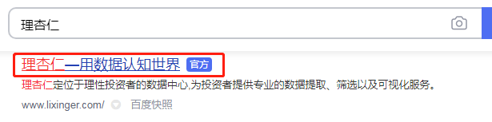

以上证 50 为例, 我们来实操查询、计算指数温度.

第一步, 在理杏仁首页的搜索框输入"上证 50", 会自动弹出下拉菜单, 我们在菜单中选择上证 50 指数, 点击它, 跳转到下一个界面.

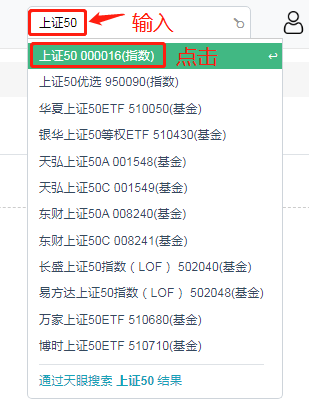

第二步, 在跳转后的界面中, 点击"PE-TTM", 大家可以对照文稿中图片中指示的位置. PE-TTM 就是我们要找的 PE , 也就是市盈率; 然后在右侧点击"10 年"

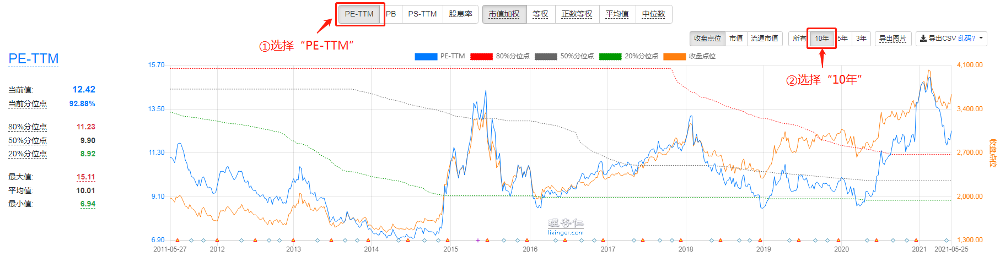

之所以选择 10 年, 是因为我国股市大约 7 年一轮牛熊更替, 选择 10 年足以覆盖一轮牛熊周期, 得出的结果更能反映指数的真实估值水平.

第三步, 直接在页面左侧查看 PE 当前分位点. 可以看到, PE 当前分位点为 92.88%. 我们把这个数字记在小本本上, 方便一会儿拿来用.

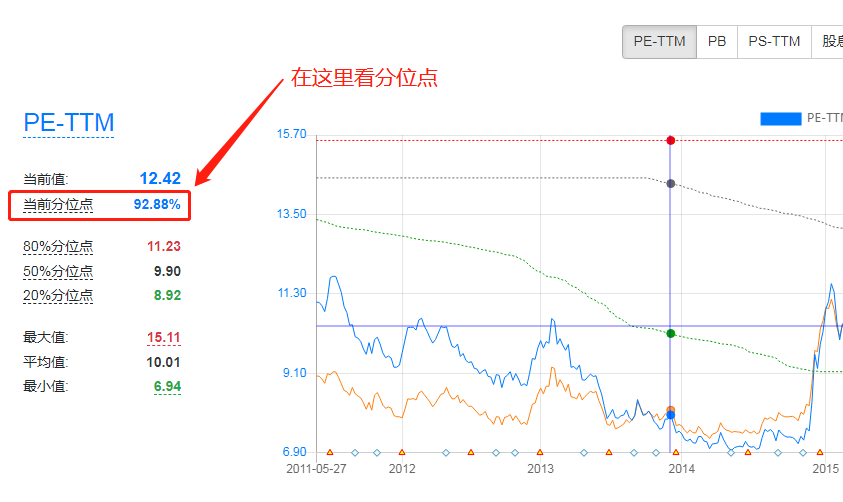

第四步, 在 PE-TTM 按钮的右侧有 PB 按钮, 它就是我们要查询的市净率, 我们点击它.

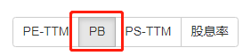

第五步, 直接在页面右侧查看 PB 当前分位点. 可以看到, PB 当前分位点为 72.56%. 我们把这个数字也记在小本本上.

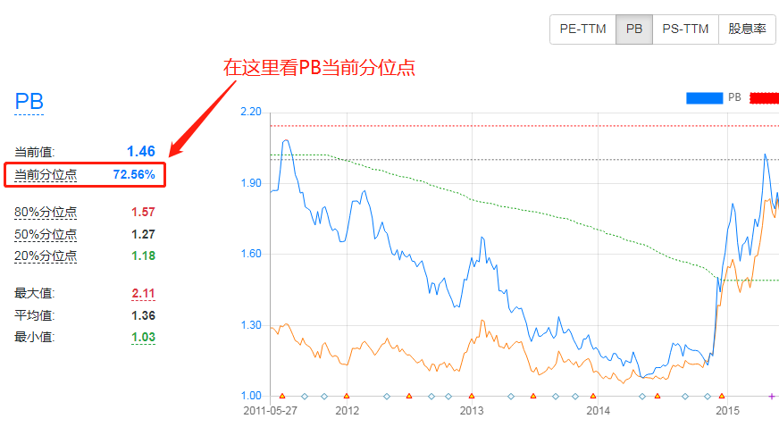

第六步, 计算指数温度. 前面已经查到了, PE 当前分位为 92.88% , PB 当前分位点为 72.56%. 我们按照指数温度的计算方法, 把两个数加起来除以 2, 结果是 82.72%.

也就是说, 指数温度为 82.72 度, 远远超过 50 度, 是一个非常高的温度, 说明当前上证 50 指数的估值过高, 不适买入追踪它的基金.

在此提醒, 分位点数值在每个交易日都会发生变化, 课程中的实操数据难免存在滞后的情况, 大家不要直接照抄课程中的估值结果, 而是要亲自实操, 得出指数最新的估值.

我们学习过的 8 大指数一上证指数、 上证 50、. 上证 180、深证 100、 中小板指、沪深 300、 中证 500 和中证 800 全部都可以用这个方法进行估值哦.

以上就是用理杏仁查询、计算指数温度的整个流程啦.

除了理杏仁以外, 大家还可以选择其他一些估值工具.

比如"韭圈儿"指数估值

[韭圈儿](http://www.funddb.cn/site/index)

在韭圈儿的指数估值的页面中, 有一个筛选器, 我们选择其中的"规模"选项即可, 我们要找的宽基指数就藏在这个选项里.

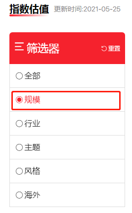

## 一次全流程"选基"之旅

有的小伙伴问班班, 我们已经学过了, 针对某一只指数, 筛选对应的指数基金; 也学过了, 看指数高估还是低估, 但是感觉实操还是缺少头绪, 不知道先干什么, 后干什么~

这个问题很典型. 班班今晚的加餐重点解决实操的问题. 小可爱们打起精神哦, 支棱起来, 好好听课! 我们从头到尾来顺一遍完整的实操.

投资指数基金, 从头到尾总共可以分成"三步走": 定指数, 定基金, 定买卖.

### 一、定指数

只有先定了指数, 我们才能在这只指数下面筛选相关的基金产品哈. 所以, 定指数排在第一位. 怎么定指数呢?

根据今天课程中所学习的, 指数温度低的时候才可以买入对应的指数基金. 那么, 我们首先需要找一只温度低的指数.

上哪儿找低估值的指数呢?

在前面课程中, 我们聚焦了 8 只指数, 投资可以覆盖全市场. 我们在这 8 只指数范围内对比一下, 选择估值最低的一只就好啦.

这 8 只指数分别是:

"中证"系列: 中证 800、沪深 300、中证 500

"上证"系列: 上证指数、上证 50、上证 180

"深证"系列: 深证 100、创业板指

我们把它们全部汇总在一张表格里. 左边一列写指数的名字, 右边一列写指数温度.

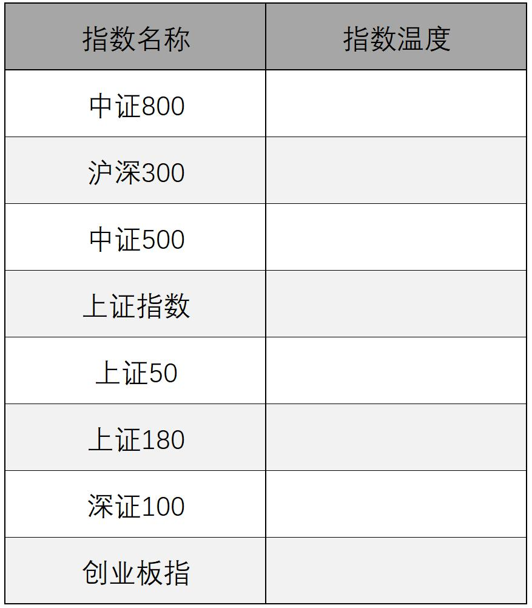

大家用电脑的 excel 表格做一下就可以啦. 实在不行的话, 拿只笔, 拿张纸, 手画一下这个表, 也很快的.

接下来, 我们把 8 个指数的温度分别计算一下, 填到表格里.

课程中已经教给大家计算指数温度的方法了哦, 班班带大家再实操一遍.

以表中第一个指数"中证 800"为例, 我们看一下它多少度.

首先, 打开"理杏仁"网站. 在搜索框输入"中证 800", 自动弹出下拉菜单, 在菜单中点击 "中证 800 000906(指数)". 大家注意一定选择带(指数)字样的, 不要点错了.

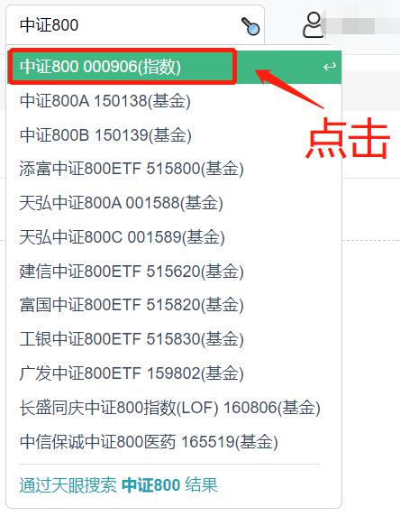

接下来, 在跳转后的页面中, 点击"PE-TTM", 再点击"10 年".

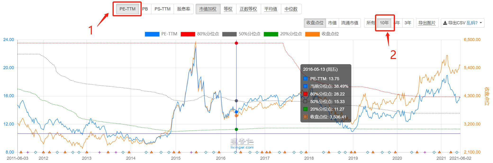

然后就可以看 PE 温度啦, 在页面左边, 显示 PE 分位点 77.70%, 也就是 PE 温度为 77.7 度.

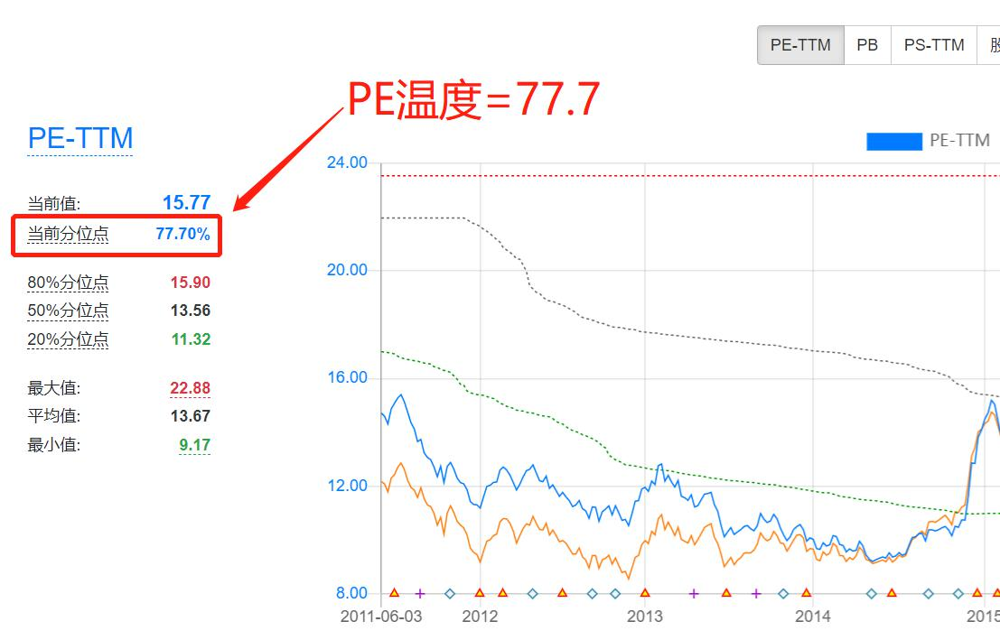

接下来我们再看 PB 温度. 方法很简单, 把"PE-TTM"切换到"PB"就好了. 我们点击"PB".

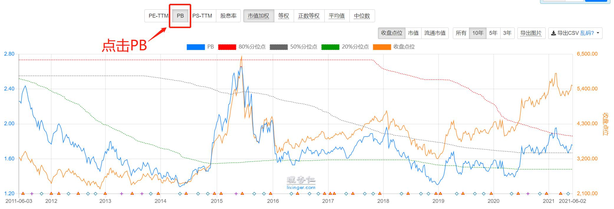

好啦, 右边可以直接看 PB 温度啦. 显示 PB 分位点 68.28%, 也就是说 PB 温度为 68.28 度.

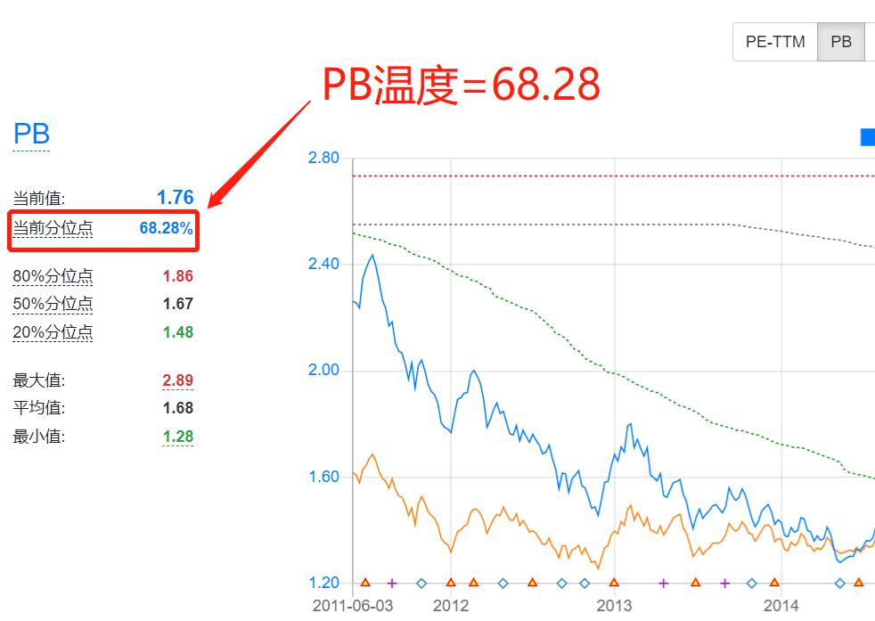

最后计算指数温度. 也就是把 PE 温度和 PB 温度加起来, 再除以 2.

(77.7+68.28)/2=72.99. 结果就有啦, 中证 800 的指数温度为 72.99 度. 我们把这个结果写到之前的表格中.

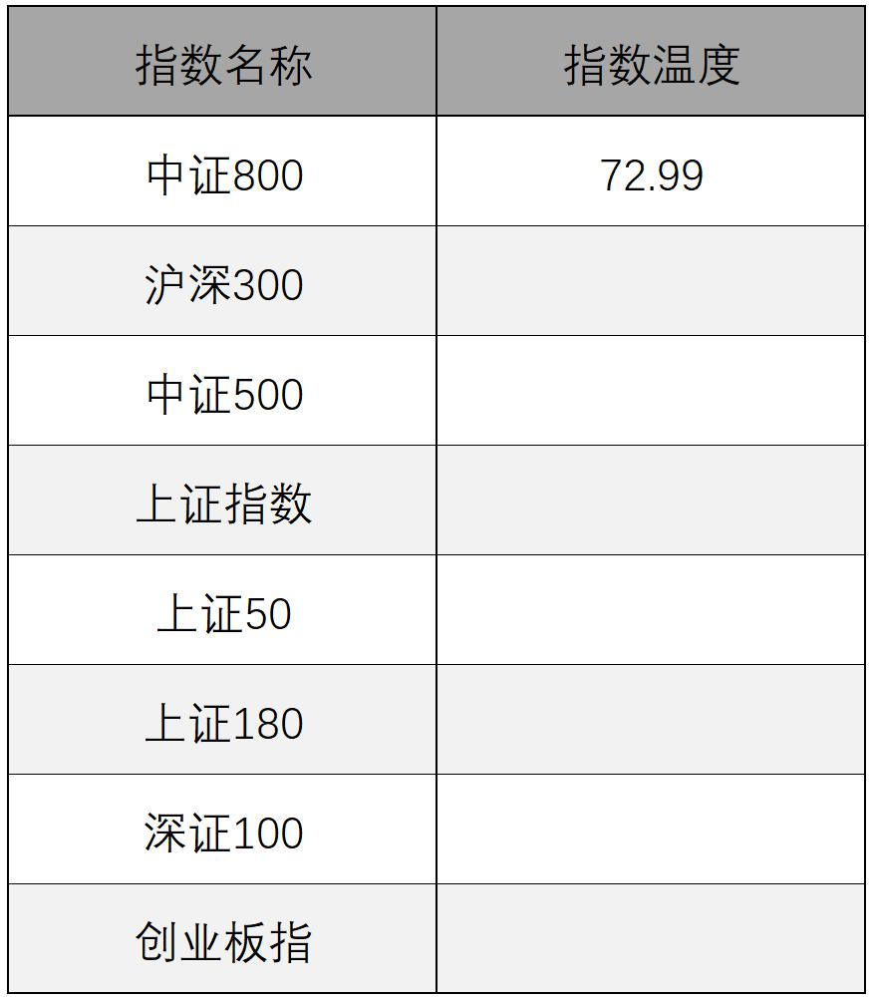

剩下的 7 只就不用班班全部演示了吧. 过程都是一样的. 班班直接把结果全部展示出来~

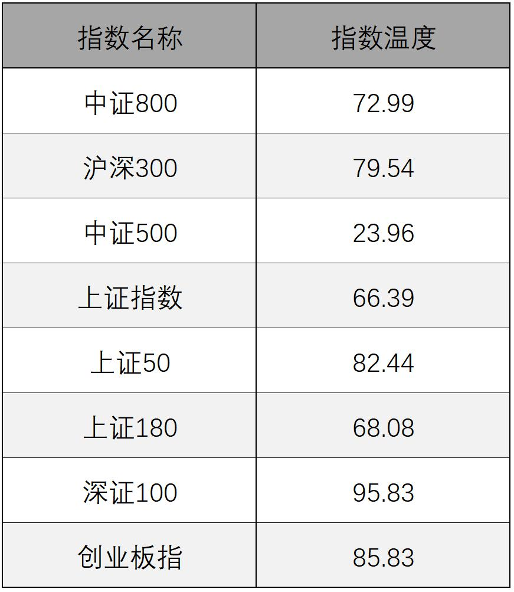

可以看到, 只有中证 500 指数的温度低于 50 度, 也就是说, 只有中证 500 是低估的, 可以投资追踪它的指数基金.

当然这是凑巧只有一只的情况. 如果我们算完了发现, 不止一只低于 50 度, 怎么办呢?

那就挑指数温度最低的那个指数就好啦. 因为温度最低, 说明它在 8 只里面最被低估, 低买高卖的价差更大哦!

另一种情况: 如果全都不符合, 全都超过 50 度了, 怎么办呢?

那就说明当前市场过热, 不适合入场投资. 这种情况下, 算到这里就不用往下进行了. 可以暂时投资债券基金或者货币基金代替, 等到指数温度降到 50 以下, 再考虑投资指数基金.

好啦. 现在, 我们找到了一个被低估的指数: 中证 500. 下一步, 我们就要在追踪中证 500 的基金里面, 挑选最中意的那一只啦.

### 二、定基金

第二步, 定基金. 确定了指数以后, 找基金就不是难事啦. 我们在昨天第 8 课已经学习过啦 ——"指数基金那么多, 哪知更靠谱?"

班班带大家重温一遍整个筛选过程. 首先打开"中证指数有限公司"官网, 在首页的搜索框搜索"中证 500".

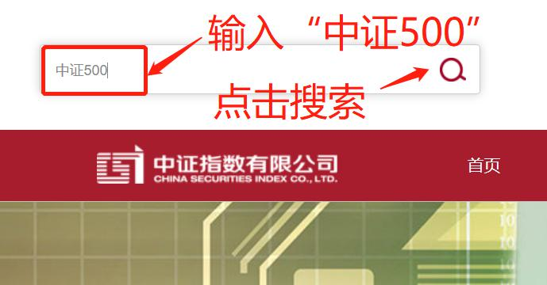

在搜索出来的结果中, 找到"中证 500"这一行, 点击它.

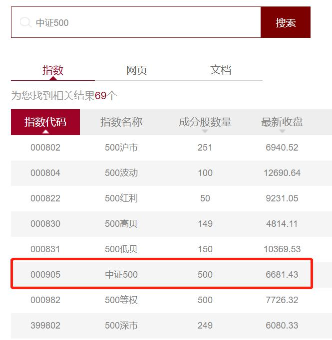

接下来, 在跳转后的网页中, 找到相关产品四个字, 点击"更多".

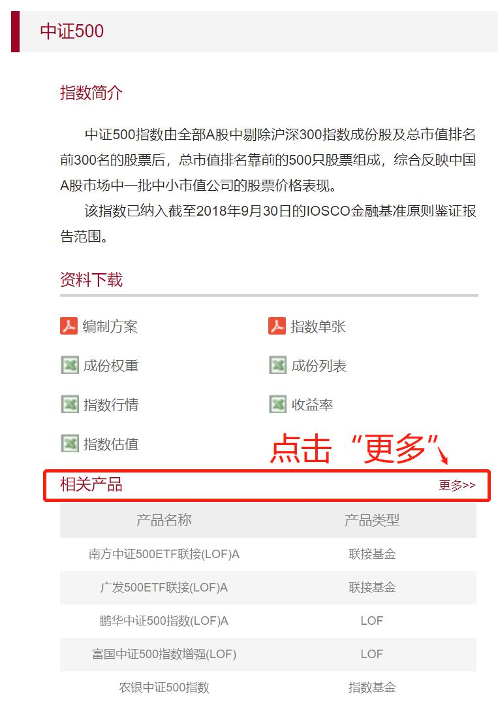

跟踪"中证 500"的指数有很多只, 班班数了一下, 足足 137 只. 要翻 5 页才能全部看完.

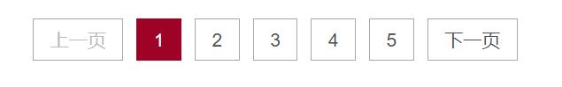

不过大家完全不用担心哈. 我们的筛选条件是: 基金规模不小于 5 亿. 这 137 只里面大部分都是不符合条件的, 看一眼直接跳过就行.

最后我们把基金规模大于 5 亿的填到水星筛选表格中. 网站上显示的"资产净值"就是基金规模的意思. 大家有时间的时候实操一下, 班班就不带大家一只一只去看了.

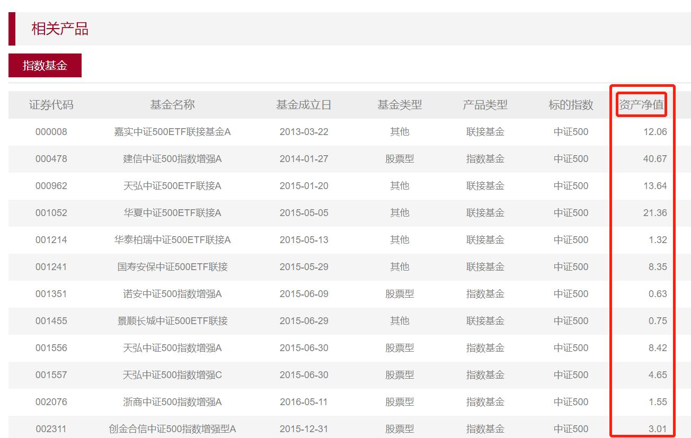

按照基金规模筛选完以后, 一共只有 23 只基金顺利通过. 没想到吧? 在 137 只基金中, 用 5 亿规模就能刷掉绝大部分.

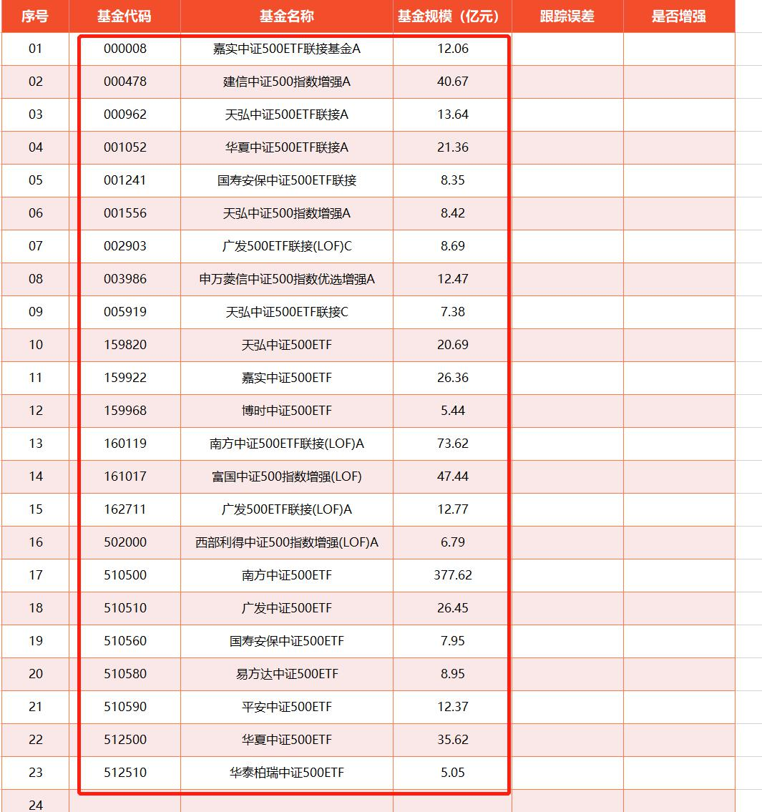

接下来, 我们需要进入天天基金网. 查这 23 只基金的跟踪误差. 以第一只基金 000008 为例, 我们在天天基金网搜索它.

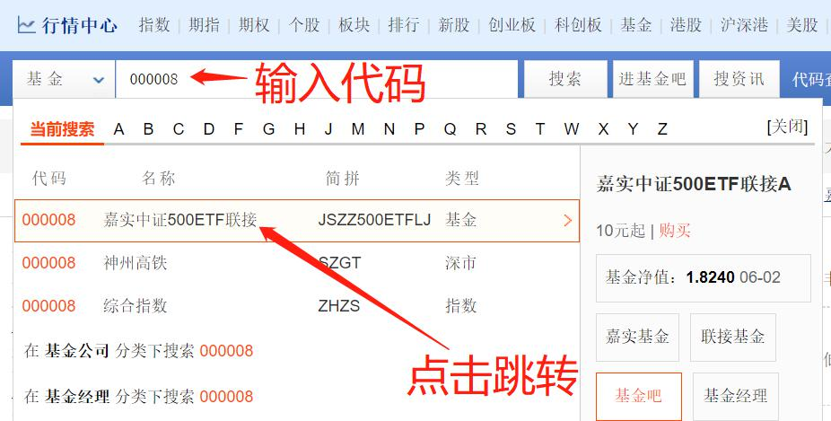

点击基金名字, 跳转进入详情页面. 直接就能看到它的跟踪误差是 0.10%, 把这个结果录入水星表格中即可.

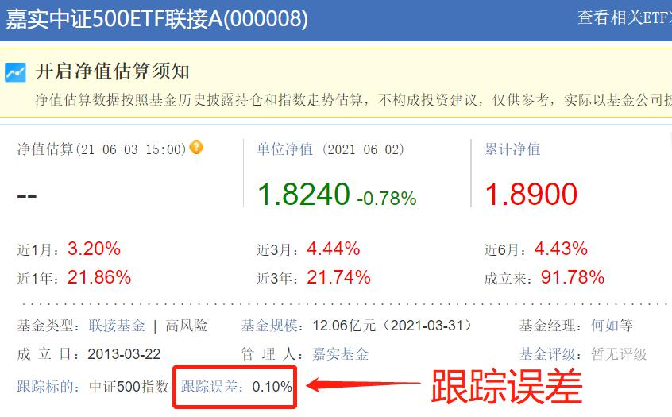

剩下的基金就不用逐个演示吧了? 方法都是一样的. 统计完以后, 如下图所示.

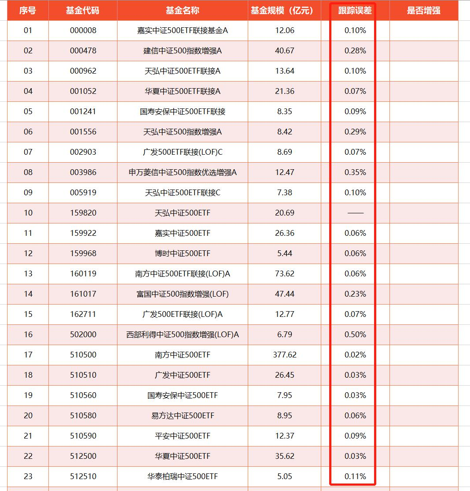

表中有一行跟踪误差填的"——", 代表没有跟踪误差的数据. 这是因为这只基金成立的时间太短, 没有足够的历史数据统计它的跟踪误差. 这种新基金不建议大家选择. 买指数基金最好是买老的, 方便咱们看跟踪误差哦!

最后一列, 是否增强, 现在我们把它填上. 方法很简单, 指数基金名字里带"增强"两个字, 就是增强型. 增强填是, 不增强填否.

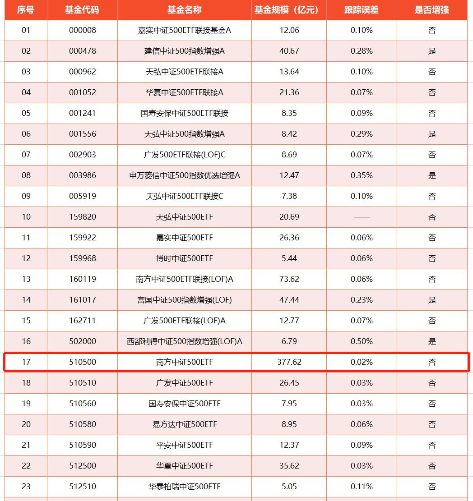

在所有结果里面, 第 17 只基金 510500 非常亮眼. 它的基金规模是最大的, 足足达到了 377.62 亿元, 跟踪误差是最小的, 只有 0.02%; 两方面都非常优秀. 而且, 它不是增强型, 符合我们完全复制指数的意愿.

综合比下来, 510500 就是这次筛选的最终答案啦.

不过大家注意哦, 班班是提前备课的, 筛选时间已经是过去, 各种数据和筛选结果如今都可能变化. 小可爱们可不要照抄结果哦~重点是看方法, 不是看结果. 一定要亲自实践一遍哦~

### 三、定买卖

定指数、定基金, 两步都搞定了. 我们先定了中证 500 指数, 又定了 510500, 南方中证 500ETF 这只基金.

接下来就到了第三步, 拿出本金, 投资这只基金.

指数基金该怎么投资呢? 比较适合工薪族、投资新手的方法是定投. 这是我们明天课程的重点哈, 今晚班班先来提前"泄密"一点点.

定投就是每隔一段时间, 就投入一部笔钱. 比如大家可以固定每个月 1 号, 投资 500 元到这只基金, 这就是定投.

那么, 定投要一直投下去吗? 什么时候是个头, 什么时候该卖出呢? 答案还是看指数温度. 指数温度既可以用来选低估的指数, 还可以知道我们买卖! 每周看一次中证 500 的温度即可, 当温度超过 50 度, 不再定投, 卖掉手里的基金, 落袋为安. 这就是整个"定买卖"的过程. 是不是很简单?

好啦, "三步走"就是以上这些啦. 定指数、定基金、定买卖, 全部搞定! 一次全流程"选基" 之旅, 终于结束啦!

今晚的分享非常重要, 它把我们第 7 课讲的 8 个指数, 第 8 课讲得筛选基金, 以及第 9 课讲得指数温度, 全部串了起来.

今后大家实操的时候, 可以着重看今晚的分享稿, 依葫芦画瓢, 走一遍实操流程就可以啦!

## 总结

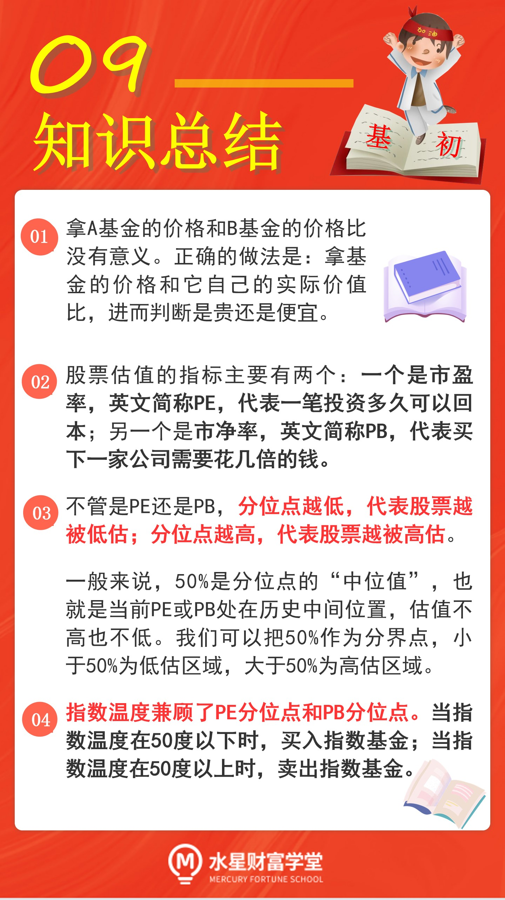

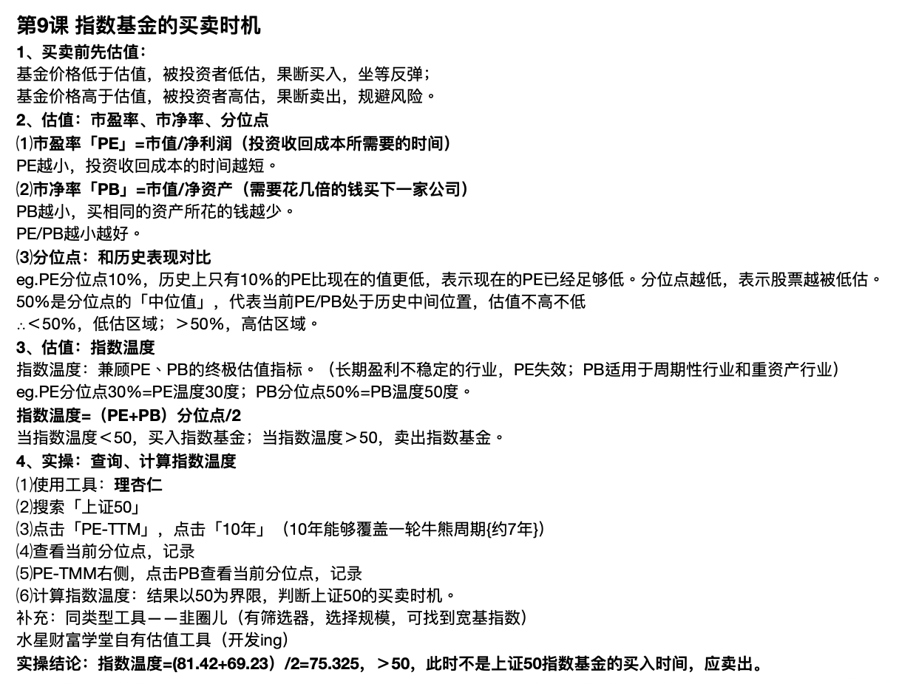

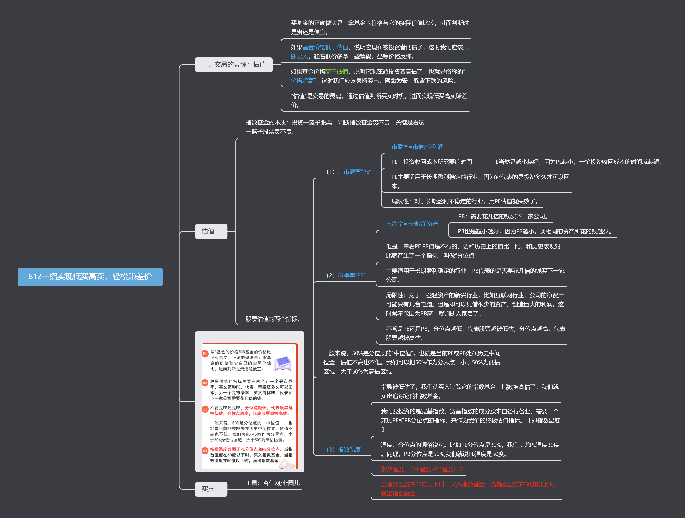

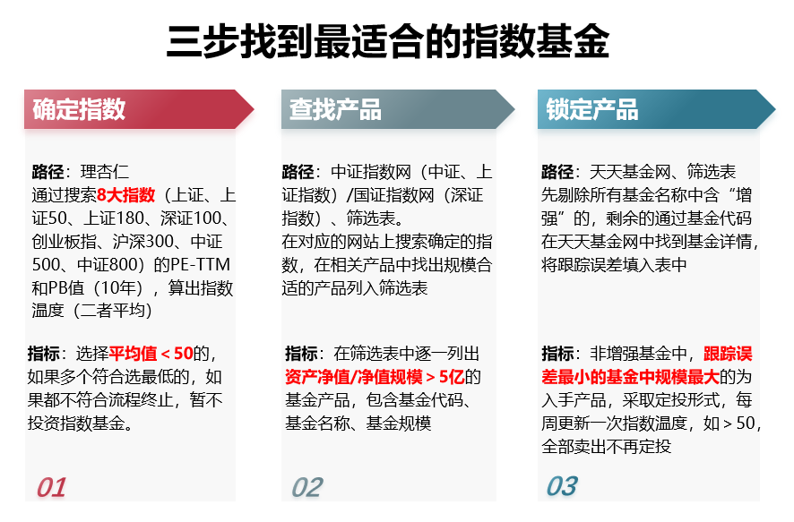

1、指数温度的原理

首先市盈率和市净率是两个估值指标, 这两个数值的大小, 反应的是估值

其次把这两个指标, 放在过去十年历史中, 去对比可以看出, 当前的估值水平在过去十年历史中的地位

如果比较高, 说明指数当前比较高估, 那么以后上涨的概率和空间就小, 这个时候我们可以考虑卖出

如果比较低, 说明指数当前比较低估, 那么以后上涨的概率和空间就大, 这个时候我们可以考虑买入

所以指数温度低, 表示指数低估, 可以考虑买入, 是入场时机

所以指数温度高, 表示指数高估, 可以考虑卖出, 是卖出时机

这就是指数温度的原理啦, 这样子去理解就行

2、指数温度适合哪些指数估值用

指数温度, 只是一个给宽基指数估值的指标, 不是一个指标在手天下我有

行业指数, 要单独分析的, 这块我们在基金进阶课程学习

3、指数温度的计算

首先, 指数温度=(PB 温度+PE 温度)/2

注意: PB≠PB 温度, PE≠PE 温度, 就像老婆 ≠ 老婆饼……

比如你搜 老婆 的时候, 搜出来的老婆饼, 名字里有一样的字, 但完全不是一个东西

指数温度的计算: 通过理杏仁网站查 PB、PE 值, 用 EXCEL 表格计算出 PB、PE 温度

然后取平均值, 就可以得到指数温度啦

4、有那么多的基金, 我需要一个一个去计算温度, 才来判断投资么? 好累啊

首先, 基金没有温度, 只有指数才有温度. 我们估值看的是指数的温度

指数只有一个, 比如沪深 300、中证 500

但是跟踪指数的基金却有很多个, 我们投资宽基指数基金的时候直接看这个基金跟踪的指数的温度来判断估值买卖即可

这里可能又有一个问题: 学姐, 在哪可以看出这个基金跟踪的指数是哪一个啊

利用天天基金网搜索代码, 然后看这个页面

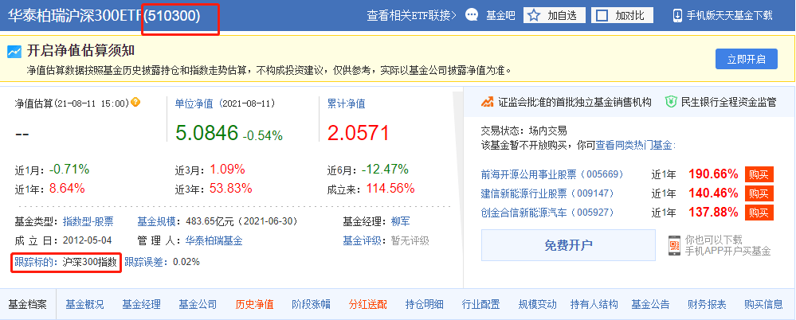

如果是指数型基金(天天基金网搜代码查询后显示有"跟踪标的"), 则看下"跟踪标的"后面的, 这个就是基金跟踪的指数

如果是宽基指数的话, 那么对应估值方法为指数温度, 可以去指数温度列表看下对应指数

如果指数温度有的话, 直接可以查看; 没有, 就需要自己动手计算

小知识点: 指数简单理解成一篮子股票

那宽基指数就是在各行各业里选择股票

行业指数就是在某个特定行业里选择股票, 比如中证白酒指数, 这个行业指数里面的股票全部来自于白酒行业, 而不是医药行业里的股票也放到这里

所以从名字上就可以区别开宽基指数和行业指数

行业指数一般名字上带有某个"行业"

小知识点 2: 如何判断一只基金是主动型还是被动型(指数)基金

天天基金网搜索代码, 看这个页面, 如果有"跟踪标的", 那么说明是被动型基金(指数型)

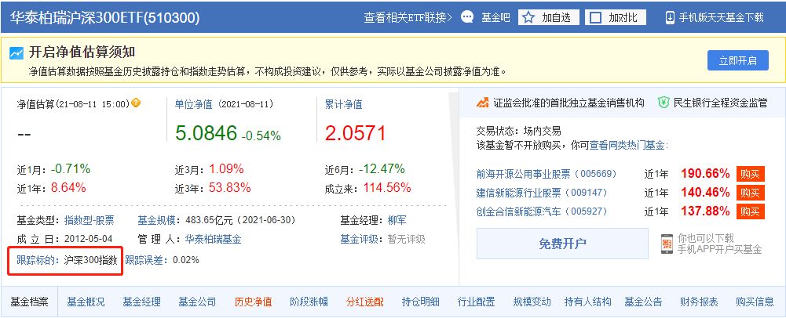

如果没有"跟踪标的", 说明是主动型基金

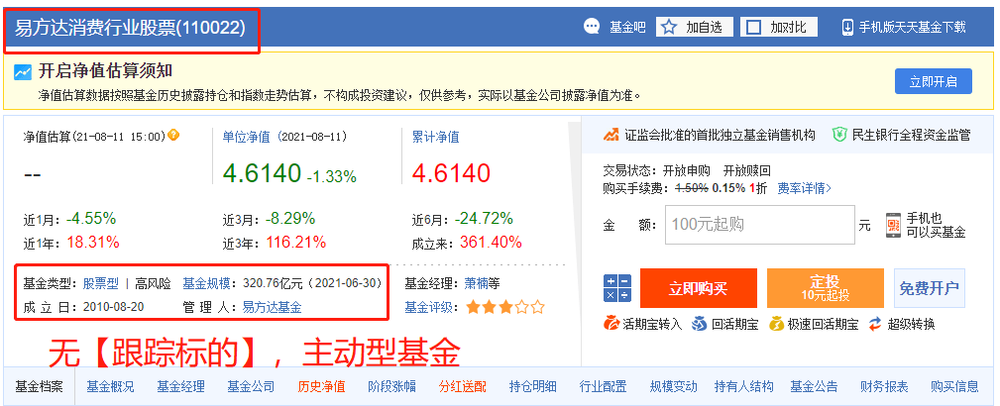

1. 投资指数基金分"三步走": 定指数, 定基金, 定买卖.
2. 定指数: 看的是指数温度. 综合对比 8 个指数的温度高低, 选温度最低的那一个. 如果 8 个指数的温度都超过 50 度, 就放弃投资指数基金, 可以暂时把钱投资到债券基金或货币基金中.
3. 定基金: 看的是基金规模、跟踪误差和是否属于指数增强型基金.
4. 定买卖: 最好的方式是定投. 指数温度低于 50 度的时候一直定投, 指数温度高于 50 度的时候终止定投, 卖掉手里的基金.
