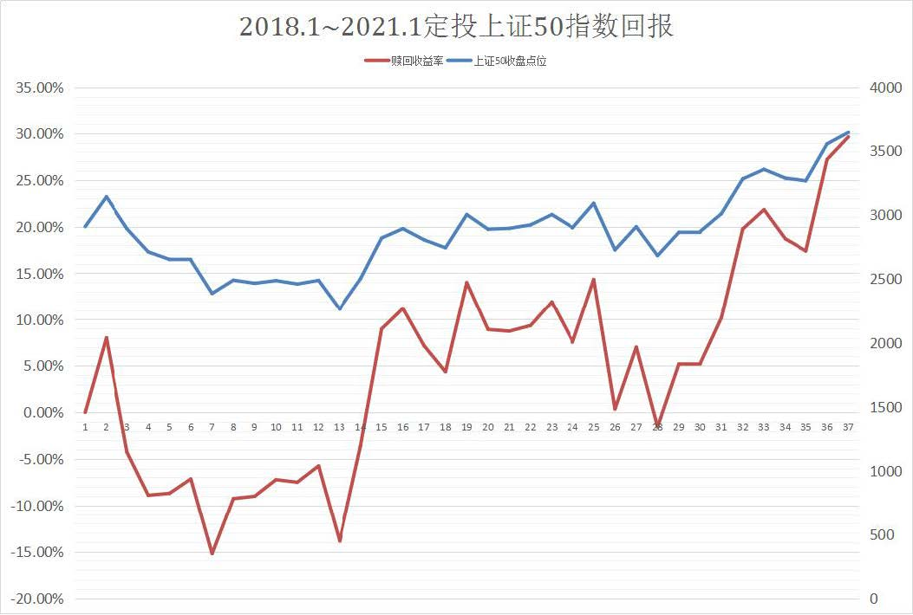

## 定投 PK 一次性投资

上一节课, 我们学习了通过指数温度判断买卖时机. 如果指数的温度低于 50 度, 那么就适合买入跟踪它的指数基金.

在买入的时候, 我们有两种选择.

选择一, 把手里的钱一次性投进去, 简称"一次性投资";

选择二, 分很多次把钱投进去, 每隔一段固定的时间就投入一笔, 简称"定投".

在这两种方法中, 优先推荐大家选择基金定投. 原因主要有三点.

### 第一, 定投可以减轻本金压力.

一次性投资需要投资者直接拿出一大笔钱, 对于普通的工薪阶层来说, 可能会带来不小的压力, 所以这个方法不适合所有人; 而定投只需要每个月拿出一笔小钱就可以. 如果闲钱不多, 可以只拿出几十、几百做定投; 如果闲钱充沛, 也可以每个月拿出几千块做定投.

### 第二, 定投可以摊薄投资成本.

基金净值下跌, 收益下降甚至造成亏损, 这是很多投资者都不愿意面对的情形. 如果你选择了一次性投资, 那么在基金净值下跌时, 只能眼睁睁看着收益跌下去, 没有多余的钱补救; 而如果你选择了定投, 那么每次遇到下跌, 你都能在更低的价格, 用更低的成本买一次, 摊薄投资的总成本.

### 第三, 定投可以规避人性弱点.

选择一次性投资的人, 遇到了亏损之后没法补救的情况, 很有可能心里难以承受, 害怕继续下跌, 结果就"割肉"离场, 亏损出局.

而选择定投的人, 会把每一次下跌看作是加码的机会, 避免了人性中恐惧下跌的弱点, 更有利于长期坚守投资纪律, 提高赚钱的确定性.

综上所述, 推荐大家选择定投.

而且大家注意, 在所有的基金品种里面, 指数基金和定投更配哦.

这首先是因为, 定投更适合波动较大的产品. 波动越大, 越有利于我们在低位多多买入, 尽可能摊薄成本. 如果波动过小, 每次买入的成本差别不大, 摊薄成本的效果不明显, 那么定投和一次性投资相比, 也就没什么优势了.

所以, 像债券基金这样的品种, 本身波动小, 定投的优势不明显; 而股票基金的波动较大, 更加适合做定投.

那么, 为什么在股票基金中, 指数基金更适合定投, 而不是主动型的股票基金更适合定投呢?

这是因为, 主动型基金的基金经理发挥未必稳定, 如果选择股票不慎, 或者投资风格漂移, 其所管理的基金存在长期下跌的风险. 如果一直不反弹, 我们定投再多次也无法挽回.

而指数基金跟踪指数进行投资, 风格固定. 而且, 指数是不会永远下跌的. 因为指数的成分股会定期更换, 通常是每隔半年或一年重新换一次, 届时表现差的股票将剔除出去, 表现好的股票补充纳入成分, 可以说"铁打的指数, 流水的成分股".

总之, 单只股票可能会一直"烂"下去, 但指数不会. 即使指数下跌了, 总有一天也会反弹起来. 这才是定投最好的选择.

## 定投频率、定投金额如何设置?

一般情况下, 基金定投分为按周定投, 按双周定投, 按月定投以及按季度定投. 长期来看, 定投频率对收益的影响不大, 大家不需要为了提高收益率每周频繁定投.

现实中, 大多数人都是每月发一次工资, 所以, 选择按月定投更符合个人现金流的实际情况.

那么, 每个月投入多少金额合适呢? 这里有两个方法河以帮你算出定投金额.

### (1)目标导向法

该访法适用于你有了明确目标的情况. 比如, 你想要通过定投, 在 5 年内攒够 20 万元买车的钱; 或者你想要通过定投, 在 30 年后获得 100 万元的养老金, 等.

这时候, 我们需要根据最终的目标金额, 反推一下, 每个月需要定投多少钱.

这个过程不需要我们手动计算, 用"定投收益计算器"就可以直接搞定. 大家可以扫描文稿中的二维码, 打开计算器.

定投用途可以选择"子女教育"、"储蓄养老"、"购买住房"和"投资". 如果你有其他的定投用途, 可以选择"其他"

假设我们的定投用途是子女教育, 目标是 20 年攒够 50 万元, 那么就在"预计到期金额"这一栏填写 50 万元 , 在"定投年限这一栏填写 20 年.

接下来需要选择风险承受能力, 有高、中、低三种选择, 对应的"预期平均年回报率"分别是 12%、8%和 4%. 这大家根据自己实际的风险承受能力选择即可.

这里假设我们的风险承受能力是"中", 那么我们点击"中", 预期平均年化回报率会自动弹出 8%的数字.

最后, 我们点击计算, 就可以看到计算结果啦. 结果显示, 每月定投金额为 843.25 元. 接下来, 我们只需要按照这个数额, 月定投就可以了.

实际定投中, 可以不必像计算结果一样精确到小数, 我们定一个大致符合的整数即可. 比如, 刚才计算的结果是每月定投 843.25 元, 我们可以每月定投 850 元即可.

### (2)固定结余法

前面的"目标导向法"适用于有明确目标的情况, 那么, 如果我们没有明确的目标, 该怎么确定定投金额呢? 这就要用到"固定结余法"了. 这个方法的逻辑很简单,

我们每个月实际能够结余下来多少钱, 就定投多少钱, 实事求是做投资.

每一个人收入不同, 日常开支也不同, 所以没有一个绝对正确的定投金额, 大家根据自己的情况确定金额即可.

当然, 我们也可以有一个简单的标准: 拿出每月税后收入的 15%左右做定投即可. 比如, 你的税后月薪是 8 千元, 适合的定投金额就是 8 千乘以 15% , 也就是 1200 元.

有的小伙伴可能想问, 知道了月定投金额以后, 怎么才能知道最终可以得到多少钱?

这个问题可以用"定投金额计算器"搞定. 大家可以扫描文稿中的二维码, 打开计算器.

在没有明确目标的情况下, 定投用途可以选择"其他".

接下来输入"每月定投金额", 我假设自己每月可以定投的钱是 1200 元, 直接输入数字即可. 剩下的部分就跟"目标导向法"基本一致啦. 定投年限、风险承受能力定下来以后, 计算, 就可以得到"预计到期总金额".

我们可以看到, 每月定投 1200 元, 定投 10 年, 预期平均年回报利率 12% , 结果得到的预计到期总金额为 27 万 8 千多元. 而我们总的投入是 14 万 4 千元, 资产接近翻倍哦.

## 升级玩法: 定期不定额投资

在上一小节, 我们学习了目标导向法和固定结余法明确定投金额.

结合上节课关于指数温度的知识, 大家在温度低于 50 度的时候, 按照计算出来的定投金额, 每月投入一笔钱就好啦.

等到温度超过 50 度, 说明价格变贵了, 这时要停止定投, 卖出手里的基金.

这种每隔固定的时间投入固定金额的方法, 叫做"定期定额投资". 不过我们还有一种更高级的玩法, 可以帮助我们放大低买高卖的效果, 赚到更多的差价.

这种方法就是: 定期不定额投资.

也就是每隔固定的时间, 虽然都会投入一笔钱, 但是每次投入的金额不一样. 指数温度越低, 我们就投入越多的钱.

这是因为, 温度代表的是估值水平, 估值越低, 说明我们越能捡到便宜的筹码, 这时候多投入本金, 摊薄成本的效果就越明显. 成本变低了, 收益率也会相应提高. 我们可以把指数温度分为六个区间, 每个区间对应不同的投资比例.

当指数温度在 0-10 度之间时, 温度非常低, 说明指数被严重低估, 这是黄金买入时机, 不要犹豫, 按照你计算出来的每月定投金额, 100%全部买入跟踪这只指数的基金.

当指数温度在 11-20 度之间时, 温度上升, 但依然很低, 我们可以相应调整定投比例, 拿出定投金额的 80%投资指数基金即可.

接下来以此类推. 温度每升高 10 度, 定投比例减 20%. 当温度上升到 21-30 度之间时, 定投比例为 60% ; 当温度上升到 31- 40 度之间时, 定投比例为 40% , 当温度上升到 41-50 度之间时, 定投比例仅剩 20%. 当温度超过了 50 度, 停止定投, 果断卖出!

总结成一句话就是, 温度越低, 投入越多; 温度越高, 投入越少; 温度超过 50 度, 卖出基金, 落袋为安.

以上就是定期不定额投资的完整方法啦. 不过有一点要提醒大家, 很多投资软件设置了自动定投, 这种情况一般都是定期定额投资, 想要实现定期不定额投资, 要我们每月手动买入基金.

如果你时间太忙, 怕自己经常忘记操作, 可以选择定期定额投资; 如果你可以每个月手动操作一次, 建议你选择定期不定额投资, 提高收益率.

## 坚持长期主义, 收获"时间的玫瑰"

晚上好, 班班的加餐分享要开始啦. 下面要正式开启今晚的加餐啦. 今晚加餐主题很浪漫哦~

### 一、什么是长期主义?

大家在看金庸的武侠小说时会发现, 每一种武功, 不仅仅有招式, 还会有配套的心法. 越是重要的武功秘籍, 越注重心法.

了解心法, 有助于大家明白武功的用途, 也有助于理解这一派武功发明的初衷. 其实投资也是一样的.

关于投资的招式, 大家已经学了不少了. 不管是债券基金, 还是指数基金, 都有了一整套的投资方法. 但是班班要说, 这些方法只是投资中的招式. 如果没有配套的心法, 就不能说武艺学到家了.

那么投资中的心法是什么呢? 总结成四个字就是: 长期主义.

有的小伙伴可能想说: 我也知道长期投资很重要啊, 可就是很难坚持. 脑子记住了, 手控制不住操作.

这归结起来主要有三个原因.

第一个原因: 买入之后一直在亏钱, 所以不想等了, 抛掉拉倒.

当你定投了三个月, 发现一直在亏, 你会不会怀疑自己的策略出现了问题呢? 有些小伙伴会因此不再相信长期投资的力量, 然后亏损收场, 要么从此再也不碰基金, 要么就投入了短线操作的怀抱, 换一种方式接着亏.

这么做的错误在于, 我们不能用短期的效果去验证长期策略是否可行, 长期策略只有长期坚持才能看到效果.

通常情况下, 三个月的下跌看似很多, 但是放到三年的时间里来看, 那三个月的下跌可能只是一次很小的回调.

第二个原因: 买入之后赚到一点钱, 怕失去, 所以早点卖掉落袋为安.

如果只是为了保住一点蝇头小利就把基金卖掉, 那么很可能错过未来长期的上涨哦. 我们可不能捡了芝麻, 丢了西瓜.

之所以会涨了一点就想卖, 是因为缺乏自己的投资逻辑. 指数基金的买卖要看指数温度, 低温买, 高温卖. 这些在课程里都讲过啦, 大家记得学过的知识就要用起来哦.

第三个原因: 买入之后赚到钱了, 但是发现别人买的比我赚得多, 想换成和别人一样的.

很多小伙伴看到周围人的基金跑得快, 自己的基金跑得慢, 心里就不淡定了, 总想着抛弃自己现有的基金, 转换到那个跑得快的基金上去.

但是大家要知道, 基金跑得快很可能是因为遇上了"热点"或者"板块轮动", 当你发现基金收益突飞猛进的时候, 说明热点已经升温, 我们很可能买在高位, 然后跟着热点降温的过程一路亏损.

这就像在火车站排队买票一样. 当你排上队以后, 发现旁边的队伍走得更快, 这时候你是继续留在原来的队伍里呢, 还是一直选择走得快的队伍, 在队伍之间换来换去呢?

大多数人都知道, 保持在一个队伍一直排下去可能是最好的办法, 那种跳来跳去的选择是非常糟糕的.

班班的心理按摩做完啦, 大家以后千万不要再有上述三种想法, 要做一名长期主义者哦. 赚"慢钱", 而不是赚"快钱"; 耐得住寂寞, 经得起诱惑, 最后才能等到赚钱的那一刻.

很多投资者把长期主义比作"时间的玫瑰", 只要时间充足, 玫瑰花就会为你绽放哦. 水星财富学堂的母公司"金斧子", 已经把"长期主义"写进了公司的价值观里面.

### 二、长期定投靠谱吗?

往期有个学员告诉班班, 他在入营之前就有投资经验, 认认真真做定投, 做了一年, 居然还是亏的. 从此就再也不相信基金定投了.

班班提到的这个学员, 定投的是跟踪"上证 50 指数"的某只基金. 班班就拿这个指数作为例子, 从 2018 年 1 月开始, 每月定投 1000 元, 直到 2021 年 1 月卖出, 整整三年时间. 咱们看看收益结果如何.

图中绿色表示定投到当月是亏损的, 红色表示定投到当月是盈利的. 大家可以看到, 如果三年坚持定投下来, 最终在 2021 年卖掉, 总的收益率是 29.62%, 还是不错的.

但是, 前提是 3 年坚持下来, 这就是长期主义! 有多少人可以真正坚持下来呢?

大家可以看表中前三分之一的部分, 几乎全部都是绿色的. 也就是说, 定投刚开始的一段时间内, 你每天打开账户看到的都是绿色的, 亏损的. 从 2018 年 3 月开始绿, 一直到 2019 年 3 月才翻红. 绿一年, 就可以刷掉很多不坚定的人.

很多不懂行的小白, 投一次, 看到亏钱就不玩了, 割肉离场. 稍微懂点的可能坚持久一些, 但是也耐不住连续定投连续亏, 可能撑不了三个月, 也割肉离场了.

我们看一下折线图可能会更加直观. 班班已经做好了~

图中蓝色表示上证 50 指数点位变化, 红色表示定投到不同月份的收益率变化. 可以看到, 收益率总体上先降后升, 最大一次亏损是-15%+, 很多小伙伴看到亏 15%多, 就坚持不住了.

班班提到的那位学员, 就是在这个时候割肉的. 他说亏损达到 10%以上他就心慌了. 很可惜, 在他割肉以后, 基金开始了反弹.

只要你提前撤了, 那么后面不管收益率反弹再多, 都和你无关了. 市场对意志不坚定的人就是这么无情, 它只会奖励长期拥抱它的人.

尤其是定投指数基金, 大家更不要怕亏损. 课程里讲过, 指数是长期向上的, 买指数就是买国运. 指数不可能一直下跌, 反弹是早晚的事, 拼的就是谁有毅力.

指数基金定投出现亏损, 千万不要割肉, 不要止损, 一定要抗住, 投就投到底!

总之一句话, 定投的方法本身是靠谱的, 但是必须结合长期主义的心法, 才能真正发挥作用.

### 三、善用估值, 及时止盈

细心的小伙伴估计会发现, 前面的定投案例其实是"无脑定投", 也就是说不看估值, 不管温度高还是低, 统一按照每个月 1000 元定投, 坚持 3 年时间.

这是最原始的一种定投方式. 它的缺点非常明显. 我们还是看上面的图就知道了.

班班用黄色箭头标出了一次回撤. 也就是基金定投收益率从近 15%, 降到了 0 以下, 变为亏损.

大家注意哦, 这次亏损出现在定投到第 28 个月的时候, 也就是说已经定投 2 年多了, 曾经还出现过收益率近 15%的辉煌时刻, 但是没有及时止盈, 而是无脑继续定投, 结果不涨反跌, 甚至变成了亏损.

无脑定投的问题出在哪呢? 就出在高位没有止盈, 也就是中途有温度过高的时候, 该卖没卖. 等温度往下降的时候, 收益又跟着掉下去了.

所以说, 指数基金定投, 看指数温度很重要!

班班把上证 50 指数的指数温度统计出来了. 从 2018 年 1 月到 2021 年 1 月, 这三年间的指数温度全包括在表格里.

表中蓝色表示温度低于 50 度, 红色表示温度高于 50 度. 也就是说, 蓝色的月份, 咱们保持定投, 红色的月份要卖出! 大家数一数, 蓝色分成了 4 段, 等于说我们在这三年里做了 4 次止盈.

就以常见的定期定额投资为例, 我们在指数温度低的时候, 每月投入 1000 元不变. 大家可以看表中最后一列, 记录的就是定投操作.

那么收益率如何呢? 班班给大家算好了, 一起来看:

第一次止盈时, 定投了 9 个月, 这段时间收益率 14.5%;

第二次止盈时, 定投了 2 个月, 这段时间收益率 8.26%;

第三次止盈时, 定投了 5 个月, 这段时间收益率 5.82%;

第三次止盈时, 定投了 6 个月, 这段时间收益率 15.56%.

同样的三年, 根据估值定投, 做好止盈, 体验是不是好很多? 每次止盈, 都是一次落袋为安. 收益在账户上是红的只能叫"浮盈", 并不是真正自己的, 只有卖掉才真正属于自己. 这就是止盈的魅力.

而且, 有了止盈这个操作以后, 不用担心无脑定投坐了"过山车", 好好的收益又被吐回去. 刚才统计的是定期定额投资, 如果是定期不定额投资呢? 咱们也来看一下.

还是刚才的表格, 班班给指数温度重新选了颜色. 红色依旧表示温度高于 50 度, 蓝色表示低于 50 度. 只不过在低估的时候有所区分, 蓝色越深, 代表越低估, 定投比例就越高.

我们根据课程中提到的定期不定额投资方式, 来分配一下每月的定投金额.

0~10 度, 定投比例 100%, 也就是 1000 元; 11~20 度, 定投比例 80%, 也就是 800 元. 以此类推. 前面表中最后一列记录的就是定投操作.

那么, 定期不定额的收益率如何呢?

第一次止盈时, 定投了 9 个月, 这段时间收益率 16.42%;

第二次止盈时, 定投了 2 个月, 这段时间收益率 8.26%;

第三次止盈时, 定投了 5 个月, 这段时间收益率 5.90%;

第四次止盈时, 定投了 6 个月, 这段时间收益率 16.72%.

我们把定期定额和定期不定额的收益率放在一起比较一下.

可以看到, 定期不定额的收益水平, 总体高于定期定额.

大家在各个 App 中选择的自动定投只能是定期定额, 如果想要定期不定额, 推荐大家每月手动定投, 可以提高收益率.

## 总结

1. 长期主义需要克服: 买入之后一直在亏钱, 所以不想等了, 抛掉拉倒; 买入之后赚到一点钱, 怕失去, 所以早点卖掉落袋为安; 买入之后赚到钱了, 但是发现别人买的比我赚得多, 想换成和别人一样的.
2. 定投的方法本身是靠谱的, 但是必须结合长期主义的心法. 指数基金定投出现亏损, 千万不要割肉, 不要止损, 一定要抗住, 投就投到底!
3. 指数基金定投, 需要看指数温度, 及时止盈, 落袋为安! 4. 定期不定额的收益水平, 总体高于定期定额.
