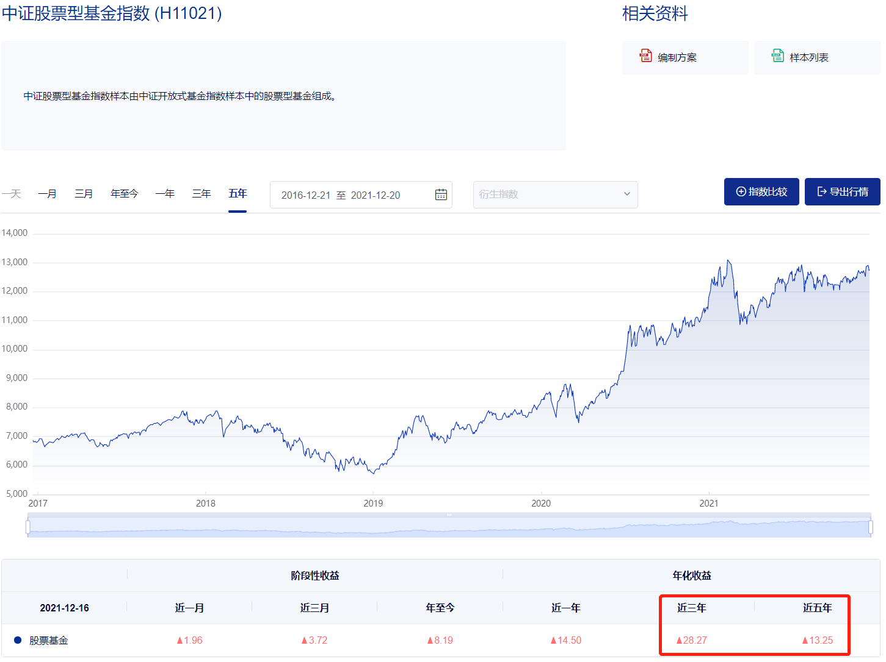
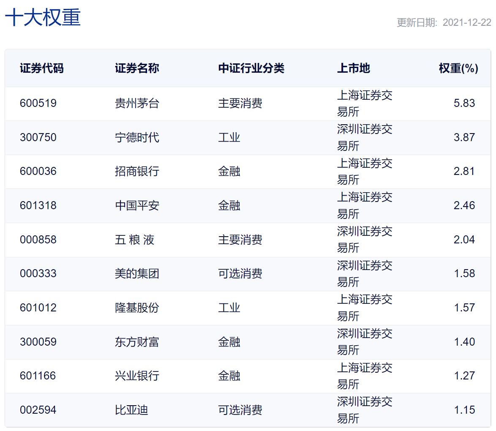
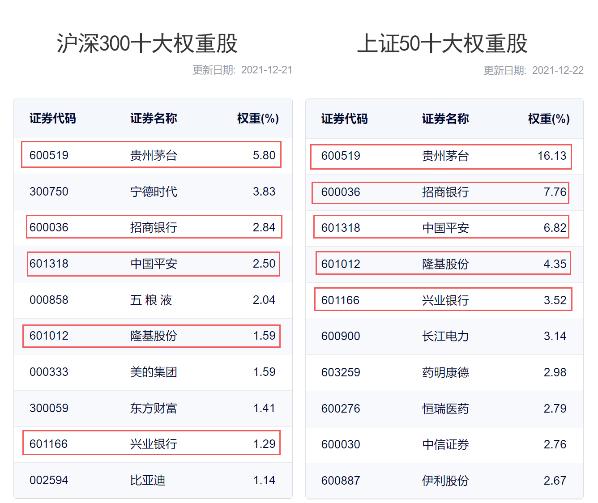
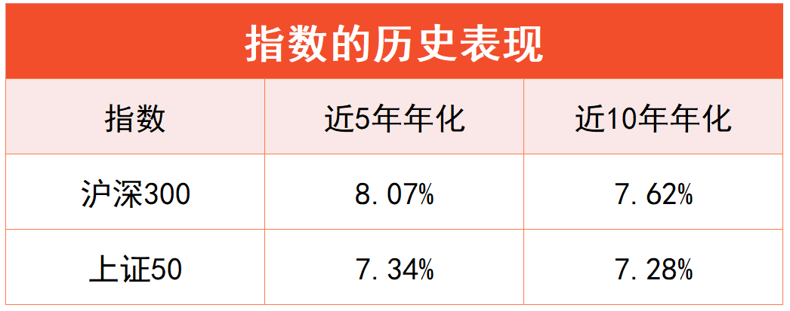

## 长期投资，冲刺高收益

学理财，上水星财富学堂。小伙伴你好，欢迎继续学习《基金会员实战营》

在前面两节课中，我们学习了货币基金和同业存单基金，它们的特点是稳中有赚，都适用于短期闲钱理财。

然而，基金投资可不仅仅是短期理财。如果你有一笔闲钱，想用来长期投资，而且可以承担一定风险，冲刺更高收益，那么货币基金和同业存单基金的“性价比”就不高了。

从这节课开始，你将学到适合长期投资、预期收益更高的基金种类：股票基金。

股票基金 80% 以上的非现金资产都用于投资股票。听到“股票”两个字，想必大家都能理解，股票基金应该是一种高风险、高收益的投资工具。

根据中证指数有限公司官网数据，截止到 2021 年 12 月 20 日，股票基金总体的历史表现出色，近三年的年化收益率达到了 28.27%，近五年的年化收益率达到了 13.25%。

如果你被高收益打动了，请先不要冲动交易。股市短期内涨跌不定，可能出现暴涨暴跌的情形，如果把短期内要用的钱放在股票基金里，等到用钱的那一刻却发现账户亏损，只能忍痛“割肉”，造成不可挽回的损失。

所以，投资于股票基金的必须是“长期闲钱”，万万不可拿短期内要用的钱来进行投机。那么，这里所说的“长期”到底是多久呢？

我们的建议是至少持有 3 年。如果一笔钱在 3 年内用不到，可以考虑用来投资股票基金。根据历史数据，优秀的股票基金，只要持有 3 年，赚钱概率可以达到 90% 以上，有些甚至可以达到 100%。

不过，市面上的股票基金种类繁多，不是随便选一只就能赚钱。到底该从哪里下手呢？

## 被动和主动，区别在哪里？

根据基金经理投资方式的不同，股票基金可以分成三大类：指数基金、指数增强基金和主动型股票基金。

### 第一类，指数基金。

上一节课，我们已经学习了“指数”的概念。所谓的“指数”，可以理解为专业机构挑选出来的一篮子投资对象。

比如同业存单指数，就是一篮子同业存单。本节课要学习的“股票指数”，其实就是一篮子股票。

专业机构编制出股票指数以后，基金经理可以选择跟踪指数进行投资，只需要“依葫芦画瓢”，原样复制指数的成分股。选择这种投资方式的就叫做“指数基金”。

需要大家注意的是，虽然指数“大家族”包含了同业存单指数、债券指数、股票指数等各种各样的类型，但由于股票指数的数量最多，使用最广泛，所以当人们讨论“指数基金”的时候，通常默认是跟踪股票指数的基金。这是一种约定俗成的叫法。

在接下来的课程中，如果出现了“指数基金”的说法，也将默认是跟踪股票指数的基金。

此外，由于基金经理只需要被动地“抄作业”，几乎没有主动发挥的余地，所以指数基金有时也被称为“被动型基金”

### 第二类，指数增强基金。

“指数增强”的意思是，既跟踪指数，做被动投资；同时又留出一定的空间，用来做主动投资。

一般来说，指数增强基金用 80% 以上的资金跟踪指数，同时还保留 20% 以内的资金，由基金经理主动发挥自己的投资水平。这一小部分的主动投资就是基金的“增强”操作。

“增强”的最终目的是提高收益，超越指数本身的表现。

不过，能不能超越指数取决于基金经理的实力。如果主动投资优秀，则可以跑赢指数;如果主动投资较差，则可能“帮倒忙”，最终表现不如指数。

### 第三类，主动型股票基金。

“主动型”的意思是，基金不再跟踪指数，不再进行被动投资，而是完全依靠基金经理的能力进行主动投资。

在基金合同约定的范围内，基金经理可以主动决定投资哪些股票，每只股票投资多少比例。

这类基金对基金经理的实力有特别高的要求。强大的基金经理可以带着投资者“起飞”，收益甩出指数基金八条街;能力有限的基金经理也可能辜负你的期待，给你带来十分平庸的收益，甚至出现不必要的亏损。

综合以上分析，我们可以得出结论

三类股票基金的“风险 - 收益”水平依次提高。在正确投资的前提“下，指数基金可以带给你市场平均水平的收益，避免了基金经理投资能力差的风险，但长期无法超越市场平均水平;指数增强基金、主动型股票基金可以带你战胜指数，超越市场平均水平，冲刺更高收益，但前提
是要选对基金，跟着优秀的基金经理一起赚钱。

在此提醒，三类基金没有好坏之分。每个人的风险偏好和预期收益不同，可以选择的基金也不同。

接下来，我们先来认识股票基金中的“基本款”一指数基金。

指数基金完全复制指数的表现，指数的涨跌会决定你的投资收益。所以，我们要选择历经市场考验的、靠谱的指数。这样的指数有哪些呢？

## 五个常用指数

接下来要介绍的指数，由证券交易所的下属公司权威发布；成立时间均达到 7 年以上；而且受到专业机构投资者的青睐，被大量的基金产品跟踪复制。

它们的名字分别是：沪深 300 指数、上证 50 指数、中证 500 指数、中证 1000 指数和创业板指数。接下来我们逐一认识它们。

### (1) 沪深 300 指数

“沪深 300"堪称市场上最有名的指数之一，由上海和深圳证券市场中市值大、流动性好的 300 只股票组成，综合反映中国 A 股市场。上市股票价格的整体表现。

其中，“A 股”指的是人民币普通股票，大家可以通俗理解为中国境内发行的股票。

股票发行和交易的场所叫做证券交易所，俗称“证券市场”。我国境内目前有三家证券交易所，分别是：上海证券交易所、深圳证券交易所和北京证券交易所，可以简称它们为，上交所、深交所和北交所。

北交所在 2021 年 9 月刚刚成立，暂时无法实现指数化投资。所以，大家在课程中学到的所有指数，都是在上交所和深交所的范围内选择成分股。

由于沪深 300 以“市值大”作为选股标准，所以选出的大都是行业龙头公司的股票，比如大家耳熟能详的贵州茅台、招商银行、中国平安、美的集团，等等。

### (2) 上证 50 指数

上证 50 指数由上海市场中规模大、流动性好的最具代表性的 50 只股票组成。

它和沪深 300 指数有两个最主要的区别：首先，上证 50 的选股范围只聚焦于上海市场，不考虑深圳市场;其次，上证 50 选出的股票总共只有 50 只，而沪深 300 选出的股票有 300 只。

虽然说上证 50 的选股更加集中了，但它的大部分成分股都已经包含在了沪深 300 之中。截止到 2021 年 12 月，两者的前十大权重股中有五只是完全一样的。

这就导致沪深 300 和上证 50 的相关性较高。文稿中展示了两者的历史表现。对比可见，无论是近 5 年还是近 10 年的历史回报，两者的表现都非常接近。

### (3) 中证 500 指数

中证 500 指数由全部 A 股中剔除沪深 300 指数成分股及总市值排名前 300 名的股票后，总市值排名靠前的 500 只股票组成。

如果把股票的市值比作学生的分数，那么沪深 300 选出的就是前 300 名的学生，中证 500 选出的大多数是 301 名到 800 名之间的学生。

有的小伙伴可能会疑惑：既然已经选出了优秀的前 300 名，还有必要选择市值排名靠后的股票吗？

答案是有必要。因为投资赚钱看的是涨幅，就像看一个学生的进步大小。进步越大，我们就越赚。有些学生虽然排名靠后，但进步空间很大，成长也很快。放到投资里来说，中小市值股票也能创造不错的收益。

### (4) 中证 1000 指数

中证 1000 指数选取中证 500 和沪深 300 指数样本股以外的，流动性好的 1000 只股票组成，与沪深 300 和中证 500 形成互补。

如果说中证 500 选出的大多数是 301 名到 800 名的学生，那么中证 1000 选出的就是 801 名到 1800 名的学生。

### (5) 创业板指数

创业板指数由创业板市场中选取的 100 只股票组成，反映创业板市场的运行情况。

什么是创业板市场呢？

简而言之，如果一家公司想在上交所或深交所上市，就必须满足一系列严格的条件，比如连续多年盈利等。公司上市的主战场叫做“主板”，是上市要求最严格的板块。不过，国内还有很多公司暂时达不到主板上市的条件，但发展势头良好，目前处在创业或快速扩张阶段，急需拿到融资。为了让这些公司也能在股市融资，国家就在主板之外设立了一些其他板块，创业板就是其中之一

创业板是深交所开设的一个板块。相较于主板，创业板没有那么成熟稳定，很多公司还在创业成长期，成立时间相对较短，市值相对较小。但是，它们大多数都是开展高科技业务的公司，成长速度快，未来潜力巨大。

五个指数已经全部介绍完毕。如果对它们加以归类，可以分成两大类：沪深 300 指数、上证 50 指数由于成分股市值偏大，通常归为“大盘指数”;中证 500、中证 1000 和创业板指由于成分股市值偏小，通常归为“中小盘指数”

需要提醒大家的是，指数家族成员众多，市面上的指数有成百上千个，普通投资者精力有限，实战中很难做到全部覆盖。

但是大家不必担心，以上五个指数足以帮助大家化繁为简，轻松开启指数化投资实战。这就像学习武术的过程一样，先把最基本的弓步、马步学到家，其他技能都将水到渠成。

本节课的内容到此结束。最后做一下总结。

## 总结

1.股票基金的预期收益高于货币基金和同业存单基金，适合拿出 2 年内用不到的闲钱，进行长期投资。

2.股票基金可以分成三大类：指数基金、指数增强基金、主动型股票基金。它们的“风险 - 收益”水平依次提高。在正确投资的前提下，指数基金可以带给你市场平均水平的收益;指数增强基金、主动型股票基金可以带你战胜指数，超越市场平均水平。

3.国内五个常用的指数为：沪深 300、上证 50、 中证 500、中证 1000、 创业板指。

4.沪深 300、上证 50 属于“大盘指数”;中证 500、中证 1000 和创业板指属于“中小盘指数”。

最后提醒大家：五个指数的表现并不同步，我们不需要一次性全部选择，只需要选择当下“性价比”最高的就可以了。具体如何选择呢？接下来的课程将为你揭晓答
