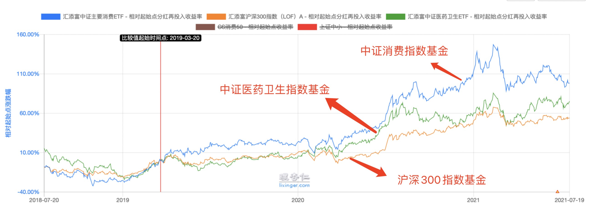
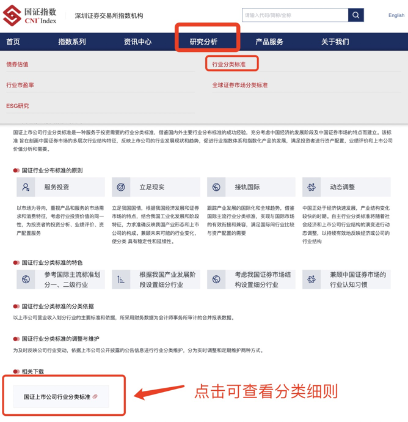
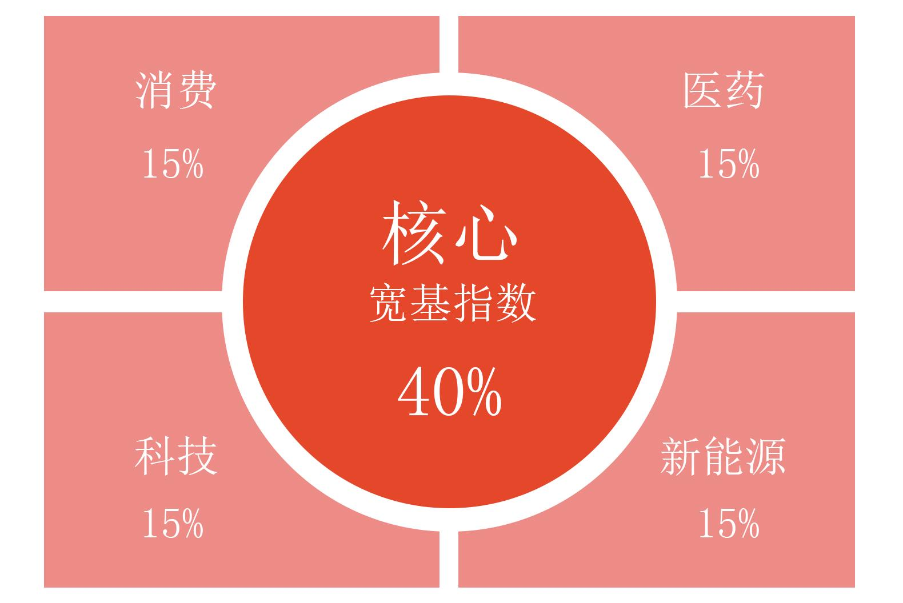
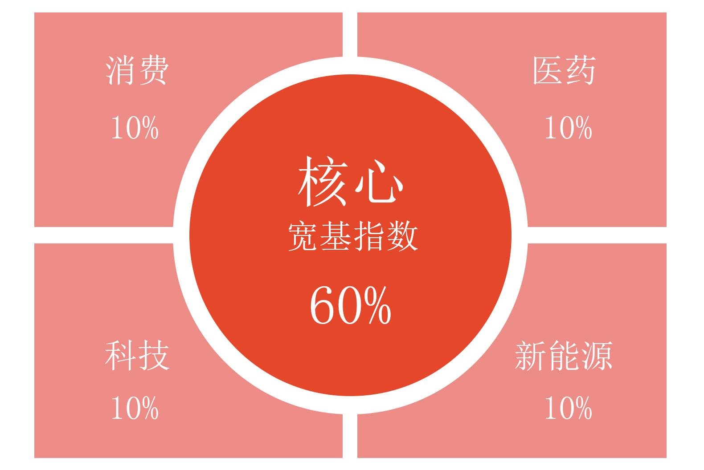
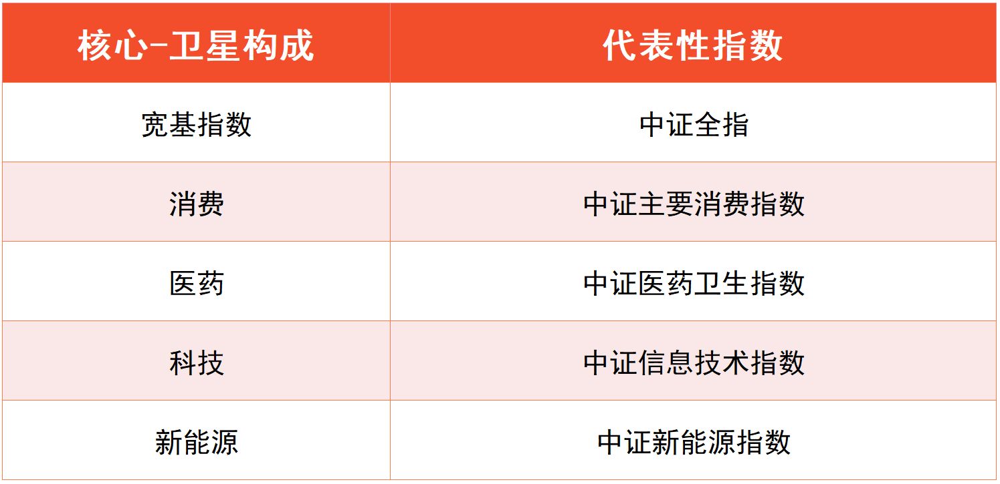
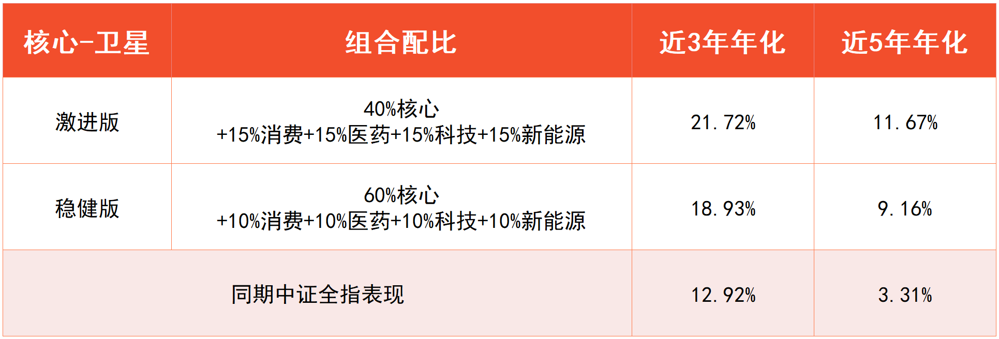
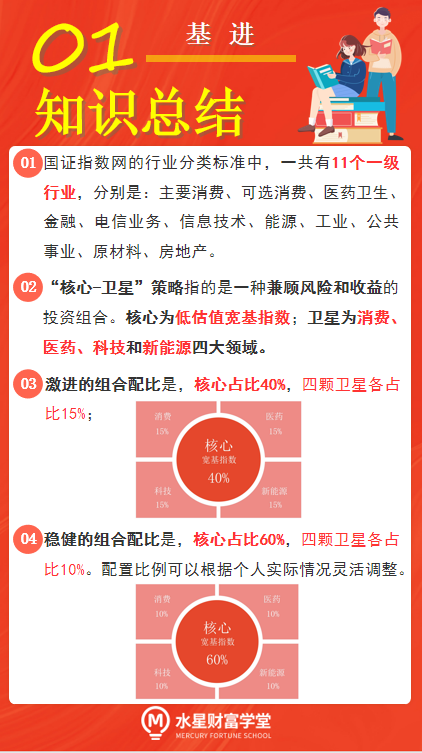
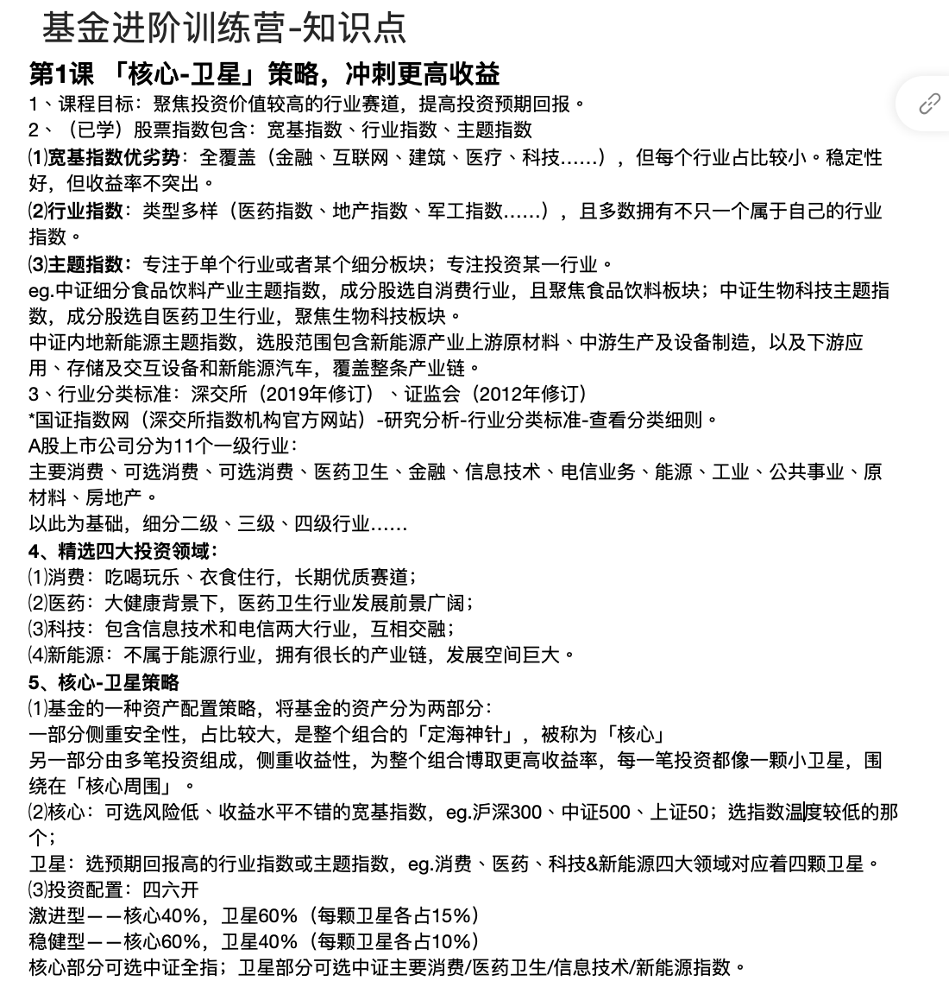
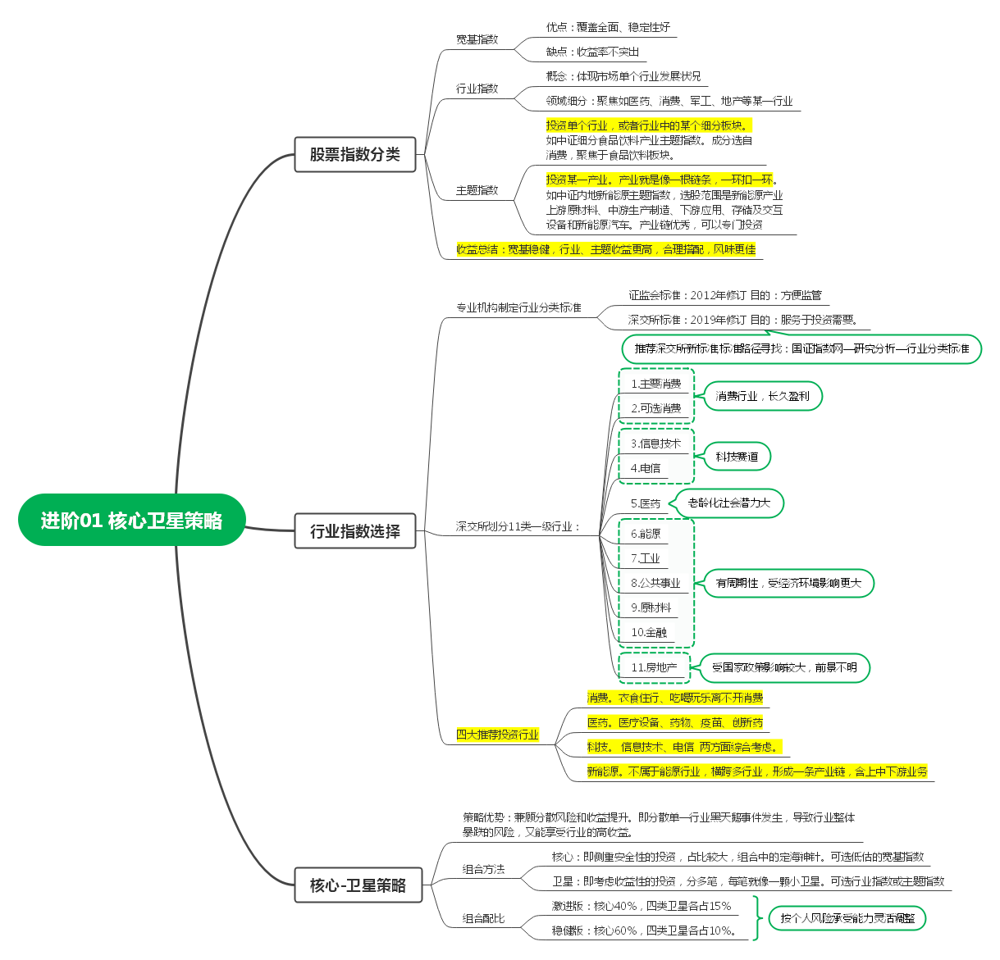

## 巧选指数, 聚焦优质赛道

小伙伴们你们好, 欢迎来到《基金进阶训练营》. 进阶课将和初级课无缝衔接, 带领大家向更高收益冲刺.

我们在初级课已经学习过, 股票指数包含了三大类, 分别是宽基指数、行业指数和主题指数. 而且, 我们重点介绍了 8 个宽基指数.

宽基的优势在于全覆盖, 金融、互联网、建筑、医疗、科技等等, 各行各业的代表都有. 可正是因为覆盖行业多, 所以每个行业的占比都比较小.

虽然不会因为一个行业出现负面事件而受到巨大影响, 但是某个行业收益非常突出时, 也会被其他表现不好的行业"拖后腿", 最终拉低收益率. 也就是说, 宽基指数稳定性好, 但是收益率不突出.

所以, 来到进阶课以后, 我们将专门聚焦一批投资价值较高的行业赛道, 提高投资的预期回报.

想要实现这个目标, 行业指数、主题指数都可以用起来啦.

其中最典型的是行业指数, 也就是可以体现市场上单个行业发展状况的指数.

行业指数的类型比较多样, 包括医药指数、地产指数、军工指数等等, 大多数行业都有不止一个属于自己的行业指数.

行业指数的优势在于如果某个行业正处于高速发展阶段, 那么相关的行业指数都会有非常不错的表现, 投资者的收益会非常可观

比如 2020 年走势非常迅猛的消费行业、因为疫情爆火的医疗行业. 大家可以看文稿中的图片, 中证主要消费指数完全"吊打"沪深 300 指数.

除了行业指数以外, 还有很多优秀的主题指数, 也可以帮我们专注于投资单个行业, 或者行业中的某个细分板块.

比如"中证细分食品饮料产业主题指数", 它的成分股选自消费行业, 而且聚焦于食品饮料这个板块; 再比如"中证生物科技主题指数", 它的成分股选自医药卫生行业, 而且聚焦于生物科技这个板块.

除此之外, 主题指数还可以帮我们专注于投资某一产业. 所谓的产业, 就像一根链条, 一环扣一环.

比如"中证内地新能源主题指数", 它选股的范围是新能源产业上游原材料、中游生产及设备制造, 以及下游应用、存储及交互设备和新能源汽车. 虽然没有聚焦单一行业, 但是它把整条产业链全覆盖了. 如果产业链非常优质, 我们就可以专门投资相应的指数.

总的来说, 我们在选择宽基指数的同时, 也需要选择一些行业指数和主题指数, 让收益更加漂亮. 小学生才做选择题, 我们成年人全都要!

## 三百六十行, 我该选哪个?

俗话说"三百六十行, 行行出状元", 市面上有那么多行业, 研究起来岂不是很复杂?

大家放心, 很多机构早就制定了行业分类标准, 帮我们解决了这个麻烦.

比如, 证监会和深交所都放出了自己的行业分类标准.

学长更推荐大家选择深交所的行业分类标准. 因为, 证监会的标准是 2012 年修订的, 深交所的标准是 2019 年修订的, 近期修订的行业标准更能代表行业现状.

而且, 证监会和深交所给行业分类的目的也不同. 证监会的行业分类标准, 更多是为了方便监管; 深交所的行业分类标准, 直接服务于投资需要.

大家可以在浏览器搜索[国证指数网](http://www.cnindex.com.cn/), 进入网站首页, 点击顶部菜单的"研究分析", 选择"行业分类标准", 就能找到分类细则了. 具体位置大家可以参考文稿中的图片.

国证指数网是深交所指数机构的官方网站, 这一点在初级课已经介绍过啦. 它借鉴了国外对主流行业的分类方法, 将 A 股上市公司分为 11 个一级行业, 分别是:

主要消费、可选消费、医药卫生、金融、信息技术、电信业务、能源、工业、公共事业、原材料、房地产.

在一级行业的基础上, 还可以进一步细分出二级行业、三级行业甚至四级行业. 到四级行业这一层, 就已经有 164 个子行业啦. 这么多行业, 难道我们要一一研究清楚吗?

其实不需要那么复杂, 投资时, 我们可以"抓大放小", 在 11 个一级行业里, 排除投资价值不高的, 保留那些长期盈利稳定、成长性好的, 再进行深入的研究.

课程为大家精选了四大投资领域.

### 第一个是消费.

消费与我们的生活密不可分. 我们的衣食住行、吃喝玩乐, 都会涉及到消费行业. 人们持久稳定且源源不断的需求, 使消费行业成为长期优质赛道.

### 第二个是医药.

医药是未来十年的黄金赛道, 2020 年的疫情加快了全世界对于医疗设备、药物、疫苗的需求. 各种疑难杂症, 也促使着创新药的快速发展. 人们对于健康的需求, 让医药卫生行业发展前景广阔.

### 第三个是科技.

科技包含了信息技术和电信两大行业, 它们两个难分难舍, 比如, 5G 通信属于电信行业, 而 5G 中要用到的半导体芯片, 属于信息技术行业. 所以, 我们不妨把两大行业综合起来考虑. 其中蕴含着大量的投资机会

### 第四个是新能源.

大家注意, 新能源可不属于能源行业哦. 第一小节已经提到, 新能源是一条相当长的产业链, 横跨了很多个行业. 比如, 生产锂电池所需的锂, 属于原材料行业; 相关设备的生产制造, 属于工业行业; 销售新能源汽车, 属于消费行业, 等等. 由于新能源拥有巨大的发展空间, 所以它值得单独作为一个研究领域, 让我们深入挖掘投资机会.

还有一些行业, 课程不进行专门讲解. 这里也说一下原因.

比如能源、原材料和金融这 3 个行业, 周期性太强, 受经济环境影响较大, 只有阶段性行情, 缺乏持续盈利的能力.

再比如公共事业行业, 主要指大家生活中常用的水、电、燃气等, 这些也存在一定的周期性, 经济发展快, 水电气的消耗大; 经济发展慢, 水电气的消耗小. 而且, 这些行业的盈利受到政策的限制, 从投资的角度来说算不上好生意.

最后是房地产行业, 最近几年都没有翻过身, 目前已经有各种政策限制, 行业前景不明, 我们也不考虑.

下一小节, 我们将把消费、医药、科技和新能源四大领域, 与宽基指数结合起来, 共同组成一个投资组合. 这就是经典的"核心-卫星"策略.

## "核心-卫星"策略

前面我们已经了解到, 聚焦专门的行业或产业, 有利于提高投资回报. 专一虽好, 但也有劣势. 如果出现了影响整个行业或产业的大事件, 那么相关股票就会集体"扑街".

比如, 2008 年的毒奶粉事件, 让整个乳制品行业受到重创; 2012 年酒鬼酒的"塑化剂"事件, 让整个白酒行业受到重创, 就连龙头茅台都受此影响, 下跌了 50%. 曾经的小甜甜, 转眼就成了牛夫人.

那么, 有没有办法, 既可以分散单一领域暴跌的风险, 又能享受到它们所带来的更高回报呢?

有这样一个策略, 可以兼顾风险分散和收益提升, 它就是:"核心-卫星"策略.

"核心-卫星"策略是基金的一种资产配置策略, 通俗点来说, 就是将基金的资产分成两个部分.

其中一部分侧重于考虑安全性, 所占的比重较大, 是整个组合的"定海神针", 被称为"核心".

另一部分由多笔投资组成, 这些投资侧重于考虑收益性, 为整个组合博取更高的收益率, 每一笔投资都像是一颗小小的卫星, 围绕在"核心"的周围, 因此被称为"卫星".

我们也可以用"核心-卫星"策略, 来配置资产组合, 分散单一领域的投资风险.

核心部分, 可以选择风险低、收益水平也不错的宽基指数. 比如, 沪深 300、中证 500、上证 50.

在选择的时候要特别注意, 如果选择估值过高的宽基指数, 基金下跌风险较大, 那么"定海神针"便失去了它的作用. 初级课介绍过 8 个宽基指数, 大家可以参考指数温度, 选择温度较低的那一个.

卫星部分, 可以选择预期回报更高的行业指数或主题指数. 在第二小节, 我们已经确定了消费、医药、科技和新能源四大领域. 四大领域对应着四颗卫星. 每个领域都有很多对应的指数, 我们在后续的课程中会详细介绍指数如何筛选, 如何估值.

为了兼顾组合的稳定和收益, 在"核心-卫星"策略中, 我们可以采用"四六开"的分配方案.

如果你的投资风格偏激进, 可以让核心部分占整个组合的 40%, 卫星部分占整个组合的 60%. 其中, 每颗卫星各占 15%.

如果你的投资风格偏稳健, 可以让核心部分占整个组合的 60%, 卫星部分占整个组合的 40%. 其中, 每颗卫星各占 10%.

这样的组合到底能不能带来更高的回报呢? 我们可以找相应的指数, 回测一下组合的历史表现.

核心部分可以选取中证全指. 该指数几乎覆盖了整个 A 股市场的所有股票, 只有少部分濒临退市的股票、或者上市时间不足 3 个月的股票没有纳入成分. 不论大盘还是中小盘, 也不论上海市场还是深圳市场, 都涵盖在里面, 所以, 中证全指具有较高的市场代表性.

卫星部分可以选取中证主要消费指数、中证医药卫生指数、中证信息技术指数和中证新能源指数. 这些指数基本可以代表相关领域的整体表现.

课程分别对激进和稳健两种"核心-卫星"组合进行了回测, 统计时间为 2021 年 7 月 20 日.

近 3 年的业绩回测中, 激进版"核心-卫星"策略的年化收益率是 21.72%, 稳健版"核心-卫星"策略的年化收益率是 18.93%, 而同期中证全指的年化收益率只有 12.92%.

近 5 年的业绩回测中, 激进版"核心-卫星"策略的年化收益率是 11.67%, 稳健版"核心-卫星"策略的年化收益率是 9.16%, 而同期中证全指的年化收益率只有 3.31%.

可见, "核心-卫星"策略对提升投资收益有效.

有的小伙伴可能会觉得, 既然指数都已经有了, 那就直接查一查相应的基金, 按照比例买起来就可以啦.

大家可不要着急下手呀. 首先, 我们前面回测用到的指数, 只能代表相关产业或行业的整体表现, 实际上各个行业都有一些细分的优质赛道, 可以选出更有投资价值的指数哦. 其次, 行业指数、主题指数的估值, 和初级课所讲的"指数温度"有些差别. 这些都会在后续的课程中详细介绍.

## 总结

1. 国证指数网的行业分类标准中, 一共有 11 个一级行业, 分别是: 主要消费、可选消费、医药卫生、金融、电信业务、信息技术、能源、工业、公共事业、原材料、房地产.
2. "核心-卫星"策略指的是一种兼顾风险和收益的投资组合. 核心为低估值宽基指数; 卫星为消费、医药、科技和新能源四大领域.
3. 激进的组合配比是, 核心占比 40%, 四颗卫星各占比 15%; 稳健的组合配比是, 核心占比 60%, 四颗卫星各占比 10%. 配置比例可以根据个人实际情况灵活调整.

