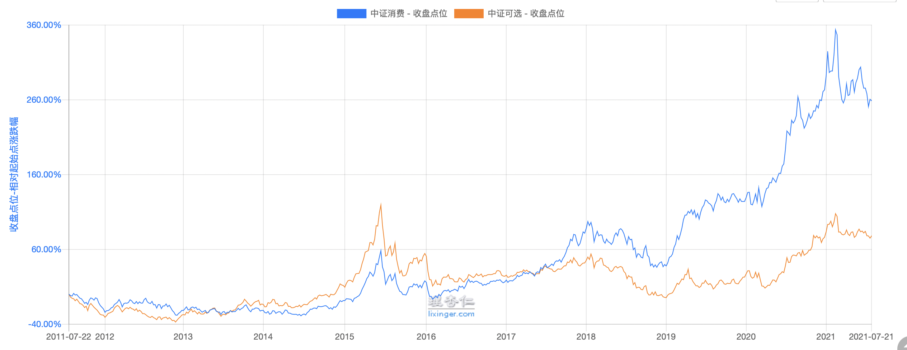
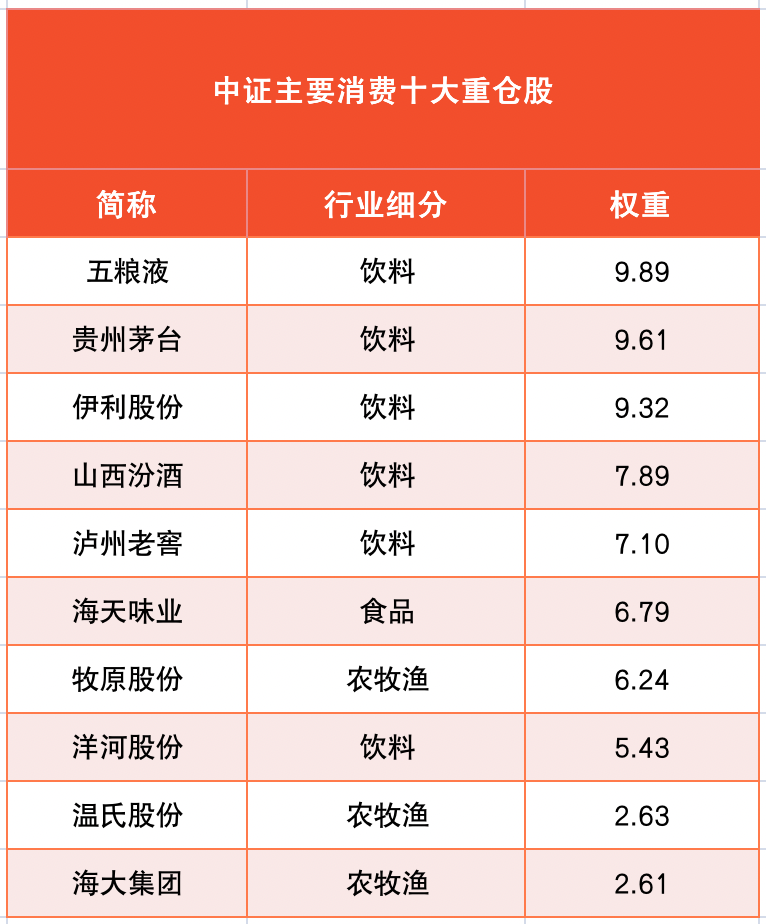
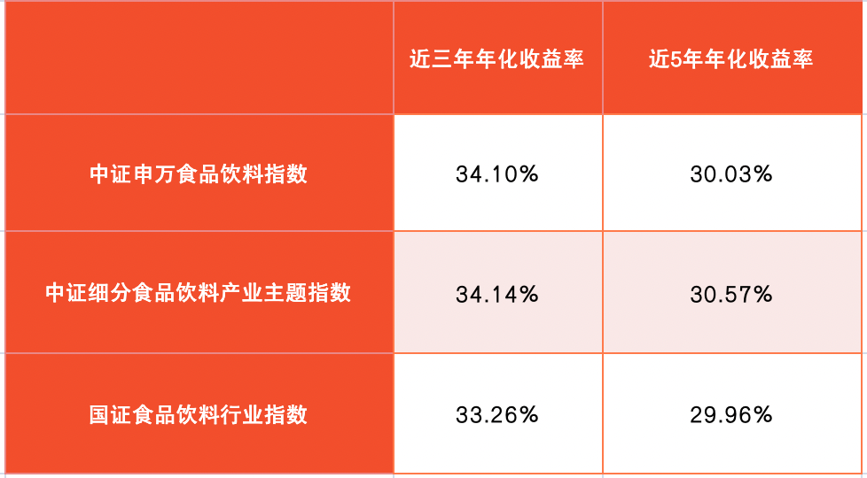
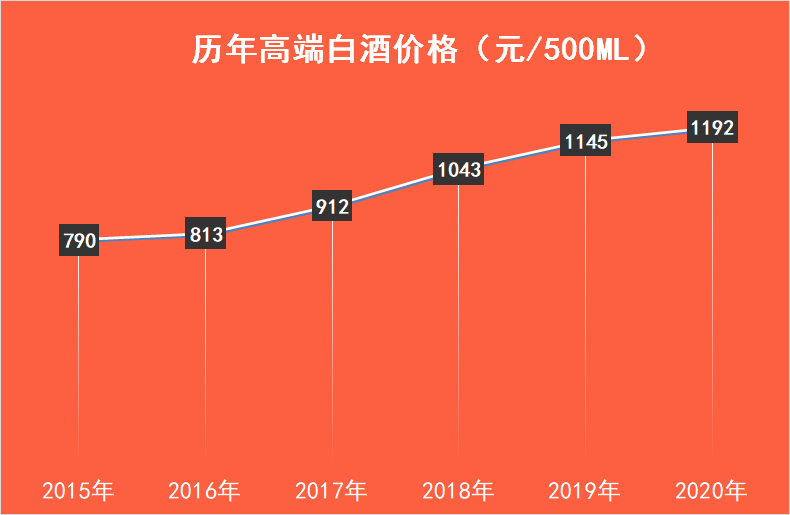
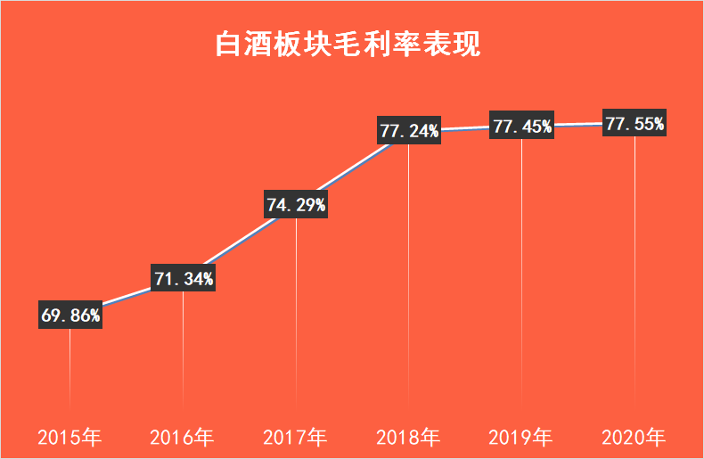
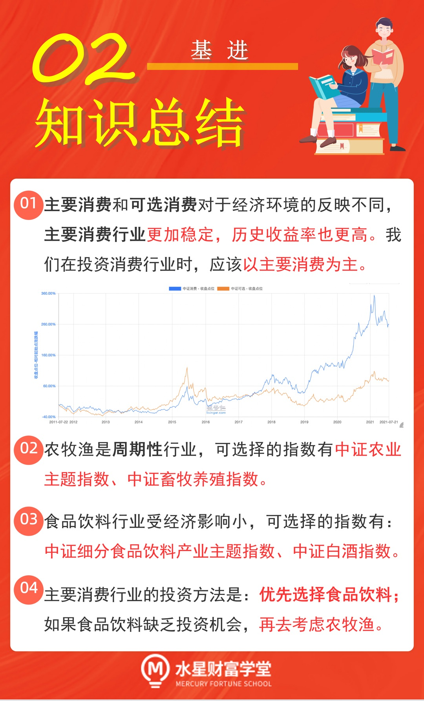

## 主要消费, 还是可选消费?

上节课, 我们学习了"核心-卫星"策略. 其中, 消费、医药、科技和新能源共同组成了卫星部分.

在接下来的课程中, 我们将深入了解这四颗卫星. 本节课, 我们先来认识第一颗卫星一消费.

消费行业与我们的生活密切相关, 只要人活着, 就会对衣食住行、吃喝玩乐有需求. 只要有需求, 就会购买相关公司的产品, 消费行业就会经久不衰.

换句话说, 消费行业有着持续且稳定的发展空间, 可以长期盈利, 非常适合投资.

不过, 消费行业其实分了两个, 一个是主要消费, 另一个是可选消费.

主要消费, 就是咱们生活里必须进行的消费, 包括食品饮料、家庭用品、个人用品以及农牧产品. 一句话概括就是, 主要消费指的是你生活中一定会用到, 不花钱不行的那些方面.

可选消费正好反过来, 指的是可花钱, 也可不花钱的方面, 有了更好, 没有的话影响也不大. 比如汽车、奢侈品包包等. 这些都是可有可无的, 属于可选消费.

为什么要特别区分主要消费和可选消费呢?

这是因为, 两种消费对经济环境的反应不一样, 导致历表现不一样, 投资方法也不一样.

主要消费受经济环境的影响比较小, 可选消费受经济环境的影响比较大.

举个例子, 2020 年疫情期间, 大家不能出门, 还有很多人面临失业, 消费欲望普遍降低, 买车之类的想法都暂时搁置了; 而且, 看电影、旅游之类的行为, 也受到了外界阻碍. 所以, 这段时期, 可选消费受到了很大的影响, 行业不太景气.

但是, 同样的时间段, 卖米、卖面、卖卫生纸的却几乎没有受到影响, 虽然大家收入少了, 可还是要保证日常生活的呀.

从投资的角度来看, 主要消费行业长期保持相对稳定地上涨. 而可选消费会随着经济、政策的变化, 波动相对剧烈, 表现时好时坏.

文稿中展示了主要消费和可选消费过去 10 年的历史走势中, 主要消费的涨幅为 258.77% , 可选消费的涨幅为 77.98%.(数据来源: 理杏仁)

可以看出, 主要消费不仅长期表现稳定, 且收益率也更有优势.

根据国证指数网的行业分类标准, 主要消费行业又被分为: 食品与主要用品零售、农牧渔产品、食品饮料与烟草、家庭与个人用品这四个大类.

目前, 食品与主要用品零售、家庭与个人用品缺少相应的指数基金, 无法进行单独投资. 所以, 我们把目光紧焦在农牧渔产品、食品饮料与烟草这两类行业上. 实际上, 中证主要消费指数的成分股, 也是以这两个行业为主的.

(统计时间:2021 年 7 月 20 日; 数据来源: 中证指数有限公司)

接下来, 我们就一起走进农牧渔和食品饮料两大赛道.

## 顺周期赚钱的农牧渔

农牧渔的最大特点是周期性强.

以生猪养殖为例: 生活中我们明显可以感觉到, 猪肉的价格每隔几年, 就会有比较大的浮动, 便宜的时候只有十几块钱, 贵的时候甚至接近四十块钱. 这就是猪周期的一种体现.

猪肉价格上涨, 就会促使更多农户养猪, 进而行业产能上涨. 等猪崽长大成熟了, 就出现了猪肉供大于求的情况, 猪肉卖不完, 价格就持续下跌.

价格下跌, 农们能赚的钱越来越少, 产积极性降低, 行业产能下降, 于是又回到了猪肉紧缺, 价格上涨. 这一个循环, 我们称为"猪周期".

周期性行业无法持续稳定地赚钱, 周期下行的那几年时间很难获得盈利. 相关指数基金近五年的历史年化收益大都不到 10%. 所以更推荐大家配置周期性弱、盈利更稳定持久的食品饮料行业. 食品饮料近五年的历史年化收益率在 30%左右(数据来源: 中证指数有限公司). 我们会在下一小节重点学习.

不过, 当食品饮料行业找不到合适的投资机会, 或者农牧渔在上行周期时, 投资农牧渔行业也是一个不错的选择.

和农牧渔相关的指数有: 中证农业主题指数、中证大农业指数、中证畜牧养殖指数.

两个与农业相关的指数, 我们优先选择中证农业主题指数, 因为这个指数在 2009 年成立, 而中证大农业指数在 2014 年才成立. 成立时间越久, 对市场的反映情况越完全, 分位点估值也越准确.

文稿中为大家展示了跟踪相关指数的基金. 中证农业主题指数的相关基金有 3 只, 中证畜牧养殖指数的相关基金有 5 只.

大家可以根据初级课筛选指数基金的步骤, 看基金规模、跟踪误差和是否增强, 最后做出选择. 由于相关基金成立时间较晚, 大部分都是 2020 年以后才成立的, 缺乏跟踪误差数据, 所以, 大家重点根据基金规模选择就可以啦.

需要注意的是, 课程统计时间难免存在滞后性, 无法传达实时的基金数量和基金规模, 小伙伴们要亲自做一遍筛选步骤哦.

## 历史年化 30%+的食品饮料

俗话说, 民以食为天. 只要活着, 我们就要吃喝. 这也造就了食品饮料行业的一大特点: 它是大众的刚需, 受经济影响小.

我们直接来看和食品饮料相关的指数, 它们分别是: 中证申万食品饮料指数、中证细分食品饮料产业主题指数、中证食品饮料指数、国证食品饮料行业指数.

其中, 中证食品饮料指数成立于 2015 年, 其余 3 个指数都成立于 2012 年. 成立时间越久, 分位点估值越有说服力, 所以, 我们首先排除成立时间较晚的中证食品饮料指数.

进一步比较历史年化收益率, 可以发现, 剩下 3 个指数的收益水平差距不大. 近 3 年的年化收益率在 34%左右, 近 5 年的年化收益率在 30%左右.( 数据来源: 中证指数有限公司)

相比之下, 中证细分食品产业主题指数的相关基金产品更多一点, 选择面更广, 所以我们优先考虑它. 大家需要注意, 虽然这些指数叫做"食品饮料", 但是其中酒类常年占据 60%以上的比例, 食品类比不到 40%. 如果大家想更纯粹地投资酒类, 可以聚焦接下来的两个酒指数.

说到酒的投资, 大家一定不陌生, 就算没有自己投资过, 也一定听过白酒股的传说. 实在投资中, 酒也有很多分类: 白酒、啤酒、黄酒、葡萄酒. 但是最为投资者熟知的、盈利能力最强的, 还要数白酒.

尤其是高端白酒, 品牌效应特别强, 消费者愿意为高端品牌付出更高的价格. 而且, 2015 年以来, 高端酒的价格也在连年上涨.

这就导致, 白酒板块的毛利率逐年提升, 白酒生意中的"油水"越来越大. 从投资的角度讲, 这是一门好生意.

酒类的相关指数有两个, 分别是中证酒指数、中证白酒指数.

这两个指数都涉及到白酒, 中证酒指数以白酒主, 还涉汲到啤酒、葡萄酒等. 中证白酒指数只涉及到白酒.

我们不如选择聚焦白酒的中证白酒指数. 中证细分食品饮料产业主题指数和中证白酒指数的相关基金, 文稿中已经为大家整理好了. 大家可以根据初级课学到的筛选规则进行选择.

细心的小伙伴可能想问: 这些指数应该怎么估值, 怎么判断买入时机呢?

关于估值的问题, 我们会在四颗卫星全部配齐以后, 一次性学习给所有的指数估值. 请小伙伴们保持期待!

## 总结

1. 主要消费和可选消费对于经济环境的反映不同, 主要消费行业更加稳定, 历史收益率也更高. 我们在投资消费行业时, 应该以主要消费为主.
2. 农牧渔是周期性行业, 可选择的指数有中证农业主题指数、中证畜牧养殖指数.
3. 食品饮料行业受经济影响小, 可选择的指数有: 中证细分食品饮料产业主题指数、中证白酒指数.
4. 主要消费行业的投资方法是: 优先选择食品饮料; 如果食品饮料缺乏投资机会, 再去考虑农牧渔.

