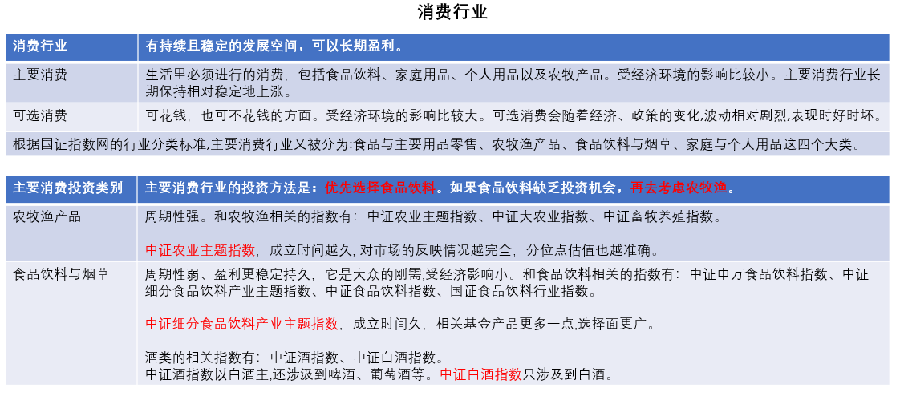
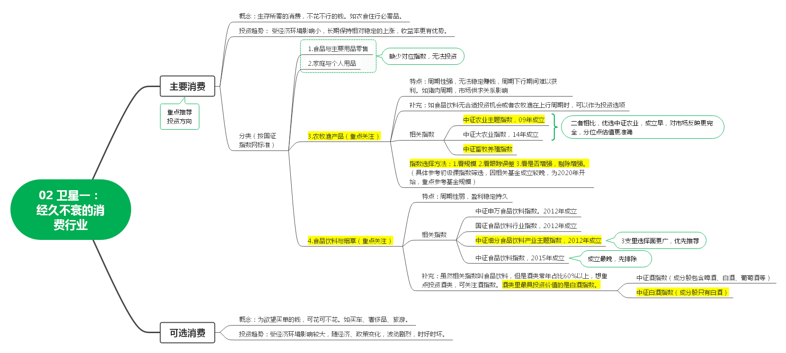
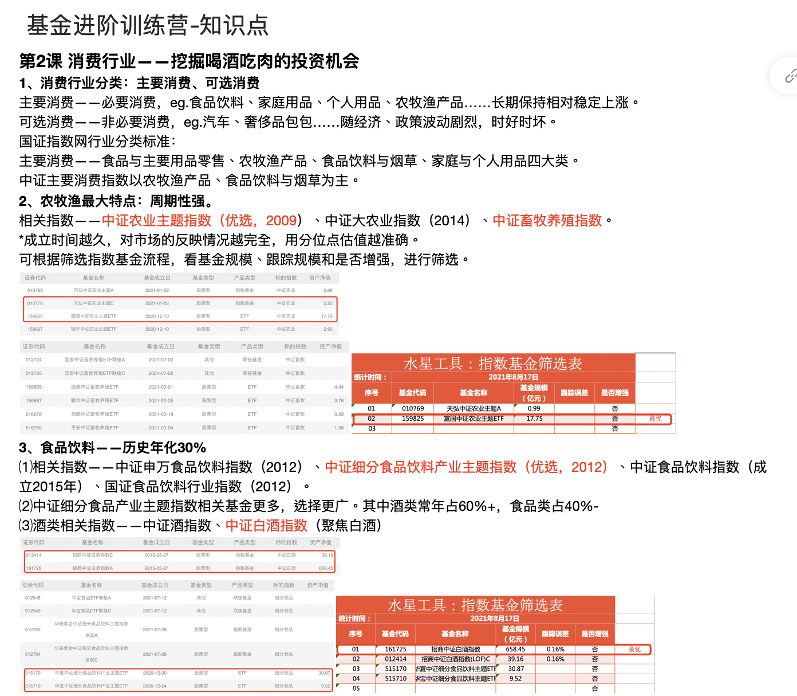

## 主要消费, 还是可选消费?

上节课, 我们学习了"核心-卫星"策略. 其中, 消费、医药、科技和新能源共同组成了卫星部分.

在接下来的课程中, 我们将深入了解这四颗卫星. 本节课, 我们先来认识第一颗卫星一消费.

消费行业与我们的生活密切相关, 只要人活着, 就会对衣食住行、吃喝玩乐有需求. 只要有需求, 就会购买相关公司的产品, 消费行业就会经久不衰.

换句话说, 消费行业有着持续且稳定的发展空间, 可以长期盈利, 非常适合投资.

不过, 消费行业其实分了两个, 一个是主要消费, 另一个是可选消费.

主要消费, 就是咱们生活里必须进行的消费, 包括食品饮料、家庭用品、个人用品以及农牧产品. 一句话概括就是, 主要消费指的是你生活中一定会用到, 不花钱不行的那些方面.

可选消费正好反过来, 指的是可花钱, 也可不花钱的方面, 有了更好, 没有的话影响也不大. 比如汽车、奢侈品包包等. 这些都是可有可无的, 属于可选消费.

为什么要特别区分主要消费和可选消费呢?

这是因为, 两种消费对经济环境的反应不一样, 导致历史表现不一样, 投资方法也不一样.

主要消费受经济环境的影响比较小, 可选消费受经济环境的影响比较大.

举个例子, 2020 年疫情期间, 大家不能出门, 还有很多人面临失业, 消费欲望普遍降低, 买车之类的想法都暂时搁置了; 而且, 看电影、旅游之类的行为, 也受到了外界阻碍. 所以, 这段时期, 可选消费受到了很大的影响, 行业不太景气.

但是, 同样的时间段, 卖米、卖面、卖卫生纸的却几乎没有受到影响, 虽然大家收入少了, 可还是要保证日常生活的呀.

从投资的角度来看, 主要消费行业长期保持相对稳定地上涨. 而可选消费会随着经济、政策的变化, 波动相对剧烈, 表现时好时坏.

文稿中展示了主要消费和可选消费过去 10 年的历史走势中, 主要消费的涨幅为 258.77% , 可选消费的涨幅为 77.98%.(数据来源: 理杏仁)

可以看出, 主要消费不仅长期表现稳定, 且收益率也更有优势.

根据国证指数网的行业分类标准, 主要消费行业又被分为: 食品与主要用品零售、农牧渔产品、食品饮料与烟草、家庭与个人用品这四个大类.

目前, 食品与主要用品零售、家庭与个人用品缺少相应的指数基金, 无法进行单独投资. 所以, 我们把目光紧焦在农牧渔产品、食品饮料与烟草这两类行业上. 实际上, 中证主要消费指数的成分股, 也是以这两个行业为主的.

(统计时间:2021 年 7 月 20 日; 数据来源: 中证指数有限公司)

接下来, 我们就一起走进农牧渔和食品饮料两大赛道.

## 顺周期赚钱的农牧渔

农牧渔的最大特点是周期性强.

以生猪养殖为例: 生活中我们明显可以感觉到, 猪肉的价格每隔几年, 就会有比较大的浮动, 便宜的时候只有十几块钱, 贵的时候甚至接近四十块钱. 这就是猪周期的一种体现.

猪肉价格上涨, 就会促使更多农户养猪, 进而行业产能上涨. 等猪崽长大成熟了, 就出现了猪肉供大于求的情况, 猪肉卖不完, 价格就持续下跌.

价格下跌, 农们能赚的钱越来越少, 产积极性降低, 行业产能下降, 于是又回到了猪肉紧缺, 价格上涨. 这一个循环, 我们称为"猪周期".

周期性行业无法持续稳定地赚钱, 周期下行的那几年时间很难获得盈利. 相关指数基金近五年的历史年化收益大都不到 10%. 所以更推荐大家配置周期性弱、盈利更稳定持久的食品饮料行业. 食品饮料近五年的历史年化收益率在 30%左右(数据来源: 中证指数有限公司). 我们会在下一小节重点学习.

不过, 当食品饮料行业找不到合适的投资机会, 或者农牧渔在上行周期时, 投资农牧渔行业也是一个不错的选择.

和农牧渔相关的指数有: 中证农业主题指数、中证大农业指数、中证畜牧养殖指数.

两个与农业相关的指数, 我们优先选择中证农业主题指数, 因为这个指数在 2009 年成立, 而中证大农业指数在 2014 年才成立. 成立时间越久, 对市场的反映情况越完全, 分位点估值也越准确.

文稿中为大家展示了跟踪相关指数的基金. 中证农业主题指数的相关基金有 3 只, 中证畜牧养殖指数的相关基金有 5 只.

大家可以根据初级课筛选指数基金的步骤, 看基金规模、跟踪误差和是否增强, 最后做出选择. 由于相关基金成立时间较晚, 大部分都是 2020 年以后才成立的, 缺乏跟踪误差数据, 所以, 大家重点根据基金规模选择就可以啦.

需要注意的是, 课程统计时间难免存在滞后性, 无法传达实时的基金数量和基金规模, 小伙伴们要亲自做一遍筛选步骤哦.

## 历史年化 30%+的食品饮料

俗话说, 民以食为天. 只要活着, 我们就要吃喝. 这也造就了食品饮料行业的一大特点: 它是大众的刚需, 受经济影响小.

我们直接来看和食品饮料相关的指数, 它们分别是: 中证申万食品饮料指数、中证细分食品饮料产业主题指数、中证食品饮料指数、国证食品饮料行业指数.

其中, 中证食品饮料指数成立于 2015 年, 其余 3 个指数都成立于 2012 年. 成立时间越久, 分位点估值越有说服力, 所以, 我们首先排除成立时间较晚的中证食品饮料指数.

进一步比较历史年化收益率, 可以发现, 剩下 3 个指数的收益水平差距不大. 近 3 年的年化收益率在 34%左右, 近 5 年的年化收益率在 30%左右.( 数据来源: 中证指数有限公司)

相比之下, 中证细分食品产业主题指数的相关基金产品更多一点, 选择面更广, 所以我们优先考虑它. 大家需要注意, 虽然这些指数叫做"食品饮料", 但是其中酒类常年占据 60%以上的比例, 食品类比不到 40%. 如果大家想更纯粹地投资酒类, 可以聚焦接下来的两个酒指数.

说到酒的投资, 大家一定不陌生, 就算没有自己投资过, 也一定听过白酒股的传说. 其实在投资中, 酒也有很多分类: 白酒、啤酒、黄酒、葡萄酒. 但是最为投资者熟知的、盈利能力最强的, 还要数白酒.

尤其是高端白酒, 品牌效应特别强, 消费者愿意为高端品牌付出更高的价格. 而且, 2015 年以来, 高端酒的价格也在连年上涨.

这就导致, 白酒板块的毛利率逐年提升, 白酒生意中的"油水"越来越大. 从投资的角度讲, 这是一门好生意.

酒类的相关指数有两个, 分别是中证酒指数、中证白酒指数.

这两个指数都涉及到白酒, 中证酒指数以白酒为主, 还涉汲到啤酒、葡萄酒等. 中证白酒指数只涉及到白酒.

我们不如选择聚焦白酒的中证白酒指数. 中证细分食品饮料产业主题指数和中证白酒指数的相关基金, 文稿中已经为大家整理好了. 大家可以根据初级课学到的筛选规则进行选择.

细心的小伙伴可能想问: 这些指数应该怎么估值, 怎么判断买入时机呢?

关于估值的问题, 我们会在四颗卫星全部配齐以后, 一次性学习给所有的指数估值. 请小伙伴们保持期待!

## 白酒行业的"波特五力"分析

"波特五力", 听着挺拗口, 到底是啥意思呢?

首先, "波特"是人名, 此人全名叫迈克尔·波特, 他在 20 世纪 80 年代初提出了一个行业分析的模型.

他原创的模型, 所以就直接以他的名字命名了, 就叫"波特五力模型".

那, "五力"又是什么意思呢?

波特认为, 一个行业中会存在五种力量, 这五种力量综合起来, 共同决定着行业的竞争激烈程度, 也决定着行业里的公司保持高收益的能力.

换句话说, 咱们根据波特五力模型, 可以大致判断一个行业的投资价值高不高. 毕竟对于投资者来说, 投资价值高的行业, 就是好行业.

那么, "五力"到底是哪五种力量呢?

班班接下来会展开介绍哈. 大家可以先记住"五力"的名字:

(1)现存竞争者的竞争强度

(2)上游议价能力

(3)下游议价能力

(4)新加入者的威胁

(5)替代品的威胁

虽然分了五个力, 但最后的落脚点都是一样的, 就看让行业里的玩家赚钱更多了, 还是更少了.

如果赚的更多了, 那么说明这个行业里的公司有优势, 行业的投资价值高.

反之, 如果赚的更少了, 那么说明这个行业里的公司没啥优势, 公司利益被挤压, 行业的投资价值低.

今天的课程着重讲了食品饮料, 其中, 食品饮料的重头戏是白酒. 那么, 班班接下来就带着大家, 一边学习波特五力模型, 一边用这个模型来分析白酒行业.

懂了分析过程以后, 大家也可以自己去分析其他行业, 底层的逻辑都一样哦.

### 一、现存竞争者的竞争强度

现存竞争者的竞争强度, 指的是行业里目前的玩家, 竞争是否激烈.

如果竞争过于激烈, 会发生一个什么现象呢? 相信小伙伴们都能想到, 那就是: 产品价格上不去, 甚至打价格战.

比如多年前, 滴滴打车和快的打车, 即使亏钱也要低价厮杀. 竞争太激烈, 竞争双方的利益都会损失.

再比如, 可口可乐和百事可乐. 假如可口可乐今天卖 5 元 1 瓶, 百事可乐还是卖 3 元 1 瓶, 那么很快, 大部分消费者都会用行动投票, 选择便宜的百事可乐.

两家可乐有竞争的情况下, 任何一家都不敢妄自提价. 想靠提价多赚点利润, 基本没戏.

白酒和可乐就完全不一样啦. 咱们课程里也提到了, 高端白酒的价格几乎年年都在涨.

白酒这个行业, 神就神在, 别的行业竞争会限制价格上涨, 白酒行业竞争反倒会促进价格上涨.

比如你是五粮液的董事长, 对手是国窖 1573, 你为了争取市场, 会让五粮液涨价还是降价?

如果你降了, 市场不但不买账, 还会觉得你的品质变低了.

因为买这些高端酒的大部分都是富人, 大家消费不是为了追求低价, 或者说是性价比. 大家买酒是为了表示尊重, 排场, 礼节, 面子等等. 这和中国的文化息息相关.

酒一旦降价了, 相当于让顾客的面子也降下来了. 人家为了维持社交, 还是会选贵的.

总之, 在白酒行业, 降价对提升竞争力没什么好处. 除非政策强制性要求, 否则企业之间绝对不会打价格战.

所以说, "波特五力"的第一力, 现存竞争者的竞争强度, 白酒行业表现可谓十分优秀.

### 二、上游议价能力

议价权, 体现的是行业在整个产业链中的实力.

打个比方, 班班开了一个卖水煮鱼的小店. 我的上游就是卖鱼的, 下游就是顾客.

班班要经常从上游批发鱼, 鱼的批发价, 就是班班的成本, 对班班能不能赚钱、赚多少钱很重要.

假如说班班开的店比较多, 全国连锁, 我从上游拿货的量比较大, 哪个卖鱼的跟我合作, 他就可以大量出货.

这时候, 班班就掌握了议价权. 因为班班有优势, 可以给上游压价, 减少成本. 相应的, 上游那个卖鱼的, 议价权就很小了.

除此之外, 我们还要看上游有多少参与者.

假如说上游只有一家卖鱼的, 班班只能从他手里拿货, 没有别的选择, 那么, 班班就要受制于上游, 议价权就很小了. 相应的, 上游的议价权就大起来了.

总的来说, 上游议价能力越小, 行业越能压低成本, 越有优势.

说回白酒. 白酒的上游是什么呢? 很简单. 酒是粮食做的. 上游就是产粮食的.

粮食卖多少钱, 农民伯伯没有太大的议价权. 而且产粮的农户很分散, 导致议价权更弱.

上游的议价能力弱, 对于白酒行业来说, 就是优势.

### 三、下游议价能力

前面说完上游, 咱们接着说下游. 下游, 同时包括了经销商和消费者.

如果经销商比较强势, 想要多扣一些提点, 那么本行业就难免要少赚. 比如很久之前, 格力和国美决裂的事情.

国美掌握着线下销售渠道, 赚的比例比较大, 格力电器的议价能力比较弱, 只能看着钱被渠道赚走了. 后来董明珠不愿意合作了, 直接自己搞线下专卖店.

除了经销商, 还要考虑消费者.

还是以班班的水煮鱼生意为例. 水煮鱼下游直接面对顾客. 如果顾客对价格比较敏感, 我卖的鱼稍微贵一点, 顾客就不来了, 那么我的议价能力就比较弱, 顾客的议价能力就比较强.

如果班班稍微涨价, 顾客还是只增不减, 说明我的议价能力比较强.

然后我们来看白酒. 白酒的下游的经销商和消费者, 都没什么议价权.

假如商店不卖五粮液, 顾客冲着五粮液来的, 结果买不到, 那么店铺也活不久. 所以商店也会积极铺货.

有的白酒还有限购的状态, 想买不一定能买到, 根本不愁铺货.

至于消费者, 更没有什么议价权了. 因为大部分人, 买多少钱的酒不是自己决定的.

在商务场合, 喝多少钱的酒是老板决定的, 或者客户重要性决定的; 在婚丧嫁娶的场合, 喝多少钱的酒是根据周围亲戚邻里的水平决定的.

所以说, 下游议价能力弱, 对于白酒行业仍然是优势.

### 四、新加入者的威胁

如果一个行业很容易出现新加入者, 跑进来抢老玩家的饭碗, 说明这个行业内没什么壁垒, 行业里的公司很难建立竞争优势.

还是以班班的水煮鱼生意为例. 班班开了一家水煮鱼店, 很快, 老王看这个生意不错, 跑到班班的店铺隔壁也开了一家.

不管是原料、手艺还是店铺装修、价格等等, 都完全模仿班班的店铺. 这时候, 班班的店就没啥优势了, 客人可能要让老王分走一半.

对于白酒行业来说, 出现一个新加入者是很难的.

因为, 喝酒的人会认牌子. 注重品牌价值, 不仅仅是因为名牌酒显得有面子, 还因为品牌的背后有浓厚的文化和历史底蕴.

一个新的酒公司, 即使搞出和茅台完全一样的生产线, 也很难获得茅台的历史文化底蕴, 很难收获和茅台一样的品牌认同感.

### 五、替代品的威胁

有些行业里的公司, 不是被竞争对手搞垮的, 而是被行业外的替代品搞垮的.

比如, 没有空调的时候, 可能风扇的销量很好; 但是有了空调以后, 很少有人再买风扇了. 这时候整个造风扇的子行业, 都会受到威胁.

再比如, 智能手机出现以后, 诺基亚手机就退出了历史舞台. 再抗摔也没用, 因为人们的需求已经变了.

那么, 白酒有没有替代品呢? 有的小伙伴可能会说红酒、黄酒、啤酒, 等等. 但是对于喝白酒的人来说, 是替代不了的.

首先, 白酒的背后是中国的千年酒文化, 不是说没就没的.

而且, 白酒的价格是喝酒人的共识, 大家基本都知道什么酒贵, 什么酒便宜, 不需要主动介绍. 至于红酒, 虽然也有高价酒, 但在国内形不成共识.

可能拿出一瓶一千多的红酒, 但老板、客户根本不认识不了解, 没感觉.

黄酒、啤酒就更不用说了, 价格和白酒不在一个层级, 上的也不是一个台面.

在替代品的威胁方面, 白酒行业没什么需要担心的.

好啦, 波特五力模型, 我们已经全部介绍完啦. 对于白酒行业来说, 不管看五力模型中的哪个力, 行业优势都很明显. 这就是典型的好行业呀.

其实除了以上谈到的之外, 白酒行业还有很多其他优势.

比如, 高端白酒兼具了快消品和奢侈品的属性. 普通的奢侈品, 比如 LV 包包, 手表等等, 咱们买了之后, 可能要用几年甚至十几年, 期间不会再买新的. 但是白酒这种奢侈品, 买了喝了就没了, 需要反复买.

又贵, 又要频繁消费, 这个行业赚的肯定不会少.

诸如此类的分析, 大家抽时间可以自己独立思考一下.

分享到最后, 班班提醒大家, 波特五力分析中, 有些行业未必五力全都是优势, 可能有些行业只有其中 3、4 个方面属于优势, 这样的行业也是不错的.

对于白酒行业这种"全中"的行业, 可以说是非常难得了.

## 总结

1. 主要消费和可选消费对于经济环境的反映不同, 主要消费行业更加稳定, 历史收益率也更高. 我们在投资消费行业时, 应该以主要消费为主.
2. 农牧渔是周期性行业, 可选择的指数有中证农业主题指数、中证畜牧养殖指数.
3. 食品饮料行业受经济影响小, 可选择的指数有: 中证细分食品饮料产业主题指数、中证白酒指数.
4. 主要消费行业的投资方法是: 优先选择食品饮料; 如果食品饮料缺乏投资机会, 再去考虑农牧渔.

1. 波特五力分析包含:(1)现存竞争者的竞争强度; (2)上游议价能力; (3)下游议价能力; (4)新加入者的威胁; (5)替代品的威胁.
2. 波特五力分析中, 有些行业未必五力全都是优势, 可能有些行业只有其中 3、4 个方面属于优势, 这样的行业也是不错的.
