## 复杂的医药, 如何简单投资?

上一节课, 我们学习了如何投资消费行业. 消费是人们的一大刚需, 只要人活着就会消费. 不过在生活中, 人们的刚需可不只消费一种哦, 生病之后吃药就医, 也是人们的刚需.

这节课, 我们就一起来学习, 每个人都离不开的医药行业.

现实生活中, 人们预防疾病要打疫苗; 感冒发烧要吃药; 生病要看医生、做手术. 这些都离不开医药行业, 正是因为源源不断的需求, 所以医药行业盈利相对稳定.

而且, 医药行业的成长性非常好, 曾经涌现出大量 10 年翻 10 倍的股票. 大家可以看文稿中的图片, 医药卫生行业的 10 年 10 倍股多达 31 只, 占比接近三分之一

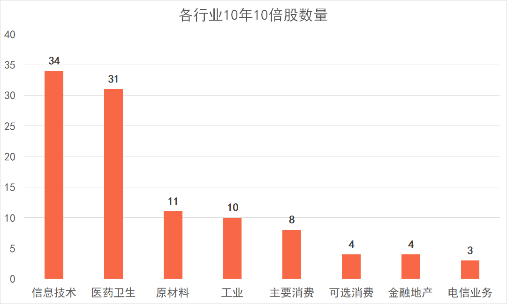

(数据来源: 国盛证券研究所)

信息技术行业的 10 年 10 倍股也非常多. 我们会在下一节课展开学习, 这节课我们先一起学好医药行业.

除了盈利稳定、成长性好以外, 医药行业还得到了大量的政策支持. 例如, 2015 年以来, 几乎每年都有新的政策鼓励新药研发.

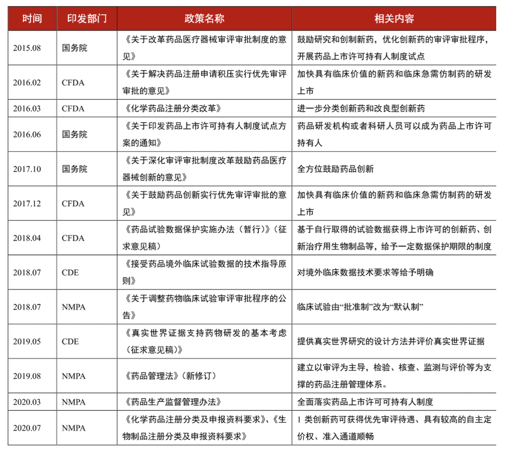

(资料来源: 国务院官网, NMPA 官网, 西部证券研发中心)

听到这里, 小伙伴们是不是准备到医药行业的投资中一展身手啦?

不要着急. 医药可是一个很庞大的行业, 比上节课学到的消费行业更复杂. 它有许多细分领域, 这些领域的的商业模式差别巨大.

总的来说, 医药行业同时具备三大属性:

第一, 周期属性. 部分药品的周期属性较强, 比如, 化学原料药. 它相当于把初级的化工品简单加工提纯, 所以这类药物明显受化工品价格波动的影响, 周期性强.

第二, 科技属性. 像创新药、疫苗这些科技含量高的品种, 需要大量的科研投入, 因此具备科技属性.

第三, 消费属性. 例如同仁堂、云南白药、片仔癀这类药物, 科技含量不高, 更像是消费品.

对于医药这种繁杂的行业, 我们要学会"抓大放小", 从大的行业分类入手.

国证指数网将医药行业分成了三个二级行业, 分别是: 医疗设备与服务、制药和生物科技.

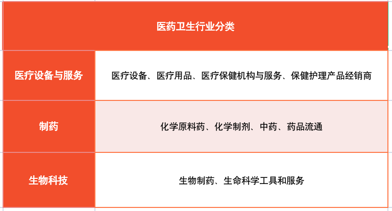

## 医疗设备与服务

这一节, 我们重点学习医疗设备与服务.

顾名思义, 医疗设备与服务包含了两大块: 一块是医疗设备, 通常叫做"医疗器械"; 另一块是"医疗服务".

这两大块都很重要, 我们分开来讲.

先来说医疗器械领域.

它主要包括: 制药装备、医药耗材、家庭医疗器械、大型医疗设备和医疗专业工程, 等等.

医疗器械领域在 2013 年的市场规模只有 2000 亿左右, 但在 2020 年已经超过 7000 亿. 券商研究显示, 2023 年, 国内医疗器械市场规模预计将超过万亿.

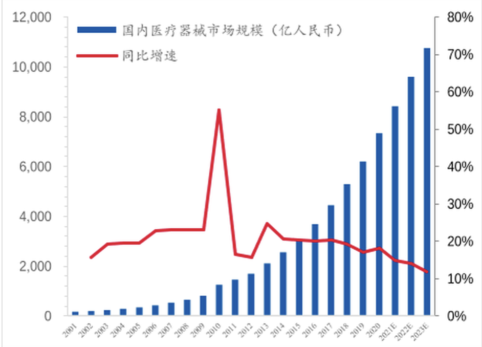

医疗器械行业发展迅猛, 市场规模稳定增长, 前景相当广阔, 是一块巨大的"肥肉". 对于我们普通投资者而言, 一只基金就可以投资整个医疗器械行业.

目前聚医疗器械行业的指数只有一只. 让我们记住它的名字: 中证全指医疗器械指数.

接下来再看医疗服务领域.

医疗服务涉及到了牙科、眼科、医美、妇儿、康复、养老等. 经历过的伙伴就会懂, 每一次拔牙都是钱包在痛哭, 更不用说涉及到老人小孩的养老和妇儿领域, 都是让消费者花钱如流水的领域.

而且, 医疗服务行业, 重服务, 轻医疗.

在医疗水平旗鼓相当的情况下, 客人更看重服务体验, 宁愿多花一些钱, 享受到更舒适的服务和医疗过程.

其次, 医疗服务领域扩张非常迅速.

医疗领域的扩张, 关键在于医生的数量. 医生多, 就能支撑起更多的医疗机构. 医疗服务领域的医生相比于外科手术的医生更好培养, 外科医生需要积累 N 年经验才能独立完成手术, 而医疗服务领域的医生可以快速学习, 快速积累实战经验, 所以医生队伍可以快速壮大, 相关的医院和机构也越来越多.

总的来说, 高端消费可以让每一单的利润更高, 快速扩张可以承接更多服务, 综合来看, 医疗服务是不可多得的黄金赛道.

事实上, 医疗服务的市场规模也在稳步扩张. 券商研究显示, 2021 年到 2025 年, 年复合增长率将达到 22.9%, 也就是说, 医疗服务领域有着十分可观的成长空间.

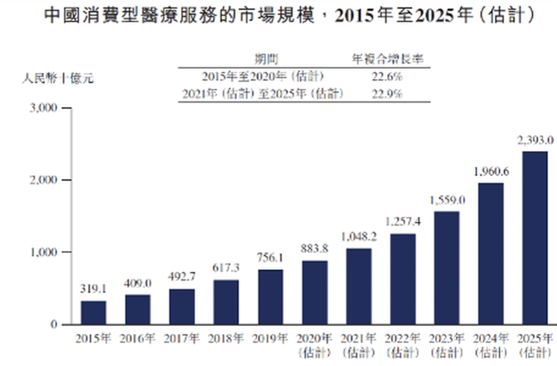

目前还没有专门聚焦于医疗服务的指数, 但是有几个医疗板块的指数, 同时囊括了医疗器械和医疗服务. 他们是: 中证医疗指数、中证全指医疗保健设备与服务指数、中证精准医疗主题指数.

我们从成立时间、选样范围、历史年化收益率几个角度, 来综合判断一下选择哪个指数.

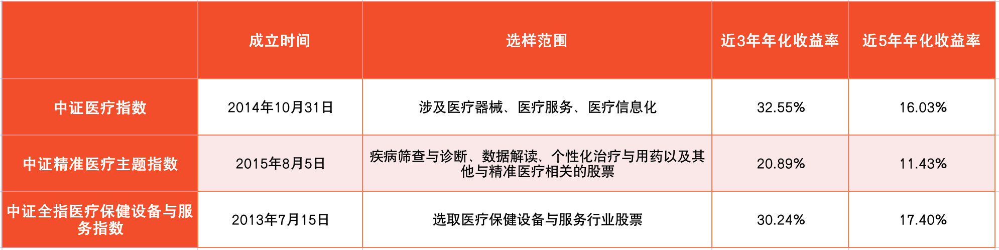

从表格中可以看到, 中证精准医疗主题指数的历史年化收益率明显低于其他两个指数, 而且成立时间最晚, 估值也不如另两个指数准确, 所以我们将其排除. 另外两个指数都可以保留.

目前追踪中证医疗指数的基金有 6 只, 追踪医疗保健设备与服务指数的基金有 4 只, 追踪中证全指医疗器械指数的基金有 2 只. 文稿中已经为大家展示出来了. 大家可以根据筛选步骤, 亲自筛选一遍.

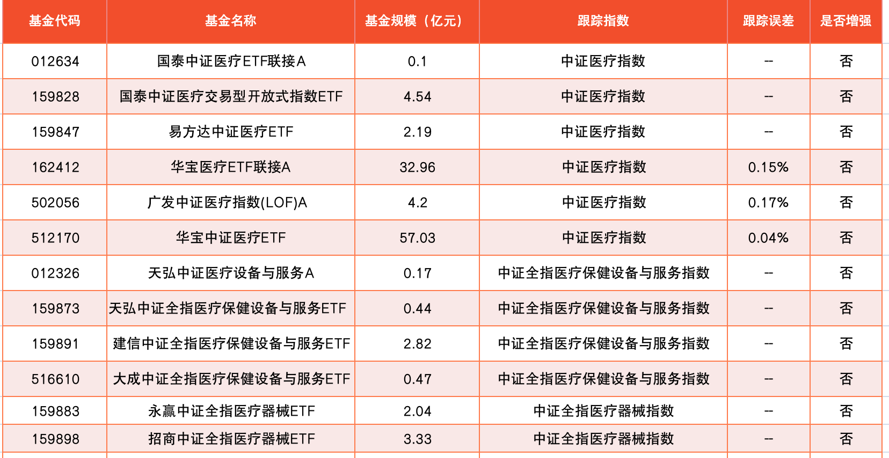

## 制药

这一节, 我们先来学习医疗卫生行业的第二个子行业: 制药.

根据国证指数网的分类标准, 制药行业可以进一步分为四个子行业: 化学原料药、化学制剂、中药和药品流通.

这些子行业都存在很明显的短板.

化学原料药, 由初级化工品合成, 东西很简单, 大吨位生产, 例如抗生素、维生素等. 化学制剂, 相当于在原料药的基础上, 添加了其他辅料, 加工成为制剂.

化学原料药和化学制剂, 受到化工品本身价格波动的影响较大, 所以周期性较强, 可以看作是周期性行业, 无法保证长期稳定盈利.

中药基于中国传统医药理论, 以植物药居多, 讲究天然药材. 这个行业"吃老本"严重, 缺乏正在研发的中药新产品, 估值上难有提升空间, 很多做中药的公司都在转型搞其它类型的药品研发.

药品流通, 主要包括了药品的批发和零售. 目前千亿巨头国药控股、上海医药、华润医药"三足鼎立", 业态大局已定, 未来稳健盈利问题不大, 但是很难扩张, 成长性不佳, 估值上也难有提升空间.

相毗于医药卫生行业的其他领域, 制药行业盈利不稳定、成长性不佳, 所以大家仅仅了解即可. 实际投资时, 我们可以选择其他更优质的赛道.

## 生物科技

我们来学习医疗卫生行业的第三个子行业: 生物科技.

生物科技可以进一步细分为: 生物制品和生命科学工具与服务.

大家可能对这两个名词有些陌生, 其实呢, 生物制品这个领域就是做疫苗、生物药、血液制品之类的东西. 生命科学工具与服务主要是做基因诊断等, 前几年非常火的, 唾液基因检测就是这个行业的一项成果.

有些小伙伴可能会好奇: 生物药也是药, 它和前面说的化学药有什么区别呢? 简单来说, 生物药是从生物体、生物组织、细胞、体液等中提取出来的; 化学药是用化工品合成的.

相毗之下, 生物药的市场空间大, 规模持续增长. 大家可以看文稿中的图片.

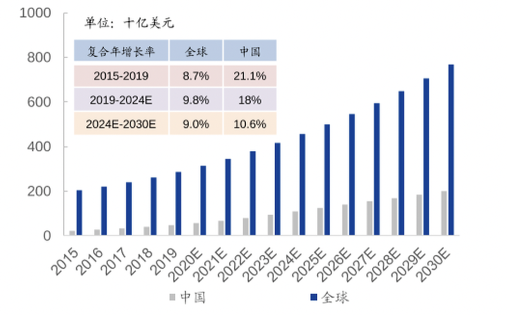

这张图是 2015 年到 2021 年全球及中国生物药的市场规模, 以及对未来十年的国内外生物药市场规模预测. 通过图表可以看出, 生物药未来复合年增长率在 10%以上, 国内增速比全球增速更快.

目前和生物科技有关的指数包括: 中证生物医药指数、国证生物医药指数、中证生物科技主题指数、中证万得生物科技指数.

我们来做个对比, 选出其中相对优秀的指数.

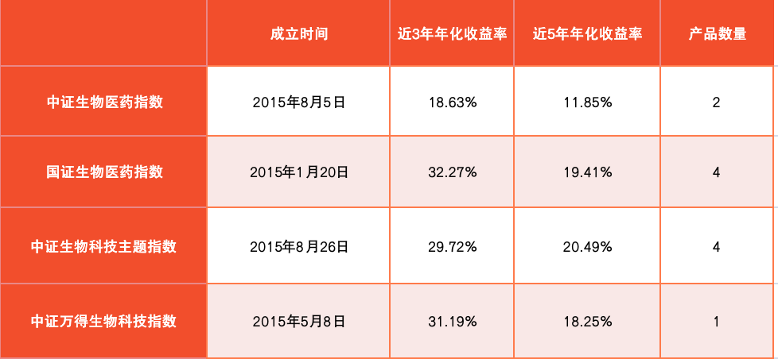

从表中可以看出, 这四个指数成立日期差不多一样. 历史收益来看, 中证生物医药指数表现逊色, 我们将它排除. 从产品数量来看, 国证生物医药指数、中证生物科技主题指数比较多. 所以我们保留这两个.

文稿中给大家展示了追踪这两个指数的基金, 大家可以按照筛选步骤, 自行筛选相应的基金.

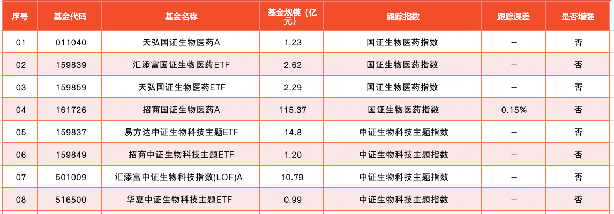

## 总结

1. 医疗行业的特点是: 盈利稳定、成长性高、政策利好、细分领域繁杂.
2. 医药行业又被分为三个子行业, 分别为: 医疗设备与服务、制药和生物科技.
3. 医疗设备与服务行业分为医疗器械和医疗服务. 其中, 医疗器械可以选择中证全指医疗器械指数; 医疗服务行业可以选择中证医疗指数、中证全指医疗保健设备与服务指数.
4. 制药行业的四个子行业短板明显, 我们不做考虑.
5. 生物科技行业可选择的指数是: 国证生物医药指数、中证生物科技主题指数.

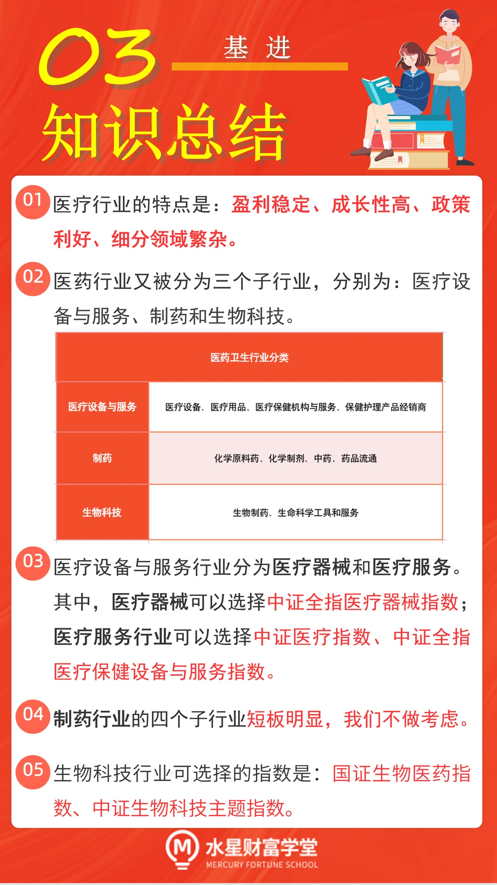

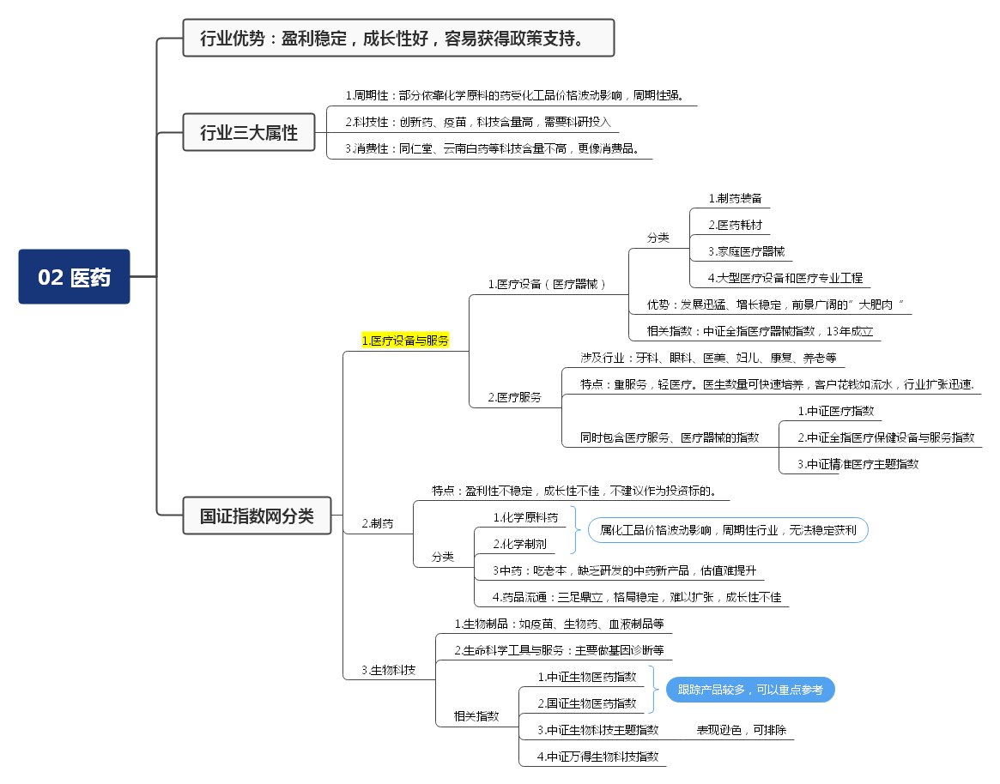
