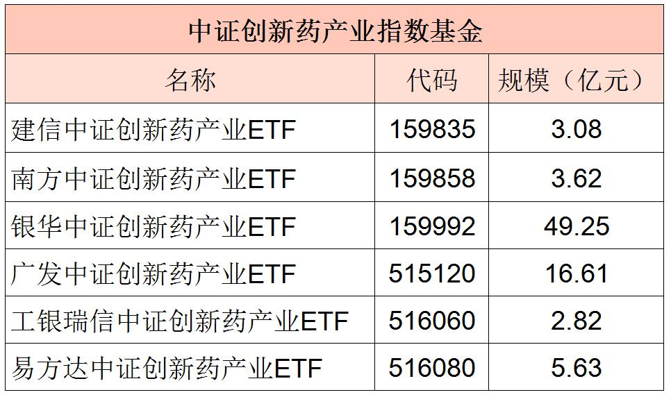

## 复杂的医药, 如何简单投资?

上一节课, 我们学习了如何投资消费行业. 消费是人们的一大刚需, 只要人活着就会消费. 不过在生活中, 人们的刚需可不只消费一种哦, 生病之后吃药就医, 也是人们的刚需.

这节课, 我们就一起来学习, 每个人都离不开的医药行业.

现实生活中, 人们预防疾病要打疫苗; 感冒发烧要吃药; 生病要看医生、做手术. 这些都离不开医药行业, 正是因为源源不断的需求, 所以医药行业盈利相对稳定.

而且, 医药行业的成长性非常好, 曾经涌现出大量 10 年翻 10 倍的股票. 大家可以看文稿中的图片, 医药卫生行业的 10 年 10 倍股多达 31 只, 占比接近三分之一

(数据来源: 国盛证券研究所)

信息技术行业的 10 年 10 倍股也非常多. 我们会在下一节课展开学习, 这节课我们先一起学好医药行业.

除了盈利稳定、成长性好以外, 医药行业还得到了大量的政策支持. 例如, 2015 年以来, 几乎每年都有新的政策鼓励新药研发.

(资料来源: 国务院官网, NMPA 官网, 西部证券研发中心)

听到这里, 小伙伴们是不是准备到医药行业的投资中一展身手啦?

不要着急. 医药可是一个很庞大的行业, 比上节课学到的消费行业更复杂. 它有许多细分领域, 这些领域的的商业模式差别巨大.

总的来说, 医药行业同时具备三大属性:

第一, 周期属性. 部分药品的周期属性较强, 比如, 化学原料药. 它相当于把初级的化工品简单加工提纯, 所以这类药物明显受化工品价格波动的影响, 周期性强.

第二, 科技属性. 像创新药、疫苗这些科技含量高的品种, 需要大量的科研投入, 因此具备科技属性.

第三, 消费属性. 例如同仁堂、云南白药、片仔癀这类药物, 科技含量不高, 更像是消费品.

对于医药这种繁杂的行业, 我们要学会"抓大放小", 从大的行业分类入手.

国证指数网将医药行业分成了三个二级行业, 分别是: 医疗设备与服务、制药和生物科技.

## 医疗设备与服务

这一节, 我们重点学习医疗设备与服务.

顾名思义, 医疗设备与服务包含了两大块: 一块是医疗设备, 通常叫做"医疗器械"; 另一块是"医疗服务".

这两大块都很重要, 我们分开来讲.

先来说医疗器械领域.

它主要包括: 制药装备、医药耗材、家庭医疗器械、大型医疗设备和医疗专业工程, 等等.

医疗器械领域在 2013 年的市场规模只有 2000 亿左右, 但在 2020 年已经超过 7000 亿. 券商研究显示, 2023 年, 国内医疗器械市场规模预计将超过万亿.

医疗器械行业发展迅猛, 市场规模稳定增长, 前景相当广阔, 是一块巨大的"肥肉". 对于我们普通投资者而言, 一只基金就可以投资整个医疗器械行业.

目前聚医疗器械行业的指数只有一只. 让我们记住它的名字: 中证全指医疗器械指数.

接下来再看医疗服务领域.

医疗服务涉及到了牙科、眼科、医美、妇儿、康复、养老等. 经历过的伙伴就会懂, 每一次拔牙都是钱包在痛哭, 更不用说涉及到老人小孩的养老和妇儿领域, 都是让消费者花钱如流水的领域.

而且, 医疗服务行业, 重服务, 轻医疗.

在医疗水平旗鼓相当的情况下, 客人更看重服务体验, 宁愿多花一些钱, 享受到更舒适的服务和医疗过程.

其次, 医疗服务领域扩张非常迅速.

医疗领域的扩张, 关键在于医生的数量. 医生多, 就能支撑起更多的医疗机构. 医疗服务领域的医生相比于外科手术的医生更好培养, 外科医生需要积累 N 年经验才能独立完成手术, 而医疗服务领域的医生可以快速学习, 快速积累实战经验, 所以医生队伍可以快速壮大, 相关的医院和机构也越来越多.

总的来说, 高端消费可以让每一单的利润更高, 快速扩张可以承接更多服务, 综合来看, 医疗服务是不可多得的黄金赛道.

事实上, 医疗服务的市场规模也在稳步扩张. 券商研究显示, 2021 年到 2025 年, 年复合增长率将达到 22.9%, 也就是说, 医疗服务领域有着十分可观的成长空间.

目前还没有专门聚焦于医疗服务的指数, 但是有几个医疗板块的指数, 同时囊括了医疗器械和医疗服务. 他们是: 中证医疗指数、中证全指医疗保健设备与服务指数、中证精准医疗主题指数.

我们从成立时间、选样范围、历史年化收益率几个角度, 来综合判断一下选择哪个指数.

从表格中可以看到, 中证精准医疗主题指数的历史年化收益率明显低于其他两个指数, 而且成立时间最晚, 估值也不如另两个指数准确, 所以我们将其排除. 另外两个指数都可以保留.

目前追踪中证医疗指数的基金有 6 只, 追踪医疗保健设备与服务指数的基金有 4 只, 追踪中证全指医疗器械指数的基金有 2 只. 文稿中已经为大家展示出来了. 大家可以根据筛选步骤, 亲自筛选一遍.

## 制药

这一节, 我们先来学习医疗卫生行业的第二个子行业: 制药.

根据国证指数网的分类标准, 制药行业可以进一步分为四个子行业: 化学原料药、化学制剂、中药和药品流通.

这些子行业都存在很明显的短板.

化学原料药, 由初级化工品合成, 东西很简单, 大吨位生产, 例如抗生素、维生素等. 化学制剂, 相当于在原料药的基础上, 添加了其他辅料, 加工成为制剂.

化学原料药和化学制剂, 受到化工品本身价格波动的影响较大, 所以周期性较强, 可以看作是周期性行业, 无法保证长期稳定盈利.

中药基于中国传统医药理论, 以植物药居多, 讲究天然药材. 这个行业"吃老本"严重, 缺乏正在研发的中药新产品, 估值上难有提升空间, 很多做中药的公司都在转型搞其它类型的药品研发.

药品流通, 主要包括了药品的批发和零售. 目前千亿巨头国药控股、上海医药、华润医药"三足鼎立", 业态大局已定, 未来稳健盈利问题不大, 但是很难扩张, 成长性不佳, 估值上也难有提升空间.

相毗于医药卫生行业的其他领域, 制药行业盈利不稳定、成长性不佳, 所以大家仅仅了解即可. 实际投资时, 我们可以选择其他更优质的赛道.

## 生物科技

我们来学习医疗卫生行业的第三个子行业: 生物科技.

生物科技可以进一步细分为: 生物制品和生命科学工具与服务.

大家可能对这两个名词有些陌生, 其实呢, 生物制品这个领域就是做疫苗、生物药、血液制品之类的东西. 生命科学工具与服务主要是做基因诊断等, 前几年非常火的, 唾液基因检测就是这个行业的一项成果.

有些小伙伴可能会好奇: 生物药也是药, 它和前面说的化学药有什么区别呢? 简单来说, 生物药是从生物体、生物组织、细胞、体液等中提取出来的; 化学药是用化工品合成的.

相毗之下, 生物药的市场空间大, 规模持续增长. 大家可以看文稿中的图片.

这张图是 2015 年到 2021 年全球及中国生物药的市场规模, 以及对未来十年的国内外生物药市场规模预测. 通过图表可以看出, 生物药未来复合年增长率在 10%以上, 国内增速比全球增速更快.

目前和生物科技有关的指数包括: 中证生物医药指数、国证生物医药指数、中证生物科技主题指数、中证万得生物科技指数.

我们来做个对比, 选出其中相对优秀的指数.

从表中可以看出, 这四个指数成立日期差不多一样. 历史收益来看, 中证生物医药指数表现逊色, 我们将它排除. 从产品数量来看, 国证生物医药指数、中证生物科技主题指数比较多. 所以我们保留这两个.

文稿中给大家展示了追踪这两个指数的基金, 大家可以按照筛选步骤, 自行筛选相应的基金.

## 医改与创新药投资

### 一、"三医联动"的大背景

医药行业和老百姓的生活息息相关. 国家每出一个政策, 对咱们都有非常直接的影响. 虽然都叫国家政策, 但政策具体来源于哪个部门, 可能很多小伙伴分不清楚.

有时候是药监局, 有时候是卫健委, 还有些时候是医保局. 大家分的清吗? 班班简单概括一下:

药监局, 全名叫国家药品监督管理局, 是个副部级的单位. 主要负责管药.

卫健委, 全名叫国家卫生健康委员会, 是个正部级单位. 主要负责管医院.

医保局, 全名叫国家医疗保障局, 是个副部级单位, 直属国务院, 主要负责管医保.

药监局的药品流通体制改革, 卫健委的卫生体制改革, 医保局的医保体制改革, 合在一起称为"三医联动".

这段话可能过于正式了. 班班通俗一点讲, "三医联动"到底是怎么回事.

这个模式最早可以追溯到一个小地方: 福建三明.

大家都知道, 老百姓去医院看病享受医保报销. 这些钱, 是需要医保基金拿出钱, 支付给医院的. 可是当时, 三明市的医保基金出不起钱了, 财政
也兜不了底. 结果, 医保基金欠了当地医院一千多万.

背后的原因嘛, 主要还是医院自己负责采购和费用结算, 和供应商之间有利益往来. 医院要多赚钱, 肯定喜欢挑价格贵的合作.

这就和医保的利益冲突了. 毕竟最后买单的是医保, 你卖的贵了, 我要付的账单可就大了啊.

针对这个问题, 当地就开展了一系列行动. 其中有一项, 是成立了"市医疗保障基金管理中心". 这个中心不简单. 全市所有医保定点医疗机构的药品、器械, 全都由它负责采购, 由它负责做费用结算.

相当于, 把医院和供应商之间, 这层利益切断了.

新成立的"中心"给医院一份"菜单", 其中可以用什么药, 用什么器械, 都写在上面. 医院只能按照单子来"点菜", 不能自己改菜单, 也不能进行费用结算.

当地大刀阔斧的改革, 最终使得医保基金扭亏为盈. 三明市的这个做法, 后面被借鉴推广到了全国范围. 这就有了现在国家层面的"三医联动".

### 二、医改到哪一步了?

"三医联动"涉及到了药监局、医保局和卫健委. 不过在改革的过程中, 各个角色发挥作用的顺序是不太一样的.

从投资机会的角度来说, 班班给大家总结成了一句话: 过去看药监局, 现在看医保局, 未来看卫健委.

首先来说, 为什么过去看药监局.

不知道大家是否了解 2015 年的"722 事件". 可能医药从业者会比较了解. 班班给大家简单解释一下.

2015 年 7 月 22 日, 原国家食药监管总局下发通知, 要求提交药品上市审批的申请人, 自查数据! 存在数据不真实、不完整的问题, 可以在 34 天内自行撤回.

否则, 如果发现问题, 将 3 年内不再受理申请. 存在弄虚作假问题的, 面临吊销执照、拉"黑名单"等处罚.

政策一出, 整个医药圈来了一个"大地震", 让各大药企进退两难. 撤回申请吧, 前面的投入就打水漂了; 不撤回吧, 万一被查出来有问题, 以后都没戏了.

结果大家猜怎么样? 超过 80%撤回! 充分说明, 药企对自己搞出来的新药有多么不自信. 很多怀着侥幸心理没有撤回注册资料的药品, 注册申请最后也被驳回了.

但是正因为政策的推出, 提高了新药临床试验的规范性.

以前的药企, 在研发上不下功夫, 数据随便搞搞, 把精力全花在营销上; 722 事件以后, 很多药企把重心向研发转移. 自那以来, 中国创新药发展走上了正轨.

而且自 722 以后, 药监局的政策也在向创新药倾斜, 鼓励创新药上市, 加快新药审批速度, 等等. 从投资的角度讲, 创新药板块, 目前是医药中的一个确定性比较大的优质板块.

药监局这一块, 政策框架已经确立, 未来更多是在执行层面的动作. 所以说"过去看药监局".

接下来, 班班再说一下, 为什么现在看医保局.

医保局现在是医改中的"主力军". 它的"接棒"时间可以追溯到 2018 年的 4+7 集采.

所谓的 4+7, 其中 4 指的是北京、上海、天津、重庆 4 个直辖市, 7 指的其它 7 个城市, 它们一起进行药品集中采购试点.

也就是把这 11 个城市的药品采购集中起来, 形成团购, 以量换价. 药企想拥有这些市场, 就得把价格降下来.

所以大家以后听到医保"集采", 不要觉得很专业. 其实本质上就是团购而已. 我们人多量大, 可以在你这里下很多单子, 你要赚我们的钱, 你就得便宜点. 集采就是这么个逻辑.

现在, 集采范围已经从 11 个试点城市扩大到了全国, 相当于团购的更多了, 量更大了, 对砍价更有利. 而且范围不仅仅限于药品, 还包括了少部分医疗器械, 比如心脏支架.

之前有个卖 1 万多的心脏支架, 为了进医保, 直接报价 400 块. 既然敢报这个价, 说明企业还是有利可图的. 可见之前这里面的利润有多高.

医保集采还在分批进行中. 每次集采, 一旦某上市公司某个产品没有中标, 相当于丢了市场, 这时候往往股价会受到重挫.

总之, 医保局的决策对目前的投资影响较大. 所以说"现在看医保局".

那么, 为什么说"未来看卫健委"呢?

咱们前面提到了, 卫健委主管的是医院这一块. 目前还没有决定性的大动作, 未来可能围绕医院相关的一些矛盾进行改革, 比如医患关系, 临床规则, 以及医院和医生的绩效考评体系, 等等.

而且, 咱们课程中提到了医疗服务板块, 也就是眼科、口腔等等专科连锁. 这些企业的规范发展, 杜绝野蛮生长, 也需要卫健委的参与.

就目前来说, 咱们从投资的角度看, 还是把重点放在医保局的政策上就好啦.

### 三、创新药投资

前面班班说道, 现在投资重点看医保局. 也就是重点看医药集采.

医药集采让老百姓用药更便宜了. 对大家来说是好事. 但是呢, 大家一定要注意, 投资的逻辑和看病的逻辑不一样, 甚至说正好反过来.

咱们投资, 投资的是上市药企. 哪怕是投资指数, 也是投资了一篮子药企. 咱们是跟着药企赚钱的.

如果集采杀价, 导致药企赚的更少了, 那么在投资中来看, 这就是负面消息.

所以, 咱们投资的时候, 要尽量避开受集采影响太大的药企. 比如, 仿制药受影响就非常大.

仿制药这个子行业, 因为仿制的门槛比自主研发低很多, 所以很多公司愿意干, 竞争肯定会非常激烈.

本来仿制药就卖得便宜, 再加上竞争激烈, 少不了在价格上压价, 利润空间就会进一步压缩. 面对医保集采, 仿制药只能大幅度让利.

所以说, 投资药品板块, 我们尽量不要选仿制药. 可以选择受集采影响较小的创新药.

投资创新药的优势都有哪些呢? 班班给大家总结一下:

第一, 未来市场空间大.

很多医药公司都已经意识到了, 不创新, 就得死. 最近这几年, 我国药企中的几家头部公司, 研发费用一直在蹭蹭涨.

我们来对比参照一下其他国家. 早在 2015 年的时候, 美国的创新药占整个美国药品市场的比例已经阿到了 67%, 欧洲是 60%, 日本是 68%. 而中国的创新药几乎没有占比. 直到 2019 年, 创新药占比才只达到了 5%.

所以我们有理由认为, 创新药这块市场未来大有可为.

第二, 创新药可以卖到高价, 利润高.

这里大家注意, 创新药也是会进入医保集采过程的, 也要面临价格谈判.

但毕竟是创新产品, 竞价对手少, 公司肯定比仿制药公司更有议价权, 价格不会降太多.

虽然说谁都不喜欢买高价药, 但是原创的东西确实贵, 这也是合理的, 只有这样才能激发药企的创新动力, 持续不断地研发出新药.

而且从投资人的角度来说, 药的价格贵对我们是有利的, 起码财务的盈利不会太难看.

第三, 创新药公司有专利优势.

新药发明出来以后, 为了避免被别人抄走了方子, 公司都会申请专利. 只要申请了专利, 只有一家能做这种药, 那么一般来说 20 年内无对手.

说了这么多创新药的好, 那么创新药到底该怎么投资呢?

其实很简单. 创新药这个细分子行业, 其实也有对应的指数哦, 它就是: 中证创新药产业指数.

这只指数选取的成分是, 主营业务涉及创新药研发的上市公司, 按照市值大小排序, 选取前面不超过 50 家公司的股票. 它反映的是整个创新药产业的整体表现.

追踪这只指数的基金, 班班同样给大家总结出来了:

## 总结

1. 医疗行业的特点是: 盈利稳定、成长性高、政策利好、细分领域繁杂.
2. 医药行业又被分为三个子行业, 分别为: 医疗设备与服务、制药和生物科技.
3. 医疗设备与服务行业分为医疗器械和医疗服务. 其中, 医疗器械可以选择中证全指医疗器械指数; 医疗服务行业可以选择中证医疗指数、中证全指医疗保健设备与服务指数.
4. 制药行业的四个子行业短板明显, 我们不做考虑.
5. 生物科技行业可选择的指数是: 国证生物医药指数、中证生物科技主题指数.

1. 药监局主管药品; 卫健委主管医院; 医保局主管医保. 三方改革合在一起称为"三医联动".
2. 从投资机会的角度来说, 过去看药监局, 现在看医保局, 未来看卫健委.
3. 投资的时候, 要尽量避开受集采影响太大的仿制药, 可以选择受集采影响较小的创新药.
4. 创新药的优势: 未来市场空间大; 可以卖到高价, 利润高; 有专利优势. 5. 投资创新药可以选择的指数: 中证创新药产业指数.
