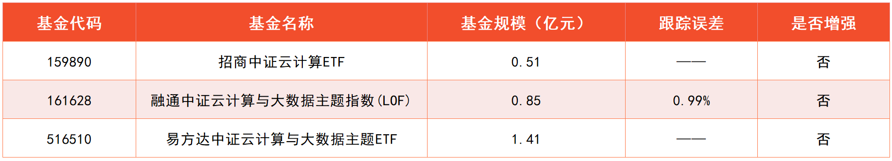
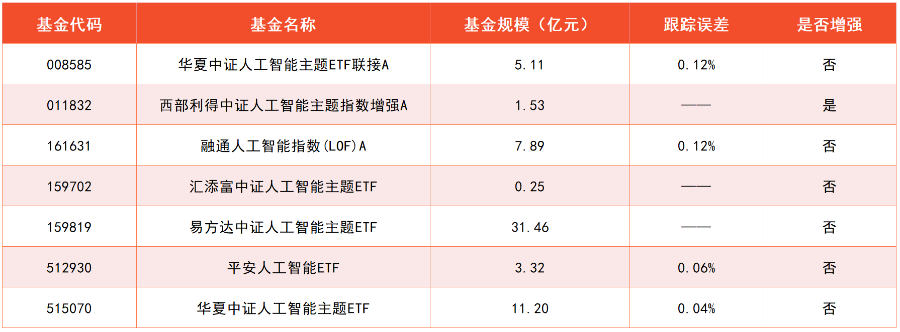
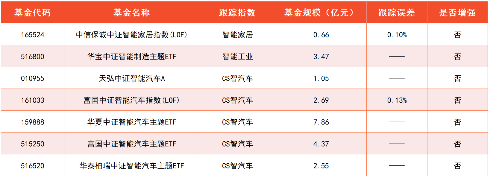
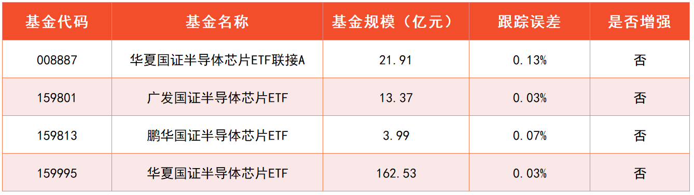
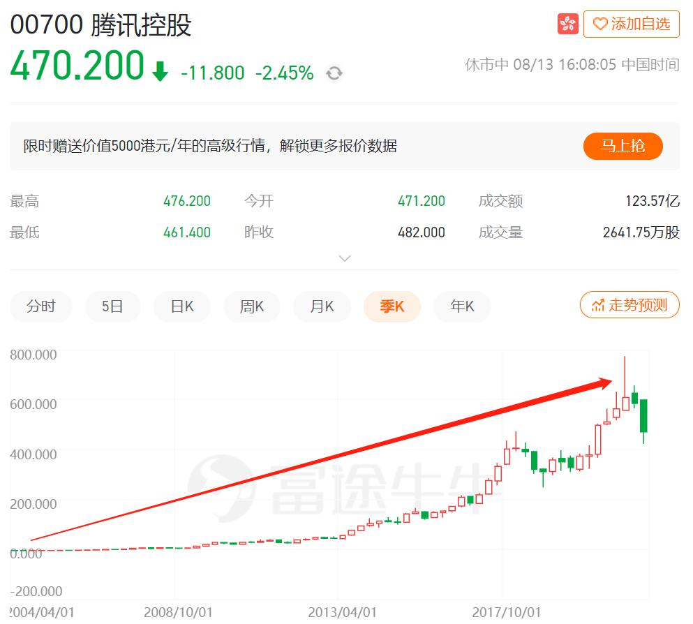

上一节课, 我们曾经看过各行业 10 年 10 倍股的数量, 其中医药卫生和信息技术堪称创造 10 年 10 倍股的"双雄".

前面我们已经学习了医药卫生行业. 这节课, 我们就一起走进信息技术.

不过大家要清楚一点, 随着科技的发展, 信息技术已经渗透到了各行各业当中, 很难再当作一个单独的领域来研究.

举个例子: 人人都在用的智能手机, 可以安装聊天软件、游戏软件以及视频软件等等, 这些软件都是科技和传媒的交叉; 此外, 手机还会提供蓝牙、WIFI、流量等通信功能, 与电信行业密不可分.

除此之外, 近年来还兴起了"智能家居"、"金融科技"或者"互联网医疗"等概念, 它们涉及到了家电行业、金融行业、医药行业, 等等.

总之, 科技发展让很多行业"你中有我, 我中有你", 而且交叉会变得越来越多, 硬要给它们"分家"是不现实的.

所以, 大家千万不要在梳理行业上面"死磕", 应该锁定国家重点发展的科技产业, 把握住大方向的投资机遇就可以啦.

未来科技发展的大趋势, 可以概括为四个字: 云、管、端、芯.

## 云-揭秘"云计算"和"大数据"

第一个字"云", 大家可以理解为云计算和大数据服务, 比如阿里云、腾讯云、华为云等等.

以前的企业和个人, 需要用自己的服务器存储数据、处理数据, 有的时候空间太小不够用, 就会出现服务器"崩了"的现象.

比如, 很多人都用 12306 网站买过火车票, 春节期间遇到买票高峰, 大量的人访问网站, 很容易导致服务器崩溃, 无法买票. 不过, 现在已经没有这种情况啦, 因为 12306 已经把服务器搬到了"云"上.

这些"云"服务, 会专门建立庞大的服务器, 租给大家用, 主要针对的是企业客户. 客户用多少就租多少, 只要定期付费就可以啦.

我们在生活中经常见到的云音乐、云网盘、云文档等等, 其实也是一样的道理. 企业提供存储空间, 各种文件都在"云"上保存着, 就不会再占用个人设备的空间啦.

以上就是高大上的"云计算"和"大数据". 它不仅提高了服务器的利用效率, 还在收费模式上引领了巨大的转变. 以前是卖服务器或硬盘, 只收一笔钱; 未来更多的是按月收费, 或者按使用次数收费.

今后, 政府和大型企业"上云", 将成为一个大趋势. 根据国务院发展研究中心数据预测显示, 预计到 2023 年, 中国政府和大型企业的上云率将会超过 60%.

这里的"上云率", 指的是政府和企业把业务、管理等工作放在云上的比率. 对比来看, 美国大型企业在 2018 年的上云率已经超过了 80%, 国内在这方面还有很大的发展空间.(数据来源: 安信证券研究中心)

既然未来云计算大有可为, 我们当然要提前布局啦. 有一个指数刚好覆盖了这一板块, 它就是"中证云计算与大数据主题指数".

该指数成立于 2016 年, 选取 50 只业务涉及提供云计算服务、大数据服务以及上述服务相关硬件设备的上市公司股票作为成分股. 跟踪它的基金已经在文稿中展示出来啦.

到这里, 我们已经搞定了"云、管、端、芯"的云. 接下来的内容, 我们一起认识一下"管、端、芯".

## 管-5G 还能"上车"吗?

这一小节, 我们来学习一下"云、管、端、芯"中的"管".

管, 指的是连接云与终端设备的管道, 也就是通信网络. 比如, 我们有一个视频存放在"百度云"上面, 而且我们要在自己的手机上看这个视频, 那么就必须上网, 通过网络把文件内容传输过来.

大家注意, 虽然现在 5G 网络非常火, 但是, 传输本身不是只能靠 5G 实现哦.

网络本身可以分为两种. 一种是蜂窝网, 也就是手机需要插卡才能用的网络, 3G、4G、5G 都是蜂窝网. 另一种是非蜂窝网, 手机不插卡就能用, 比如 WIFI 和蓝牙.

有些时候信息量很小, 只需要传输几个字节的数据, 完全可以不用 5G. 比如共享单车, 可以用蓝牙实现信息传输.

之所以国家要大力发展 5G 网络, 是因为随着云的发展, 以及各种智能终端设备的应用, 未来对网络传输的体量和效率都有很高的要求.

举个例子, 未来自动驾驶需要精确到"厘米级"的定位精度, 每一厘米的路况信息都要在云服务器和汽车之间"飞速"传输, 才能确保自动驾驶顺利完成. 这么大的信息量, 外加这么高的速度要求, 必须借助于 5G 网络.

那么, 是不是说, 现在是投资 5G 的大好时机呢? 我们来看一组数据就知道啦.

根据工信部的数据预测, 5G 基站的新增数量将在 2022 年达到顶峰, 之后逐年减少.

大家可以看文稿中的图片, 5G 基站数量爆发的时期是 2020 到 2022 这 3 年, 鉴于目前已经离顶峰不远, 投资市场会对业绩预期提前反应, 所以, 5G 已经没有特别好的布局机会了.

小伙伴们在投资的时候, 要特别注意"时移"的问题.

所谓的"时移", 指的是随着时间的推移, 产业本身在增长, 但是产业内各个部分的表现会各不相同.

"云、管、端、芯"四个部分, 共同组成了科技增长大趋势, 但是在发展的不同阶段, 会有不同的部分出现机会. 如果在"云"有机会的时候, 投资了"管"; 那可就踏错节奏, 得不偿失啦.

## 端-让科幻成真的"人工智能"

上一小节介绍的"管", 也就是通信网络. 它前面连着"云", 后面连着"端".

这个"端"字, 指的是终端设备, 比如手机、音箱、平板电脑、数字电视、VR/AR 眼镜、智能汽车等.

终端设备的未来发展方向是人工智能, 也就是机器自我学习.

有些小伙伴一听"人工智能", 就觉得只有科幻片里才会出现. 但其实, 人工智能已经进入了我们的生活.

比如, 谷歌此前开发的 AlphaGo 机器人, 在围棋比赛中打败了韩国职业棋手李世石. 机器可以看完成千上万的棋谱, 从中提炼总结出规律.

再比如, 现在正流行的语音识别、人脸识别等技术, 也属于人工智能. 机器积累了大量的声音信息、人脸信息, 从中提炼规律, 进而可以识别出细微的差别.

早在 2017 年的时候, 我国发布的《新一代人工智能发展规划》, 就已经将人工智能的发展上升到了国家战略. 近年来利好政策不断, 人工智能连续多年被写入政府工作报告, "十四五规划"更是多次提到人工智能发展的重要性.

券商研究预测, 中国人工智能市场规模将在 2024 年达到近 8000 亿元, 最近几年将出现迅猛增长.

截止到 2021 年 7 月 30 日, 与人工智能相关, 且有基金跟踪的指数有两个.

一个是中证人工智能主题指数, 成立于 2015 年, 跟踪它的基金有 7 只; 另一个是中证人工智能产业指数, 成立于 2018 年, 跟踪它的基金只有 3 只.

两相对比, 我们可以选择成立时间更早, 产品数量更多的中证人工智能主题指数. 跟踪它的基金已经在文稿中展示出来啦.

除了选择"人工智能主题指数"以外, 大家还可以聚焦三个细分领域: 智能家居、智能制造和智能汽车.

很多智能家居已经出现在了大家的生活中, 比如可以对话的智能音箱, 可以远程开关的智能空调, 可以打扫房间的扫地机器人, 等等.

据券商测算, 中国智能家居的市场规模将在 2025 年超过 8000 亿元.

智能制造和智能汽车的前景则更长远, 很多券商已经预判到了 2035 年.

智能家居相关的指数叫做"中证智能家居指数", 智能制造相关的指数叫做"中证智能制造主题指数".

智能汽车相关的指数有两个. 其中, "中证智能汽车主题指数"成立于 2015 年, 跟踪它的基金有 5 只. 该指数聚焦于汽车上的人工智能应用.

"中证智能电动汽车指数"成立于 2009 年, 跟踪它的基金有 4 只. 该指数选股综合考虑了"智能"和"电动"两个方面, 其中"电动"与人工智能关系不大, 与下节课将要介绍的"新能源"关系比较大.

"智能"和"电动"都是汽车未来的发展方向. 关于"电动", 下节课会介绍专门的"新能源汽车"相关指数. 为了让投资更纯粹, 这里我们选择专注于"智能"的"中证智能汽车主题指数".

追踪智能家居、智能制造、智能汽车相关指数的基金, 已经在文稿中展示出来啦.

## 芯-智能"大脑": 半导体芯片

本小节, 我们来学习"云、管、端、芯"中的最后一部分: 芯.

"芯"的意思是芯片. 芯片是一种小型化的电路, 也就是把很多微小的电子元件, 制作在一小块半导体晶片上.

很多投资者习惯把芯片直接说成"半导体". 但其实, 它们之间有些区别. 这就需要大家了解一些科学常识啦.

半导体本身只是一种材料. 按照导电性来分类, 生活中常见的铜、铁之类的金属材料, 属于导体; 陶瓷、木头之类的材料, 属于绝缘体. 而半导体的导电性介于导体和绝缘体之间.

为什么制作芯片必须用半导体, 而不是导体呢? 这是因为, 导体在通电之后没法控制电路, 而半导体可以控制电路, 让你导电就导电, 让你断电就断电, 从而可以作为信号开关, 而且还能通过导电性的变化, 把信号缩小和放大.

使用半导体做出来的芯片, 拥有了控制功能, 从而可以像大脑指挥身体一样, 让各种设备变得智能化.

所以说, 人工智能的大好前景, 必然伴随着半导体的大好前景. 根据券商研究预测, 到 2024 年, 中国人工智能芯片的市场规模将达到 785 亿元.

芯片占到了半导体市场的 80%以上, 所以很多投资者干脆把芯片和半导体画上了等号. 不过大家要注意, 半导体不是只有做芯片这一个用处.(数据来源: 东兴证券)

作为一种特殊的材料, 半导体还可以用在其他一些场景中. 比如新能源中的光伏产业, 在把太阳能转化成电能的时候, 也需要用到半导体.

与半导体相关、而且有基金跟踪的指数共三个: 中证全指半导体产品与设备指数、中华半导体芯片指数、国证半导体芯片指数.

其中, 中华半导体芯片指数 2019 年才成立, 不利于用历史分位点估值, 也缺乏可以参考的历史收益率数据, 我们将它排除.

中证全指半导体产品与设备指数, 选择的是和半导体产品和设备有关的成分股, 不局限于芯片产业, 从历史年化收益率数据来看, 收益水平不如国证半导体芯片指数.

而且, 国证半导体芯片指数的产品数量是最多的. 所以, 我们最终锁定该指数. 跟踪它的基金已经在文稿中展示出来啦.

## "反垄断"与互联网投资

### 一、带你认识不一样的"互联网"

说到互联网, 大家能想到什么呢? 百度一下? 听歌打游戏看视频点外卖? 老铁双击 666? 游艇跑车刷起来?

现在流行一个说法, 叫"互联网大厂", 也就是阿里、腾讯、美团、百度、字节跳动等等这些互联网"巨头"公司.

这些公司, 其实也和科技有关. 而且是科技改变生活, 改变非常巨大. 比如网购、移动支付、 娱乐方式等等.

但是, 互联网的科技含量相对比较低, 或者说不像人工智能、芯片一样"硬核". 有些投资者把互联网称为"软科技".

虽然是软的, 但班班还是会带着大家学习的哈. 因为从投资的角度来讲, 互联网也是一条不错的赛道.

下面是腾讯 2004 年 4 月至 2021 年 8 月的股价变化:

下面是阿里 2004 年 9 月至 2021 年 8 月的股价变化:

可以看到, 历史股价一路爬升. 有的小伙伴可能注意到, 股价走势在最后一段都是跌的, 这个主要和目前国家的"反垄断"政策有关哈. 后面班班还会讲到.

虽然这些公司涨了这么多, 但是班班得先泼一盆冷水: 咱们在国内市场买不到它们.

因为它们都在美国或者香港上市. 百度是在美国上市的, 腾讯是在香港上市的, 阿里巴巴在美国和香港上市.

那么, 有小伙伴可能会问了: 为什么中国的互联网公司要跑到美国或者香港上市呢?

原因有 3 点:

1、我国 A 股目前是不能接受境外公司上市申请, 像是阿里巴巴, 百度, 腾讯, 这些实际上都是在境外注册的公司, 所以他们是不能在 A 股上市.

2、在美国, 上市的门槛比较低, 而且上市的效率比较高, 可以更容易且更快上市.

3、有助于进军国际市场, 因为美国毕竟是全球资本的中心, 在美国上市可以提高企业的知名度.

这就像是, 好不容易养大的女儿结果嫁到国外去了.

导致的结果就是, 如果小伙伴们想要购买这么优秀的公司股票的话, 需要开通港股账户, 把人民币转成港币或者开通美股账户, 把人民币转成美元, emm, 感觉好麻烦~

那要怎么办呢? 我们难道要和互联网投资无缘啦? 不是的, 聪明的小伙伴已经猜到了, 投资基金就好啦.

学习了这么久的基金, 你肯定知道市面上是有很多指数基金的, 像是消费指数基金, 医药指数基金, 那么, 有没有互联网指数基金呢? 那, 当然, 必须有.

### 二、两个指数, 搞定一切

有两个指数, 可以聚焦投资互联网大厂, 一个是中国互联网, 指数代码 H11136; 另一个是中国互联网 50, 指数代码 H30533.

大家到中证指数有限公司官网, 输入指数代码搜索, 就可以搜到这两个指数哦.

两个指数的主要区别, 班班给大家解释一下:

中国互联网, 成分股选择的是海外上市中国互联网企业; 中国互联网 50, 在前面的基础上精选了 50 家.

从收益的角度看, 这两个指数的差别不大. 大家可以看下图, 2016 年 8 月到 2021 年 8 月, 这 5 年里, 两个指数的涨跌基本完全重合.

非要比出一个高低的话, 也可以说中国互联网 50(图中橙色)稍好一点.

这和中国互联网 50 聚焦头部 50 家有关系. 互联网这个行业, 就是典型的强者恒强, 赢家通吃, 越赚钱的公司就会赚越多, 所以聚焦头部的表现会更好一点.

跟踪中国互联网 50 的基金, 班班已经给大家整理出来了.

目前来看, 整个互联网板块的估值不贵, 主要跟"反垄断"政策有关系. 那么, 反垄断之下, 互联网能不能投资呢? 下面班班就带着大家详细分析一下.

### 三、网络效应和"反垄断"

像阿里、腾讯这些互联网大厂, 为什么能够如此"暴利"? 这和互联网行业的本质有关系. 互联网行业拥有强大的"网络效应".

网络效应的意思就是: 一个产品的价值和使用它的人数有很大关系, 用的人越多, 产品价值就越高.

比如, 几乎每个人都会用到的聊天软件, 班班就以这个为例.

假设现在班班发明了一个"班信"软件, 功能和微信都一样, 甚至更好用. 现在班班告诉你, 别用微信了, 改用"班信"吧, 请问你会换吗?

相信大部分人都不会. 因为, "班信"上面, 没熟人, 没朋友, 没同事, 没同学, 就算再好用, 一个人用也没意义.

大家发现没? 微信之所以这么有价值, 很大一个原因是, 用它的人非常多.

而且这是一个正向循环: 用的人越多, 大家就会感到越实用; 大家发现越实用了, 就会有更多的人来用它.

身边人都用微信, 如果你不用, 可能就要与身边人脱节, 可能都很难保持联系.

一旦微信的地位确立了, 别的公司即使再有钱, 技术再高, 都很难复制它的成功. 因为问题的关键不是钱和技术, 是使用的人很难复制过去. 这就是网络效应.

淘宝也是一样的. 如果只有几家店铺, 相信没几个人愿意逛. 随着店铺越多, 大家逛起来越方便, 就会有更多的顾客来淘宝; 随着顾客变多, 商家觉得有价值, 就会有更多的店铺入驻.

网络效应就像一块巨大的吸铁石, 把大家都吸在一起. 一旦形成了网络效应, 就很难被颠覆了.

互联网行业靠着网络效应, 出现了很多巨头, 我们会发发现, 很多互联网产品都是一家独大, 大部分都不会超过三家.

比如网购, 我们能想到淘宝和京东; 移动支付, 我们能想到微信和支付宝; 短视频, 我们能想到抖音和快手; 聊天就不用说了, 微信一家独大.

这个现象总结成两个字就是: 垄断.

其实垄断本身不可怕, 可怕的是企业把用户圈起来, 独自"收割", 拒绝与其他企业互通. 比如微信支付和支付宝, 互不相容, 所有用户只能二选一. 不像银联, 存在 A 银行的钱可以在 B 银行取出来.

腾讯不允许分享淘宝链接, 所以大家经常看到很长的淘宝乱码链接, 必须把乱码复制到淘宝里, 才能打开, 微信上面打不开.

还有, 淘宝不支持微信支付, 只能使用支付宝支付.

就是针对这种圈起来收割的现象, 国家开始对互联网行业大力"反垄断". 而且是连续出拳, 罚了一家又一家.

有个新闻不知道小伙伴们关注过没? 就是腾讯和阿里, 要互相打通生态了. 以后可能大家在微信上面, 就能打开淘宝链接, 像打开小程序一样容易; 而在淘宝里购物, 可能也可以使用微信支付.

反垄断, 让互联网行业"圈起地, 关起门"赚钱的模式, 不能继续了. 那么, 回到最核心的问题上: 互联网现在还能投资吗?

其实这个问题可以拆成两方面来看: 第一, 互联网的网络效应优势还在吗? 第二, 互联网什么时候会涨起来?

第一, 班班认为, 互联网行业反垄断, 只是让大家打开内部封闭, 并没有动到网络效应的基础. 像微信、淘宝这样的大产品, 即使开放生态, 也很难有人可以复制.

第二, 互联网行业短期内受到政策和情绪影响, 大概率不会立马出现反弹. 但只要坚持长期主义, 相信它们的长期回报, 还是有投资价值的.

## 总结

1. 未来科技发展的大趋势, 可以概括为四个字: 云、管、端、芯.
2. "云"字代表云计算, 相关指数可以选择: 中证云计算与大数据主题指数.
3. 投资的时候, 要特别注意"时移"的问题. 也就是是随着时间的推移, 产业本身在增长, 但是产业内各个部分的表现会各不相同, 切勿踏错节奏.
4. "端"字指的是终端设备, 未来的发展趋势是人工智能. 相关指数可以选择: 中证人工智能主题指数、中证智能家居指数、中证智能制造主题指数、中证智能汽车主题指数.
5. 芯"字指的是半导体芯片, 相关指数可以选择国证半导体芯片指数.

1. 互联网的科技含量不如人工智能、芯片, 所以有些投资者把互联网称为"软科技". 但互联网长期来看具备投资价值.
2. 投资互联网, 可以选择跟踪中国互联网 50 的指数基金.
3. 互联网行业拥有强大的"网络效应": 产品的价值和使用它的人数有很大关系, 用的人越多, 产品价值就越高.
4. 互联网行业反垄断, 只是让大家打开内部封闭, 并没有动到网络效应的基础. 短期内受到政策和情绪影响, 大概率不会立马出现反弹; 但只要坚持长期主义, 相信它们的长期回报, 还是有投资价值的.
