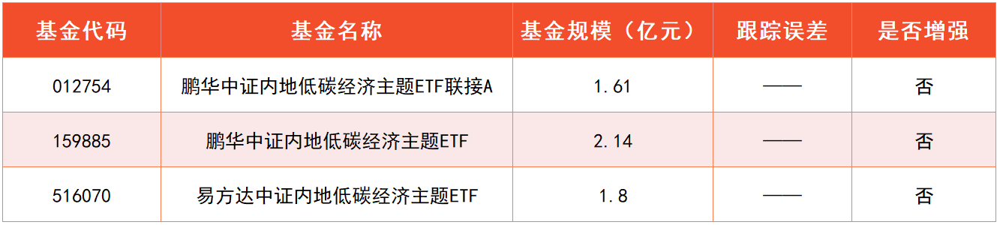
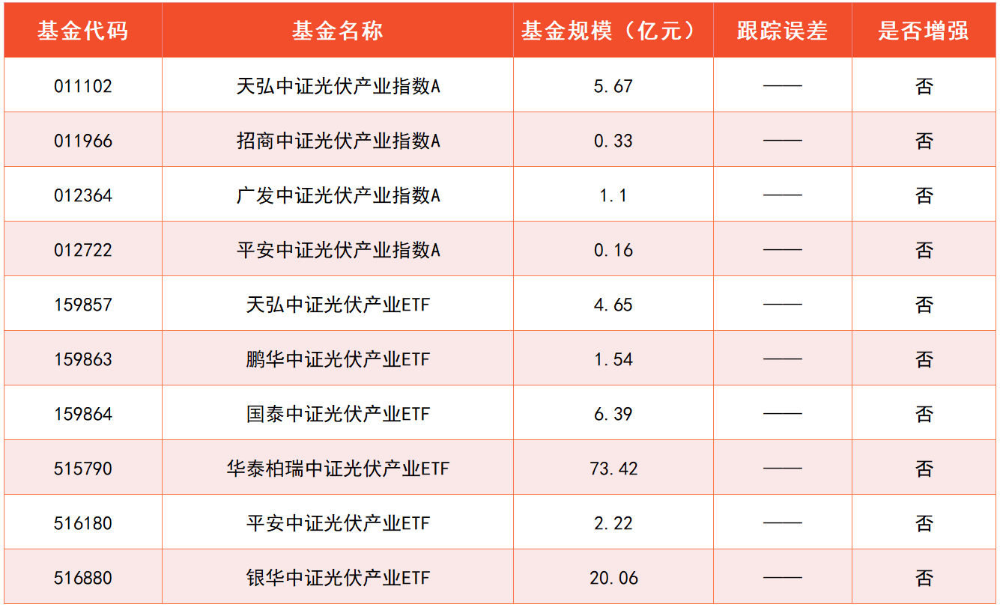
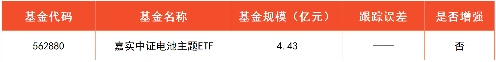
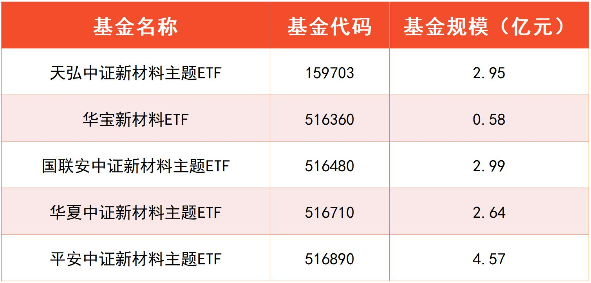
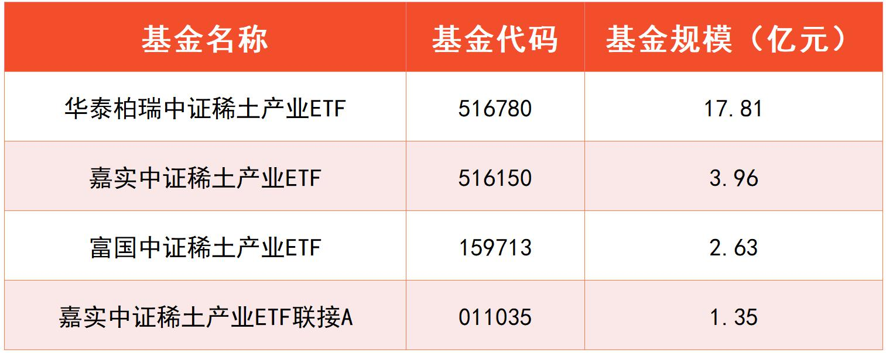

在前面的课程中, 我们先后了解了消费、医药、科技三颗卫星, 本节课, 我们一起走进最后一颗卫星: 新能源.

## 低碳目标, 势在必行

"新能源"这一概念, 是相对于传统能源来定义的. 传统能源指的是已经能够大规模生产和广泛利用的能源, 比如煤炭、石油、天然气、水能, 等等.

新能源指的是刚开始开发利用的能源, 或者正在积极研究、有待推广的能源, 比如太阳能、风能, 等等.

新能源已经成为世界主要国家争相布局的领域. 我国也针对新能源产业给予了大量的政策和财政支持. 那么, 为什么我国要在此时大力发展新能源呢? 主要原因有两个.

第一, 发展新能源可以减少对外依赖. 我国有两大产品严重依赖于进口, 一是芯片, 二是石油, 每年进口分别需要约 2000 亿美金. 尤其是石油, 目前全世界普遍采用美元计价, 长期靠进口难以摆脱对美元体系的依赖.(数据来源: WIND)

上一节课我们已经了解到, 芯片的国产化会带来不错的投资机会. 同样, 用新能源替代石油, 减少对石油进口和美元体系的依赖, 也是未来发展的大趋势, 对于投资而言是不错的机会.

第二, 发展新能源也是为了改善生态环境. 传统能源的消耗会产生大量的二氧化碳, 进而造成全球变暖等生态问题. 为了改善生态环境, 发展新能源势在必行.

2021 年全国两会上, "碳达峰"和"碳中和"被首次写入政府工作报告.

"碳达峰"是指二氧化碳的排放达到峰值, 之后逐步降低."碳中和"是指通过植树造林、节能减排等形式, 让排放和吸收的二氧化碳互相抵消, 实现二氧化碳"零排放".

我国的目标是 2030 年实现碳达峰, 2060 年实现碳中和.

碳达峰和碳中和都是长远目标, 现在布局为时不晚. 有一个和低碳相关的指数叫做: 中证内地低碳经济主题指数. 目前跟踪该指数的基金共 3 只, 大家可以参考文稿中的表格.

了解了新能源发展的背景以后, 我们就来梳理一下新能源投资的具体赛道.

投资新能源共有三大赛道, 分别是: 发电、储能以及新能源汽车.

## 发电

我们将分成三个小节分别进行学习. 本小节先来学习发电.

发电指的是将太阳能、风能等新能源转化成电能. 其中, 太阳能发电简称"光伏", 风能发电简称"风电". 光伏和风电是发电赛道的两条主线.

光伏和风电都有相关的指数, 不过, 风电相关的指数暂时没有基金跟踪, 无法进行投资. 所以, 我们聚焦光伏就可以啦. 根据券商研究预测, 中国光伏装机规模在 2025 年之前将持续扩大.

围绕光伏产业制定的指数叫做: 中证光伏产业指数. 目前跟踪该指数的基金足足有 10 只, 侧面反映了光伏产业的火热程度. 相关基金已经展示出来啦, 大家可以参考文稿中的表格.

## 储能

这一节, 我们来进一步了解投资新能源的第二大赛道: 储能.

为什么会出现储能的需求呢?

这是因为, 风电中的风力大小、光伏中的光照强弱, 都无法人为控制, 随着环境的变化, 发电量时多时少. 这就需要人们在发电量多的时候, 把电储存起来, 在发电少的时候, 拿储存的电来顶上.

那么, 国内外为了实现储能, 用了什么"高招"呢?

目前, 全球最常用的方法是抽水储能. 也就是配置两个水库, 一个在高处, 一个在低处. 如果发电量用不完, 就用多余的电把水从低处抽到高处. 等到用电高峰期, 再在高处开闸放水, 利用水能发电.

抽水储能已经发展得比较成熟了. 但是, 它的缺点也很明显: 首先需要两个大水库, 对场地要求很高; 其次在抽水、放水的过程中, 一部分能量会白白浪费掉; 最后, 水本身会蒸发, 如果降水不够, 蒸发严重, 也会造成能量损失.

这些缺点, 用电池储能就可以很好地解决. 那么, 为什么以前不直接用电池呢?

这是因为, 以前电池的造价太高, 储能方面"扛不住"巨大的成本压力. 不过现在, 电池的造价越来越低, 用电池储能将成为更好的选择. 根据券商研究预测, 2030 年以前, 电池成本将持续下降.

其中, 锂电池由于成本下降最快, 因此在储能电池中占比最高, 未来发展空间巨大. 根据券商预测, 2021 年至 2025 年, 储能锂电池出货量的复合年均增长率将达到 33%.

需要大家注意的是, 在应用层面, 电池被分成了储能电池、动力电池和消费电子电池. 其中, 动力电池主要用在电动汽车等领域, 消费电子电池主要用在手机、平板等消费电子产品上.

但在本质上来说, 它们没有区别, 都是储能电池, 都以锂电池为主, 涉及到的上市公司也基本一致.

目前, 与电池相关、且有基金跟踪的指数有两个, 分别是: 中证电池主题指数和国证新能源车电池指数.

中证电池主题指数全面覆盖了储能电池、动力电池和消费电子电池三大类; 而国证新能源车电池指数仅仅围绕的是新能源车上面的动力电池, 以及新能源车的充电桩等, 这部分在下一小节的新能源汽车相关指数中都已经涵盖了.

从布局储能赛道的角度出发, 建议大家优先选择中证电池主题指数. 跟踪它的基金已经展示在了文稿中.

## 新能源汽车

这一小节, 我们一起走进新能源汽车赛道.

总的来说, 未来汽车发展的大方向可以概括为"两化": 一个是智能化, 另一个是电动化.

智能化这个方向, 我们在上节课学习人工智能的时候已经了解过了, 而且也找到了相关的指数. 至于电动化, 顾名思义, 就是把汽车的动力由燃油改为电池.

在国际上, 汽车市场对应着约 10 万亿的产值, 相当于房地产市场的一半. 然而, 这一市场长期被国外汽车品牌占据. 国内消费者在买车的时候, 也大多倾向于购买国外品牌的车.

如今, 汽车行业正大步迈向电动化时代, 市场面临重新洗牌, 而我国在电动化这条路上处于领先低位, 很有希望实现"弯道超车", 走出一批具备国际竞争力的造车企业.

随着新能源汽车政策不断落地, 行业前景越来越明朗, 大量企业纷纷宣布加入造车大军.

为了方便大家把握趋势, 我们的课程将造车大军分成了五大派别, 分别是: 传统玩家, 手机玩家, 互联网玩家, 造车新势力和电池玩家. 每个派别各自具有自己的优势.

第一大派别: 传统玩家, 以上汽、北汽、吉利为代表. 这些企业在燃油汽车的生产过程中, 积累了扎实的制造工艺, 在整车制造方面具备自己的优势. 但是, 汽车的电动化和智能化是它们的短板.

第二大派别: 手机玩家, 以华为、小米、OPPo 为代表. 这些企业在手机研发中积累了丰富的人机交互经验, 在用户体验方面具备独到的优势. 不过它们在整车制造方面缺乏经验, 所以往往选择和传统玩家合作造车.

第三大派别: 互联网玩家, 以百度、阿里巴巴、腾讯为代表. 互联网企业掌握了大量的用户数据, 这些数据是机器学习不可或缺的, 在汽车的智能化方面, 还要数互联网玩家最有优势.

第四大派别: 造车新势力, 以蔚来、理想、小鹏为代表. 它们自建工厂, 自己造车. 相比于传统玩家, 造车新势力在智能化和电动化方面有一定的优势; 相比于手机玩家和互联网玩家, 造车新势力拥有更强的汽车制造能力.

第五大派别: 电池玩家, 以宁德时代为代表. 新能源电池是汽车上的重要零部件, 造电池的企业自然不甘心"为他人做嫁衣裳", 它们也开始走上自己造车的道路.

有这么多玩家参与, 说明新能源汽车是一个"大蛋糕". 按照国家规划, 2025 年国内新能源汽车的渗透率将达到 20%. 也就相当于, 每 5 辆车里面有 1 辆是新能源汽车.

至于最终谁能分得这个"大蛋糕", 目前尚处于起步阶段, 暂时无法知晓.

不过没关系, 我们可以通过投资指数基金的方式, 投资一篮子成分股. 随着时间的推移, 成分股会定期调整, 有旧的淘汰, 也有新的纳入, 保证成分股永远符合选股规则.

目前, 聚焦新能源汽车板块、且有基金跟踪的指数有三个, 分别是中证新能源汽车指数、中证新能源汽车产业指数、国证新能源汽车指数.

需要大家注意的是, 这三个指数不仅仅覆盖了造车领域, 还包括了一些和电池相关的成分股.

大家可以看文稿中的表格, 中证新能源汽车产业指数的成立时间较晚, 而国证新能源汽车指数的历史收益较低.

对比来看, 我们可以选择成立时间久、历史收益高、产品数量多的中证新能源汽车指数. 跟踪它的基金已经展示在文稿中啦.

## 原材料的两大投资机会

### 一、万事不离"新材料"

说到新材料, 其实大家在课程学习中, 已经不知不觉接触过一些了.

比如, 芯片中用到的半导体材料, 就属于新材料的范畴. 今天课程提到的光伏, 其中也涉及到半导体材料哦.(主要是"硅"这种材料)

再比如, 锂电池涉及到的锂, 也是新材料. 此外锂电池还可能涉及到钴、镍等金属, 也属于新材料.

小伙伴们没想到吧, 咱们无意之间已经打开了材料行业的大门.

其实随着科技发展, 各个产业融合在一起, 行业之间已经很难分得那么清楚了. 但不管怎么发展, 不管造芯片, 造电池, 甚至造飞机、导弹, 都离不开最基本的原材料.

这就好比, 不管蒸馒头, 还是蒸花卷, 还是下面条, 都离不开最基础的面粉. 原材料的内心独白: 没有我, 你们拿什么造?

这些高成长的赛道, 只要发展, 就得持续用原材料. 只要持续用, 就能带着原材料行业蓬勃发展.

但是大家要注意, 材料之间有很大不同哦.

这些高成长赛道, 利好的主要是新材料. 也就是新近发展的, 在结构或者性能上有独到之处的一些材料.

比如, 在飞机发动机或者导弹上, 这些地方温度高得出奇, 需要用耐高温合金. 这种合金满足了耐高温这个功能, 就是新材料.

再比如碳化硅, 也是一种新材料. 比钢铁轻, 还比钢铁的强度大, 非常适合用在飞机上. 减轻飞机重量的同时, 还让飞机更结实了.

其实大家面对这些专业的知识, 完全不用慌啦. 咱们不用深入钻研材料学.

对投资指数基金而言, 大家知道新材料有很高的投资价值, 就 OK 啦. 反正我们正在学习的是指数化投资, 可以用一个指数, 一次性打包各种新材料.

至于指数的成分股侧重什么材料, 交给指数自己去定期调整. 咱们不用把精力浪费在这上面.

那么, 什么指数可以聚焦新材料呢?

用不着筛选, 因为目前只有一个. 全名叫"中证新材料主题指数".

该指数从沪深市场中选取 50 只成分股, 业务涉及先进钢铁、有色金属、化工、无机非金属等基础材料以及关键战略材料等新材料领域.

指数的历史表现非常亮眼. 截至 2021 年 8 月 16 日的数据, 指数近 5 年的年化收益率达到了 17.34%! 相当于 5 年时间里, 本金翻了两倍多.

如果聚焦近 3 年, 指数的年化收益率更是高达 35.74%!

这个成绩, 比很多主动型基金的基金经理都要优秀. 跟踪这个指数的基金, 班班已经整理出来了, 供大家参考.

此前这个指数没有基金跟踪. 这 5 只基金都是 2021 年才成立的. 侧面反映出, 基金公司看很好新材料赛道.

### 二、战略性资源——稀土

在原材料领域, 班班还想跟大家分享一种意义特殊的原材料: 稀土. "稀土"不是土哦. 稀土是金属. 而且是 17 种金属的合称, 比如"钕、钇、镧"......

对咱们来说, 很多字都非常生僻, 生活中它们也不像铜、铁一样常见.

不过, 咱们不用深入研究这些金属哦, 研究这个对投资帮助不大. 只要知道稀土混合了很多金属元素, 就可以了.

为什么我们要重点关注稀土投资呢?

这是因为, 在很多高科技产业中, 都少不了稀土的身影. 咱们课程里提到的风电、新能源汽车等, 这些产业里都要用到稀土.

只要这些赛道快速发展, 就能带着稀土产业一起起飞.

而且, 稀土还用在了国防军工中, 对国家来说有很大的战略意义. 像导弹、 战斗机、坦克、驱逐舰上面, 都要用到稀土.

工业的方方面面都离不了稀土. 就跟人的身体需要维生素一样. 需要的量不一定很多, 但是少了它还真不行. 所以, 稀土也被叫做"工业维生素".

其实美国的军工也用稀土, 但是呢, 美国很缺稀土, 78%要靠从中国进口. 当美国在芯片等方面卡我们脖子的时候, 稀土可以成为我们国家的一张底牌.

咱们国家在稀土储量这一块, 有非常明显的优势. 根据美国地质调查局 2020 年报告, 2019 年全球稀土储量为 1.2 亿吨, 其中中国储量达 4400 万吨, 占比达 38%;

美国呢, 只有 1%左右. 差距非常明显.

而且, 稀土还分为轻稀土和重稀土, 只有"重稀土"能用在高精尖科技上. 如果只看重稀土的储量, 地球上 90%重稀土都在中国. 几乎被咱承包了.

那么, 美国可以拒绝从中国进口稀土吗? 恐怕做不到.

他可以选择中国以外的稀土资源, 但是呢, 重点不是资源, 重点是咱们掌握着分离提纯技术.

前面说到, 稀土里面有 17 种金属, 除此之外, 开采出来的稀土矿肯定带着杂质. 这就需要专门的分离提纯技术, 一来把杂质去掉, 二来把 17 种金属分离开.

大家可不要小看分离提纯技术哦, 这些金属都是用在高精尖领域的, 对纯度要求非常高. 美国从我们这里进口稀土, 一般都是我们给他提纯过的.

全球分离提纯后的稀土产品, 绝大多数是从中国出来的.

美国就算从别的国家买稀土, 也只能运到中国来分离提纯. 技术这一块卡得死死的. 别的地方运过来不包邮, 还得搭上运费.

虽然稀土如此重要, 但是很长时间以来呢, 咱们没有给它足够的重视. 按照工信部的说法, 稀土没有卖出"稀"的价格, 却卖出了"土"的价格. 这让外国捡了不少便宜.

背后原因主要是, 国内的稀土有很多违规开采的现象, 而且存在同行之间恶性竞争, 内部打价格战.

国家已经注意到了这一乱象, 2021 年也加大了对稀土的重视. 2021 年 1 月出了一份《稀土管理条例(征求意见稿)》, 表明态度要规范这个市场了.

7 月 7 日, 工信部副部长又表示, 要推动《稀土管理条例》尽快出台. 总之, "白菜价"的稀土即将成为历史.

未来随着国家打击违规开采, 控制产量, 稀土的供给会不可避免地降下来; 而且, 随着新能源、军工等产业的发展, 稀土的需求量会越来越大.

供给下降, 需求增加, 势必带来稀土价格的上涨. 稀土产业将直接收益.

投资稀土, 也是只有一个指数, 全名叫"中证稀土产业指数". 指数代码 930598.

它由业务范围涵盖稀土产业的 A 股上市公司构成, 成分股数量不超过 50 家, 反映稀土产业在 A 股的整体走势.

截止到 2021 年 8 月 16 日, 指数的近 5 年年化收益是 6.38%.

看着不多, 对不对? 咱们再看一下近 3 年, 年化收益直接飙到 29.37%!

近 5 年的收益不高, 原因班班前面提过了, 主要是之前稀土没有受到足够的重视. 近 3 年逐步重视起来以后, 稀土板块的表现可谓立竿见影!

跟踪这个指数的基金, 班班也整理了一份名单, 供大家参考.

一个指数聚焦这么细分的产业, 能达到 4 只基金跟踪, 已经蛮多的啦.

而且, 这 4 只基金也都是 2021 年才成立的. 基金公司一般都是看好一个赛道, 才会推出相关赛道的基金哦. 相当于侧面给了我们一个积极的信号.

### 三、它们可以做"卫星"吗?

今晚咱们学习了两个指数: 中证新材料主题指数、中证稀土产业指数.

有的小伙伴可能会疑惑: 课程里讲的"核心-卫星"策略, 总结了 4 颗卫星, 消费、医药、科技、新能源, 都已经占满了, 没有给新材料和稀土留位置啊?

那, 咱们该怎么配置新材料和稀土呢? 班班给大家两个方法:

第一个方法, 直接再增加一颗卫星就可以了.

其实"核心-卫星"策略没有规定必须几颗卫星, 5 颗卫星也可以. 咱们适当调整一下配置比例, 做成 5 颗卫星的"核心-卫星"组合即可.

比如核心的宽基指数占 50%, 五颗卫星每颗占比 10%. 就可以了.

第二个方法, 把新材料作为备选卫星.

有时候, 我们按照消费、医药、科技、新能源来配置 4 颗卫星, 但会发现某一个板块的指数估值普遍很高, 根本没法配置.

比如 2021 年 8 月 16 日, 新能源的指数估值都达到了 90 多度, 严重过高.

这时候空出来一个位置, 如果新材料和稀土, 有合适的, 可以把这个位置填上, 凑齐 4 颗卫星.

具体的估值, 大家在水星财富学堂公众号就能看到. 可以直接看颜色, 标红的就是估值合理, 没标红就是过高了.

估值不是今天学习的重点哈, 下一节课会专门解决估值的问题. 今晚大家只要把新材料和稀土学到家了, 就非常 OK 了.

## 总结

1. 我国的目标是 2030 年实现碳达峰, 2060 年实现碳中和. 相关的指数可以选择"中证内地低碳经济主题指数".
2. 太阳能发电简称"光伏", 是发电赛道中的一条主线. 相关指数可以选择"中证光伏产业指数".
3. 储能板块将伴随新能源的发展而爆发, 相关指数可以选择"中证电池主题指数".
4. 未来汽车发展的大方向可以概括为"两化": 一个是智能化, 另一个是电动化. 新能源汽车相关的指数可以选择"中证新能源汽车指数".

1. 新材料是未来发展科技、工业、装备等等的基础. 投资新材料可以选择 "中证新材料主题指数".
2. 稀土是国家的战略性资源, 随着政策出台缩减供给, 需求端又保持旺盛, 稀土产业将长期收益. 投资稀土产业可以选择"中证稀土产业指数".
