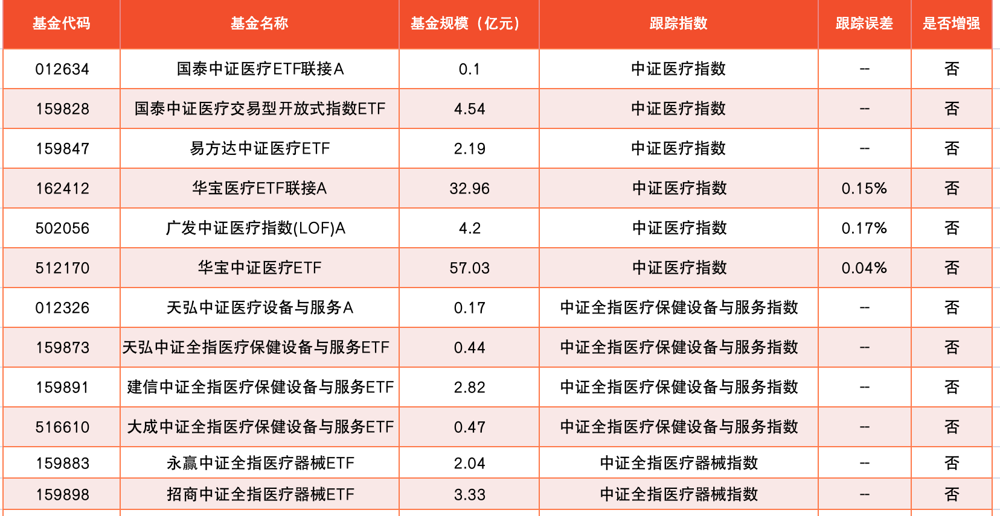
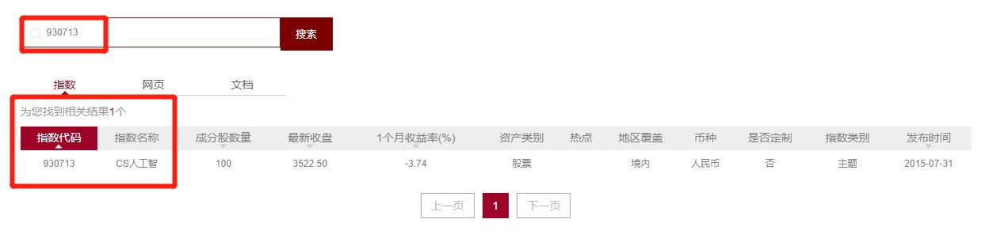
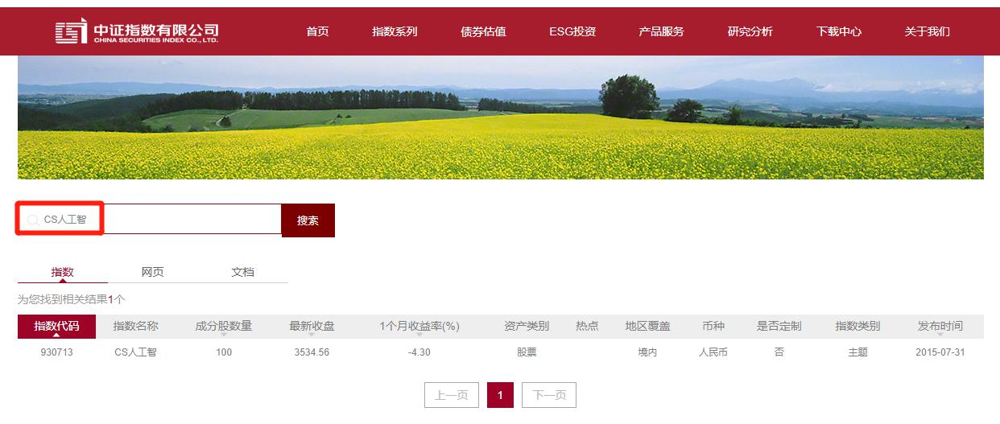
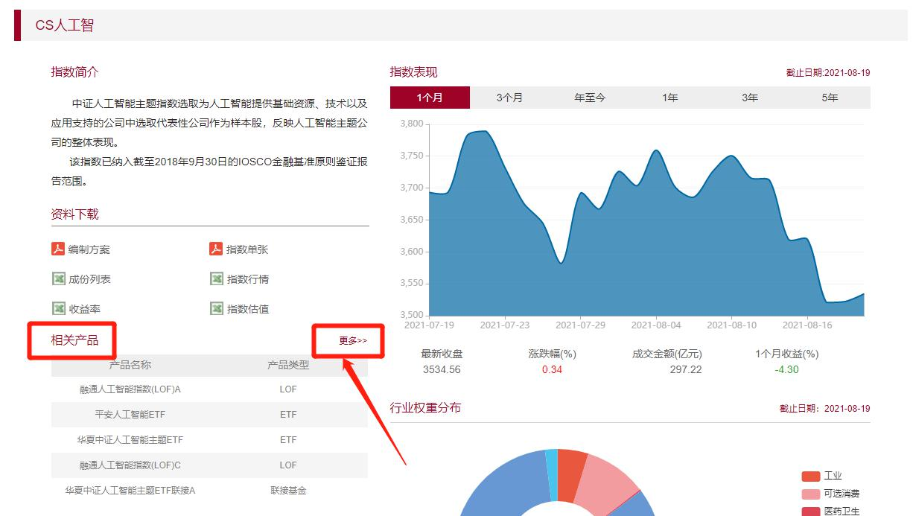

大家晚上好呀, 今天是我们基金进阶训练营的第一周周六, 照例来带大家复习本周的知识点, 做好准备了吗? 复习要开始啦~

## 核心-卫星

在第一天我们学习到行业指数聚焦某一领域, 可以帮我们更好的享受行业快速发展带来的成功.

根据国证指数网的行业分类标准, 一共有 11 个一级行业, 分别是: 主要消费、可选消费、医药卫生、金融、电信业务、信息技术、能源、工业、公共事业、原材料、房地产.

为了平衡直接投资单一行业带来的风险和波动, 我们采用"核心-卫星"策略. 核心为低估值宽基指数; 卫星为消费、医药、科技和新能源四大领域.

配置比例可以根据个人实际情况灵活调整.

激进的组合配比是, 核心占比 40%, 四颗卫星各占比 15%; 稳健的组合配比是, 核心占比 60%, 四颗卫星各占比 10%.

做"核心-卫星"的基金组合可以分散风险, 应对"轮动", 还可以提高投资"性价比", 优化投资体验. 但由于"核心-卫星"组合投资的都是股权类资产, 无法应对股市的系统性风险. 为了应对系统性风险, 我们后面的课程中还将介绍股债组合.

核心的宽基, 我们在基初课已经详细学过了, 现在主要是来学习博取收益的卫星,

## 消费

主要消费和可选消费对于经济环境的反映不同, 主要消费行业更加稳定, 历史收益率也更高. 我们在投资消费行业时, 应该以主要消费为主.

主要消费里, 我们重点关注农牧渔和食品饮料两大赛道.

农牧渔是周期性行业, 可选择的指数有中证农业主题指数、中证畜牧养殖指数.

食品饮料行业受经济影响小, 可选择的指数有: 中证细分食品饮料产业主题指数、中证白酒指数.

在主要消费行业的投资中, 我们优先选择食品饮料; 如果食品饮料缺乏投资机会, 再去考虑农牧渔.

班班在周二晚上还特地用了波特五力分析白酒一直在 A 股傲视群雄的原因.

波特五力包含:(1)现存竞争者的竞争强度; (2)上游议价能力; (3) 下游议价能力; (4)新加入者的威胁; (5)替代品的威胁.

## 医药

医疗行业的特点是: 盈利稳定、成长性高、政策利好、细分领域繁杂.

医药行业又被分为三个细分放心, 分别为: 医疗设备与服务、制药和生物科技.

医疗设备与服务行业分为医疗器械和医疗服务. 其中, 医疗器械可以选择中证全指医疗器械指数; 医疗服务行业可以选择中证医疗指数、中证全指医疗保健设备与服务指数.

制药行业的四个子行业短板明显, 盈利不稳定、成长性不佳, 我们不做考虑.

生物科技行业可选择的指数是: 国证生物医药指数、中证生物科技主题指数.

班班还在周三晚上带大家了解了跟医药行业密切相关的几个政府部门.

药监局主管药品; 卫健委主管医院; 医保局主管医保. 三方改革合在一起称为"三医联动".

从投资机会的角度来说, 过去看药监局, 现在看医保局, 未来看卫健委.

投资的时候, 要尽量避开受集采影响太大的仿制药, 可以选择受集采影响较小的创新药.

创新药的优势: 未来市场空间大; 可以卖到高价, 利润高; 有专利优势.

投资创新药可以选择的指数: 中证创新药产业指数.

## 科技

未来科技发展的大趋势, 可以概括为四个字: 云、管、端、芯.

"云"字代表云计算, 相关指数可以选择: 中证云计算与大数据主题指数.

管, 指的是连接云与终端设备的管道, 也就是通信网络. 跟通信网络直接相关的 5G 基站, 数量爆发的时期是 2020 到 2022 这 3 年, 鉴于目前已经离顶峰不远, 投资市场会对业绩预期提前反应, 所以, 5G 已经没有特别好的布局机会了.

"端"字指的是终端设备, 未来的发展趋势是人工智能. 相关指数可以选择: 中证人工智能主题指数、中证智能家居指数、中证智能制造主题指数、 中证智能汽车主题指数.

"芯"字指的是半导体芯片, 相关指数可以选择国证半导体芯片指数.

投资的时候, 要特别注意"时移"的问题. 也就是随着时间的推移, 产业本身在增长, 但是产业内各个部分的表现会各不相同, 切勿踏错节奏.

周四晚上班班带大家深度剖析了最近很火的"反垄断"和互联网投资.

互联网的科技含量不如人工智能、芯片, 所以有些投资者把互联网称为"软科技". 但互联网行业拥有强大的"网络效应": 产品的价值和使用它的人数有很大关系, 用的人越多, 产品价值就越高.

互联网行业反垄断, 只是让大家打开内部封闭, 并没有动到网络效应的基础. 短期内受到政策和情绪影响, 大概率不会立马出现反弹; 但只要坚持长期主义, 相信它们的长期回报, 还是有投资价值的.

投资互联网, 可以选择跟踪中国互联网 50 的指数基金.

## 新能源

这可是今年在我们 A 股大放异彩的新宠儿, 甚至已经威胁到白酒行业在很多投资者心中的"信仰". 但是, 我们来学习就是为了做出理性的判断的哦, 信仰可是要不得的, 毕竟我们还是要让他们那业绩来说话的(偷笑).

新能源火热的主要原因之一, 是政策扶持. 我国的目标是 2030 年实现碳达峰, 2060 年实现碳中和. 想投资这个主题的话, 可以选择"中证内地低碳经济主题指数".

新能源下有 3 个赛道, 分别是: 发电、储能以及新能源汽车.

太阳能发电简称"光伏", 是发电赛道中的一条主线. 相关指数可以选择"中证光伏产业指数".

储能板块将伴随新能源的发展而爆发, 相关指数可以选择"中证电池主题指数".

未来汽车发展的大方向可以概括为"两化": 一个是智能化, 另一个是电动化. 新能源汽车相关的指数可以选择"中证新能源汽车指数".

到这里, 我们"核心-卫星"组合的四颗卫星就全部集齐了, 它们分别是: 消费、医药、科技和新能源.

但有时候, 并不是所有的卫星里都有低估赛道, 贴心的班班给大家提供了备选项——新材料和稀土.

新材料是未来发展科技、工业、装备等等的基础. 投资新材料可以选择"中证新材料主题指数".

稀土是国家的战略性资源, 随着政策出台缩减供给, 需求端又保持旺盛,

稀土产业将长期收益. 投资稀土产业可以选择"中证稀土产业指数".

好了, 到了这里万事俱备, 只欠东风, 下周一, 我们一起来学习估值, 解锁"核心-卫星"的整体结构. 下周的课程极其重要, 大家要更加认真的学习, 细细消化哦~

## 如何查找行业基金

最近, 班班和学姐们经常收到这种提问"班班, 指数是怎么查来的?""学姐, 我想了解 xx 行业, 应该怎么查到相对应的指数呢?"

今天班班就从去哪里找, 怎么找, 是否值得投资以及怎么查对应的基金, 这 4 个方面来给大家讲讲关于指数的哪些小秘密~

### 一、 怎么查指数?

通过初级课的学习, 我们知道想要查找指数需要去指数官网.

A 股的指数官网有[中证指数官网](http://www.csindex.com.cn/)和[国证指数官网](http://www.cnindex.com.cn/).

所以, 第一步先打开网站.

找指数, 其实可以分成 3 种方法:

1. 搜索指数名称
2. 搜索指数代码
3. 搜索关键字

前两种方法都是可以直接定位到某一只数据, 比如:

当然, 这两个情况, 都是在我们已经认识了这个指数之后去搜索的.

如果不认识这个指数或者想要查询某个行业有什么指数的话, 我们可以通过关键词去搜索. 比如: 想找人工智能方向的话, 直接搜索关键词"人工智能"

这样所有跟人工智能相关的指数都出现在这里啦. 另外, 国证指数官网也是相同的道理, 班班就不一一演示了.

接下来, 我们来一一看下什么样的指数值得投资.

### 二、 什么样的指数值得投资?

投资指数之前, 我们要对这个行业进行过深入研究, 确定这个行业有较好的成长性和确定性哦. 除非大家投资自己所从事的行业, 要不然, 保险起见, 班班还是建议大家选择课程内推荐的行业.

那当我们确定好行业之后, 通过关键词, 我们往往搜索出多个指数. 这些指数都可以投资吗? 有没有办法帮我们挑选出更值得投资的指数呢?

班班教你几个挑选指数的小技巧:

1、查看指数有没有对应的基金?

如果指数非常优秀, 但是没有跟踪它的指数基金, 我们也是无法投资的. 所以, 第一步, 我们就先去看下, 这只指数有没有对应的指数基金.

以"人工智能"为例, 我们点开搜索页面的第一只指数"930713 CS 人工智".

我们可以在相关产品这里看到跟踪它的基金, 点开"更多", 可以查看到所有的相对应的指数基金哦~

但如果这只指数没有相对应的基金, 就会显示"无相关信息". 像下面这样:

像这种没有指数基金的指数就直接不考虑了.

2、选择成立时间更长的指数

指数成立的越久, 历史数据就越多, 一般来说, 跟踪它的产品也会更多. 当我们有多个选择的时候, 我们优先选择成立时间更长的指数.

指数成立时间可以直接在搜索页面查看到. 这里, 我们依旧以"人工智能"的为例.

大家可以直接看到, 相关的 4 只指数里"930713 CS 人工智"这只指数是成立时间最长的, 点开它们相对应的详情页面, 我们也能发现跟踪这只指数的基金数量是最多的.

3、尽量选择非定制的指数

这里我们来简单的说下, 指数公司的盈利模式.

基金公司如果想要推出一只指数基金, 是需要向指数公司购买指数的服务费的. 怎么理解呢? 咱们初级课说过, 指数基金其实就是基金经理在抄指数的作业. 抄作业之前给辛苦写作业的指数公司一点辛苦费, 换取指数的详细数据, 以及定期更新的资讯.

那定制指数呢, 差不多就相当于一个财大气粗的老板, 过来跟家教公司说, 你这里好像没有清北辅导班呀, 你给我儿子开一个, 这个辅导班以后就只有我们家能用哈.

所以, 定制指数一般都是机构投资者根据自身的需求, 跟指数公司商量好之后 , 为他们量身定做的. 只有他们家能用, 其他公司和机构都不能用.

指数是否定制, 我们也可以在搜索页面直接查看到. 以"人工智能" 为例, 我们可以看到第 2 只指数"931071 人工智能"就是一只定制的指数产品.

你点开这只指数之后就会发现, 所有的指数基金都出于同一个基金公司.

选择这只指数的话, 我们的选择面变少了, 毕竟, 已经形成了垄断局面, 话语权更多的都是在基金公司手里, 我们只能被动的接受.

所以, 在投资过程中, 我们尽可能避开定制的指数.

4、多个指数可选时, 优先选择收益高的

这个理由, 相信就不需要班班详述了吧. 不过, 这个是最后的加分项哦~也就是说, 当有多只指数已经通过了前 3 轮筛选的时候, 我们优先选择 3 年~5 年年化收益更高的指数.

我们点开指数的详情页, 在"指数表现"的板块下, 我们可以切换时间.

咱们做的是投资而不是投机, 所以我们还是更加关注长期收益更高的赛道哦~

### 三、 如何通过指数查找到对应的指数基金?

好了, 我们已经有了指数, 怎么查看指数基金呢?

我们回顾下基金初级课里挑选指数基金的要求:

1. 指数基金的规模 >5 亿, 且越大越好.
2. 跟踪误差越小越好.
3. 优先选择完全复制型.

其实, 挑选行业指数基金也是遵从上面的 3 个要求.

下面班班以指数"930713 CS 人工智"为例, 带大家走一遍筛选流程:

第一步: 在中证官网搜索"930713"或者" CS 人工智"或者"中证人工智能主题指数"

第二步: 点击指数名称, 进入指数详情页

第三步: 找到"相关产品"板块, 点击"更多"

第四步: 挑选出资产净值大于 5 亿元的指数基金, 进行记录

这里我们可以用到之前基金初级的指数基金筛选表格, 把基金规模超过 5 亿的基金都记录下来, 进行下一轮筛选.

第五步: 打开天天基金网, 输入基金代码或者基金名称, 查看基金的跟踪误差率

把跟踪误差率记录在表格相对应的位置上.

ps: 是不是指数增强型一般通过名字就可以看出来的, 所以班班就不多做赘述了.

就这样, 我们完成了一次行业指数基金的筛选, 是不是很简单呢~
