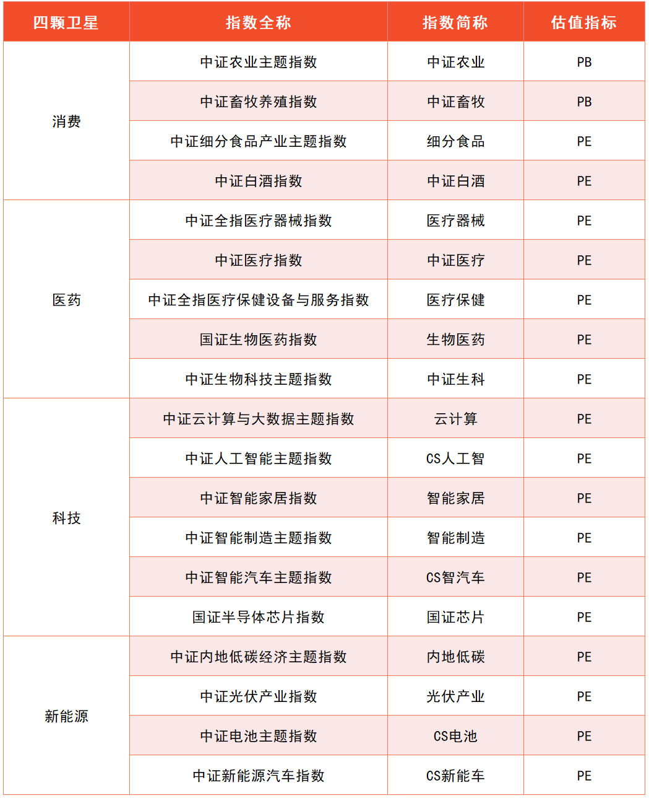
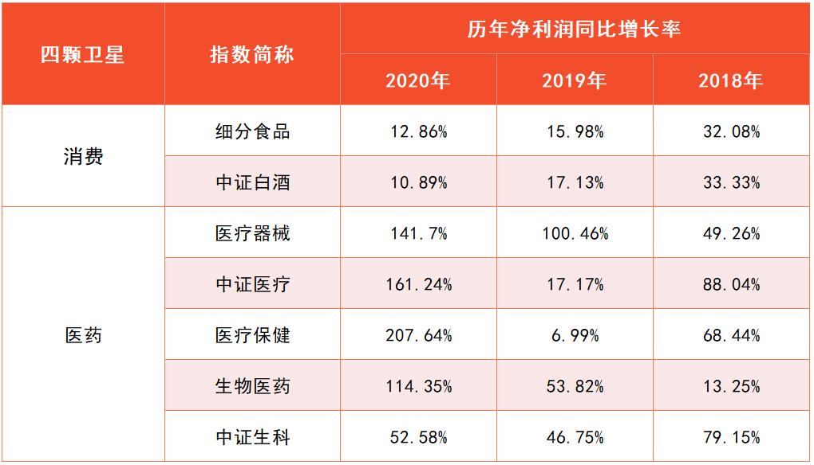
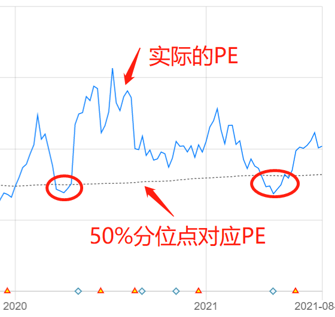
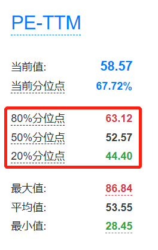
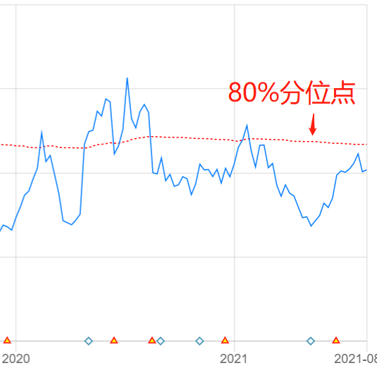
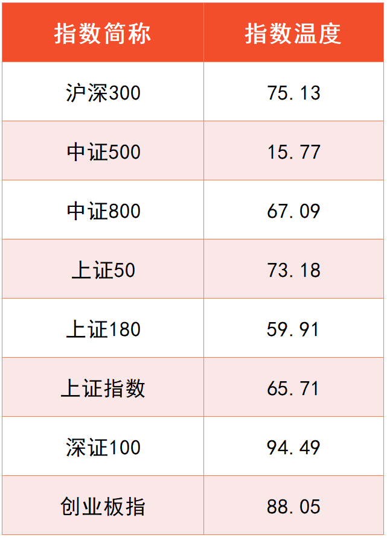
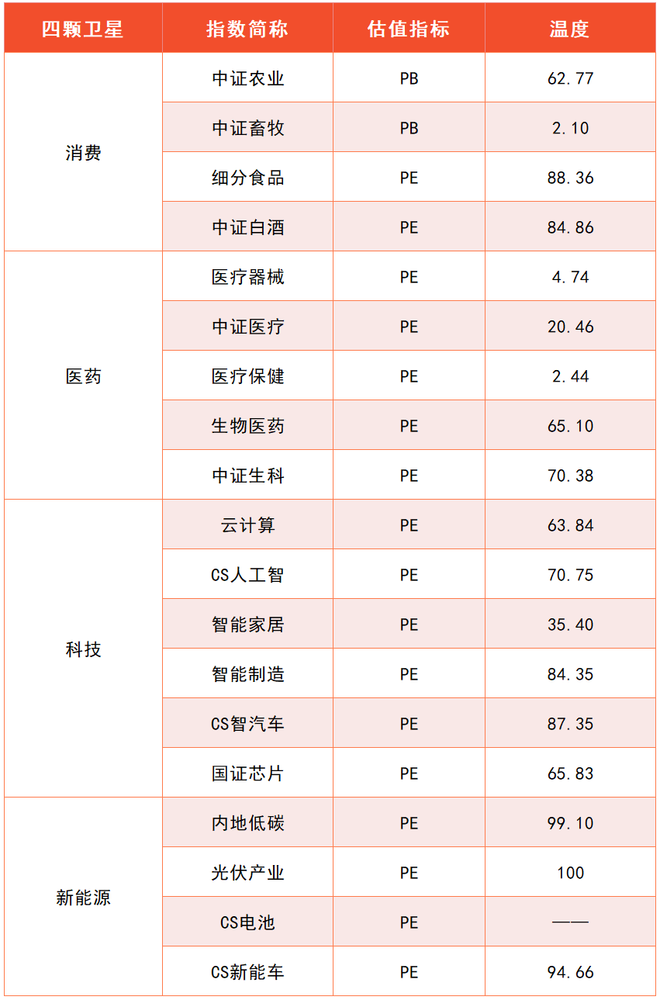
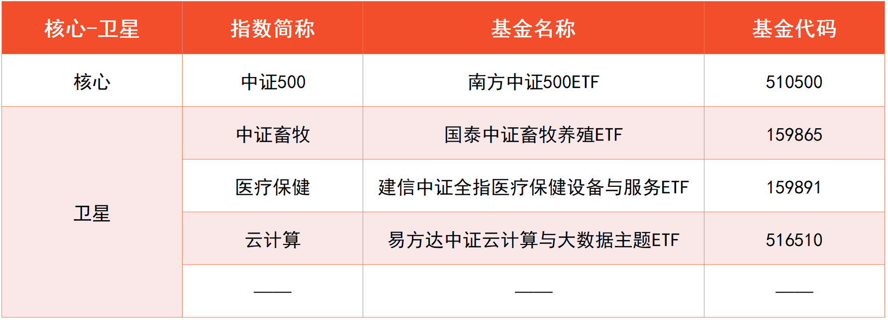
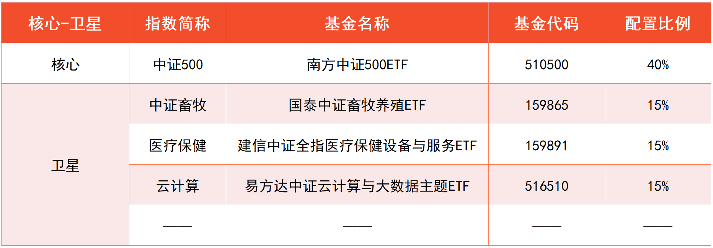
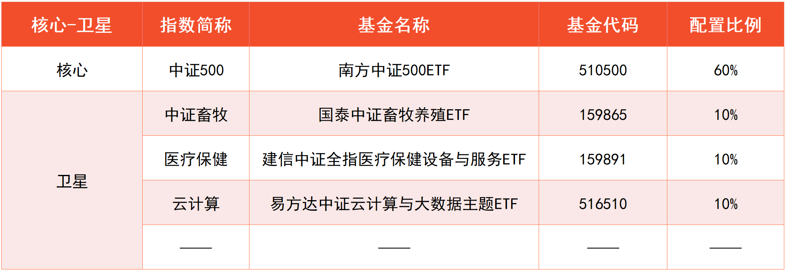

## PE 和 PB, 到底怎么选?

小伙伴们你们好, 欢迎继续学习《基金进阶训练营》.

在前面的课程中, 我们已经学习了与消费、医药、科技、新能源相关的很多指数, 每个指数也都可以找到对应的指数基金.

不过, 学过初级课的小伙伴想必都知道, 有了指数基金还不能直接"下手", 必须确认指数估值处在合理的位置, 才能买入.

针对初级课学习的宽基指数, 我们用指数温度来估值.

指数温度综合考虑了市盈率 PE 和市净率 PB.

这是因为, PE 和 PB 分别适用于给不同的行业估值, 而宽基指数的成分股来自各行各业, 所以才需要综合起来考虑.

但是, 进阶课里的指数聚焦单个行业或产业, 这种情况就没有必要综合考虑 PE 和 PB 啦, 我们只需要在 PE 和 PB 之间, 选一个最适合给行业估值的指标, 就可以啦.

具体应该怎么选呢? 我们先来看结论: PE 估值适用于弱周期行业; PB 估值适用于强周期行业.

"周期性"指的是与经济周期同起同落的特质. 经济大环境繁荣, 行业就繁荣; 经济大环境衰退, 行业就衰退.

所有的行业或多或少都受到国家经济的影响. 不过, 其中有些行业受经济影响较小, 它们被称为弱周期行业.

比如食品饮料、医药卫生, 不管经济怎么变化, 人饿了就得吃饭, 病了就得治疗, 行业周期性不明显.

为什么弱周期行业用市盈率 PE 估值呢?

我们可以回顾一下 PE 的计算公式: PE=市值/净利润. 它代表的是按照目前的净利润来估算, 投资多少年可以回本.

只有行业盈利保持相对稳定, 我们用目前的净利润来估算才有意义.

弱周期行业的周期性不明显, 盈利可以长期保持相对稳定, 用 PE 来衡量行业的估值水平较为合理.

当然, 还有些行业受经济影响较大, 被称为"强周期行业". 这类行业在经济向好的时候可以大赚, 在经济不景气的时候有可能不赚钱, 甚至亏钱. 这时候, 行业的净利润忽高忽低, 用 PE 估值就不合适啦.

强周期行业估值可以选择市净率 PB. 我们再来回顾一下 PB 的计算公式: PB=市值/净资产. 它代表的是买下一家公司需要花几倍的价格.

即使经济不景气, 行业不赚钱, 但是公司手里还有资产呀, 咱们就直接评估买下这些资产需要出几倍的价钱即可.

前面课程中介绍的所有行业和产业, 有且仅有一个属于强周期, 那就是农牧渔. 这一点在第二课已经提到过啦.

农牧渔相关的指数适合用 PB 估值. 我们可以将 PB 分位点 50%作为分界线, 也就是 PB 温度低于 50 度时买入, PB 温度高于 50 度时卖出.

除此之外, 进阶课中涉及到的其他指数均用 PE 估值.

文稿中的表格为大家总结了消费、医药、科技、新能源涉及到的指数, 这些指数都是我们在前面课程中精选出来的, 每个指数应该用什么估值指标也列在了表格中.

大家可以对照表格使用 PE 和 PB.

## 高成长赛道如何估值

上一小节, 我们已经了解, 盈利稳定的行业适合用 PE 估值.

细心的小伙伴会发现, "盈利稳定"其实包含了两种情况.

一种情况是盈利年年都差不多. 比如, 去年的净利润是 1 个亿, 今年的净利润还是 1 个亿, 几乎不怎么变化. 这种情况一般出现在市场已经成熟、没有更多成长空间的行业.

还有一种情况是盈利保持稳定地正增长. 比如, 去年的净利润是 1 个亿, 今年的净利润是 2 个亿, 明年的净利润是 4 个亿, 不仅每年都能保持盈利, 而且盈利水平节节高升. 这种情况一般出现在市场尚未成熟、还有很大成长空间的行业

除农牧渔以外, 课程中为大家精选的赛道, 都属于成长性相对较好的赛道, 也就是属于以上第二种情况.

以消费和医药相关指数为例, 从 2018 年到 2020 年这 3 年时间里, 净利润总体保持年年正增长. 尤其是医药, 随着政策支持和市场扩张, 净利润增长可以说是"快马加鞭"

(指数统计的净利润代表了成分股总体的净利润水平. 净利润同比增长率为正, 说明当年的净利润较去年增加.)

科技方面的云计算、人工智能和半导体, 以及新能源方面的低碳、光伏、电池和新能源汽车, 全部都是新兴领域, 目前还处于发展的起步阶段, 市场刚刚打开, 未来成长空间非常大.

对于这些成长性好的赛道, 我们在用 PE 估值的时候会发现, PE 分位点长期居高不下. 也就是说, 市场十分看好这些赛道, 给予了它们较高的估值.

以中证人工智能主题指数为例, 大家可以看文稿中的图片, 蓝色实线表示实际的 PE, 黑色虚线表示 50%分位点对应的 PE

图中可以看出, 该指数从 2020 年开始, PE 分位点在绝大部分时间里都超过了 50%. 如果我们还像初级课一样, 以 50%分位点为买卖界限, 那么在近 20 个月的时间里, 只有两次很短的买入机会.

但实际上, 该指数在同一时间内总共上涨了 22.32%, 换算成年化收益率相当于 13.57%. 按照 50%分位点来买卖就错过了这笔收益.

对于高成长赛道而言, 高估值是常态. 为了不错过行业发展、指数上涨的投资机会, 我们可以适当放宽对估值的要求.

"理杏仁"网站给出了三条分位点分界线, 分别是: 20%分位点, 50%分位点和 80%分位点, 一般认为, 它们分别代表机会值、中位值和危险值. PE 高于 80%则说明进入了高估值的危险区域.

我们不妨把对 PE 分位点的要求放宽到 80%, 低于 80%即可买入. 也就是说, PE 温度在 80 度以下, 即可买入.

还是以中证人工智能主题指数为例, 大家可以看文稿中的图片, 将 80%分位点作为界限以后, 会出现很多不错的买入机会.

有些小伙伴可能会顾虑, 把估值要求放宽到了 80%, 虽然买入机会变多了, 但是下跌的风险会不会变得特别大?

这一点不用过于担心. 因为高成长意味着市场规模越来越大, 盈利越来越多, 最终盈利会把高估值"消化"掉.

这就是传说中的"盈利消化估值".

为了理解背后的逻辑, 我们回到市盈率的计算公式: PE=市值/净利润.

假设一家公司市值 100 亿, 我们花 100 亿买下了这家公司. 它最近年度的净利润是 2 亿元, 那么 PE 就是 100 除以 2 等干 50.

也就是说, 如果保持每年赚 2 亿元净利润, 我们要用 50 年的时间才能收回成本.

不过, 我们买的是一家成长性好的公司, 今年的净利润是 2 亿元, 明年的净利润可以涨到 5 亿元. 如果按照 5 亿元来算, 只需要 20 年时间就能收回成本.

随着每年的净利润越来越高, 我们收回成本的时间就会越来越短. 可见, 估值贵只是临时的, 盈利增长很快就会把估值"消化"掉. 这就是为什么, 对于高成长赛道, 我们可以适当放宽估值要求.

不过大家要注意, 只有对于进阶课中的高成长赛道, 我们才能把估值放宽到 80%哦. 对于初级课学过的宽基指数, 我们还是严格按照 50%分位点来估值.

## 一次性配齐"核心-卫星"

我们已经选出了一批指数, 也学习了指数的估值方法.

现在, 我们终于可以把"核心-卫星"组合配齐啦.

首先, 我们来找一个宽基指数作为"核心". 文稿中为大家展示了 8 个宽基指数的温度, 统计时间为 2021 年 8 月 3 日. 可以看到, 温度最低的是中证 500 指数, 我们把它作为核心部分.

接下来, 我们来寻找四颗卫星. 文稿中给大家展示了消费、医药、科技和新能源相关指数的温度, 统计时间同样是 2021 年 8 月 3 日. 我们只需要在四大领域里面, 各选择一个估值最低的指数就可以啦.

(数据来源: 理杏仁. 备注: 截至 2021 年 8 月 3 日, "CS 电池"指数估值尚无法查询, 我们会在理杏仁网站更新后的第一时间补充该指数的估值.)

根据上面的表格, 消费方面可以选择中证畜牧, 医药方面可以选择医疗保健.

科技方面可以选择智能家居. 不过由于跟踪智能家居的基金较少, 只有 1 只, 且在筛选期间基金规模不足 1 亿元, 不适合配置, 所以我们暂且排除智能家居, 选择科技领域里估值第二低的云计算.

至于新能源领域, 指数估值全都超过了 80 度, 没有符合条件的指数. 这种情况下, 我们就暂时不投资这一领域, 等到机会出现以后再加以考虑.

确定了指数以后, 我们直接按照基金规模、跟踪误差、是否增强三个指标, 来选择跟踪它们的基金就可以啦.

最后, 按照第一课介绍的激进版、稳健版两种配置比例, 大家可以选择其中更适合自己的一种, 配置起来.

以激进版的配置为例, 核心部分占比 40%, 每颗卫星占比 15%, 那么我们就把资金按比例分配到对应的指数基金上面.

新能源相关指数估值过高, 当前不配置, 这 15%的资金我们就先保留着, 可以暂时放在货币基金里生息; 等机会一出现, 就一次性把钱取出来, 全部投资到新能源上面.

稳健版的配置只需要调整一下比例, 核心占比 60%, 每颗卫星占比 10%.

温馨提示: 配置时间不同, 大家所看到的指数估值也会不同, 从而所选择的指数和指数基金可能会不一样, 请小伙伴们按照自己实际筛选的结果为准, 不要照抄课程中的基金哦.

## 总结

1. PE 估值适用于弱周期行业; PB 估值适用于强周期行业.
2. 进阶课介绍的所有行业和产业, 有且仅有农牧渔属于强周期. 农牧渔相关的指数适合用 PB 估值. PB 温度低于 50 度时买入, PB 温度高于 50 度时卖出.
3. 除农牧渔之外, 进阶课中涉及到的其他指数均用 PE 估值. 而且由于行业成长性好, 估值可以适当放宽. PE 温度低于 80 度时买入, PE 温度高于 80 度时卖出.
4. 在配置四颗卫星时, 我们只需要在消费、医药、科技、新能源里面, 各选择一个估值最低的指数就可以了.
5. 如果某一个领域没有估值合理的指数, 那就暂时不配置该领域的基金. 可以把保留下来的本金放在货币基金里生息; 等该领域的机会一出现, 就一次性把钱取出来, 全部投资进去.

最后请大家注意, "核心-卫星"组合是为了搭配指数基金, 而指数基金所投资的底层资产以股票为主.

下一节课, 我们将把债券基金也考虑进来, 在股票和债券之间合理配比, 建立一个攻守兼备的股债组合.
