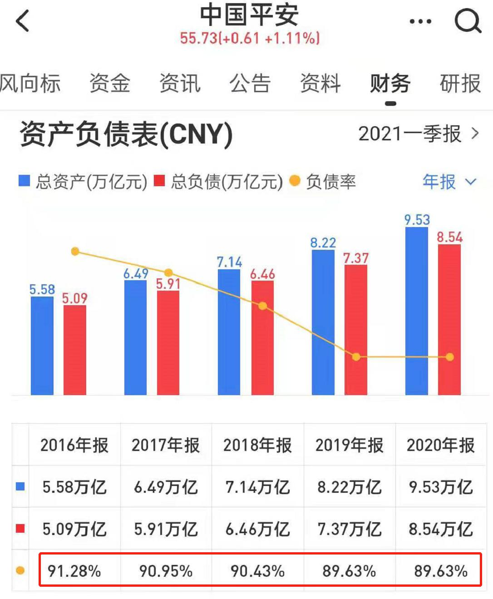
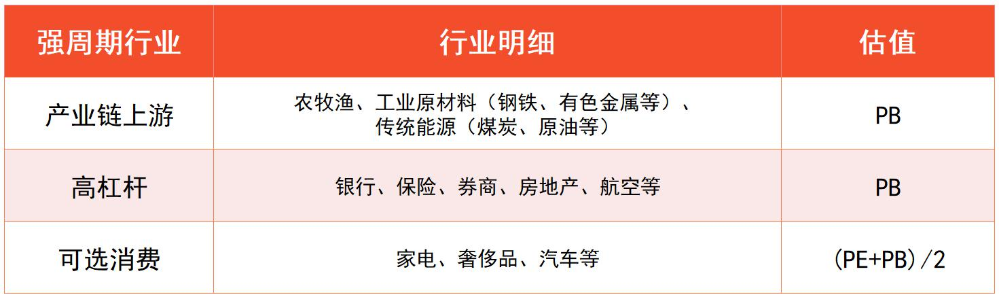

## PE 和 PB, 到底怎么选?

小伙伴们你们好, 欢迎继续学习《基金进阶训练营》.

在前面的课程中, 我们已经学习了与消费、医药、科技、新能源相关的很多指数, 每个指数也都可以找到对应的指数基金.

不过, 学过初级课的小伙伴想必都知道, 有了指数基金还不能直接"下手", 必须确认指数估值处在合理的位置, 才能买入.

针对初级课学习的宽基指数, 我们用指数温度来估值.

指数温度综合考虑了市盈率 PE 和市净率 PB.

这是因为, PE 和 PB 分别适用于给不同的行业估值, 而宽基指数的成分股来自各行各业, 所以才需要综合起来考虑.

但是, 进阶课里的指数聚焦单个行业或产业, 这种情况就没有必要综合考虑 PE 和 PB 啦, 我们只需要在 PE 和 PB 之间, 选一个最适合给行业估值的指标, 就可以啦.

具体应该怎么选呢? 我们先来看结论: PE 估值适用于弱周期行业; PB 估值适用于强周期行业.

"周期性"指的是与经济周期同起同落的特质. 经济大环境繁荣, 行业就繁荣; 经济大环境衰退, 行业就衰退.

所有的行业或多或少都受到国家经济的影响. 不过, 其中有些行业受经济影响较小, 它们被称为弱周期行业.

比如食品饮料、医药卫生, 不管经济怎么变化, 人饿了就得吃饭, 病了就得治疗, 行业周期性不明显.

为什么弱周期行业用市盈率 PE 估值呢?

我们可以回顾一下 PE 的计算公式: PE=市值/净利润. 它代表的是按照目前的净利润来估算, 投资多少年可以回本.

只有行业盈利保持相对稳定, 我们用目前的净利润来估算才有意义.

弱周期行业的周期性不明显, 盈利可以长期保持相对稳定, 用 PE 来衡量行业的估值水平较为合理.

当然, 还有些行业受经济影响较大, 被称为"强周期行业". 这类行业在经济向好的时候可以大赚, 在经济不景气的时候有可能不赚钱, 甚至亏钱. 这时候, 行业的净利润忽高忽低, 用 PE 估值就不合适啦.

强周期行业估值可以选择市净率 PB. 我们再来回顾一下 PB 的计算公式: PB=市值/净资产. 它代表的是买下一家公司需要花几倍的价格.

即使经济不景气, 行业不赚钱, 但是公司手里还有资产呀, 咱们就直接评估买下这些资产需要出几倍的价钱即可.

前面课程中介绍的所有行业和产业, 有且仅有一个属于强周期, 那就是农牧渔. 这一点在第二课已经提到过啦.

农牧渔相关的指数适合用 PB 估值. 我们可以将 PB 分位点 50%作为分界线, 也就是 PB 温度低于 50 度时买入, PB 温度高于 50 度时卖出.

除此之外, 进阶课中涉及到的其他指数均用 PE 估值.

文稿中的表格为大家总结了消费、医药、科技、新能源涉及到的指数, 这些指数都是我们在前面课程中精选出来的, 每个指数应该用什么估值指标也列在了表格中.

大家可以对照表格使用 PE 和 PB.

## 高成长赛道如何估值

上一小节, 我们已经了解, 盈利稳定的行业适合用 PE 估值.

细心的小伙伴会发现, "盈利稳定"其实包含了两种情况.

一种情况是盈利年年都差不多. 比如, 去年的净利润是 1 个亿, 今年的净利润还是 1 个亿, 几乎不怎么变化. 这种情况一般出现在市场已经成熟、没有更多成长空间的行业.

还有一种情况是盈利保持稳定地正增长. 比如, 去年的净利润是 1 个亿, 今年的净利润是 2 个亿, 明年的净利润是 4 个亿, 不仅每年都能保持盈利, 而且盈利水平节节高升. 这种情况一般出现在市场尚未成熟、还有很大成长空间的行业

除农牧渔以外, 课程中为大家精选的赛道, 都属于成长性相对较好的赛道, 也就是属于以上第二种情况.

以消费和医药相关指数为例, 从 2018 年到 2020 年这 3 年时间里, 净利润总体保持年年正增长. 尤其是医药, 随着政策支持和市场扩张, 净利润增长可以说是"快马加鞭"

(指数统计的净利润代表了成分股总体的净利润水平. 净利润同比增长率为正, 说明当年的净利润较去年增加.)

科技方面的云计算、人工智能和半导体, 以及新能源方面的低碳、光伏、电池和新能源汽车, 全部都是新兴领域, 目前还处于发展的起步阶段, 市场刚刚打开, 未来成长空间非常大.

对于这些成长性好的赛道, 我们在用 PE 估值的时候会发现, PE 分位点长期居高不下. 也就是说, 市场十分看好这些赛道, 给予了它们较高的估值.

以中证人工智能主题指数为例, 大家可以看文稿中的图片, 蓝色实线表示实际的 PE, 黑色虚线表示 50%分位点对应的 PE

图中可以看出, 该指数从 2020 年开始, PE 分位点在绝大部分时间里都超过了 50%. 如果我们还像初级课一样, 以 50%分位点为买卖界限, 那么在近 20 个月的时间里, 只有两次很短的买入机会.

但实际上, 该指数在同一时间内总共上涨了 22.32%, 换算成年化收益率相当于 13.57%. 按照 50%分位点来买卖就错过了这笔收益.

对于高成长赛道而言, 高估值是常态. 为了不错过行业发展、指数上涨的投资机会, 我们可以适当放宽对估值的要求.

"理杏仁"网站给出了三条分位点分界线, 分别是: 20%分位点, 50%分位点和 80%分位点, 一般认为, 它们分别代表机会值、中位值和危险值. PE 高于 80%则说明进入了高估值的危险区域.

我们不妨把对 PE 分位点的要求放宽到 80%, 低于 80%即可买入. 也就是说, PE 温度在 80 度以下, 即可买入.

还是以中证人工智能主题指数为例, 大家可以看文稿中的图片, 将 80%分位点作为界限以后, 会出现很多不错的买入机会.

有些小伙伴可能会顾虑, 把估值要求放宽到了 80%, 虽然买入机会变多了, 但是下跌的风险会不会变得特别大?

这一点不用过于担心. 因为高成长意味着市场规模越来越大, 盈利越来越多, 最终盈利会把高估值"消化"掉.

这就是传说中的"盈利消化估值".

为了理解背后的逻辑, 我们回到市盈率的计算公式: PE=市值/净利润.

假设一家公司市值 100 亿, 我们花 100 亿买下了这家公司. 它最近年度的净利润是 2 亿元, 那么 PE 就是 100 除以 2 等干 50.

也就是说, 如果保持每年赚 2 亿元净利润, 我们要用 50 年的时间才能收回成本.

不过, 我们买的是一家成长性好的公司, 今年的净利润是 2 亿元, 明年的净利润可以涨到 5 亿元. 如果按照 5 亿元来算, 只需要 20 年时间就能收回成本.

随着每年的净利润越来越高, 我们收回成本的时间就会越来越短. 可见, 估值贵只是临时的, 盈利增长很快就会把估值"消化"掉. 这就是为什么, 对于高成长赛道, 我们可以适当放宽估值要求.

不过大家要注意, 只有对于进阶课中的高成长赛道, 我们才能把估值放宽到 80%哦. 对于初级课学过的宽基指数, 我们还是严格按照 50%分位点来估值.

## 一次性配齐"核心-卫星"

我们已经选出了一批指数, 也学习了指数的估值方法.

现在, 我们终于可以把"核心-卫星"组合配齐啦.

首先, 我们来找一个宽基指数作为"核心". 文稿中为大家展示了 8 个宽基指数的温度, 统计时间为 2021 年 8 月 3 日. 可以看到, 温度最低的是中证 500 指数, 我们把它作为核心部分.

接下来, 我们来寻找四颗卫星. 文稿中给大家展示了消费、医药、科技和新能源相关指数的温度, 统计时间同样是 2021 年 8 月 3 日. 我们只需要在四大领域里面, 各选择一个估值最低的指数就可以啦.

(数据来源: 理杏仁. 备注: 截至 2021 年 8 月 3 日, "CS 电池"指数估值尚无法查询, 我们会在理杏仁网站更新后的第一时间补充该指数的估值.)

根据上面的表格, 消费方面可以选择中证畜牧, 医药方面可以选择医疗保健.

科技方面可以选择智能家居. 不过由于跟踪智能家居的基金较少, 只有 1 只, 且在筛选期间基金规模不足 1 亿元, 不适合配置, 所以我们暂且排除智能家居, 选择科技领域里估值第二低的云计算.

至于新能源领域, 指数估值全都超过了 80 度, 没有符合条件的指数. 这种情况下, 我们就暂时不投资这一领域, 等到机会出现以后再加以考虑.

确定了指数以后, 我们直接按照基金规模、跟踪误差、是否增强三个指标, 来选择跟踪它们的基金就可以啦.

最后, 按照第一课介绍的激进版、稳健版两种配置比例, 大家可以选择其中更适合自己的一种, 配置起来.

以激进版的配置为例, 核心部分占比 40%, 每颗卫星占比 15%, 那么我们就把资金按比例分配到对应的指数基金上面.

新能源相关指数估值过高, 当前不配置, 这 15%的资金我们就先保留着, 可以暂时放在货币基金里生息; 等机会一出现, 就一次性把钱取出来, 全部投资到新能源上面.

稳健版的配置只需要调整一下比例, 核心占比 60%, 每颗卫星占比 10%.

温馨提示: 配置时间不同, 大家所看到的指数估值也会不同, 从而所选择的指数和指数基金可能会不一样, 请小伙伴们按照自己实际筛选的结果为准, 不要照抄课程中的基金哦.

## 指数估值三问三答

今天课程重点讲了估值. 班班先来总结一下:

1. 强周期行业用 PB, 弱周期行业用 PE;
2. 高成长赛道可以放宽估值要求, 温度 80 度以下都可以定投.

相信小伙伴们理解这两个重点, 应该没什么问题了. 不过具体到其中一些细节, 可能还有些疑问.

比如说, 课程里只讲了农牧渔一个强周期行业, 别的强周期行业还有哪些? 高成长赛道, 为什么可以把估值放宽? 进阶课的指数基金, 需要定期不定额投资吗? 等等.

今晚咱们就通过三问三答的形式, 来解答相关的疑惑. 接下来的内容来自班班的带班经验, 都是从过去学员提问中总结出来的精华, 大家真对待哦.

### 第一问: 哪些行业是强周期行业?

咱们只要能知道, 什么行业是强周期行业, 那么也就相当于知道了, 除此之外的都是弱周期行业.

强周期, 就是跟经济周期有很强的关系. 这种关系一般都是正相关, 也就是同时繁荣, 同时衰退.

有些行业是否属于周期行业, 咱们凭生活经验就能判断出来. 大家不要小看生活经验哦, 这是咱们判断周期最直接的方式.

比如课程里提到过的养猪行业, 根据猪肉价格变化, 基本就知道这是一个强周期行业.

再比如银行, 经济繁荣的时候, 不管是企业还是个人, 存款贷款都很活跃, 银行业很吃香; 经济衰落的时候, 个人和企业保命还来不及呢, 更别提银行贷款了, 这时候银行业不景气. 所以, 银行也是周期性行业.

这就是第一步, 根据生活经验判断一个行业是强周期还是弱周期. 强周期行业用 PB 估值, 弱周期行业用 PE 估值.

如果根据生活经验判断不了, 班班再给大家三个锦囊.

第一个锦囊, 看行业是否处于产业链上游.

比如说, 从养猪, 到屠宰, 到生肉, 到肉制品加工, 到包装、超市铺货、零售, 这就是一条完整的产业链. 靠近源头的是上游, 贴近消费者的是下游.

在一条产业链里, 越往上游走, 周期性越强; 越往下游走, 周期性越弱.

养猪处在上游, 所以它是强周期, 整个农牧渔是强周期, 都是这个原因.

等把猪肉做成猪肉脯, 它就属于食品行业了, 成了弱周期.

还有哪些行业处于产业链上游呢? 大家可以思考一下哦.

传统能源、原材料其实都是强周期行业. 也就是煤炭、钢铁、有色金属、原油, 等等这些.

工业生产必须用到这些能源, 也必须采购原材料, 在产业链中, 它们就是上游. 所以周期性比较强. 直接的体现就是它们的价格, 像猪价一样, 受到供给和需求的变化影响, 时而贵, 时而便宜.

其实我们从宏观经济的角度看也一样. 经济繁荣了, 工业大发展, 肯定要消耗大量的能源和原材料, 这些行业都受益, 都保持景气; 经济衰退了, 正好反过来. 所以它们是强周期.

第二个锦囊, 看行业是否高杠杆.

杠杆这个词, 咱们在初级课学习债券基金的时候, 曾经接触过.

杠杆, 其实就是负债. 高杠杆行业, 其实就是高负债行业.

也就是说, 这个行业必须借大量的钱, 才能维持运作. 这样的行业也属于周期性行业.

最典型的就是金融、房地产和航空. 其中金融包含了"三驾马车": 银行、 券商、保险.

就拿中国银行来说, 负债率常年都在 90%以上. 也就是说 100 块里面有 90 块是借来的.

有些投资者看到高负债都会吓怕, 但其实高负债对这些银行来说, 就是常规现象. 大家存到银行的钱, 对咱们来说是存款, 对银行来说其实就是它的负债, 早晚得还我们. 银行要活着, 就得靠大家存款, 所以它负债率高. 再比如券商里面的华泰证券, 负债率常年在 70%以上.

保险也是一样. 中国平安的负债率在 90%以上.

房地产就更不用说了. 先借钱盖房子再销售. 万科常年的负债率在 80%以上.

最后是航空. 我们可以看一下业内龙头, 南方航空, 负债率在 70%以上.

以上不管是银行、券商、保险、房地产还是航空, 都属于高杠杆行业, 也都是强周期行业. 经济差了, 钱不好借, 这些负债高的公司肯定都受影响.

另外, 从供给和需求的角度出发, 经济疲软的时候, 人们对于证券投资、买保险、买房子、坐飞机的需求也不大, 这些行业都受影响.

第三个锦囊, 可选消费的周期性也比较强.

可选消费就是可买、可不买的. 比如奢侈品、汽车、家电等. 有了当然更好, 没有的话只是降低一下生活品质, 不会影响到生存.

当然, 由于它们处于产业链下游, 所以相对于前面两种情况, 对经济周期的反应没有那么强烈, 周期性相对弱一点.

对于可选消费行业, 因为它周期性相对折中, 大家估值的时候可以综合考虑 PE、PB, 用咱们初级课学到的"指数温度", 也就是(PE+PB)/2, 来估值.

好啦, 三个锦囊都给大家了. 典型的几个强周期行业, 班班刚才基本都覆盖到了. 除此之外, 如果大家还有拿不准的, 可以往这三个锦囊上面套一套.

给大家一个表格, 以后估值的时候可以拿来对照.

有些细心的小伙伴估计会发现一个问题:

前面讲了能源、汽车, 都是强周期, 用 PB 估值. 咱们课程里讲了新能源、 新能源汽车, 难道不属于能源和汽车吗? 为什么新的就用 PE 估值, 传统的就用 PB 估值?

这是因为, 用不用 PB, 归根结底还是看它的周期性. 光伏、新能源汽车, 这些未来都是高速发展的赛道, 不会立马体现出周期性.

可能等它们发展成熟了, 等新能源取代旧能源了, 新能源汽车取代燃油车了, 那个时候它们的周期性才会出现. 不过这种情况可能得到 2030 年以后了.

就未来十年来说, 光伏、新能源汽车的成长性, 还不至于让它们面对周期衰退. 咱们直接按照弱周期来处理完全没问题.

上一次晚分享, 班班提到的新材料、稀土产业, 其实也是一样的逻辑.

虽然原材料属于强周期行业, 但仅限于钢铁等成熟行业. 对于新材料和稀土, 它们的成长性较好, 发展空间大, 成熟之前还体现不出太强的周期性. 咱们就可以按照弱周期用 PE 估值.

### 第二问: 高成长行业, 为什么可以放宽指数估值?

课程里提到, 高成长赛道的指数, 可以把估值要求放宽. 温度低于 80 度都可以定投. 可能有的小伙伴还不太理解其中的逻辑.

下面, 班班按照自己梳理的逻辑, 给大家展开讲讲.

首先来看 PE 的公式: PE=市值/净利润. 这是课程里有的哦.

对于上市公司而言, 市值和股价直接相关. 股价代表的是一股多少钱, 乘以总的股数, 就是公司的总市值. 它们的关系是: 市值=股价 × 总股本.

现在咱们有俩公式啦:

1 PE=市值/净利润

2 市值=股价 × 总股本

把 2 代入到 1 里面, 可以得到: PE=股价 × 总股本/净利润班班把公式简单调一下顺序, 可以把它变成: 股价=PE× 净利润/总股本. 咱们直接看图吧, 看图更形象:

投资公司, 肯定是股价上涨才能赚钱. 按照上面公式, 股价和三个因素有关: PE、净利润和总股本.

其中, 除非极个别情况下公司有特殊操作, 总股本一般都不会变, 可以看做一个不变值.

那么, 股价上涨, 关键就看分子的 PE 和净利润了.

PE 体现的是估值水平, 净利润体现的是盈利水平. 这一点理解起来没有问题吧.

大家看图, 股价上涨赚钱, 可以是赚估值上涨的钱, 也可以是赚盈利上涨的钱. 估值和盈利, 他俩共同决定了股价上涨.

对于发展成熟的、已经没有多少成长空间的行业来说, 行业里的公司能保住现有的盈利水平就不错了. 咱们在盈利这边, 不会抱太大期待. 只能在估值上卡的严一点, 侧重于赚估值从低位到高位修复的钱.

对于进阶课的高成长赛道, 高成长就意味着赚钱越来越多, 盈利涨得很猛. 那么, 盈利这边就能大幅度带动股价上涨. 投资成长赛道, 侧重点就在盈利这边.

这个时候, 咱们对估值这边的要求就没有必要那么严了. 不必非得强求低估, 只要估值相对合理, 不是贵得过分了(不超过 80 度), 就算 OK.

所以呀, 咱们在投资成长赛道时, 可以把估值放宽.

### 第三问: 进阶课的指数基金, 需要定期不定额投资吗?

在初级课, 大家学习了定期不定额投资. 也就是指数估值越低的时候, 定投金额越大.

那么, 进阶课里, 咱们还要进行定期不定额投资吗? 班班的答案是: 没必要. 前面咱们说了, 高成长行业赚钱, 侧重于盈利的带动, 而不是估值的修复.

一般来说, 低于 50 度那种严格的低估值, 出现的时间都不长, 如果我们按照越低越买操作, 可能大部分时间只能买很少, 很多钱投不出去, 导致本金的利用效率很低.

其次呢, 进阶课的每一个指数, 都是放在"核心-卫星"组合里来考虑的. 如果我们定期不定额投资, 每个指数每次投资的数额不一样, 就把整个组合的比例给打乱了, 调整起来非常麻烦.

总的来说, 对于进阶课的指数基金, 定期不定额投资得不偿失, 麻烦大于好处. 咱们可以不考虑.

平时有机会的时候, 保持定期定额投资就可以了.

## 总结

1. PE 估值适用于弱周期行业; PB 估值适用于强周期行业.
2. 进阶课介绍的所有行业和产业, 有且仅有农牧渔属于强周期. 农牧渔相关的指数适合用 PB 估值. PB 温度低于 50 度时买入, PB 温度高于 50 度时卖出.
3. 除农牧渔之外, 进阶课中涉及到的其他指数均用 PE 估值. 而且由于行业成长性好, 估值可以适当放宽. PE 温度低于 80 度时买入, PE 温度高于 80 度时卖出.
4. 在配置四颗卫星时, 我们只需要在消费、医药、科技、新能源里面, 各选择一个估值最低的指数就可以了.
5. 如果某一个领域没有估值合理的指数, 那就暂时不配置该领域的基金. 可以把保留下来的本金放在货币基金里生息; 等该领域的机会一出现, 就一次性把钱取出来, 全部投资进去.

最后请大家注意, "核心-卫星"组合是为了搭配指数基金, 而指数基金所投资的底层资产以股票为主.

下一节课, 我们将把债券基金也考虑进来, 在股票和债券之间合理配比, 建立一个攻守兼备的股债组合.

1. 判断行业是否强周期, 首先根据生活经验判断; 其次可以用三个锦囊: (1)看行业是否处于产业链上游; (2)看行业是否高杠杆; (3)可选消费.
2. 估值和盈利, 共同决定了股价上涨. 成熟行业侧重于赚估值从低到高修复的钱; 高成长行业侧重于赚盈利爆发的钱.
3. 对于进阶课的指数基金, 没有必要定期不定额投资, 保持定期定额投资就可以了.
