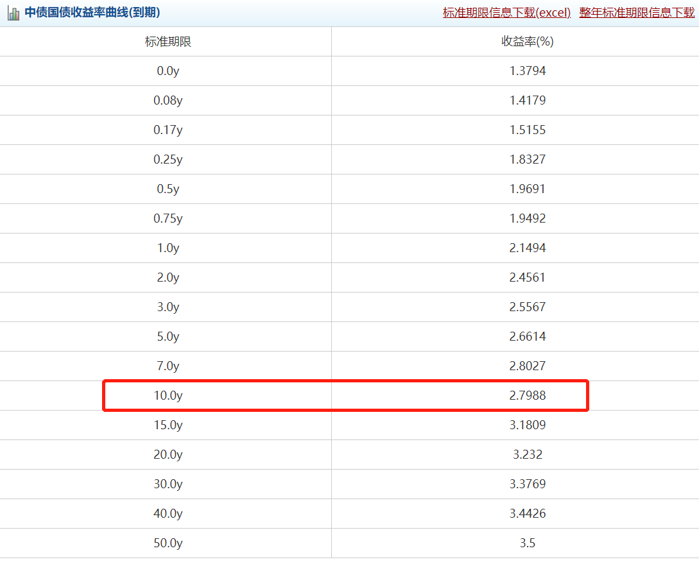
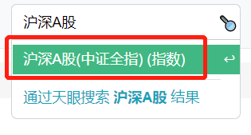
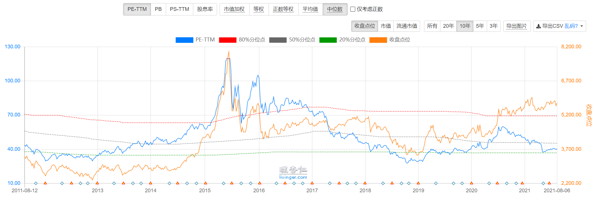
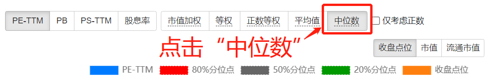
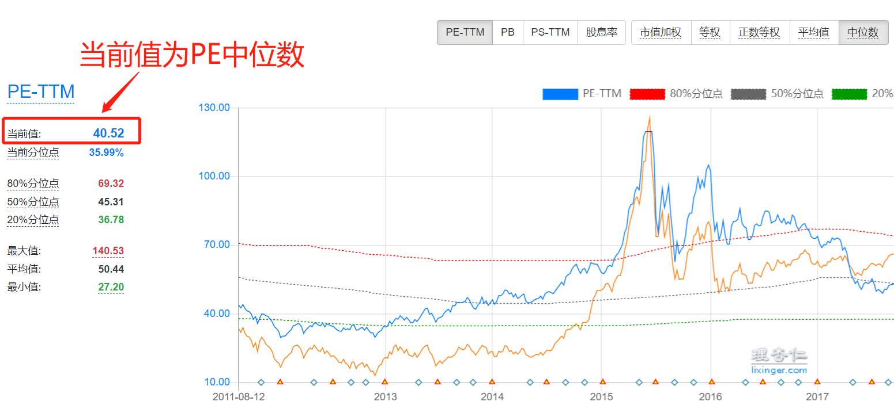
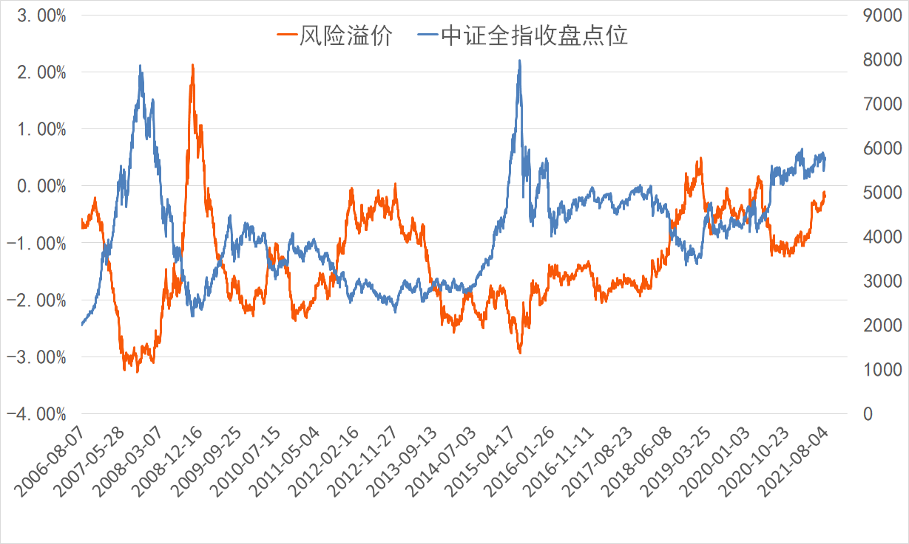
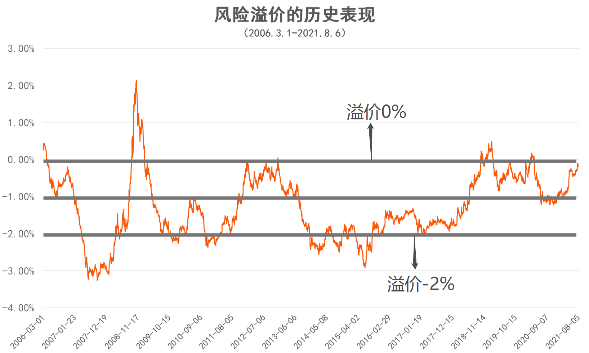
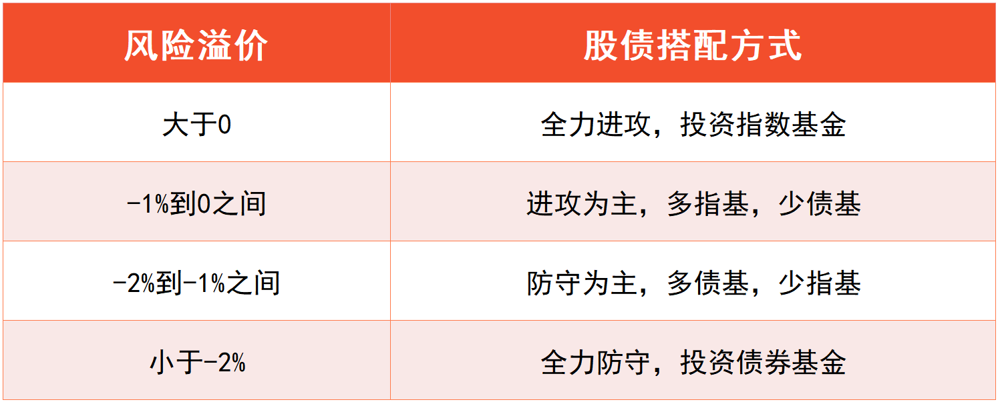
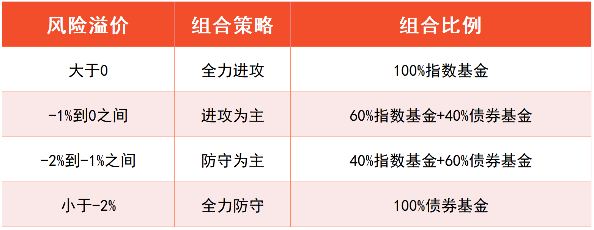
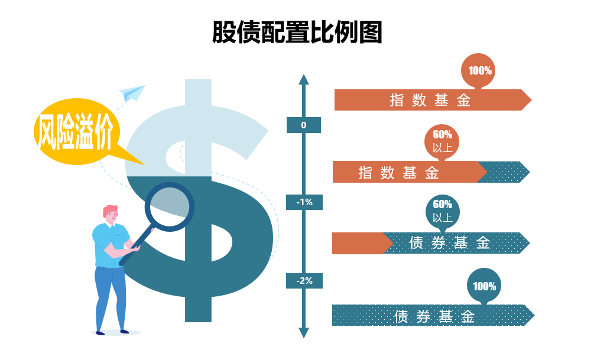

## 股债搭配, 攻守兼备

前面六节课, 我们已经构建了完整的"核心-卫星"组合. 不过大家要知道, 该组合由指数基金构成, 指数基金主要投资于股票, 风险-收益水平较高.

所以, "核心-卫星"组合适合用来进攻. 然而, 投资就像打仗, 光有进攻可不行, 还得做好防守的准备.

进攻部分已经有"核心-卫星"组合了, 那么, 防守部分该怎么选择呢? 答案就是风险-收益水平较低的债券基金.

本节课, 我们就来学习, 如何用股票类资产进攻, 用债券类资产防守, 构建一个攻守兼备的股债组合.

股票方面, 我们直接按照"核心-卫星"策略来配置就可以了.

债券方面, 我们已经在初级课学习了债券基金, 长期投资可以选择长期纯债基金, 数量上选择 3 只就可以了.

进攻、防守都已经有了. 接下来的关键问题是, 股、债应该怎么配比?

有的小伙伴会想:"我的风格非常激进, 大量配置股票类资产就可以了, 债券类资产可以少一点."

还有的小伙伴会想:"我的风格比较保守, 只能接受债券类资产占多数, 股票类资产用少量的金额尝试一下即可."

这样想的小伙伴忽略了一个问题: 投资市场不是一成不变的. 有的时候股市被严重低估, 股票类资产的上涨机会大, 这时候我们应该加强进攻; 有的时候股巿被严重高估, 股票类资产存在泡沫, 这时候我们应该加强防守.

也就是说, 进攻还是防守, 不是一成不变的, 而是要根据市场情况灵活调整.

那么, 如何才能知道市场被高估还是低估, 进而判断应该进攻还是防守呢?

这就要用到一个经典的模型啦, 它就是: 股债利差模型.

下一小节, 我们就来认识一下, 到底什么是股债利差模型.

## 关键指标———"风险溢价"

为了理解股债利差模型的含义, 我们先来看一下它的计算公式:

风险溢价=股市收益率 - 10 年期国债到期收益率

其中, "10 年期国债到期收益率"这个指标, 我们已经在初级课中学习过啦. 它是以国家信用为担保的债券收益率, 一定程度上代表了我国境内市场的无风险利率.

所以, 上面的公式可以理解为:

我们用股市的收益率, 减去无风险就可以拿到的收益率, 剩下的就是承担股市风险所带来的那部分收益率; 这部分就叫做"风险溢价".

对投资来说, 风险溢价越高越好. 风险溢价越高, 代表我们承担同等风险所带来的收益率越高.

当发现风险溢价很高的时候, 我们就可以乐观一点, 多配置一些股票类资产, 加强进攻.

当发现风险溢价很低的时候, 我们就要谨慎一点, 减小股票类资产比例, 多配置一些债券类资产, 加强防守.

那么, 问题的关键就是把"风险溢价"算出来啦.

公式里"10 年期国债到期收益率"的数据可以直接查到. 大家可以按照初级课中的方法, 进入中国债券信息网查询.

以 2021 年 8 月 6 日为例, 10 年期国债到期收益率的值显示为 2.7988%, 我们精确到两位小数即可, 直接取 2.80%.

"水星财富学堂"公众号也会定期更新这一数据. 大家可以在公众号的底部菜单点击"投资神器 → 市场宏观", 找到 10 年期国债到期收益率.

接下来, 我们就来确定公式中的"股市收益率".

股市里有几千只股票, 每只股票的收益率都不一样, 挨个算一遍肯定不现实. 解决方法很简单, 我们只需要取中位数就可以啦.

也就是对所有股票的收益率进行排名, 取最中间的那一个. 一半股票的收益率在中位数的前面, 另一半股票的收益率在中位数的后面.

中位数不就高, 也不就低, 可以客观反映股市收益率的中等水平.

那么, 股市收益率的中位数怎么查呢? 这就要用到理杏仁"网站啦.

[理杏仁](https://www.lixinger:com/)

第一步, 在理杏仁首页的搜索框里, 搜索"沪深 A 股"或者"中证全指"", 下拉菜单会显示出相关指数, 该指数以整个 A 股市场几乎全部的股票作为样本, 可以反映整个股市的估值全貌.

第二步, 点击该指数, 网站会跳转到查询 PE 估值的页面. 这个页面我们在初级课接触过, 大家应该比较熟悉啦.

第三步, 在当前页面, 点击"中位数"按钮.

此时, 我们在页面左侧就可以看到市盈率的中位数啦.

估计小伙伴们要问了: 我们不是要查股市收益率吗? 怎么变成查 PE 啦?

之所以这样操作, 是因为 PE 的倒数就是收益率.

我们已经学习过, PE 代表的是投资多少年可以回本. 如果两年回本, 就相当于每年赚回二分之一; 如果五年回本, 就相当于每年赚回五分之一, 以此类推.

所以, 每年的收益率, 其实就是 PE 的倒数.

以 2021 年 8 月 6 日为例, 中证全指的 PE 中位数为 40.52, 它的倒数是 1 除以 40.52, 也就是 2.47%, 大家可以拿出手机, 用计算器亲自算一下.

以上我们已经得到, 股市收益率的中位数是 2.47%, 10 年期国债到期收益率是 2.80%, 代入股债利差模型的公式, 两个数据相减, 就可以得到风险溢价为-0.33%.

如果大家觉得靠自己分析和计算太麻烦, 也可以直接在"水星财富学堂"公众号查询结果, 我们会计算好风险溢价的数据结果, 分享给大家作为参考.

数据每周更新一次. 小伙伴们可以在公众号的底部菜单点击"投资神器 → 市场宏观", 找到风险溢价的数据.

当然, 有了数据以后, 我们还得知道, 这样的风险溢价处于高位还是低位.

只有知道了高位还是低位, 我们才能判断出, 到底要加强进攻还是加强防守.

## 一步判断攻与守

上一小节我们学习了风险溢价. 用这个指标来决定进攻和防守, 到底准不准呢?

大家可以看文稿中的图片. 图中展示了从 2006 年到 2021 年, 整整 15 年时间里, 风险溢价和中证全指的走势对比.

我们可以看到, 风险溢价与股市表现呈现出明显的负相关.

溢价高的时候, 刚好是股市的底部, 这时候我们到股市里低位布局, 加强进攻, 可以享受到后续的上涨.

溢价低的时候, 刚好是股市的顶部, 这时候我们远离股市, 加强防守, 可以避开后续的下跌.

我们把风险溢价单独拎出来看, 可以发现, 它的波动范围基本维持在在-3%到 2%之间. 不过, 溢价超过 0 的情况, 和溢价低于-2%的情况, 都很少见.

大家可以对照文稿中的图片来理解, 风险溢价过高、过低的极端情况主要出现在 2007~2008 年和 2014~2015 年, 这两段都是从牛市泡沫迅速变大到股灾崩盘的时期.

除了这些极端状况以外, 大部分时间的风险溢价都围绕着-1%上下波动, 波动范围在-2%到 0 之间.

那么, 我们就可以把 0、-1%、-2%作为三条分界线.

当风险溢价大于 0 时, 说明溢价极高, 此时股市处于谷底, 价值被大家严重低估, 我们应该抓住机会, 果断进入, 把本金全部投资到指数基金上去, 开启"全力进攻"模式.

当风险溢价在-1%到 0 之间时, 说明溢价较高, 此时股市偏向于低估. 我们可以更加乐观, 拿大部分本金配置指数基金, 其余少部分本金配置债券基金, 开启"以攻为主"模式.

当风险溢价在-2%到-1%之间时, 说明溢价较低, 此时股市偏向于高估, 我们只拿少部分的本金配置指数基金, 其余大部分的本金配置债券基金, 开启"以守为主"模式.

当风险溢价小于-2%时, 说明溢价极低, 此时股市出现泡沫, 我们应该果断退出, 清空所有指数基金, 把本金全部投资到债券基金上去, 开启"全力防守"模式.

文稿中整理出了一份表格, 汇总了以上四种情况, 方便大家查询

上一小节我们算出, 2021 年 8 月 6 日的风险溢价为-0.33%, 处于-1%到 0 之间, 那么就应该选择进攻为主, 多配指数基金, 少配债券基金.

投资的时候, 只要股债之间的侧重点抓对了, 具体的比例可以灵活调整.

比如, 进攻为主的时候, 指数基金占 60%, 债券基金占 40%; 防守为主的时候, 指数基金占 40%, 债券基金占 60%.

## 总结

1. 投资中的进攻和防守, 不是一成不变的, 而是要根据市场情况灵活调整.
2. 股市收益率减去无风险利率, 就是承担风险所带来的那部分收益率; 这部分叫做风险溢价". 风险溢价越高越好. 溢价越高, 代表我们承担同等风险所带来的收益率越高."水星财富学堂"公众号每周更新风险溢价的数据, 供大家参考.
3. 当风险溢价大于 0 时, 全力进攻; 当风险溢价在-1%到 0 之间时, 进攻为主; 当风险溢价在-2%到-1%之间时, 防守为主; 当风险溢价小于-2%时, 全力防守.
4. 投资的时候, 只要股债之间的侧重点抓对了, 具体的比例可以灵活调整.

有了股债利差模型, 小伙伴们在投资的时候, 就可以在股债之间有所侧重了. 不过, 可能有的小伙伴还不太去确定怎么做出一个完整的股债组合.

而且, 股债价格一直变化, 有时已经配好了比例, 经过市场波动以后, 比例又变了, 这时候怎么调整呢? 下节见分晓

