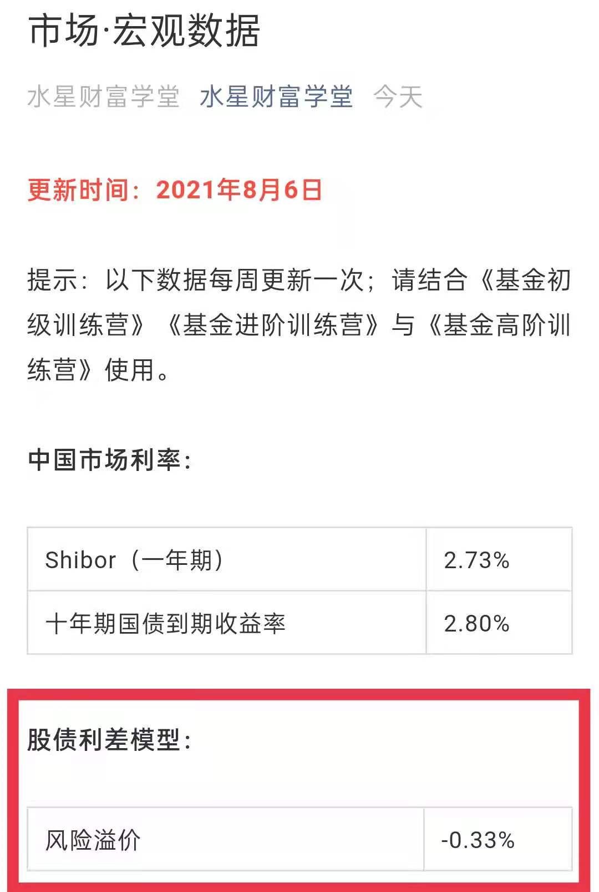

## 股债搭配, 攻守兼备

前面六节课, 我们已经构建了完整的"核心-卫星"组合. 不过大家要知道, 该组合由指数基金构成, 指数基金主要投资于股票, 风险-收益水平较高.

所以, "核心-卫星"组合适合用来进攻. 然而, 投资就像打仗, 光有进攻可不行, 还得做好防守的准备.

进攻部分已经有"核心-卫星"组合了, 那么, 防守部分该怎么选择呢? 答案就是风险-收益水平较低的债券基金.

本节课, 我们就来学习, 如何用股票类资产进攻, 用债券类资产防守, 构建一个攻守兼备的股债组合.

股票方面, 我们直接按照"核心-卫星"策略来配置就可以了.

债券方面, 我们已经在初级课学习了债券基金, 长期投资可以选择长期纯债基金, 数量上选择 3 只就可以了.

进攻、防守都已经有了. 接下来的关键问题是: 股、债应该怎么配比?

有的小伙伴会想:"我的风格非常激进, 大量配置股票类资产就可以了, 债券类资产可以少一点."

还有的小伙伴会想:"我的风格比较保守, 只能接受债券类资产占多数, 股票类资产用少量的金额尝试一下即可."

这样想的小伙伴忽略了一个问题: 投资市场不是一成不变的. 有的时候股市被严重低估, 股票类资产的上涨机会大, 这时候我们应该加强进攻; 有的时候股巿被严重高估, 股票类资产存在泡沫, 这时候我们应该加强防守.

也就是说, 进攻还是防守, 不是一成不变的, 而是要根据市场情况灵活调整.

那么, 如何才能知道市场被高估还是低估, 进而判断应该进攻还是防守呢?

这就要用到一个经典的模型啦, 它就是: 股债利差模型.

下一小节, 我们就来认识一下, 到底什么是股债利差模型.

## 关键指标———"风险溢价"

为了理解股债利差模型的含义, 我们先来看一下它的计算公式:

风险溢价=股市收益率 - 10 年期国债到期收益率

其中, "10 年期国债到期收益率"这个指标, 我们已经在初级课中学习过啦. 它是以国家信用为担保的债券收益率, 一定程度上代表了我国境内市场的无风险利率.

所以, 上面的公式可以理解为:

我们用股市的收益率, 减去无风险就可以拿到的收益率, 剩下的就是承担股市风险所带来的那部分收益率; 这部分就叫做"风险溢价".

对投资来说, 风险溢价越高越好. 风险溢价越高, 代表我们承担同等风险所带来的收益率越高.

当发现风险溢价很高的时候, 我们就可以乐观一点, 多配置一些股票类资产, 加强进攻.

当发现风险溢价很低的时候, 我们就要谨慎一点, 减小股票类资产比例, 多配置一些债券类资产, 加强防守.

那么, 问题的关键就是把"风险溢价"算出来啦.

公式里"10 年期国债到期收益率"的数据可以直接查到. 大家可以按照初级课中的方法, 进入中国债券信息网查询.

以 2021 年 8 月 6 日为例, 10 年期国债到期收益率的值显示为 2.7988%, 我们精确到两位小数即可, 直接取 2.80%.

"水星财富学堂"公众号也会定期更新这一数据. 大家可以在公众号的底部菜单点击"投资神器 → 市场宏观", 找到 10 年期国债到期收益率.

接下来, 我们就来确定公式中的"股市收益率".

股市里有几千只股票, 每只股票的收益率都不一样, 挨个算一遍肯定不现实. 解决方法很简单, 我们只需要取中位数就可以啦.

也就是对所有股票的收益率进行排名, 取最中间的那一个. 一半股票的收益率在中位数的前面, 另一半股票的收益率在中位数的后面.

中位数不就高, 也不就低, 可以客观反映股市收益率的中等水平.

那么, 股市收益率的中位数怎么查呢? 这就要用到"理杏仁"网站啦.

[理杏仁](https://www.lixinger:com/)

第一步, 在理杏仁首页的搜索框里, 搜索"沪深 A 股"或者"中证全指", 下拉菜单会显示出相关指数, 该指数以整个 A 股市场几乎全部的股票作为样本, 可以反映整个股市的估值全貌.

第二步, 点击该指数, 网站会跳转到查询 PE 估值的页面. 这个页面我们在初级课接触过, 大家应该比较熟悉啦.

第三步, 在当前页面, 点击"中位数"按钮.

此时, 我们在页面左侧就可以看到市盈率的中位数啦.

估计小伙伴们要问了: 我们不是要查股市收益率吗? 怎么变成查 PE 啦?

之所以这样操作, 是因为 PE 的倒数就是收益率.

我们已经学习过, PE 代表的是投资多少年可以回本. 如果两年回本, 就相当于每年赚回二分之一; 如果五年回本, 就相当于每年赚回五分之一, 以此类推.

所以, 每年的收益率, 其实就是 PE 的倒数.

以 2021 年 8 月 6 日为例, 中证全指的 PE 中位数为 40.52, 它的倒数是 1 除以 40.52, 也就是 2.47%, 大家可以拿出手机, 用计算器亲自算一下.

以上我们已经得到, 股市收益率的中位数是 2.47%, 10 年期国债到期收益率是 2.80%, 代入股债利差模型的公式, 两个数据相减, 就可以得到风险溢价为-0.33%.

如果大家觉得靠自己分析和计算太麻烦, 也可以直接在"水星财富学堂"公众号查询结果, 我们会计算好风险溢价的数据结果, 分享给大家作为参考.

数据每周更新一次. 小伙伴们可以在公众号的底部菜单点击"投资神器 → 市场宏观", 找到风险溢价的数据.

当然, 有了数据以后, 我们还得知道, 这样的风险溢价处于高位还是低位.

只有知道了高位还是低位, 我们才能判断出, 到底要加强进攻还是加强防守.

## 一步判断攻与守

上一小节我们学习了风险溢价. 用这个指标来决定进攻和防守, 到底准不准呢?

大家可以看文稿中的图片. 图中展示了从 2006 年到 2021 年, 整整 15 年时间里, 风险溢价和中证全指的走势对比.

我们可以看到, 风险溢价与股市表现呈现出明显的负相关.

溢价高的时候, 刚好是股市的底部, 这时候我们到股市里低位布局, 加强进攻, 可以享受到后续的上涨.

溢价低的时候, 刚好是股市的顶部, 这时候我们远离股市, 加强防守, 可以避开后续的下跌.

我们把风险溢价单独拎出来看, 可以发现, 它的波动范围基本维持在-3%到 2%之间. 不过, 溢价超过 0 的情况, 和溢价低于-2%的情况, 都很少见.

大家可以对照文稿中的图片来理解, 风险溢价过高、过低的极端情况主要出现在 2007~2008 年和 2014~2015 年, 这两段都是从牛市泡沫迅速变大到股灾崩盘的时期.

除了这些极端状况以外, 大部分时间的风险溢价都围绕着-1%上下波动, 波动范围在-2%到 0 之间.

那么, 我们就可以把 0、-1%、-2%作为三条分界线.

当风险溢价大于 0 时, 说明溢价极高, 此时股市处于谷底, 价值被大家严重低估, 我们应该抓住机会, 果断进入, 把本金全部投资到指数基金上去, 开启"全力进攻"模式.

当风险溢价在-1%到 0 之间时, 说明溢价较高, 此时股市偏向于低估. 我们可以更加乐观, 拿大部分本金配置指数基金, 其余少部分本金配置债券基金, 开启"以攻为主"模式.

当风险溢价在-2%到-1%之间时, 说明溢价较低, 此时股市偏向于高估, 我们只拿少部分的本金配置指数基金, 其余大部分的本金配置债券基金, 开启"以守为主"模式.

当风险溢价小于-2%时, 说明溢价极低, 此时股市出现泡沫, 我们应该果断退出, 清空所有指数基金, 把本金全部投资到债券基金上去, 开启"全力防守"模式.

文稿中整理出了一份表格, 汇总了以上四种情况, 方便大家查询

上一小节我们算出, 2021 年 8 月 6 日的风险溢价为-0.33%, 处于-1%到 0 之间, 那么就应该选择进攻为主, 多配指数基金, 少配债券基金.

投资的时候, 只要股债之间的侧重点抓对了, 具体的比例可以灵活调整.

比如, 进攻为主的时候, 指数基金占 60%, 债券基金占 40%; 防守为主的时候, 指数基金占 40%, 债券基金占 60%.

## 升级版股债组合策略

咱们课程里介绍的"股债利差模型", 可以帮助大家在股、债之间进行配比. 哪个更有优势, 就多配哪个.

不过呢, 这个只是基础版的股债组合策略哦.

基础版的优势在于, 咱们每个人都可以用, 因为大家面对的是相同的股票市场和债券市场.

但是呢, 基础版也有一定的不足, 那就是没有照顾到每个人的不同.

举个例子, 每个人的年龄不一样, 所处的人生阶段不一样, 对资产配置的要求也会不一样.

比如一位 70 岁的老先生, 风险承受能力很低, 这时候应该侧重于防守, 债多股少, 甚至是全部配置债券.

即使按照股债利差模型, 算出来应该股多债少, 对于这位老先生来说, 也是不合适的.

所以说, 股债组合怎么配比, 咱们得综合考虑两方面: 一是考虑市场; 二是考虑自身.

升级版股债组合的思路, 就是把两方面结合起来. 知己知彼, 方能百战不殆.

### 一、两种资产配置

股债组合, 其实就是在股票类资产和债券类资产之间, 进行资产配置.

很多小白以为的资产配置, 就跟吃火锅一样, 这个来一点, 那个来一点, 凑在一起就行了.

但专业的资产配置可不是这么随心所欲的哦. 专业的资产配置分成了两大类, 一类叫战略资产配置, 简称 SAA, 另一类叫战术资产配置, 简称 TAA.

SAA 和 TAA 到底区别在哪里呢?

简单来说, SAA 是预先设定好配置比例, 以后就不改了, 一直按照固定的配比来投资.

比如经典的"60/40"组合, 60%投资于股票类, 40%投资于债券类. 不管市场如何风云变幻, 它就一直保持 60/40 的比例.

TAA, 就是根据市场动向, 灵活调整配比.

咱们课程里讲到的股债利差模型, 按照风险溢价调整股债配比, 其实就是 TAA.

班班来打个比方:

SAA 就像练拳的套路, 一招一式, 都有固定的打法. 使用它的人, 相当于面对所有的战况, 都打出同一套拳. 所以它叫"战略"资产配置.

TAA 就像是搏击, 招式不是固定的, 得根据现场的状况灵活调整. 所以它叫 "战术"资产配置.

那么, 我们应该选 SAA 还是 TAA 呢?

答案当然是, 小孩子才做选择, 成年人全都要啦! 既能打固定的套路招式, 又能够临场灵活调整, 那才是真正的武林高手.

接下来, 咱们就分成 SAA 和 TAA 两部分, 依次做一下资产配置, 最后再把两者结合起来, 确定升级版的股债组合.

### 二、SAA——战略资产配置

战略资产配置, 主要应该考虑的是自身情况. 班班给大家总结了三大方面: 个人性格和心理偏好、财务状况和持有时间、所处的人生阶段.

(1)个人性格和心理偏好

性格和心理, 这方面比较主观, 但对我们的投资体验却有很大影响.

如果你心理上非常激进, 但只是配置了很稳健的股债组合, 相信你也会一直心里挠痒痒, 不满足于现有的风险-收益水平.

反过来呢, 如果你很看重安全, 但却大比例配置了股票类, 相信你也不会心安.

这方面没有人能替大家做决定, 只有自己最了解自己.

如果你乐于冒险, 心理素质过硬, 投资可以承受较大的波动, 那么就可以适当提高股票类资产的比例, 降低债券类资产的比例.

如果你更侧重于安全, 只能接受很小的损失, 那么就可以提高债券类资产的比例, 降低股票类资产的比例.

目前不需要给出具体的比例数字. 大家看看"全力进攻、进攻为主、防守为主、全力防守", 四种情况, 哪种更符合自己的性格和心理偏好. 把这个答案记下来, 我们继续往下走.

(2)财务状况和持有时间

投资用的一定要是自己的闲钱. 但是具体来说, 这笔钱到底是短期闲着, 还是长期闲着, 还是有区别的哦.

如果只是短期的闲钱, 过不了 1 年就要用了, 那就不适合投资股票类啦, 因为短期内股票波动较大, 如果亏钱, 我们又急着用钱, 那就让自己陷入困境啦.

如果是长期的闲钱, 5 年以内都不打算用到, 可以投资 5 年以上, 那么全配股票也问题不大.

在金斧子基金 App 里有一个功能叫"盈利估算", 大家抽空可以随便点开几只基金看一看"盈利估算", 它展示的是持有时间和赚钱概率的关系.

一般来说, 持有时间越长, 赚钱概率也会越大. 很多基金持有 2 年, 赚钱概率可以达到 100%

大家持有基金组合的时间越长, 赚钱概率也会越大. 这时候短期内股票类资产的下跌就不算是问题啦.

大家可以评估一下手中的闲钱, 看是属于短期闲钱, 还是长期闲钱, 根据不同的情况来搭配股债. 具体的搭配方式大家可以参考下图.

根据表格, 大家把这一次选择的答案记下来, 我们继续往下走.

(3)所处的人生阶段

随着年龄的增长, 我们的风险承受能力会慢慢下降.

年轻人可以选择激进一点的配置方式, 即使投资失败大不了从头再来, 以后还有大量的时间和机会.

老年人已经没有太多从头再来的机会了, 对投资失败往往难以承受, 而且年纪大了以后, 就不适合长回报周期的投资了, 应该把自己预期的回报周期缩短一些.

通常来说"三十而立", 30 岁前还很年轻, 可以激进一点, 全部配置股票类资产问题也不大.30 岁以后要考虑家庭稳定发展等, 需要适当降低一些股票的比例, 但还是以进攻为主, 多多增值.

等到了 50 岁以后, 孩子差不多已经独立了, 财富增值的需求没有那么强烈了, 更多的是需要考虑安全和稳定, 在此基础上再考虑增值, 所以防守为主.

再到 70 岁, 人上了年纪, 就应该全力防守啦.

班班给大家一个参考表格, 大家可以根据表格来, 在全力进攻、进攻为主、 防守为主、全力防守中, 做出自己的选择.

好啦, 以上我们已经做了三次选择, 分别是根据个人性格和心理偏好、财务状况和持有时间、所处的人生阶段.

下面, 大家可以把三次的选择汇总在一起啦. 班班举个例子:

上面是某学员的分析结果. 大家可以看到, 从三个维度去考虑, 得出的攻守方向不完全一样. 这种情况怎么办呢?

这种情况下, 咱们就按照最保守的一种情况来做.

按照木桶定律: 一个桶能装多少水, 取决于它最短的那块木板. 我们的组合进攻性有多强, 取决于进攻性最弱的一种情况.

按照上面表格, 这位小伙伴就应该在全力进攻、防守为主、进攻为主中, 选择防守为主.

具体是股债 3:7, 还是 4:6, 等等, 可以自由决定. 但要符合防守为主的大方向. 大家也可以用同样的方法, 来进行判断.

最终的比例定下来以后, 不管市场环境如何变化, 比例坚决不变. 这就是用一套固定的招式, 应对所有的战况. 也就是 SAA, 战略资产配置.

### 三、TAA——战术资产配置

TAA 这部分我们不用展开讲啦. 课程里学到的"股债利差模型", 就是方便大家动态调整股债比例, 完成战术资产配置的.

以 2021 年 8 月 9 日为例, 班班在水星财富学堂公众号查到, 风险溢价是 -0.22%.

按照课程所讲, 股债搭配方式应该选择: 进攻为主.

大家要清楚, 这里选择进攻为主, 和 SAA 中做选择不一样哦. 这里的选择是按照市场情况来选择的, 可能会年年变. 而前面 SAA 所做的选择, 是常年固定的.

SAA 让我们"知己", 了解自身适合的组合配比; TAA 让我们"知彼", 了解应对市场的组合配比. 知己知彼, 百战不殆!

所以最好的方式不是二选一, 而是合二为一.

同样按照"木桶定律", 我们取 SAA 和 TAA 中, 相对保守的那一个组合配比就可以了.

比如前面咱们得到, 某学员的 SAA 配置结果是防守为主, 后来查了风险溢价, TAA 配置结果是进攻为主. 那么最终的选择就是: 防守为主.

升级版股债组合策略, 就是以上 SAA 和 TAA 相结合的策略.

## 总结

1. 投资中的进攻和防守, 不是一成不变的, 而是要根据市场情况灵活调整.
2. 股市收益率减去无风险利率, 就是承担风险所带来的那部分收益率; 这部分叫做"风险溢价". 风险溢价越高越好. 溢价越高, 代表我们承担同等风险所带来的收益率越高."水星财富学堂"公众号每周更新风险溢价的数据, 供大家参考.
3. 当风险溢价大于 0 时, 全力进攻; 当风险溢价在-1%到 0 之间时, 进攻为主; 当风险溢价在-2%到-1%之间时, 防守为主; 当风险溢价小于-2%时, 全力防守.
4. 投资的时候, 只要股债之间的侧重点抓对了, 具体的比例可以灵活调整.

有了股债利差模型, 小伙伴们在投资的时候, 就可以在股债之间有所侧重了. 不过, 可能有的小伙伴还不太去确定怎么做出一个完整的股债组合.

而且, 股债价格一直变化, 有时已经配好了比例, 经过市场波动以后, 比例又变了, 这时候怎么调整呢? 下节见分晓

1. SAA 也叫战略资产配置, 是预先设定好配置比例, 一直按照固定的配比来投资.
2. SAA 主要考虑三大方面: 个人性格和心理偏好、财务状况和持有时间、所处的人生阶段.
3. TAA 也叫战术资产配置, 就是根据市场动向, 灵活调整配比.
4. SAA 和 TAA 相结合, 可以做到知己知彼. 按照木桶定律, 最终攻守方向应选择 SAA 和 TAA 中较保守的那一种.
