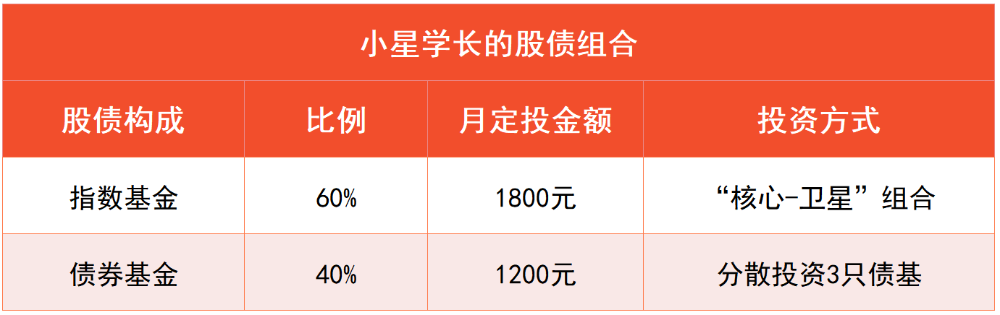
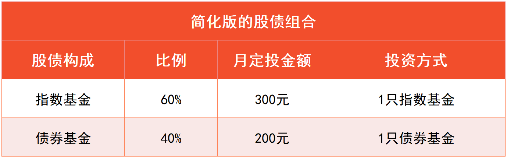
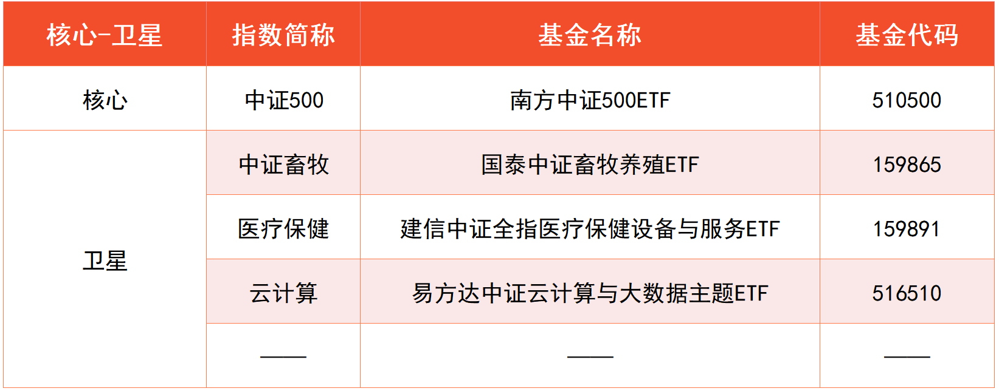
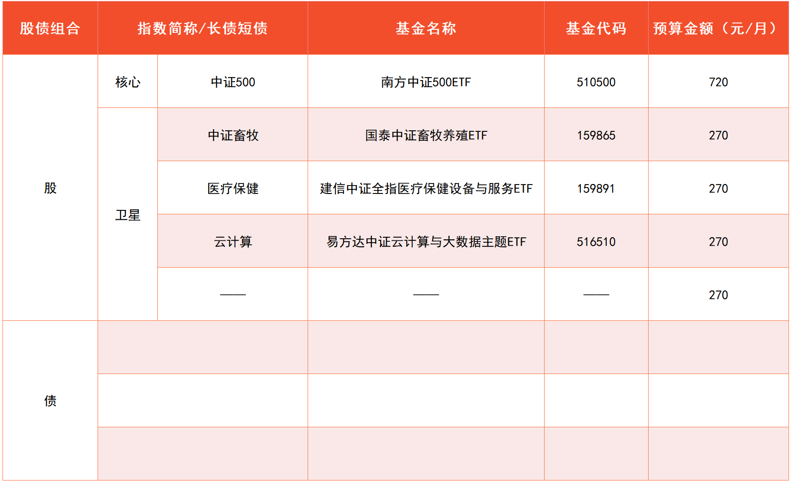
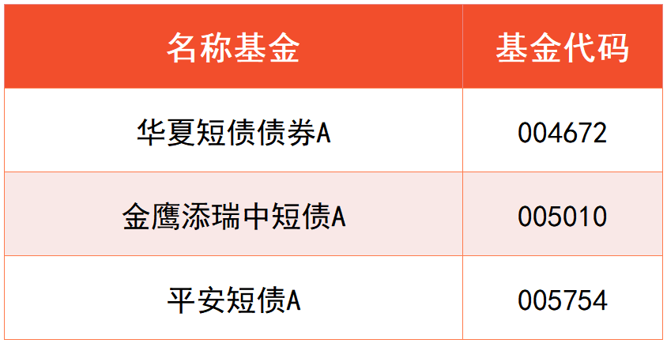
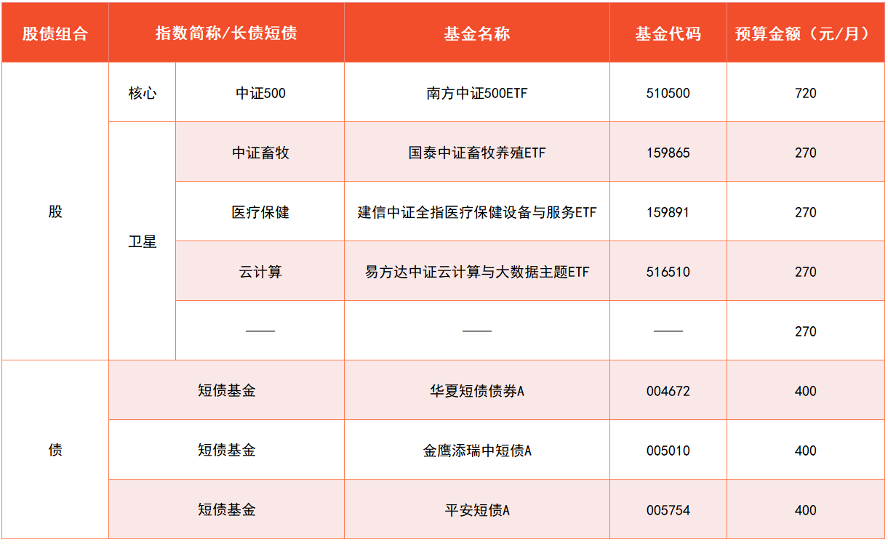
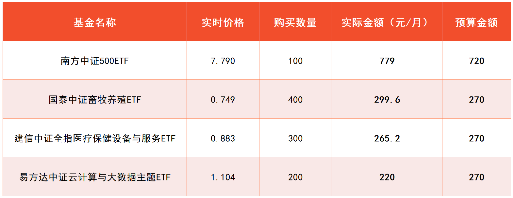
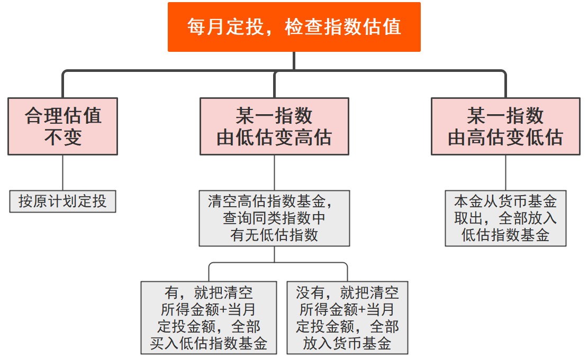
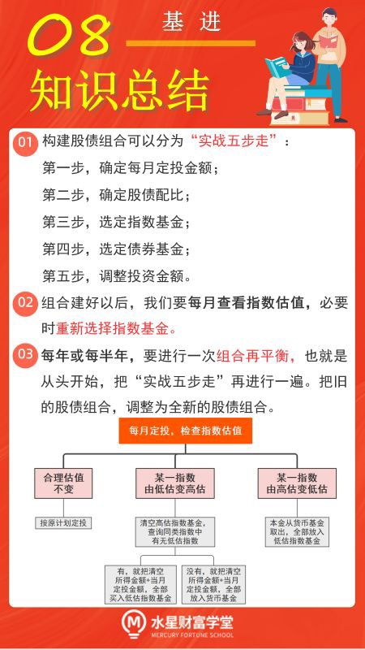
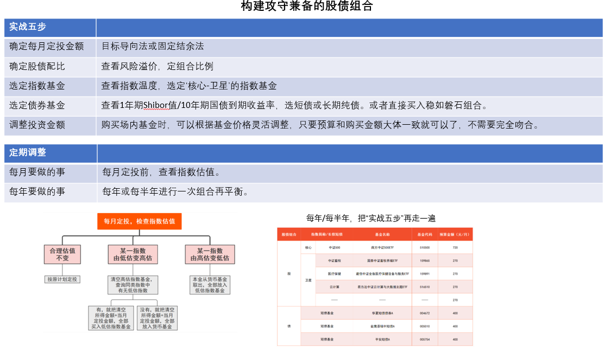

## 确定金额, 分散配置

小伙伴们你们好, 欢迎继续学习《基金进阶训练营》.

上一节课, 我们学习了股债利差模型, 了解了风险溢价, 最终确定了全力进攻、进攻为主、防守为主、全力防守四种股债配置策略.

本节课, 我们将用小星学长的例子, 把所有实战流程串起来, 完整构建一个股债组合, 并且学会定期调整组合的成分和比例.

### 实战第一步, 确定每月定投金额.

小星学长自己评估了一下, 每月可以拿出 3000 元做定投. 不过, 定投金额没有统一的标准, 大家可以根据自己的实际情况来确定.

### 实战第二步, 确定股债配比.

时间来到了 2021 年 8 月 6 日, 小星学长准备拿这 3000 元构建一个股债组合, 以后每个月定投组合就可以了. 组合中股债的比例该如何分配呢?

小星学长首先看了一下股债利差模型, 查到了风险溢价是-0.33%, 介于-1%到 o 之间, 说明组合应该以进攻为主, 也就是多配置指数基金, 少配置债券基金.

小星学长初步决定, 用 60%的本金投资于指数基金, 40%的本金投资于债券基金.

其中, 60%的本金也就是 1800 元, 这笔钱足够分散投资多只指数基金啦. 所以, 小星学长决定做成一个"核心-卫星"组合.

剩下 40%的本金, 也就是 1200 元, 可以找 3 只债券基金分散投资.

"核心-卫星"组合包含了 1 个核心, 4 颗卫星, 总共需要 5 只指数基金. 再加上 3 只债券基金, 小星学长最多要分散投资 8 只基金.

可能有的小伙伴本金有限, 很难把本金拆成这么多份. 那么就可以做成简化版的股债组合, 在指数基金、债券基金中各选择一只, 就可以啦.

比如, 小王只能每月拿出 500 元进行定投, 所以用 300 元定投一只指数基金, 再用 200 元定投一只债券基金, 这样就可以做出简化版的股债组合啦.

在此提醒, 以上配置比例不是定死的, 大家可以根据自己的实际情况灵活调整, 只要股、债之间的侧重点抓对了就可以啦.

## 选定一篮子基金

小星学长已经决定, 1800 元投资于"核心-卫星"组合, 另外 1200 元分散投资于 3 只债券基金.

那么, 具体应该投资哪些基金呢? 这里, 我们分成两步来确定.

### 实战第三步, 选定指数基金.

根据"核心-卫星组合"的筛选方法, 我们需要参考指数温度来选基金. 这部分内容在第 6 课已经学习过啦.

小星学长查询了指数温度, 核心部分选择了目前温度最低的中证 500 指数; 卫星部分选择了消费中的中证畜牧、医药中的医疗保健、科技中的云计算. 由于新能源板块的指数温度过高, 所以没有选择.

确定了指数以后, 小星学长直接按照基金规模、跟踪误差、是否增强三个指标, 选出了跟踪它们的基金.

这些基金要瓜分 1800 元的预算. 由于目前的投资方向是进攻为主, 所以, 小星学长采用了激进版的"核心-卫星"策略, 40%投资于核心, 60%投资于卫星.

中证 500 占 1800 元的 40%, 也就是 720 元.

消费、医药、科技、新能源、每颗卫星各占 15%, 也就是 270 元. 其中, 新能原暂时无法投资, 对应的 270 元暂时放到货币基金当中.

### 实战第四步, 选定债券基金.

债券基金可以选择短债基金或长期纯债基金. 为了决定选哪个, 小星学长查询了十年期国债到期收益率, 8 月 6 日这天的数据是 2.80%, 低于 3.5%. 按照初级课中的择时标准, 此时投资短债基金的性价比更高.

所以, 小星学长综合评估了基金的近 3 年收益率和基金规模以后, 选择了 3 只短债基金.

这 3 只基金瓜分 1200 元的预算, 小星学长平均分配, 每只基金各占 400 元.

到这里, 股债组合中的基金就全部选出来了, 而且每只基金都按照投资比例, 分配了相应的预算金额. 文稿中展示了小星学长完整的股债组合. 大家可以联系自己的训练营班班, 获取相同的表格, 方便以后做组合的时候使用.

<a href="/水星工具：基金进阶专用.xlsx" target="_blank">水星工具：基金进阶专用.xlsx</a>

### 实战第五步, 调整投资金额.

代码有了, 金额也有了, 是不是可以直接买入了呢?

小伙伴们要注意, 我们现在算出来的金额, 只是预算. 在真实的购买场景中, 可能会遇到实际购买金额和预算不匹配的情况.

这种情况主要出现在购买场内基金的时候. 在小星学长的组合中, 指数基金全部都是'ETF""基金, 都需要开通证券账户, 在场内购买.

在购买场内基金的时候, 会出现一个实时波动的价格. 比如中证 500ETF, 8 月 6 日某时刻的价格为 7.79 元.

我们在下单时, 购买数量只能是 100 或 100 的倍数. 最低购买金额为 7.79 乘以 100, 也就是 779 元.

而在小星学长的股债组合中, 买这只基金的预算只有 720 元.

如果小伙伴们遇到这种情况, 请不必担心, 只要预算和购买金额大体一致就可以了, 不需要完全吻合. 投资就像作战一样, 作战前想好了策略, 作战时还需要灵活应对.

大家可以看文稿中的表格, 以小星学长的组合为例, 其中 4 只场内基金, 实际金额可以如下安排.

其中, 每只基金的实际购买金额跟预算相差不大; 实际投资金额共计 1563.9 元, 预算金额为 1800 元, 总金额相差也不大.

所以, 购买场内基金时, 大家可以根据基金价格灵活调整.

至于场外基金, 就不存在这个问题了. 因为场外基金的购买是按照金额申购的, 而不是按照数量. 我们直接按照预算金额, 原封不动进行申购就可以了.

以上就是构建股债组合的完整步骤啦, 总结一下: 第一步, 确定每月定投金额; 第二步, 确定股债配比; 第三步, 选定指数基金; 第四步, 选定债券基金; 第五步, 调整投资金额.

## 定期调整, 做可持续投资

前面两小节, 我们已经跟着小星学长做好了股债组合. 投资时, 大家直接按照"实战五步走"买入即可.

不过, 买入成功后, 大家可不能放在一边不管了哦. 股债组合是为我们"钱生钱"的工具, 买完仍然需要悉心呵护.

买入之后的主要任务可以分成两部分, 一是每月要做的事情, 二是每年要做的事情.

### 每月要做的事情

我们先来解决每个月要做的事情, 那就是定投.

每开启新一轮定投, 我们需要先检查—遍, 目前跟踪的所有指数的估值变化. 大家可以参考文稿中的思维导图, 根据图片中的逻辑来调整自己的组合.

首先, 如果估值都处于合理范围内, 没有变高估, 我们就按原计划定投即可.

其次, 如果其中某一指数由低估变为高估了, 我们要遵守"低买高卖"原则, 把高估的指数基金全部清空.

清空以后, 查询其他同类指数中还有没有低估的指数. 其中, 核心部分的宽基指数算一类, 四颗卫星分别算一类. 如果同类中还有低估指数, 那么我们就找一只跟踪低估指数的基金, 把清空后拿到的金额, 再加上最新月份计划定投的金额, 全部买入低估指数基金.

万一实在找不到可以替换的低估指数了, 我们就把对应的金额放到货币基金里面, 耐心等待机会.

最后, 如果发现某一指数由高估变低估了, 那么我们就把保留在货币基金里的本金全部取出, 转移到相关的指数基金上面.

### 每年要做的事情

下面, 我们来解决每年要做的事情.

一年时间, 组合会发生很多变化. 首先, 10 年期国债收益率的数据会变, 可能我们原本选择了短债基金, 最近应该切换到长期纯债基金; 其次, 基金一直在涨涨跌跌, 股债无法一直保持原来的比例, 可能我们最初定的是股多债少, 但是经过市场涨跌之后, 总体变成了债多股少; 最后, 风险溢价一直在变, 攻守方向可能需要做出调整

所以, 我们要每年进行一次组合再平衡.

组合再平衡的意思, 就是从头开始, 把"实战五步走"再进行一遍. 把旧的股债组合, 调整为全新的股债组合.

小伙伴们如果觉得一年时间太长, 自己的时间比较充裕, 也可以改为每半年做一次再平衡.

不过, 不建议大家频繁操作哦, 少于半年就没有必要再平衡啦. 因为无论是 10 年期国债到期收益率, 还是风险溢价, 半年内的变化都不会太大; 而且, 每次再平衡都会进行较多的买入卖出, 操作频繁会浪费不少手续费.

## 总结

1. 构建股债组合可以分为"实战五步走": 第一步, 确定每月定投金额; 第二步, 确定股债配比; 第三步, 选定指数基金; 第四步, 选定债券基金; 第五步, 调整投资金额.
2. 组合建好以后, 我们要每月查看指数估值, 必要时重新选择指数基金.
3. 每年或每半年, 要进行一次组合再平衡, 也就是从头开始, 把"实战五步走"再进行一遍. 把旧的股债组合, 调整为全新的股债组合.

