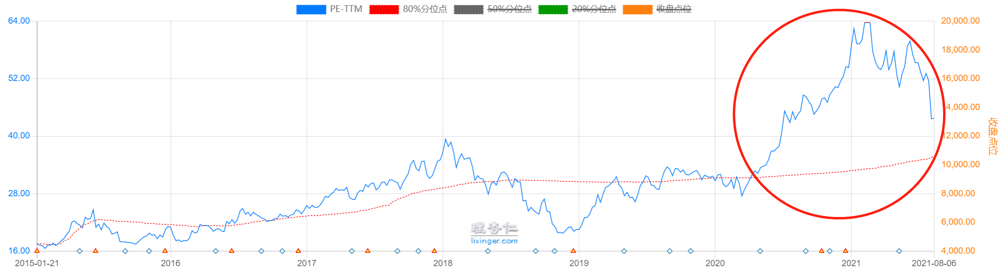
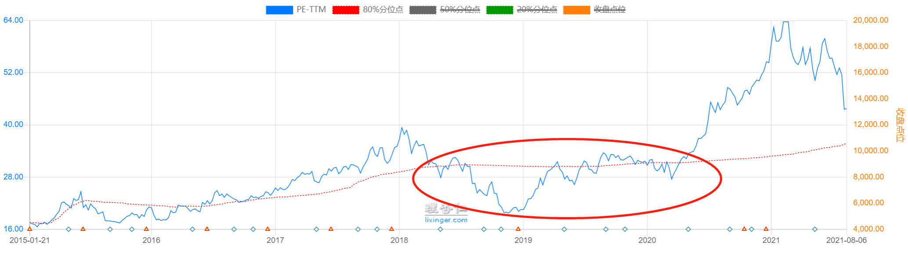

## 基本心理误区

本节课开始, 我们将共同学习投资中的"心法". 大部分新手热衷于研究投资技巧, 对投资心理建设不屑一顾. 然而, 对于投资来说, 只懂招式, 不懂心法, 是很难赚到钱的.

塞斯·卡拉曼曾经在《安全边际》这本书里说过:"不论一个投资者经历过多少训练, 他依然会犯新手一直犯的错误, 原因只有一个——他们情不自禁."

有的小伙伴辛辛苦苦进行了各种分析, 选出一只基金, 但是最后发现某个自媒体推荐了另一只基金, 然后他不管不顾, 像个投资新手一样, 开启了盲目跟风模式.

还有的小伙伴已经学过了长期投资, 也相信长期投资的理念, 但是在某个新闻热点出现的时候, 又感觉可以临时捞一笔, 接着就开启了短线炒作模式.

在以上这些情境里亏钱, 并不是因为方法没学到家, 而是大家走进了心理误区, 没有一套强大的"心法".

接下来, 我们就一起走出八大心理误区, 和"韭菜"划清界限.

### 第一大心理误区: 从众心理.

跟风投资, 缺乏主见, 总觉得大部分人都在买的基金一定没有问题, 这就是典型的从众心理.

从众心理也常被称为"旅鼠效应". 旅鼠会组成浩荡的迁移大军, 向着一个方向进发, 直到走到悬崖边, 第一只旅鼠跳下了悬崖, 后面所有的旅鼠都不知道改变方向, 纷纷跟着跳下悬崖.

这种现象在投资界特别常见, 很多"荐股大师"就是利用这一心理来诱骗投资者. 大家学过课程以后, 要保持独立思考, 切记不要盲目跟风.

### 第二大心理误区: 过度自信.

曾经有人在司机群体中做过一项调查, 题目是: 你觉得你的驾驶技术比平均水平更好吗?

如果答案是客观的, 技术超过平均水平的司机应该占比 50%, 可调查的结果却是, 80%以上的司机都觉得自己的驾驶技术在平均水平以上.

诸如此类的实验还有很多. 它们显示出, 大多数人都存在过度自信的倾向. 在投资的世界里尤其如此. 很多投资者认为自己的风险承受能力远远超过平均水平, 投资风格非常激进, 再加上投资时间短, 没有被暴跌"教训"过, 所以对市场缺少起码的敬畏.

大家可不要因为赚钱心切, 忽视了投资风险呀!

## 时效心理误区

### 第三大心理误区: 近因效应.

近因效应指的是最近、最新的认知占据了主导地位. 比如, 有些多年不见的老朋友, 留在我们印象里的, 都是临别时的样子.

在投资中, 很多人喜欢关注投资标的最近一段时间的表现, 由此来判断未来的涨跌. 比如, 有些人觉得某只基金未来会上涨, 如果你问他原因, 他会说:"你看它都涨了一个月了."

理性来看, 最近一段时间的涨跌和未来表现没有必然的关系. 放到长周期里来看, 短期的涨跌可能只是一段很小的趋势, 变化微乎其微, 对投资的指导意义不大.

### 第四大心理误区: 缺乏耐心.

有的小伙伴看过指数温度以后, 发现温度一直很高, 没有任何一个指数符合投资条件. 而且, 等了很久以后再看, 温度依然很高.

以中证白酒指数为例, 如果我们以 PE 温度低于 80 度作为买卖时机, 那么, 从 2020 年 4 月, 到 2021 年 8 月, 长达 1 年多的时间里都没有买入机会.

这时候, 很多小伙伴就等不及了, 觉得看指数温度耽误了自己赚钱, 甚至觉得按照指数温度来判断根本找不到买入时机.

事实上, 我们往前看, 中证白酒指数在 2018 年 7 月到 2020 年 4 月, 大部分时间的 PE 温度都在 80 度以下, 而且在 2018 年底出现了低于 20 度的大好机会.

指数不可能永远高估, 也不可能永远低估, 长时间找不到买入时机是很正常的事情, 大家要保持耐心, 不要因为不耐烦, 硬生生在高位入场. 只要不跌到适合买入的估值范围, 我们坚决不买.

## 决策心理误区

### 第五大心理误区: 偏爱复杂.

学校教育给人们留下了一种惯性思维, 那就是"越高级的知识越复杂", 而且要各种方法综合使用, 才能算出正确的结果.

有些投资者学习了各门各派的投资方法, 甚至进行了大量运算, 想通过这样赚更多钱. 但是在投资中, 方法是否有效, 用了能赚多少钱, 和它的复杂程度没什么关系. 很多简单的方法就可以"一招鲜, 吃遍天". 如果杂而不精, 效果适得其反.

### 第六大心理误区: 锚定效应.

打个比方, 一双鞋卖到 300 元, 你可能会觉得偏贵, 选择不买; 但如果在这双鞋旁边摆了一双差不多一样的鞋子, 标价 1000 元, 你便会觉得 300 元的那双没那么贵了, 然后选择买下它.

这是因为, 你被 1000 元这个参考价格"锚定"了. 很多商家就是利用锚定效应促进了销售.

在投资中, 锚定效应也很明显. 很多人在入手一只基金以后, 会立马被买入价格锚定. 之后如果基金跌了, 他就会想:"等回到我的买入价就卖出, 大不了不亏不赚."

但是, 你买或不买, 它都照常涨跌, 和你的买入价格没有任何关系. 一只基金该不该卖出, 可以根据估值判断, 也可以预先设置好止盈线, 到达止盈线就卖. 但是, 绝对不可以根据买入价格来判断什么时候卖.

### 第七大心理误区: 心理账户.

很多工薪族在拿到年终奖以后, 会选择大肆挥霍. 因为他们感觉年终奖是额外到手的钱, 相当于公司"白送"的. 而面对平时的工资, 他们就非常谨慎, 害怕浪费.

这时在他们心里自动分出了两个账户:"年终奖账户"的钱可以随便取; "工资账户"的钱要攒着.

不过我们必须清楚, 年终奖和工资都是钱, 100 元的工资和 100 元的年终奖, 购买力是一样的, 不应该区别对待.

在投资中, 很多小伙伴也会在心里分出两个账户, 一个是"本金账户", 另一个是"收益账户".

本金账户里的钱是他们亲自放进去的, 可能是工资, 也可能是其他收入, 总之他们会很珍惜, 害怕本金出现任何亏损.

然而对于收益账户里的钱, 他们感觉是市场"送"给自己的, 所以不知道珍惜, 要么花掉享乐, 要么拿去做一些超过自己风险承受能力的投资, 然后亏掉.

他们忽视了, 收益本身可以转化为本金, 继续发挥复利的威力. 所以, 小伙伴们, 如果你们珍惜自己的本金, 就请同样珍惜自己的收益吧.

### 第八大心理误区: 膀胱效应.

膀胱是人体中储存尿液的器官. 每当储存尿液达到一定程度, 就会产生疼痛感, 促使人尽快排尿. 对应到投资中, 其实就是在说, 投资者手里拿不住本金.

每当手里有点闲钱, 就想尽快投资出去, 感觉不投资就要错过一个亿的盈利. 但是, 投资机会不是随时都有, 投资之后也不是立马就能产生盈利.

如果基金出现了下跌, 别人可以低位买入摊薄成本, 而我们早就把钱全部投出去了, 手里没有"子弹"了, 只能眼睁睁看着机会从眼前溜走.

为了避免这种情况, 建议大家手中保留 20%左右的现金, 机会到来时可以"好钢用在刀刃上".

投资中的八大心理误区全部介绍完啦. 小伙伴们, 你们有没有"躺枪"呢?

请大家把这八个心理误区记在心里, 当自己要冲动操作的时候, 就拿出来提醒一下自己.

## 总结

1. 基本心理误区包括: 从众心理和过度自信。
2. 时效心理误区包括: 近因效应和缺乏耐心。
3. 决策心理误区包括: 偏爱复杂、锚定效应、心理账户和膀胱效应。

