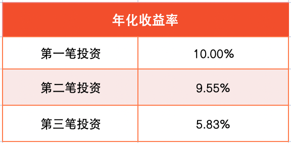
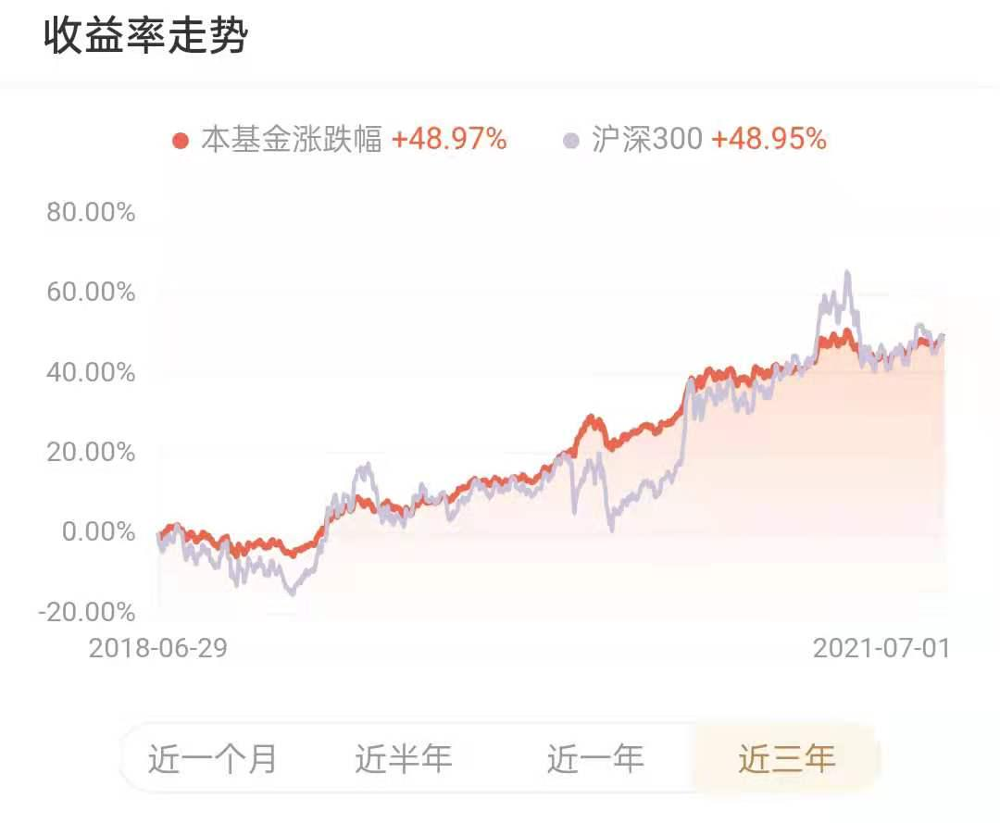
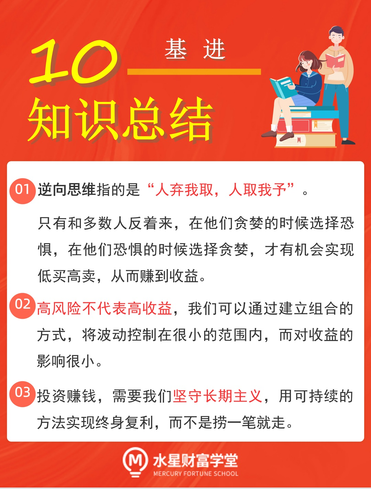
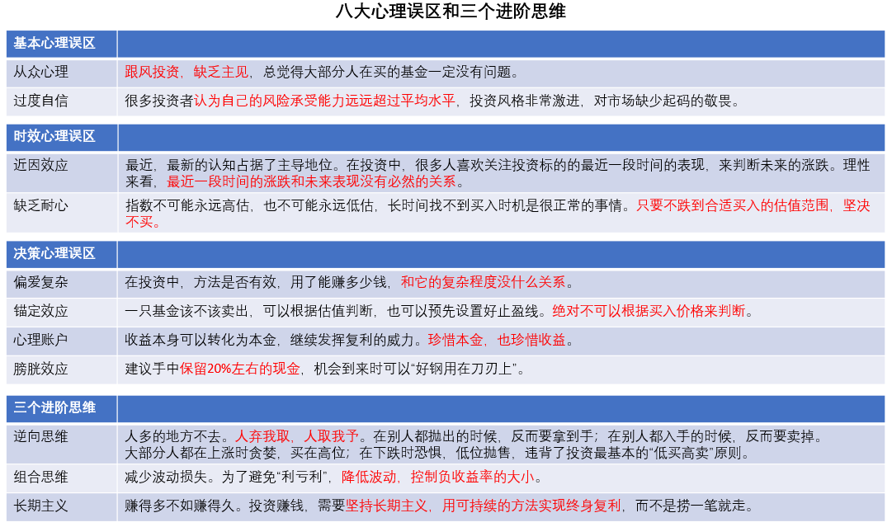

## 逆向思维: 人多的地方不去

欢迎来到进阶课的最后一课, 我们将一起总结三个进阶思维, 分别是: 逆向思维、组合思维和长期主义.

首先来看逆向思维.

战国时有个叫白圭的, 师从鬼谷子, 他被人称为"商祖", 也就是商人们的祖师爷. 听名字就知道, 这个人很会做生意.

当时遇上粮食丰收, 农民大量出售谷物. 因为产量高, 竞争激烈, 所以粮食的卖价十分低廉. 这时候, 白圭选择了大量收购. 等到年景不好, 青黄不接的时候, 粮食产量供应不上老百姓的需求, 价格自然上涨, 白圭再把之前收购的粮食抛售出去, 从中大赚一笔.

白圭的做法对我们的投资有非常大的借鉴意义. 他提出了一个理念, 叫做"人弃我取, 人取我予", 也就是说, 在别人都抛出的时候, 我反而要拿到手; 在别人都入手的时候, 我反而要卖掉.

总而言之, 大部分人都在做的事情, 我不做, 我偏偏要做相反的操作. 这就是逆向思维的精髓.

为什么和别人反着来才能赚到钱呢?

这是因为, 大部分人都在上涨时贪婪, 买在高位; 在下跌时恐惧, 低位抛售, 违背了投资最基本的"低买高卖"原则.

只有和多数人反着来, 在他们贪婪的时候选择恐惧, 在他们恐惧的时候选择贪婪, 才有机会实现低买高卖, 从而赚到收益.

投资大师彼得·林奇提出过一个著名的定律: 鸡尾酒会定律.

彼得·林奇在参加鸡尾酒会时, 总是有人凑过来跟他讨论股票. 他发现一个现象: 在股市行情的不同阶段, 他在鸡尾酒会上的受重视程度完全不一样.

在股市不景气, 股价跌跌不休的时候, 酒会上的人们都在讨论天气、大选之类的话题, 就是没什么人跟他讨论股票.

随着股市慢慢好转起来, 找他聊股票的人也越来越多了. 股市上涨 15%的时候, 人们就跟他闲聊一些股票的话题, 不过人还不算多; 等股市上涨 30%的时候, 人们就都来找他要投资建议了; 等股市行情快冲到顶点的时候, 人们依然会来找他聊股票, 只不过不是找他要建议了, 而是向他推荐买哪只股票.

可见, 从周围人的言行之中, 我们便能得出一些初步的判断. 在这一点上, 买基金和买股票是一样的道理. 我们根据周围的人讨论投资话题的多少, 大概就能判断出市场处于高位还是低位了.

当大部分"韭菜"都在吐槽买基金不赚钱, 甚至已经"被套"了的时候, 不要害怕! 他们作为反向指标, 其实是在告诉我们, 目前市场跌到了低位, 正是大量吸筹码的好时候, 适合买入.

当大部分"韭菜"都高兴地展示自己的基金收益, 甚至那个打死都不投资的人也开始说起买基金的话题时, 我们反倒要小心了, 不要被他们当前漂亮的收益诱惑, 因为那恰恰说明市场处于高位了, 当下买入很容易被套, 更应该做的其实是卖出

## 组合思维: 减少波动损失

假设你有一万元的本金, 可以在三笔投资中选择一笔进行投资.

第一笔投资: 第一年收益率是 10%, 第二年收益率也是 10%.

第二笔投资: 第一年收益率是 20%, 第二年收益率是 0.

第三笔投资: 第一年收益率是 40%, 第二年收益率是-20%.

请问你会选择哪一笔投资呢?

粗略来看, 这三笔投资的平均收益率相同, 平均每年都是 10%. 但是, 它们的波动一个比一个大.

有的人说, 投资中风险和收益成正比, 承担高风险才有高收益, 所以第三笔投资的收益最高. 事实是这样的吗? 我们一起来看一下三笔投资在两年结束后的收益情况.

可以看到, 年化收益率最高的是第一笔投资, 也就是第一年收益率 10%, 第二年收益率仍然 10%.

很多投资者往往对这样的收益表现不屑一顾, 觉得永远也赚不了大钱. 但是大家不要忘了, 投资是复利效果, 如果收益为正, 会实现"利滚利", 但是如果收益为负, 就会出现"利亏利".

为了避免"利亏利", 我们要尽可能降低波动, 控制负收益率的大小.

降低波动一定会降低收益吗? 其实不是的. 我们可以通过构建组合的方式, 将波动控制在很小的范围内, 而对收益的影响很小.

以金斧子基金 App 中的"步步为盈"组合为例. 从 2018 年 6 月 29 日, 到 2021 年 7 月 1 日, 组合的收益率为 48.97%, 沪深 300 的收益率为 48.95%, 两者几乎完全持平.

然而, 两者承担的风险却很不一样. 沪深 300 呈现出了高波动的特质, 而"步步为盈"组合的波动相对小很多. 大家可以看图中的红色线条, 上涨趋势趋于稳定, 投资体验比选择沪深 300 更佳.

这就是为什么, 我们在进阶课中要学习组合投资, 先建立了"核心-卫星"组合, 又建立了股债组合.

提前预告一下, 《基金高阶训练营》还会为大家介绍一种全新的组合, 把黄金基金、商品期货基金全部加入到组合中哦.

## 长期主义: 赚得多不如赚得久

相信大家学习到现在, 都能感受到长期主义的重要性.

但是, 往往在坚持长期投资的时候, 你会发现, 身边有很多做短期投资的小伙伴竟然赚到钱了. 他们没怎么研究过基金, 只是追热点, 炒概念, 跟风投资, 反倒比自己赚钱更容易.

遇到这种情况, 你是否会怀疑自己的价值理念呢?

小伙伴们要知道, 一只基金的阶段性业绩出彩, 根本不能代表什么. 在投资界流行这样一句话:"一年翻三倍很容易, 三年翻一倍很难."

那些短期捞走一笔的散户, 还能在第二年、第三年获得同样的收益吗? 答案是否定的. 甚至结果恰恰相反, 很多散户无意中捞到一笔之后, 觉得自己水平高, 策略好, 然后继续重复短期投资, 最终做了"散财童子", 把之前的收益全部吐出去了.

这就像某个人要穿过一片地雷区, 他闭着眼睛直接走了过去, 发现自己没有踩雷. 所以他总结出, 穿越雷区的正确方法就是闭着眼往前走. 如果执行这样的策略, 踩雷是早晚的事.

投资赚钱, 需要我们坚守长期主义, 用可持续的方法实现终身复利, 而不是捞一笔就走.

基金经理张坤曾在他的基金报告中写道:

"任何长期有效的投资方法, 短期必然间歇性失灵. 如果短期一直有效, 会导致大量的人采用该方法, 从而导致该方法长期失效. 因此, 一个投资人不论采用何种方法, 必然在某些时期面临业绩的落后."

"我的体会是, 一个投资人选择何种投资方法, 并不是这种方法在出彩时多灿烂, 而是在这种方法阶段性失灵时仍能坦然面对, 并且晚上睡得香. 这一点, 很大程度取决于投资人的性格和价值观."

本节课的内容就到这里啦. 下面, 我们一起来总结一下课程重点.

## 总结

1. 逆向思维指的是"人弃我取, 人取我予". 只有和多数人反着来, 在他们贪婪的时候选择恐惧, 在他们恐惧的时候选择贪婪, 才有机会实现低买高卖, 从而赚到收益.
2. 高风险不代表高收益, 我们可以通过建立组合的方式, 将波动控制在很小的范围内, 而对收益的影响很小.
3. 投资赚钱, 需要我们坚守长期主义, 用可持续的方法实现终身复利, 而不是捞一笔就走.

到这里, 《基金进阶训练营》的课程已经全部结束啦, 恭喜大家完成了两周的学习.

锲而舍之, 朽木不折; 锲而不舍, 金石可镂. 期待我们在《基金高阶训练营》继续相遇.
