## 逆向思维: 人多的地方不去

欢迎来到进阶课的最后一课, 我们将一起总结三个进阶思维, 分别是: 逆向思维、组合思维和长期主义.

首先来看逆向思维.

战国时有个叫白圭的, 师从鬼谷子, 他被人称为"商祖", 也就是商人们的祖师爷. 听名字就知道, 这个人很会做生意.

当时遇上粮食丰收, 农民大量出售谷物. 因为产量高, 竞争激烈, 所以粮食的卖价十分低廉. 这时候, 白圭选择了大量收购. 等到年景不好, 青黄不接的时候, 粮食产量供应不上老百姓的需求, 价格自然上涨, 白圭再把之前收购的粮食抛售出去, 从中大赚一笔.

白圭的做法对我们的投资有非常大的借鉴意义. 他提出了一个理念, 叫做"人弃我取, 人取我予", 也就是说, 在别人都抛出的时候, 我反而要拿到手; 在别人都入手的时候, 我反而要卖掉.

总而言之, 大部分人都在做的事情, 我不做, 我偏偏要做相反的操作. 这就是逆向思维的精髓.

为什么和别人反着来才能赚到钱呢?

这是因为, 大部分人都在上涨时贪婪, 买在高位; 在下跌时恐惧, 低位抛售, 违背了投资最基本的"低买高卖"原则.

只有和多数人反着来, 在他们贪婪的时候选择恐惧, 在他们恐惧的时候选择贪婪, 才有机会实现低买高卖, 从而赚到收益.

投资大师彼得·林奇提出过一个著名的定律: 鸡尾酒会定律.

彼得·林奇在参加鸡尾酒会时, 总是有人凑过来跟他讨论股票. 他发现一个现象: 在股市行情的不同阶段, 他在鸡尾酒会上的受重视程度完全不一样.

在股市不景气, 股价跌跌不休的时候, 酒会上的人们都在讨论天气、大选之类的话题, 就是没什么人跟他讨论股票.

随着股市慢慢好转起来, 找他聊股票的人也越来越多了. 股市上涨 15%的时候, 人们就跟他闲聊一些股票的话题, 不过人还不算多; 等股市上涨 30%的时候, 人们就都来找他要投资建议了; 等股市行情快冲到顶点的时候, 人们依然会来找他聊股票, 只不过不是找他要建议了, 而是向他推荐买哪只股票.

可见, 从周围人的言行之中, 我们便能得出一些初步的判断. 在这一点上, 买基金和买股票是一样的道理. 我们根据周围的人讨论投资话题的多少, 大概就能判断出市场处于高位还是低位了.

当大部分"韭菜"都在吐槽买基金不赚钱, 甚至已经"被套"了的时候, 不要害怕! 他们作为反向指标, 其实是在告诉我们, 目前市场跌到了低位, 正是大量吸筹码的好时候, 适合买入.

当大部分"韭菜"都高兴地展示自己的基金收益, 甚至那个打死都不投资的人也开始说起买基金的话题时, 我们反倒要小心了, 不要被他们当前漂亮的收益诱惑, 因为那恰恰说明市场处于高位了, 当下买入很容易被套, 更应该做的其实是卖出

## 组合思维: 减少波动损失

假设你有一万元的本金, 可以在三笔投资中选择一笔进行投资.

第一笔投资: 第一年收益率是 10%, 第二年收益率也是 10%.

第二笔投资: 第一年收益率是 20%, 第二年收益率是 0.

第三笔投资: 第一年收益率是 40%, 第二年收益率是-20%.

请问你会选择哪一笔投资呢?

粗略来看, 这三笔投资的平均收益率相同, 平均每年都是 10%. 但是, 它们的波动一个比一个大.

有的人说, 投资中风险和收益成正比, 承担高风险才有高收益, 所以第三笔投资的收益最高. 事实是这样的吗? 我们一起来看一下三笔投资在两年结束后的收益情况.

可以看到, 年化收益率最高的是第一笔投资, 也就是第一年收益率 10%, 第二年收益率仍然 10%.

很多投资者往往对这样的收益表现不屑一顾, 觉得永远也赚不了大钱. 但是大家不要忘了, 投资是复利效果, 如果收益为正, 会实现"利滚利", 但是如果收益为负, 就会出现"利亏利".

为了避免"利亏利", 我们要尽可能降低波动, 控制负收益率的大小.

降低波动一定会降低收益吗? 其实不是的. 我们可以通过构建组合的方式, 将波动控制在很小的范围内, 而对收益的影响很小.

以金斧子基金 App 中的"步步为盈"组合为例. 从 2018 年 6 月 29 日, 到 2021 年 7 月 1 日, 组合的收益率为 48.97%, 沪深 300 的收益率为 48.95%, 两者几乎完全持平.

然而, 两者承担的风险却很不一样. 沪深 300 呈现出了高波动的特质, 而"步步为盈"组合的波动相对小很多. 大家可以看图中的红色线条, 上涨趋势趋于稳定, 投资体验比选择沪深 300 更佳.

这就是为什么, 我们在进阶课中要学习组合投资, 先建立了"核心-卫星"组合, 又建立了股债组合.

提前预告一下, 《基金高阶训练营》还会为大家介绍一种全新的组合, 把黄金基金、商品期货基金全部加入到组合中哦.

## 长期主义: 赚得多不如赚得久

相信大家学习到现在, 都能感受到长期主义的重要性.

但是, 往往在坚持长期投资的时候, 你会发现, 身边有很多做短期投资的小伙伴竟然赚到钱了. 他们没怎么研究过基金, 只是追热点, 炒概念, 跟风投资, 反倒比自己赚钱更容易.

遇到这种情况, 你是否会怀疑自己的价值理念呢?

小伙伴们要知道, 一只基金的阶段性业绩出彩, 根本不能代表什么. 在投资界流行这样一句话:"一年翻三倍很容易, 三年翻一倍很难."

那些短期捞走一笔的散户, 还能在第二年、第三年获得同样的收益吗? 答案是否定的. 甚至结果恰恰相反, 很多散户无意中捞到一笔之后, 觉得自己水平高, 策略好, 然后继续重复短期投资, 最终做了"散财童子", 把之前的收益全部吐出去了.

这就像某个人要穿过一片地雷区, 他闭着眼睛直接走了过去, 发现自己没有踩雷. 所以他总结出, 穿越雷区的正确方法就是闭着眼往前走. 如果执行这样的策略, 踩雷是早晚的事.

投资赚钱, 需要我们坚守长期主义, 用可持续的方法实现终身复利, 而不是捞一笔就走.

基金经理张坤曾在他的基金报告中写道:

"任何长期有效的投资方法, 短期必然间歇性失灵. 如果短期一直有效, 会导致大量的人采用该方法, 从而导致该方法长期失效. 因此, 一个投资人不论采用何种方法, 必然在某些时期面临业绩的落后."

"我的体会是, 一个投资人选择何种投资方法, 并不是这种方法在出彩时多灿烂, 而是在这种方法阶段性失灵时仍能坦然面对, 并且晚上睡得香. 这一点, 很大程度取决于投资人的性格和价值观."

## 实战必做的三个交易记录

首先小伙伴们思考一下, 为什么要做交易记录?

有的小伙伴可能认为, 交易记录就是记一下, 自己买了什么基金, 花了多少钱; 卖了什么基金, 赚了或者亏了多少钱......

实不相瞒, 这种交易记录完全用不着自己做, 买基金的 App 里都有. 金斧子基金 App 里可以直接查看.

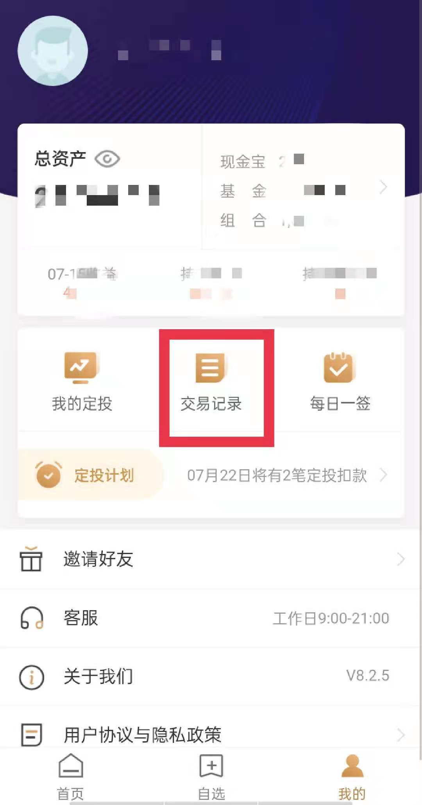

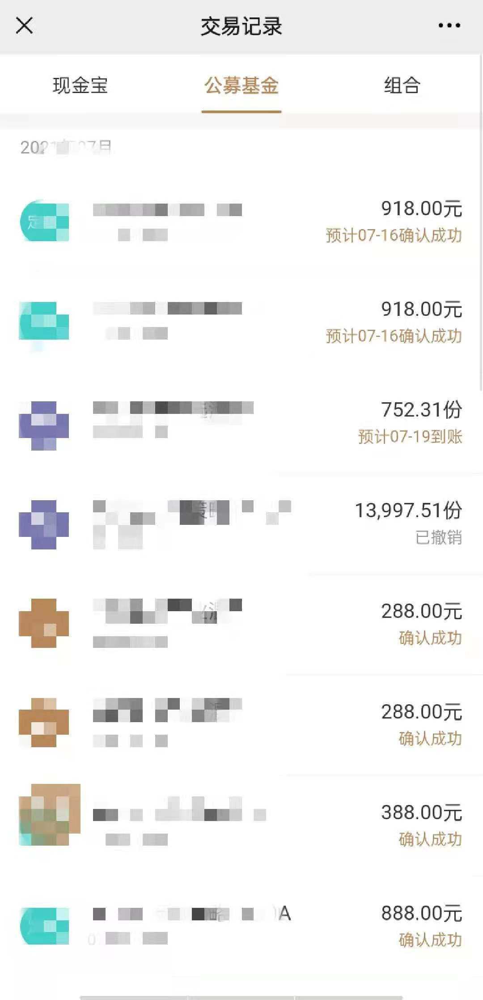

这样的交易记录, 其实就是"流水账", 只是方便大家查看自己的资金出入情况. 班班今晚要讲的交易记录, 可不是记流水账哦!

接下来, 班班要带大家做三个交易记录, 分别是: 买前自问清单、卖前自问清单、完整交易复盘.

目的是, 让大家认真总结自己买的对不对, 卖的对不对, 如果赚到了, 可以学到什么经验; 如果亏了, 要吸取什么教训. 这才是成长的正确姿势~

每一个交易记录都会进行 360 度无死角的灵魂拷问, 大家准备好哦.

班班已经把表格分享给大家了, 小伙伴们现在电脑旁边的, 可以一边对照表格一边听讲. 没在电脑边也没事, 班班把表格都截图了, 一会看群里消息就行.

### 第一份交易记录: 买前自问清单

买前, 指的是你下单之前就要做这份记录, 而不是等买了以后再回头来做; 自问, 就是自己问自己, 看自己能不能对答如流;

清单, 就是一系列问题的合集, 大家每次下单前, 按照清单里的问题, 一个一个过, 省的漏掉必须思考的问题.

买前自问清单, 是下面这个模样:

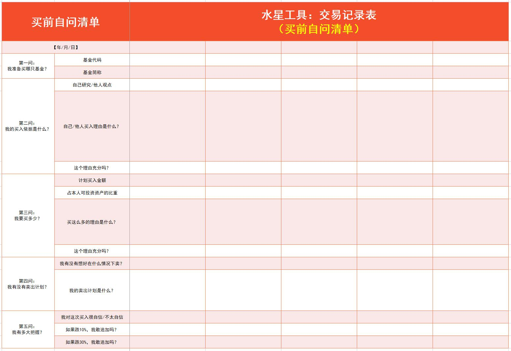

大家着重看表头, 班班接下来挨个讲解:

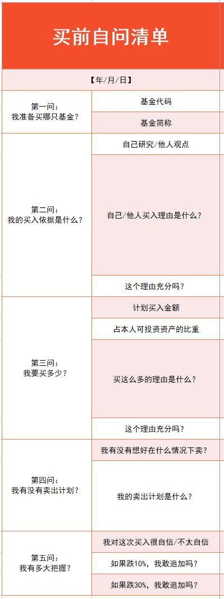

买前自问清单一共包含了五大问:

第一问, 我准备买哪只基金?

第二问: 我的买入依据是什么?

第三问: 我要买多少?

第四问: 我有没有卖出计划?

第五问: 我有多大把握?

首先, 我们肯定是看上了某只基金, 或者是听人介绍了某只基金, 心动了, 所以想买. 这时候先不要直接下单, 拿出表来自问一遍.

第一问, 我准备买哪只基金?

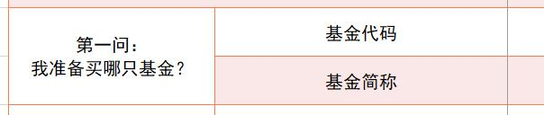

这一问很好写, 直接把自己相中的基金代码、名字写进表格里. 继续往下进行第二问.

第二问, 我的买入依据是什么?

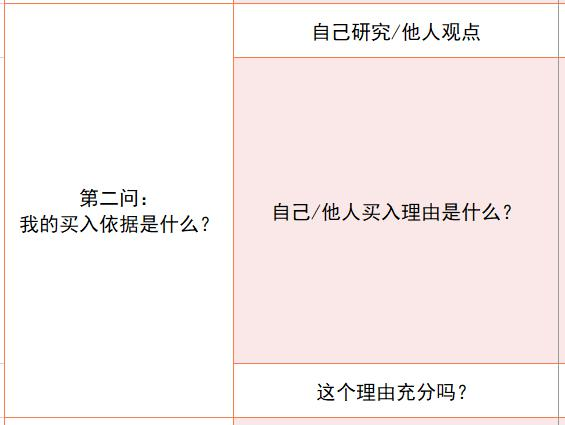

这一栏至关重要. 首先选择"自己研究/他人观点", 自己研究, 说明你没有盲目跟风, 不是"听风就是雨"的投资选手.

他人观点, 也不一定全错, 关键看他人的观点能不能站得住脚. 所以接下来要填"自己/他人买入理由是什么?"

这一问倒逼自己去反省, 如果听别人的观点, 也必须掌握他分析的前因后果, 把买入理由文字化, 填到表格里, 不能单纯凭感觉, 更不能无脑抄作业.

买入理由填好以后, 接下来还要自问"这个理由充分吗?"

咱们买基的理由一般就两个: 买好的, 买得好. 大家把填完的买入理由再看一遍, 是否可以达到"买好的", 也就是基金本身足够优质; 是否可以达到"买得好", 也就是在合适的时机, 合理的价位入手.

如果你发现自己找不到买入理由, 或者感觉理由根本不充分, 那么就此打住, 不要往下进行了, 放弃这次买入计划, 等你找到了充分的理由, 再重新考虑.

第二问就解释到这里. 咱们一共五问哈, 接下来开始第三问: 我要买多少?

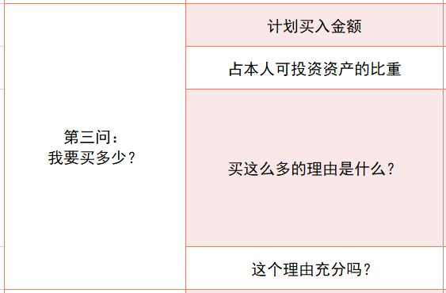

前面理由充分可以买了, 接下来就是买多少的问题. 首先填入一个"计划买入金额", 然后考量一下, 这个金额"占本人可投资资产的比重".

有时候你凭主观感觉, 可能会觉得, 某个投资机会太好了, 必须重金入手, 完全不考虑自己的可投资资产有多少! 但是, 填完"占本人可投资资产的比重"以后, 你就会发现自己的配置不太合适了.

一般来说, 单笔买入金额超过了你的可投资资产的三分之一, 就要十分警惕啦, 这样过于集中了.

然后下一行, 给自己一个理由, 告诉自己为什么买这么多. 是估值特别低, 你想占据"黄金坑"; 还是未来行业非常景气, 投资这个板块大有可为? 把你的理由写下来.

最后再问一次: 这个理由充分吗? 是我只听好消息导致的过于乐观, 还是说有理有据, 买这个数额刚好合适?

如果理由充分, 继续往下进行第四问. 如果理由不充分, 可以修改前面的投资金额和比重, 达到合理的数字.

如果感觉不管怎么调整, 数字都有点问题, 那么就此打住, 不要往下进行了, 放弃这次买入计划.

接下来一起看第四问: 我有没有卖出计划?

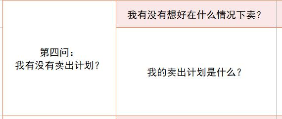

像巴菲特这样的投资大师, 在买的时候就已经在心里预估好合理价位了, 达到合理价位就卖. 也就是说, 在买之前他就知道自己会在什么时候卖啦. 我们这里也借鉴这种做法.

买入之前就先想清楚: 我有没有考虑好在什么情况下卖?

关于卖出的法则, 大家看指数估值就可以啦. 这些在课程里都讲过. 所以这里填写起来没有多少花样.

大家买之前把"我的卖出计划是什么?"填上, 比如温度超过 80 度, 一次性卖光, 等等.

第五问, 我有多大把握?

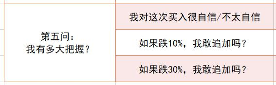

这一问主要检验自己的直觉. 在投资中, 直觉也很重要的, 尤其是大家积累过丰富的经验之后, 直觉会变得越来越准.

如果你的直觉是买入后大涨, 这个未必准确; 但是, 如果你的直觉是买入后会心里不安, 总感觉不放心, 那么大概率是某个地方出现了问题. 这种反向的直觉往往是很准的.

首先大家需要自问: 我对这次买入很自信, 还是不太自信?

很自信未必代表真赚钱, 但起码不是心里打鼓的状态; 如果不太自信, 一来可以把前面的投资金额和比重调低一些, 让自己感受更加舒服一些, 二来可以直接放弃, 不做这种不自信的投资.

接下来, 做一做简单的压力测试. 如果跌 10%, 我敢追加吗? 如果跌 30%, 我敢追加吗?

如果不敢追加, 说明你对这笔投资并没有那么自信, 要么降低投资金额, 要么干脆放弃.

以上就是完整的"买前自问清单"啦. 实际上每个小伙伴在投资的时候, 多多少少都会在心里衡量其中的一些问题, 但是难免考虑不周全.

所以不如就直接拿来表格, 逐个问题自问, 问透彻了为止. 自问全部通过, 再去有理有据地买入. 你会发现, 自己全都问了一遍之后, 持有基金的过程中也会更加自信.

### 第二份交易记录: 卖前自问清单

卖前, 就是在卖出之前就要填写这份表格, 而不是等卖掉以后再回头填写.

由于咱们在买入的时候, 已经确认过卖出计划了, 所以卖出环节就非常简单了, 只需要回答两问.

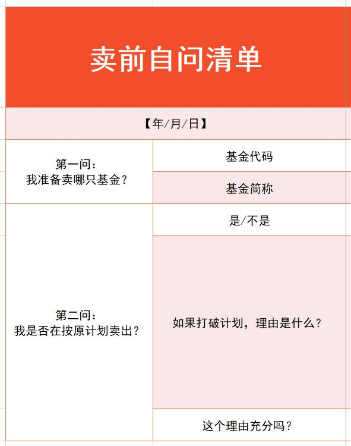

第一问: 我准备卖哪只基金?

买的哪只, 就卖哪只, 这个很好填, 班班就不多说啦.

第二问: 我是否在按原计划卖出?

首先选择"是/不是". 这里没有中间选择哦, 要么是, 要么不是. 只要你的决定和原来的计划有出入, 不管大小, 都填不是.

如果填"是", 也就是完全遵照计划, 那么卖出自问结束, 可以卖了.

如果填"否", 也就是要打破计划, 那么要把下面两个问题回答完.

如果打破计划, 理由是什么?

想卖, 就必须给自己一个说法. 是在买入环节判断失误, 一开始就买错了? 还是觉得自己当初订立的卖出计划不合理, 你有了新计划?

总之, 如果你只是情绪上过于恐慌, 就选择卖出, 给不出一个理由, 那么先不要急着立马卖, 冷静下来想清楚了再说卖的事情.

### 第三份交易记录: 完整交易复盘

前面我们把买入和卖出分别记录下来了. 都是在正式交易之前填写表格.

接下来的"完整交易复盘", 是在一笔买卖完成之后进行的.

复盘, 就是回顾一下这笔买卖, 总结成功经验, 吸取失败教训.

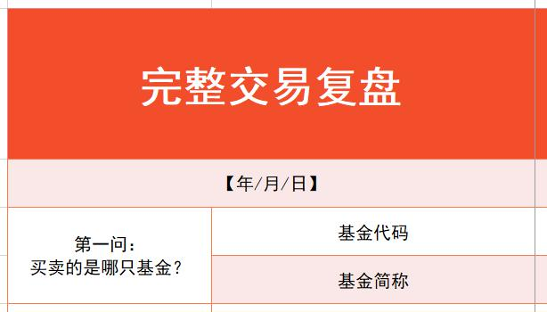

完整交易复盘总共有三问. 第一问照旧是填写基金名字和代码即可. 关键是二、三问.

第二问: 这笔交易是否满意?

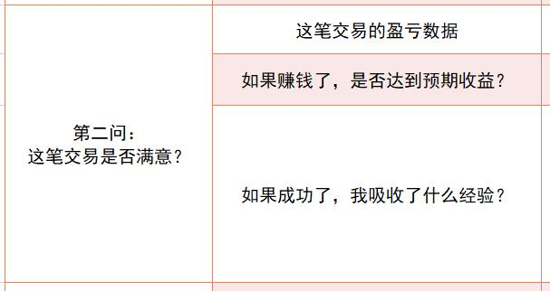

满意不满意, 判断标准非常简单粗暴, 就看盈亏. 亏了, 你不会满意; 赚了, 分两种情况.

第一种, 赚的钱达到了自己的预期, 或者超过了自己的预期, 你会满意.

第二种, 虽然赚了, 但是嫌少, 没有达到预期的收益水平, 你不会满意.

这些情况咱们都记录下来, 在接下来找原因. 这一问先把成功的经验记录下来. 赚到了, 满意了, 就填一下: 如果成功了, 我吸收了什么经验?

把自己这次交易中比较出彩的做法, 可以指导以后投资的做法, 都记下来. 这些经验将是你的宝贵财富.

如果不满意, 就进入第三问.

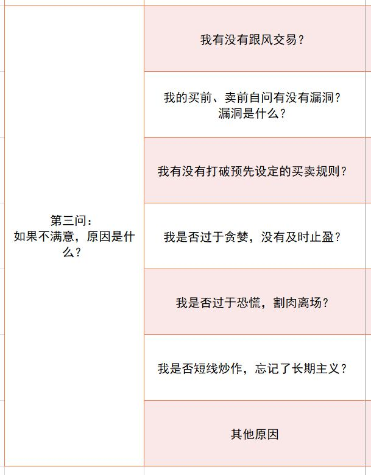

第三问: 如果不满意, 原因是什么?

表格中列了一些非常常见的原因, 比如跟风交易, 自问环节有漏洞, 没有遵守买卖原则, 过于贪婪, 过于恐慌, 短线炒作, 等等, 大家逐一自问, 把真正的问题揪出来. 如果还有其他方面的原因, 就填到"其他原因"这一行.

总之, 失败是成功之母, 这些也是宝贵的经验. 从失败的总结和反思中, 我们能学到更多.

好啦, 实战必做的三个交易记录, 我们就介绍这么多啦. 大家保存好表格, 今后充分利用起来.

这里班班解释一下: 制作这份表格, 主要是为了帮助大家扫除心理误区, 理性做投资; 由于大部分小伙伴的投资经验不足, 很多还是新手, 考虑问题难免不全, 所以咱们最好是有这么个工具表, 就像一根拐杖一样.

但是, 等大家的投资能力越来越强, 经验越来越丰富, 思维越来越开阔, 就不需要这个表格啦. 因为那时候, 这些自问的问题都会刻进你的脑子里. 就像说母语, 自然就脱口而出了, 不需要多加思考.

最后, 祝大家在实战环节顺顺利利! 本次分享到此结束.

## 总结

1. 逆向思维指的是"人弃我取, 人取我予". 只有和多数人反着来, 在他们贪婪的时候选择恐惧, 在他们恐惧的时候选择贪婪, 才有机会实现低买高卖, 从而赚到收益.
2. 高风险不代表高收益, 我们可以通过建立组合的方式, 将波动控制在很小的范围内, 而对收益的影响很小.
3. 投资赚钱, 需要我们坚守长期主义, 用可持续的方法实现终身复利, 而不是捞一笔就走.

到这里, 《基金进阶训练营》的课程已经全部结束啦, 恭喜大家完成了两周的学习.

锲而舍之, 朽木不折; 锲而不舍, 金石可镂. 期待我们在《基金高阶训练营》继续相遇.
